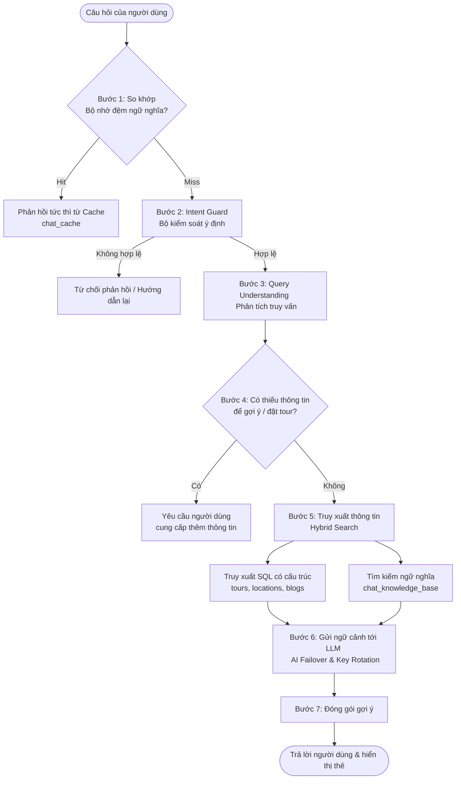

# CHƯƠNG 1. CƠ SỞ LÝ THUYẾT

## 1.1. Tổng quan về kiến trúc Client-Server

Kiến trúc Client-Server là mô hình phổ biến trong phát triển ứng dụng web. Trong mô hình này, Client chịu trách nhiệm hiển thị giao diện và tương tác với người dùng, trong khi Server xử lý nghiệp vụ, truy xuất dữ liệu, xác thực, phân quyền và cung cấp API [1].

Trong hệ thống DanangTrip, kiến trúc Client-Server được thể hiện qua ba thành phần:

- `danangtrip-web`: website người dùng, gọi API để hiển thị dữ liệu địa điểm, tour, đơn đặt tour, thanh toán và hồ sơ.
- `danangtrip-admin`: giao diện quản trị, gọi API quản trị để quản lý dữ liệu và báo cáo.
- `danangtrip-api`: Server API được xây dựng bằng Laravel, cung cấp REST API cho website người dùng và trang quản trị.

Mô hình này giúp tách biệt trách nhiệm giữa giao diện và nghiệp vụ, thuận tiện cho bảo trì, mở rộng và triển khai độc lập.

## 1.2. Tổng quan về Next.js và React

React là thư viện JavaScript dùng để xây dựng giao diện người dùng theo hướng thành phần. Next.js là khung phát triển xây dựng trên React, hỗ trợ định tuyến theo cấu trúc tệp, kết xuất phía Server, sinh trang tĩnh, tối ưu SEO và triển khai linh hoạt [2].

Trong DanangTrip, Next.js được dùng cho website người dùng vì phù hợp với các trang cần SEO như trang chủ, danh sách địa điểm, chi tiết địa điểm, danh sách tour, chi tiết tour và blog. Dự án còn sử dụng:

- TypeScript để tăng độ an toàn kiểu dữ liệu.
- React Query để quản lý trạng thái dữ liệu lấy từ API.
- Zustand để quản lý trạng thái cục bộ như xác thực, giỏ hàng hoặc trạng thái ứng dụng.
- next-intl để hỗ trợ đa ngôn ngữ.
- Leaflet để hiển thị bản đồ và vị trí du lịch.

## 1.3. Tổng quan về React/Vite cho trang quản trị

Vite là công cụ đóng gói giao diện có tốc độ phát triển nhanh, phù hợp với ứng dụng quản trị dạng ứng dụng một trang. React Router được dùng để quản lý đường dẫn nội bộ, React Query để đồng bộ trạng thái dữ liệu từ Server, React Hook Form và Yup/Zod để xử lý biểu mẫu và kiểm tra dữ liệu [3].

Trang quản trị DanangTrip sử dụng React/Vite để xây dựng các phân hệ bảng điều khiển, tour, lịch khởi hành, đơn đặt tour, thanh toán, địa điểm, bài viết, người dùng, đánh giá, liên hệ, thông báo, khuyến mãi và cấu hình. Đây là nhóm màn hình có tính thao tác lặp lại cao, cần bảng dữ liệu, bộ lọc, biểu đồ, biểu mẫu thêm/sửa và kiểm soát trạng thái.

## 1.4. Tổng quan về Laravel REST API

Laravel là khung phát triển PHP hỗ trợ phát triển ứng dụng web và API với hệ sinh thái đầy đủ: định tuyến, lớp trung gian (middleware), ORM, migration, hàng đợi, kiểm tra dữ liệu, bộ nhớ đệm, sự kiện, tác vụ nền và kiểm thử. REST API là phong cách thiết kế API sử dụng các phương thức HTTP như GET, POST, PUT, PATCH và DELETE để thao tác tài nguyên [4].

Server API của DanangTrip sử dụng Laravel 12 và tổ chức mã nguồn theo hướng:

- Controller tiếp nhận yêu cầu và trả phản hồi.
- Service xử lý nghiệp vụ.
- Repository truy vấn và thao tác dữ liệu.
- Model đại diện bảng dữ liệu.
- Cơ chế kiểm tra yêu cầu đầu vào giúp xác thực dữ liệu trước khi xử lý nghiệp vụ.
- Middleware xử lý xác thực, phân quyền và throttle.

Cách tổ chức này giúp nghiệp vụ được tách khỏi controller, dễ kiểm thử và dễ mở rộng.

## 1.5. Xác thực JWT và phân quyền

JWT là chuẩn mã thông báo dùng để truyền thông tin xác thực giữa Client và Server. Sau khi đăng nhập thành công, Server cấp mã thông báo truy cập (access token) và mã thông báo làm mới (refresh token) thông qua thư viện `jwt-auth`. Client gửi mã thông báo trong các yêu cầu cần bảo vệ. Server kiểm tra mã thông báo để xác định người dùng và quyền truy cập [5].

Trong DanangTrip, API được chia thành:

- Nhóm tuyến công khai: không cần mã thông báo, dùng cho trang chủ, địa điểm, tour, blog, tìm kiếm, chatbot và liên hệ.
- Nhóm tuyến yêu cầu xác thực: cần đăng nhập, dùng cho hồ sơ, đơn đặt tour, thanh toán, yêu thích, đánh giá, thông báo và giỏ hàng.
- Nhóm tuyến quản trị: cần mã thông báo và quyền quản trị viên, dùng cho quản trị hệ thống.

## 1.6. PostgreSQL/Supabase và migration

PostgreSQL là hệ quản trị cơ sở dữ liệu quan hệ mã nguồn mở, hỗ trợ khóa ngoại, giao dịch (transaction), chỉ mục (index), ràng buộc dữ liệu, JSON/JSONB và tìm kiếm toàn văn (full-text search). Supabase cung cấp nền tảng dịch vụ backend dựng sẵn (backend-as-a-service) sử dụng PostgreSQL làm lõi lưu trữ, phù hợp với các hệ thống cần triển khai nhanh cơ sở dữ liệu quan hệ và quản lý dữ liệu trên môi trường đám mây [6].

PostgreSQL/Supabase được sử dụng do hệ thống có nhiều quan hệ dữ liệu cần quản lý bằng khóa ngoại và giao dịch, chẳng hạn quan hệ giữa người dùng, tour, lịch khởi hành, đơn đặt tour, chi tiết đơn đặt tour và thanh toán.

Laravel migration giúp định nghĩa cấu trúc bảng bằng mã nguồn, hỗ trợ quản lý phiên bản lược đồ, tạo bảng, thêm cột, tạo chỉ mục và quay lui khi cần [4]. Trong dự án, migration cũng được sử dụng để khai báo khóa ngoại, chỉ mục tìm kiếm, ràng buộc trạng thái, ràng buộc giá trị tiền và một số ràng buộc phục vụ toàn vẹn dữ liệu.

Các nhóm bảng chính của DanangTrip và chức năng tương ứng được mô tả chi tiết trong Bảng 1.2:

*Bảng 1.2: Các nhóm bảng cơ sở dữ liệu và phân hệ chức năng tương ứng*

| STT | Nhóm chức năng | Các bảng trong cơ sở dữ liệu | Mô tả chức năng chính |
| :---: | :--- | :--- | :--- |
| 1 | Nhóm người dùng và xác thực | `users`, `refresh_tokens`, `password_reset_tokens`, `sessions` | Quản lý thông tin tài khoản (khách du lịch, quản trị viên), lưu phiên làm việc, quản lý refresh token duy trì đăng nhập và xử lý yêu cầu đặt lại mật khẩu. |
| 2 | Nhóm địa điểm | `locations`, `categories`, `subcategories`, `tags`, `amenities`, `location_tags`, `location_amenities`, `views` | Lưu trữ thông tin chi tiết địa điểm (tọa độ GPS, mô tả, hình ảnh), danh mục phân loại, tiện ích dịch vụ đi kèm, thẻ tìm kiếm và thống kê lượt xem. |
| 3 | Nhóm tour và đặt tour | `tours`, `tour_categories`, `tour_schedules`, `tour_locations`, `bookings`, `booking_items`, `cart_items` | Lưu trữ thông tin tour, danh mục tour, lịch khởi hành, chỗ trống khả dụng, giỏ hàng tạm thời, đơn đặt tour, hành khách, khuyến mãi hệ thống và phiếu giảm giá cá nhân đã áp dụng. |
| 4 | Nhóm thanh toán | `payments` | Lưu trữ lịch sử giao dịch và trạng thái thanh toán của đơn đặt tour qua SePay/VietQR hoặc thao tác xác nhận chuyển khoản thủ công của quản trị viên. |
| 5 | Nhóm nội dung | `blog_posts`, `blog_categories`, `blog_post_categories`, `landing_pages` | Quản lý các bài viết cẩm nang du lịch Đà Nẵng, danh mục bài viết, liên kết danh mục và nội dung các trang đích (landing pages) phục vụ SEO. |
| 6 | Nhóm tương tác | `favorites`, `ratings`, `rating_images`, `rating_helpful_votes`, `search_logs`, `notifications`, `contacts` | Ghi nhận nội dung yêu thích, đánh giá kèm hình ảnh, người dùng xác nhận đánh giá hữu ích, nhật ký tìm kiếm, thông báo hệ thống và liên hệ. |
| 7 | Nhóm điểm thành viên | `user_point_balances`, `point_rules`, `point_rewards`, `point_transactions`, `user_vouchers` | Quản lý số dư điểm, quy tắc cộng điểm, phần thưởng đổi điểm, lịch sử biến động điểm và phiếu giảm giá cá nhân. |
| 8 | Nhóm cấu hình và chatbot | `settings`, `promotions`, `chat_messages`, `chat_cache`, `chat_knowledge_base` | Quản lý cấu hình chung, khuyến mãi, lịch sử hội thoại, bộ nhớ đệm câu trả lời và cơ sở tri thức có dữ liệu embedding. |

## 1.7. Thanh toán trực tuyến và IPN

Thanh toán trực tuyến trong hệ thống đặt tour cần đảm bảo các yếu tố: tạo giao dịch, gắn giao dịch với đơn đặt tour, xác nhận trạng thái, chống xử lý trùng, cập nhật trạng thái đơn đặt tour sau thanh toán và lưu lịch sử giao dịch. Để thực hiện đối soát tự động, các dịch vụ thanh toán trực tuyến cung cấp các cơ chế tích hợp thông qua API và cổng thông báo tức thời Webhook/IPN để cập nhật trạng thái thanh toán trực tiếp từ tài khoản ngân hàng [7].

Trong hệ thống DanangTrip, cổng thanh toán SePay/VietQR được tích hợp. Khi người dùng tạo thanh toán, hệ thống sinh thông tin giao dịch và nội dung chuyển khoản dưới dạng mã VietQR. Khi cổng thanh toán gửi IPN/callback, Server API kiểm tra dữ liệu, xác thực chữ ký giao dịch, cập nhật bảng `payments` và chuyển trạng thái đơn hàng trong bảng `bookings`.

## 1.8. Chatbot, truy xuất tri thức và gợi ý du lịch

Trong các ứng dụng thực tế, chatbot du lịch cần hỗ trợ phản hồi thông tin dựa trên cơ sở dữ liệu thực tế của hệ thống (như tour, địa điểm, bài viết và chính sách). Nếu chỉ dựa vào tri thức tổng quát sẵn có của mô hình ngôn ngữ lớn (LLM), chatbot dễ gặp phải hiện tượng 'ảo tưởng' (hallucination) và đưa ra thông tin sai lệch so với dữ liệu thực tế. Vì thế, các hệ thống chatbot hiện nay thường áp dụng kiến trúc truy xuất thông tin tăng cường (Retrieval-Augmented Generation - RAG) kết hợp kỹ thuật nhúng văn bản (vector embeddings) để tìm kiếm ngữ nghĩa dựa trên độ tương đồng Cosine (Cosine Similarity) [8].

Các thành phần chính trong quy trình xử lý của chatbot trong DanangTrip gồm:

- **Bộ kiểm soát ý định (Intent Guard)**: phân loại câu hỏi vào 14 ý định nghiệp vụ (chào hỏi, điểm thành viên, gặp nhân viên tư vấn, thanh toán, hoàn tiền/hủy tour, đặt tour, bài viết, lịch trình, tour du lịch, ẩm thực, khách sạn, địa điểm, tài khoản, liên hệ) nhằm đảm bảo chatbot tập trung đúng chuyên môn du lịch và chặn các câu hỏi nhạy cảm hoặc không liên quan.
- **Thành phần phân tích truy vấn (Query Understanding)**: trích xuất các thực thể quan trọng từ câu hỏi như điểm đến cụ thể, vùng địa lý, chủ đề địa điểm (bãi biển, nhà hàng, chùa chiền...), khoảng giá (giá tối thiểu/tối đa), số người, ngày đi dự kiến, thời lượng chuyến đi và tiêu chí sắp xếp (rẻ nhất, tốt nhất).
- **Quy trình làm rõ thông tin (Clarification Flow)**: tự động nhận diện nếu thiếu các thông tin cốt lõi (như điểm đến hoặc số lượng người khi muốn đặt tour) để phản hồi hỏi lại người dùng nhằm thu thập đủ thông số trước khi gợi ý dữ liệu.
- **Truy xuất dữ liệu có cấu trúc**: tự động tạo các điều kiện truy vấn động dựa trên tham số đã phân tích để lọc dữ liệu trực tiếp từ các bảng nghiệp vụ (`tours`, `tour_schedules`, `locations`, `blog_posts`).
- **Tìm kiếm ngữ nghĩa bằng embedding (Semantic Search)**: khi được kích hoạt, hệ thống sử dụng mô hình embedding để vector hóa câu hỏi của người dùng, thực hiện so khớp độ tương đồng Cosine với các bản ghi tri thức nghiệp vụ và chính sách trong bảng `chat_knowledge_base` mà không cần sử dụng cơ sở dữ liệu vector chuyên dụng.
- **Lớp bộ nhớ đệm ngữ nghĩa (Semantic Cache Layer)**: lưu trữ và tái sử dụng các phản hồi trong bảng `chat_cache`. Khác với cache thông thường, lớp này hỗ trợ so khớp ngữ nghĩa dựa trên cosine similarity của vector câu hỏi (ngưỡng 0.92 cho FAQ và 0.97 cho dữ liệu giao dịch), giúp tiết kiệm tài nguyên AI và phản hồi tức thì đối với các câu hỏi tương tự.
- **Cơ chế chuyển đổi dự phòng AI (AI Failover & Key Rotation)**: tự động luân chuyển giữa các khóa API dự phòng khi gặp lỗi HTTP 429 (vượt quá hạn mức) và tự động chuyển đổi giữa các nhà cung cấp AI khác nhau (Gemini, Groq, OpenRouter, OpenAI) theo thứ tự cấu hình ưu tiên, kết hợp với cơ chế cooldown để cách ly các key lỗi tạm thời.

DanangTrip thiết lập nhóm các lớp dịch vụ xử lý chatbot chuyên biệt như mô tả tại Bảng 1.3:

*Bảng 1.3: Các lớp dịch vụ xử lý chatbot của hệ thống DanangTrip*

| STT | Tên lớp dịch vụ | Chức năng chính |
| :---: | :--- | :--- |
| 1 | `ChatService` | Bộ điều phối trung tâm; quản lý luồng xử lý từ khi nhận tin nhắn, kiểm tra bộ nhớ đệm, thu thập ngữ cảnh, gọi mô hình AI đến ghi nhật ký chi tiết luồng chạy (`CHATBOT_PIPELINE_TRACE`). |
| 2 | `ChatIntentGuardService` | Phân loại ý định (intent) của người dùng dựa trên từ khóa đồng nghĩa và quy tắc ranh giới từ để lọc các câu hỏi ngoài phạm vi nghiệp vụ du lịch. |
| 3 | `ChatQueryUnderstandingService` | Trích xuất thực thể có cấu trúc bằng các biểu thức chính quy (Regex) nâng cao kết hợp với AI NLU khi cần. |
| 4 | `ChatQueryNormalizerService` | Chuẩn hóa các thực thể văn bản đã phân tích sang định danh tương ứng trong cơ sở dữ liệu (như ánh xạ tên địa danh thành `location_id`). |
| 5 | `ChatToolGuardrailService` | Xác thực và làm sạch các tham số trích xuất được (như lọc ngày quá khứ, giới hạn số khách, sửa lỗi ngược khoảng giá) để đảm bảo an toàn dữ liệu trước khi truy vấn. |
| 6 | `IntentConsistencyService` | Kiểm tra tính nhất quán giữa ý định phân loại và các thực thể thực tế trích xuất được để quyết định luồng xử lý phù hợp. |
| 7 | `ChatSessionMemoryService` | Quản lý trạng thái hội thoại của phiên chat và theo dõi các bước làm rõ thông tin còn thiếu. |
| 8 | `ChatKnowledgeSyncService` | Đồng bộ định kỳ dữ liệu tour, địa điểm, blog và chính sách vào bảng cơ sở tri thức và tự động tạo embedding. |
| 9 | `ChatKnowledgeSearchService` | Điều phối tìm kiếm kết hợp (hybrid search) giữa truy vấn có cấu trúc và tìm kiếm ngữ nghĩa. |
| 10 | `ChatVectorSearchService` | Thực hiện tính toán độ tương đồng cosine thủ công trên mảng vector để xếp hạng các bản ghi tri thức phù hợp. |
| 11 | `ChatEmbeddingService` | Tích hợp với API Gemini/OpenAI để tạo vector biểu diễn (embeddings) cho câu hỏi và dữ liệu tri thức. |
| 12 | `ChatRecommendationBuilderService` | Đóng gói dữ liệu gợi ý (tours, locations, blogs) thành các cấu trúc chuẩn hóa để phía frontend hiển thị trực quan dưới dạng thẻ (cards) hoặc bản đồ. |
| 13 | `ChatAiProviderService` | Điều phối việc gọi các mô hình AI lớn (LLM), xử lý xoay vòng key, cơ chế cooldown và chuyển đổi dự phòng giữa các nhà cung cấp. |

Mối quan hệ và luồng tương tác giữa các lớp dịch vụ xử lý chatbot này được biểu diễn trực quan thông qua sơ đồ quy trình dưới đây:

Trong hệ thống DanangTrip, luồng xử lý câu hỏi diễn ra tuần tự: câu hỏi trước tiên được kiểm tra trong **bộ nhớ đệm ngữ nghĩa (Semantic Cache)** để phản hồi tức thì nếu trùng khớp; nếu không, câu hỏi sẽ được phân loại bằng **bộ kiểm soát ý định (Intent Guard)**, phân tích trích xuất thực thể bằng **bộ phân tích truy vấn (Query Understanding)**, thực hiện làm rõ thông tin thiếu (nếu có), truy xuất dữ liệu từ các bảng nghiệp vụ kết hợp với tìm kiếm ngữ nghĩa bằng **embedding**, và cuối cùng chuyển toàn bộ ngữ cảnh cho mô hình ngôn ngữ lớn (LLM) thông qua **cơ chế chuyển đổi dự phòng AI (AI Failover)** để sinh phản hồi tự nhiên.

## 1.9. Đa ngôn ngữ trong website du lịch

Website du lịch thường phục vụ nhiều nhóm người dùng, gồm khách nội địa và khách quốc tế. Vì vậy, hỗ trợ đa ngôn ngữ là một yếu tố quan trọng nhằm nâng cao trải nghiệm người dùng quốc tế [9], [10]. DanangTrip sử dụng `next-intl` ở website người dùng và `i18next` ở trang quản trị.

Lợi ích của đa ngôn ngữ:

- Tăng khả năng tiếp cận người dùng quốc tế.
- Tách nội dung hiển thị ra khỏi mã nguồn.
- Dễ bổ sung ngôn ngữ mới.
- Hỗ trợ SEO theo từng ngôn ngữ nếu cấu hình đường dẫn và siêu dữ liệu phù hợp.

## 1.10. Bản đồ số và dữ liệu vị trí

Đối với hệ thống du lịch, dữ liệu vị trí đóng vai trò quan trọng. Người dùng cần biết địa điểm nằm ở đâu, cách di chuyển như thế nào, có những điểm gần đó không và khoảng cách tương đối giữa các địa điểm [11].

DanangTrip lưu tọa độ `latitude`, `longitude` trong bảng địa điểm và sử dụng Leaflet để hiển thị bản đồ. Các chức năng liên quan gồm:

- Xem vị trí địa điểm trên bản đồ.
- Tìm địa điểm gần người dùng.
- Hiển thị nhiều điểm du lịch trên cùng bản đồ.
- Gợi ý địa điểm lân cận trong trang chi tiết.

## 1.11. Bảo mật trong hệ thống web

Hệ thống du lịch có nhiều dữ liệu nhạy cảm như thông tin tài khoản, số điện thoại, email, đơn đặt tour và thanh toán. Do đó, bảo mật cần được áp dụng ở nhiều lớp [4], [5]:

- Xác thực bằng mã thông báo và mã thông báo làm mới sử dụng mã hóa JWT.
- Phân quyền theo vai trò người dùng/quản trị viên.
- Kiểm tra dữ liệu đầu vào bằng cơ chế xác thực yêu cầu của Laravel.
- Giới hạn tần suất gọi các API nhạy cảm như đăng nhập, đăng ký, quên mật khẩu, tải ảnh và thanh toán bằng middleware throttle.
- Không cho người dùng truy cập dữ liệu đơn đặt tour của người khác.
- Kiểm tra chữ ký hoặc dữ liệu xác thực khi nhận callback/IPN thanh toán.
- Giới hạn loại tệp và dung lượng khi tải ảnh.
- Ghi nhật ký lỗi và xử lý phản hồi lỗi thống nhất.
