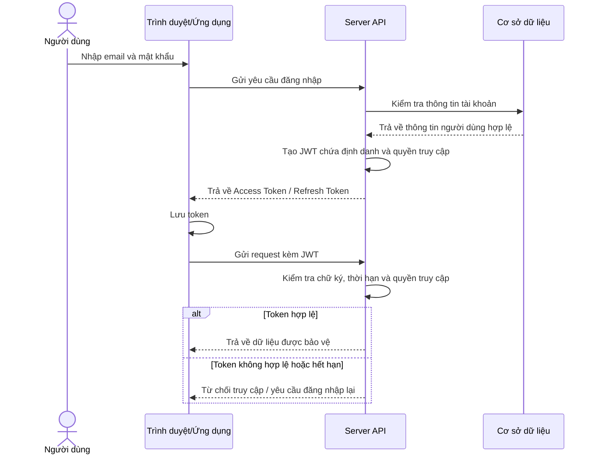

# CHƯƠNG 1. CƠ SỞ LÝ THUYẾT

## 1.1. Tổng quan về kiến trúc Client-Server

Kiến trúc Client-Server là mô hình phổ biến trong phát triển ứng dụng web. Trong mô hình này, Client chịu trách nhiệm hiển thị giao diện và tương tác với người dùng, trong khi Server xử lý nghiệp vụ, truy xuất dữ liệu, xác thực, phân quyền và cung cấp API [1].

Trong kiến trúc Client-Server của các ứng dụng web hiện đại, hệ thống thường được phân chia thành các thành phần chính bao gồm:
- **Client (Frontend)**: Giao diện dành cho người dùng và giao diện dành cho quản trị viên, chịu trách nhiệm nhận tương tác từ người dùng, hiển thị thông tin và gửi yêu cầu HTTP đến máy chủ.
- **Server (Backend API)**: Máy chủ cung cấp các dịch vụ REST API, xử lý các nghiệp vụ logic hệ thống và trả về kết quả cho phía Client dưới dạng dữ liệu chuẩn (thường là JSON).
- **Cơ sở dữ liệu (Database)**: Nơi lưu trữ thông tin có cấu trúc và được truy vấn bởi Server.

Mô hình này giúp tách biệt trách nhiệm giữa giao diện và nghiệp vụ, thuận tiện cho việc bảo trì, mở rộng và triển khai các thành phần độc lập.

## 1.2. Tổng quan về Next.js và React

React là thư viện JavaScript dùng để xây dựng giao diện người dùng theo hướng thành phần. Next.js là khung phát triển xây dựng trên React, hỗ trợ định tuyến theo cấu trúc tệp, kết xuất phía Server (Server-Side Rendering), sinh trang tĩnh (Static Site Generation), tối ưu SEO và triển khai linh hoạt [2], [3].

Trong các ứng dụng web hiện đại hướng tới người dùng cuối, Next.js thường được ưu tiên lựa chọn nhờ khả năng hỗ trợ kết xuất trước nội dung và tối ưu hóa công cụ tìm kiếm (SEO) tốt hơn so với mô hình chỉ kết xuất hoàn toàn ở phía trình duyệt. Bên cạnh đó, việc kết hợp Next.js với các công cụ bổ trợ giúp xây dựng hệ thống hoàn chỉnh:
- **TypeScript**: Giúp kiểm soát kiểu dữ liệu tĩnh chặt chẽ, giảm thiểu lỗi trong quá trình phát triển.
- **React Query (TanStack Query)**: Quản lý trạng thái dữ liệu bất đồng bộ từ Server, hỗ trợ bộ nhớ đệm (caching) và tự động đồng bộ dữ liệu.
- **Zustand**: Quản lý trạng thái cục bộ của ứng dụng một cách gọn nhẹ và hiệu quả.
- **Thư viện bản đồ Leaflet**: Tích hợp bản đồ tương tác để trực quan hóa dữ liệu vị trí địa lý.
- **Thư viện đa ngôn ngữ next-intl**: Định cấu hình hiển thị nội dung theo từng ngôn ngữ và hỗ trợ cấu hình SEO cho từng ngôn ngữ.

## 1.3. Tổng quan về React/Vite cho trang quản trị

Vite là công cụ đóng gói giao diện có tốc độ phát triển nhanh, phù hợp với ứng dụng quản trị dạng ứng dụng một trang [4]. React Router được dùng để quản lý đường dẫn nội bộ, React Query để đồng bộ trạng thái dữ liệu từ Server, React Hook Form và Yup/Zod để xử lý biểu mẫu và kiểm tra dữ liệu.

Trong các hệ thống quản trị, mô hình ứng dụng một trang (Single Page Application - SPA) được xây dựng trên thư viện React kết hợp với công cụ đóng gói Vite thường được áp dụng rộng rãi. Vite hỗ trợ phản hồi nhanh trong quá trình phát triển (HMR - Hot Module Replacement) và tối ưu hóa mã nguồn khi biên dịch. Nhóm các trang quản trị thường tập trung vào các chức năng CRUD (Thêm, Đọc, Sửa, Xóa), hiển thị biểu đồ phân tích dữ liệu, các bảng thông tin phức tạp đi kèm bộ lọc nâng cao và các biểu mẫu nhập liệu có kiểm tra ràng buộc nghiêm ngặt.

## 1.4. Tổng quan về Laravel REST API

Laravel là khung phát triển PHP hỗ trợ phát triển ứng dụng web và API với hệ sinh thái đầy đủ: định tuyến, lớp trung gian (middleware), ORM, migration, hàng đợi, kiểm tra dữ liệu, bộ nhớ đệm, sự kiện, tác vụ nền và kiểm thử. REST API là phong cách thiết kế API sử dụng các phương thức HTTP như GET, POST, PUT, PATCH và DELETE để thao tác tài nguyên [5].

Để xây dựng các hệ thống API có khả năng mở rộng cao, mã nguồn backend thường được tổ chức theo kiến trúc phân lớp (Layered Architecture) kết hợp với các mẫu thiết kế (Design Patterns) phổ biến như Repository và Service Pattern:
- **Controller Layer**: Đóng vai trò là điểm tiếp nhận các yêu cầu HTTP từ client, điều phối dữ liệu đến các lớp nghiệp vụ và trả phản hồi HTTP chuẩn.
- **Service Layer**: Nơi tập trung toàn bộ các logic nghiệp vụ và quy tắc hệ thống, đảm bảo tính độc lập và khả năng tái sử dụng.
- **Repository Layer**: Đóng vai trò là lớp trừu tượng hóa việc truy vấn dữ liệu, tách biệt logic truy vấn khỏi logic nghiệp vụ.
- **Model Layer (ORM)**: Đại diện cho cấu trúc bảng dữ liệu và hỗ trợ tương tác với cơ sở dữ liệu qua lớp ánh xạ quan hệ.
- **Validation & Middleware**: Đảm nhận nhiệm vụ làm sạch dữ liệu đầu vào và thực hiện kiểm tra quyền truy cập (Authentication/Authorization) trước khi yêu cầu đi vào các lớp xử lý nghiệp vụ.

Mô hình này giúp nghiệp vụ được tách biệt rõ ràng, nâng cao khả năng kiểm thử độc lập và mở rộng hệ thống.

## 1.5. Xác thực JWT và phân quyền

JWT là chuẩn mã thông báo dùng để truyền thông tin xác thực giữa Client và Server. Sau khi đăng nhập thành công, Server có thể cấp mã thông báo truy cập (access token) dưới dạng JWT để Client gửi kèm trong các yêu cầu cần bảo vệ. Mã thông báo làm mới (refresh token) có thể được triển khai riêng bằng chuỗi ngẫu nhiên lưu an toàn ở Server hoặc cookie bảo mật, tùy theo thiết kế của hệ thống. Server kiểm tra mã thông báo để xác định người dùng và quyền truy cập [6].

*Hình 1.5: Sơ đồ luồng xác thực bằng JWT*

*Nguồn: Tác giả tự tổng hợp dựa trên cơ chế xác thực JWT.*

Khi triển khai cơ chế xác thực JWT cho các API, hệ thống thường được phân chia thành các nhóm tuyến truy cập (endpoints) khác nhau dựa trên chính sách bảo mật:
- **Tuyến công khai (Public API Routes)**: Cho phép truy cập tự do mà không yêu cầu mã thông báo, dùng cho việc hiển thị thông tin chung như trang chủ, danh sách dịch vụ, tìm kiếm hoặc chatbot tư vấn.
- **Tuyến yêu cầu xác thực (Authenticated API Routes)**: Chỉ cho phép truy cập khi có mã thông báo hợp lệ, phục vụ các tính năng liên quan đến tài khoản cá nhân, lịch sử giao dịch, giỏ hàng hoặc gửi đánh giá.
- **Tuyến quản trị (Admin API Routes)**: Yêu cầu mã thông báo của tài khoản có vai trò quản trị viên để thực hiện các thao tác cấu hình hệ thống, quản lý người dùng và duyệt giao dịch.

## 1.6. PostgreSQL/Supabase và migration

PostgreSQL là hệ quản trị cơ sở dữ liệu quan hệ mã nguồn mở, hỗ trợ khóa ngoại, giao dịch (transaction), chỉ mục (index), ràng buộc dữ liệu, JSON/JSONB và tìm kiếm toàn văn (full-text search). Supabase cung cấp nền tảng dịch vụ backend dựng sẵn (backend-as-a-service) sử dụng PostgreSQL làm lõi lưu trữ, phù hợp với các hệ thống cần triển khai nhanh cơ sở dữ liệu quan hệ và quản lý dữ liệu trên môi trường đám mây [7], [8].

Khi phát triển hệ thống có nhiều mối quan hệ dữ liệu ràng buộc phức tạp, cơ sở dữ liệu quan hệ (RDBMS) như PostgreSQL thường là lựa chọn phù hợp nhờ tính năng toàn vẹn dữ liệu cao, hỗ trợ khóa ngoại, giao dịch ACID và các chỉ mục nâng cao phục vụ tìm kiếm nhanh. Việc tích hợp các dịch vụ đám mây giúp đơn giản hóa việc quản lý và triển khai cơ sở dữ liệu quan hệ trong môi trường production.

Laravel migration giúp định nghĩa cấu trúc bảng bằng mã nguồn, hỗ trợ quản lý phiên bản lược đồ, tạo bảng, thêm cột, tạo chỉ mục và quay lui khi cần [5]. Sử dụng migration giúp quản lý, đồng bộ hóa lược đồ (schema) giữa các môi trường phát triển, đồng thời cho phép thực hiện nâng cấp hoặc khôi phục cấu trúc dữ liệu một cách an toàn và nhất quán.

## 1.7. Thanh toán trực tuyến và IPN

Thanh toán trực tuyến trong hệ thống đặt tour cần đảm bảo các yếu tố: tạo giao dịch, gắn giao dịch với đơn đặt tour, xác nhận trạng thái, chống xử lý trùng, cập nhật trạng thái đơn đặt tour sau thanh toán và lưu lịch sử giao dịch. Để thực hiện đối soát tự động, các dịch vụ thanh toán trực tuyến cung cấp các cơ chế tích hợp thông qua API và cổng thông báo tức thời Webhook/IPN để cập nhật trạng thái thanh toán trực tiếp từ tài khoản ngân hàng [9].

Trong quá trình triển khai, việc tích hợp thanh toán trực tuyến thường dựa trên cơ chế sinh mã QR động (ví dụ chuẩn VietQR). Khi khách hàng quét mã và thanh toán thành công, ngân hàng hoặc cổng trung gian thanh toán sẽ gửi một thông báo bất đồng bộ (IPN/Webhook) đến Server của ứng dụng. Máy chủ tiếp nhận thông báo này cần thực hiện xác thực chữ ký, mã HMAC hoặc token bí mật tùy theo cơ chế tích hợp, đồng thời đối soát thông tin giao dịch để cập nhật trạng thái đơn đặt hàng một cách tự động và chính xác, tránh các nguy cơ gian lận giao dịch.

## 1.8. Chatbot và truy xuất tri thức

Trong các ứng dụng thực tế, chatbot du lịch cần hỗ trợ phản hồi thông tin dựa trên cơ sở dữ liệu thực tế của hệ thống (như tour, địa điểm, bài viết và chính sách). Nếu chỉ dựa vào tri thức tổng quát sẵn có của mô hình ngôn ngữ lớn (LLM), chatbot dễ gặp phải hiện tượng 'ảo tưởng' (hallucination) và đưa ra thông tin sai lệch so với dữ liệu thực tế. Vì thế, các hệ thống chatbot hiện nay thường áp dụng kiến trúc truy xuất thông tin tăng cường (Retrieval-Augmented Generation - RAG) kết hợp kỹ thuật nhúng văn bản (vector embeddings) để tìm kiếm ngữ nghĩa dựa trên độ tương đồng Cosine (Cosine Similarity) [10], [11].

Trong mô hình này, câu hỏi của người dùng được phân tích để xác định nhu cầu thông tin, sau đó hệ thống truy xuất các dữ liệu liên quan từ cơ sở tri thức hoặc cơ sở dữ liệu nghiệp vụ. Phần ngữ cảnh đã truy xuất được đưa vào lời nhắc (prompt) để mô hình AI sinh phản hồi tự nhiên hơn và giảm rủi ro bịa thông tin so với việc chỉ dựa vào tri thức nội tại của mô hình. Các bước triển khai cụ thể như phân loại ý định, bộ nhớ phiên, bộ nhớ đệm ngữ nghĩa hoặc kết hợp truy vấn SQL với tìm kiếm vector sẽ được trình bày trong phần phân tích và thiết kế hệ thống.

## 1.9. Đa ngôn ngữ trong website du lịch

Website du lịch thường phục vụ nhiều nhóm người dùng, gồm khách nội địa và khách quốc tế. Vì vậy, hỗ trợ đa ngôn ngữ là một yếu tố quan trọng nhằm nâng cao trải nghiệm người dùng quốc tế. Việc áp dụng các giải pháp đa ngôn ngữ phổ biến như `next-intl` hoặc `i18next` giúp đồng bộ và quản lý bản dịch một cách tập trung, mang lại trải nghiệm nhất quán cho khách du lịch đến từ nhiều quốc gia khác nhau.

Lợi ích của đa ngôn ngữ:

- Tăng khả năng tiếp cận người dùng quốc tế.
- Tách nội dung hiển thị ra khỏi mã nguồn.
- Dễ bổ sung ngôn ngữ mới.
- Hỗ trợ SEO theo từng ngôn ngữ nếu cấu hình đường dẫn và siêu dữ liệu phù hợp.

## 1.10. Bản đồ số và dữ liệu vị trí

Đối với hệ thống du lịch, dữ liệu vị trí đóng vai trò quan trọng. Người dùng cần biết địa điểm nằm ở đâu, cách di chuyển như thế nào, có những điểm gần đó không và khoảng cách tương đối giữa các địa điểm.

Để trực quan hóa dữ liệu vị trí trên nền tảng web, hệ thống thường lưu trữ tọa độ địa lý gồm vĩ độ (`latitude`) và kinh độ (`longitude`) trong cơ sở dữ liệu. Kết hợp với các thư viện hiển thị bản đồ tương tác như Leaflet hoặc dịch vụ bản đồ tương đương, hệ thống có thể cung cấp các tính năng hỗ trợ du khách như: định vị điểm đến trên bản đồ số, tìm kiếm các địa danh lân cận dựa trên khoảng cách địa lý, hiển thị danh sách các điểm du lịch xung quanh và gợi ý lộ trình di chuyển phù hợp [12].

Leaflet chủ yếu đảm nhiệm vai trò hiển thị bản đồ, lớp nền và các điểm đánh dấu. Để có chức năng chỉ đường hoặc vẽ tuyến đường từ vị trí người dùng đến điểm đến, hệ thống kết hợp Leaflet với `leaflet-routing-machine` [13]. Plugin này đóng vai trò kết nối bản đồ Leaflet với dịch vụ định tuyến OSRM, trong đó OSRM tính toán tuyến đường dựa trên dữ liệu đường sá của OpenStreetMap và trả về tập hợp tọa độ tuyến đường để frontend vẽ trực tiếp lên bản đồ [14], [15].

## 1.11. Bảo mật trong hệ thống web

Hệ thống web phục vụ du lịch thường lưu trữ nhiều thông tin nhạy cảm của người dùng (như thông tin cá nhân, lịch sử đặt tour, hóa đơn thanh toán). Do đó, bảo mật hệ thống nên được thiết lập theo nhiều lớp [16]:

- **Xác thực và phân quyền**: Sử dụng các chuẩn bảo mật như JWT kết hợp mã thông báo làm mới (refresh token) để xác thực các yêu cầu, đồng thời áp dụng chính sách phân quyền theo vai trò (Role-Based Access Control) để giảm nguy cơ truy cập trái phép.
- **Kiểm soát dữ liệu đầu vào và đầu ra**: Kiểm tra, chuẩn hóa dữ liệu đầu vào, sử dụng cơ chế truy vấn an toàn và mã hóa/escape dữ liệu khi hiển thị nhằm giảm nguy cơ phát sinh các lỗ hổng phổ biến như SQL Injection hoặc XSS.
- **Giới hạn tần suất (Rate Limiting)**: Áp dụng cơ chế giới hạn tần suất yêu cầu đối với các API nhạy cảm (như đăng nhập, đăng ký hoặc thanh toán) để giảm nguy cơ brute-force, spam request hoặc lạm dụng tài nguyên hệ thống.
- **Bảo mật giao dịch**: Kiểm tra tính toàn vẹn dữ liệu, xác thực chữ ký, HMAC, token bí mật hoặc mã kiểm tra (checksum) đối với các phản hồi IPN/callback từ cổng thanh toán để hạn chế gian lận giao dịch.
- **Kiểm soát tải lên tệp tin**: Giới hạn dung lượng và định dạng tệp tin cho phép tải lên hệ thống để phòng ngừa mã độc.
- **Ghi nhật ký và xử lý lỗi**: Thiết lập cơ chế ghi nhật ký hoạt động hệ thống (logging) và chuẩn hóa phản hồi lỗi để tránh rò rỉ thông tin hạ tầng kỹ thuật.
