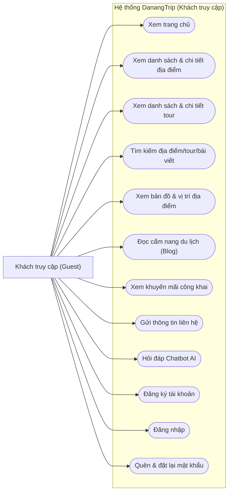
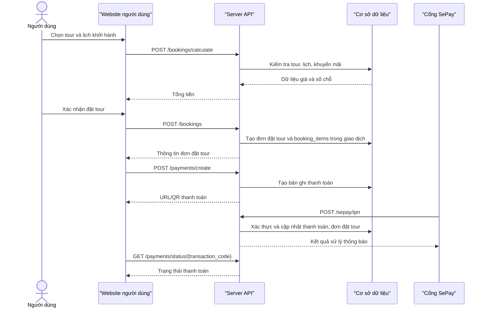
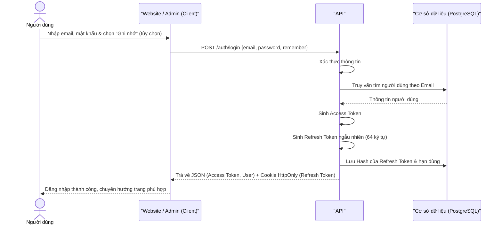
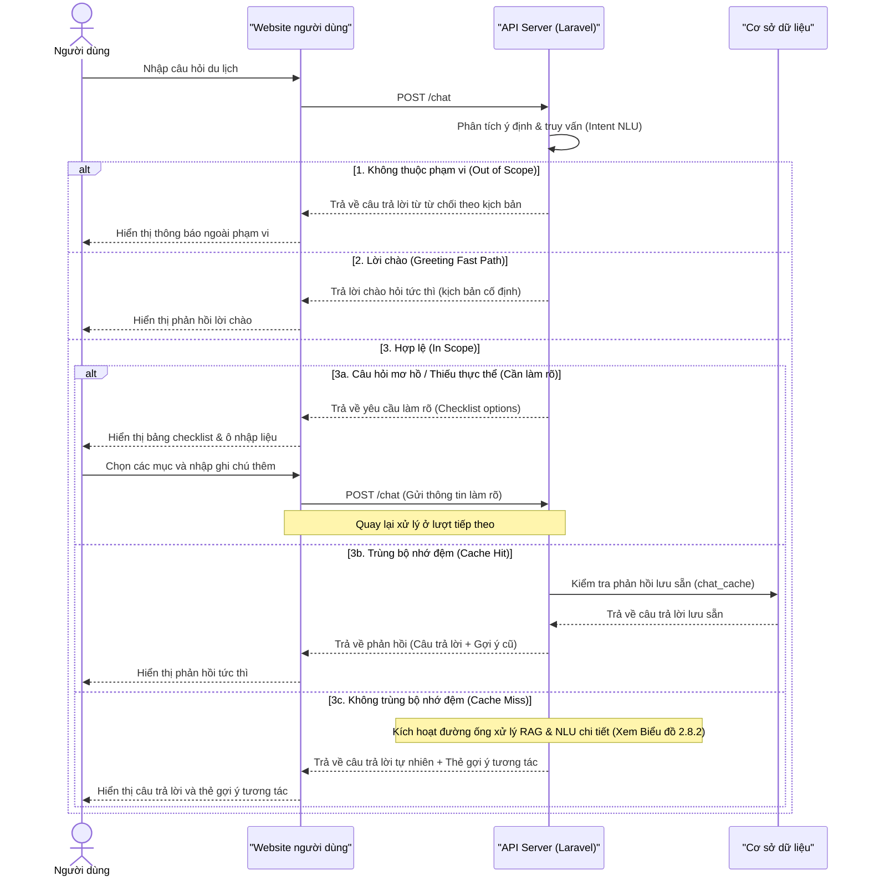
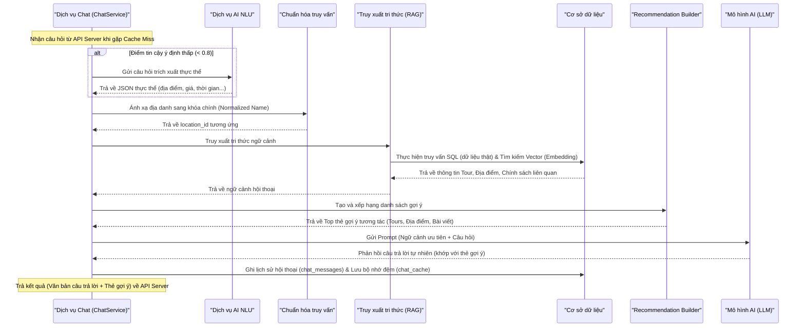
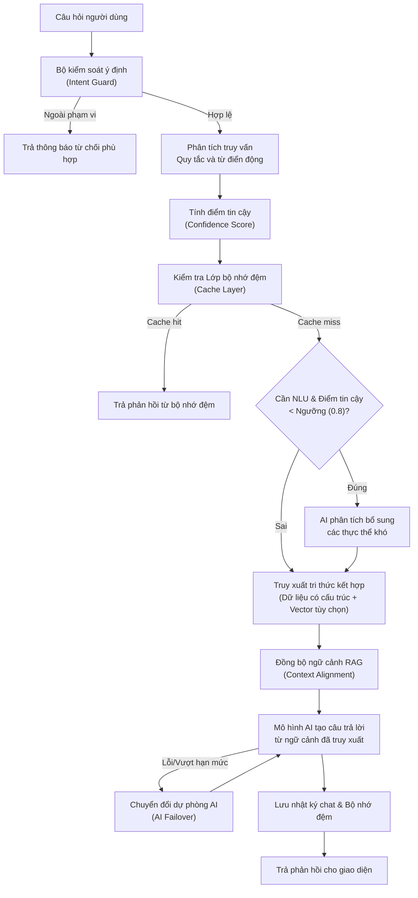
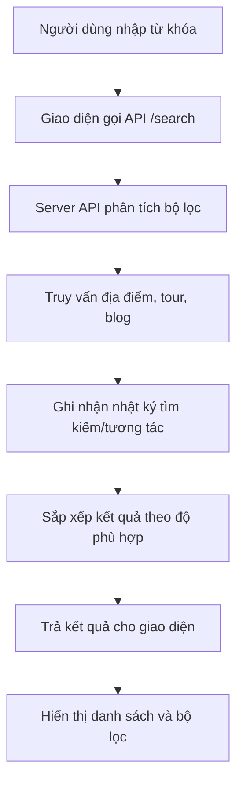
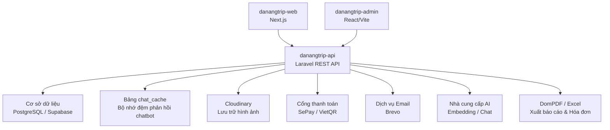

# CHƯƠNG 2. PHÂN TÍCH THIẾT KẾ HỆ THỐNG

## 2.1. Các tác nhân chính

Để phân tích chi tiết các yêu cầu và thiết kế các ca sử dụng (use case) của hệ thống DanangTrip, trước tiên cần xác định rõ ràng các tác nhân (Actors) tham gia tương tác trực tiếp hoặc gián tiếp với hệ thống. Qua phân tích nghiệp vụ, hệ thống DanangTrip phân loại đối tượng sử dụng thành ba nhóm tác nhân chính với vai trò và phạm vi quyền hạn cơ bản nhất, cụ thể như sau:

### 2.1.1. Khách truy cập (Guest)
Khách truy cập đại diện cho các người dùng vãng lai, chưa thực hiện đăng ký tài khoản hoặc chưa đăng nhập vào hệ thống. Đây là nhóm đối tượng có phạm vi quyền hạn cơ bản nhất, chủ yếu tương tác với các giao diện hiển thị thông tin công cộng.
- **Vai trò và quyền hạn:** Khách truy cập có thể truy cập trang chủ để xem thông tin tổng quan, danh sách các địa điểm du lịch nổi bật, các tour du lịch hấp dẫn cũng như các bài viết chia sẻ cẩm nang du lịch. Họ được sử dụng các tính năng tìm kiếm, lọc địa điểm/tour, tra cứu bản đồ số để định vị các điểm đến tại Đà Nẵng, gửi thông tin liên hệ và tương tác với chatbot AI để được tư vấn thông tin du lịch tự động.
- **Mục tiêu tương tác:** Khách truy cập sử dụng hệ thống nhằm mục đích tham khảo thông tin, tìm kiếm các dịch vụ du lịch phù hợp trước khi quyết định đăng ký tài khoản để sử dụng các dịch vụ sâu hơn.

### 2.1.2. Người dùng đã đăng nhập (User)
Người dùng đã đăng nhập là những thành viên đã đăng ký tài khoản thành công và xác thực danh tính qua hệ thống. Nhóm tác nhân này kế thừa toàn bộ các chức năng công cộng của Khách truy cập, đồng thời được cấp quyền truy cập vào các phân hệ chức năng mang tính cá nhân hóa và giao dịch nghiệp vụ.
- **Vai trò và quyền hạn:** Người dùng được phép quản lý hồ sơ cá nhân, danh sách yêu thích và giỏ hàng; tạo đơn đặt tour, áp dụng khuyến mãi hoặc phiếu giảm giá cá nhân, thanh toán qua VietQR/SePay, theo dõi trạng thái đơn và tải hóa đơn. Người dùng còn có thể viết đánh giá, tải ảnh đánh giá, ghi nhận đánh giá hữu ích, xem số dư/lịch sử điểm, đổi điểm lấy phiếu giảm giá và nhận thông báo cá nhân hóa.
- **Mục tiêu tương tác:** Người dùng sử dụng hệ thống để thực hiện đặt tour du lịch, thực hiện thanh toán trực tuyến nhanh chóng và tương tác cộng đồng thông qua việc chia sẻ trải nghiệm thực tế.

### 2.1.3. Quản trị viên (Admin)
Quản trị viên đại diện cho nhóm người dùng nội bộ, có vai trò vận hành, giám sát và quản trị toàn bộ hoạt động của hệ thống thông qua phân hệ trang quản trị (Admin Dashboard). Đây là nhóm tác nhân có đặc quyền cao nhất trong hệ thống.
- **Vai trò và quyền hạn:** Quản trị viên chịu trách nhiệm quản lý danh mục địa điểm, quản lý thông tin địa điểm (thêm, sửa, xóa, duyệt ảnh), quản lý tour du lịch và lịch khởi hành chi tiết. Quản trị viên theo dõi và xử lý các đơn đặt tour, xác nhận giao dịch thanh toán, quản lý tài khoản người dùng (bao gồm phân quyền, khóa hoặc mở khóa tài khoản), quản lý nội dung cẩm nang du lịch (bài viết blog), kiểm duyệt và xử lý các phản hồi/đánh giá từ người dùng. Đồng thời, quản trị viên sử dụng hệ thống báo cáo thống kê doanh thu, xu hướng đặt tour, tăng trưởng người dùng để đưa ra các quyết định vận hành tối ưu.
- **Mục tiêu tương tác:** Vận hành hệ thống ổn định, đảm bảo thông tin dịch vụ du lịch luôn chính xác, xử lý kịp thời các giao dịch tài chính của người dùng và giám sát hiệu quả hoạt động kinh doanh thông qua các số liệu báo cáo thực tế.

## 2.2. Yêu cầu chức năng

Yêu cầu chức năng của hệ thống DanangTrip được chia thành hai nhóm đối tượng sử dụng chính: Nhóm chức năng dành cho người dùng (bao gồm khách truy cập vãng lai và thành viên đã đăng nhập) và nhóm chức năng dành cho quản trị viên (Admin). Nhằm tăng tính tường minh và khoa học cho tài liệu phân tích, các chức năng được phân tách rõ ràng theo từng phân hệ (module) dưới dạng bảng biểu cụ thể.

### 2.2.1. Nhóm chức năng người dùng (Khách du lịch)

*Bảng 2.1: Yêu cầu chức năng nhóm người dùng*

| STT | Phân hệ (Module) | Chi tiết yêu cầu chức năng |
| :---: | :--- | :--- |
| 1 | Xác thực & Tài khoản | - Đăng ký, đăng nhập, đăng xuất, làm mới mã thông báo. - Quên mật khẩu, đặt lại mật khẩu mới. - Xác thực email bằng mã OTP và gửi lại mã xác thực. - Quản lý hồ sơ cá nhân (ảnh đại diện, đổi mật khẩu, xóa tài khoản). |
| 2 | Khám phá & Tìm kiếm | - Xem trang chủ, danh mục, địa điểm/tour nổi bật, bài viết mới. - Tìm kiếm địa điểm/tour, xem gợi ý/xu hướng tìm kiếm và gợi ý cá nhân hóa. - Xem chi tiết địa điểm, hình ảnh, đánh giá, thống kê đánh giá. - Xem vị trí địa điểm trên bản đồ, tìm địa điểm lân cận hoặc gần vị trí người dùng. |
| 3 | Đặt tour và thanh toán | - Xem danh sách tour, chi tiết tour, lịch khởi hành, kiểm tra số chỗ. - Quản lý giỏ hàng và đặt tour. - Tính giá, áp dụng mã khuyến mãi hoặc phiếu giảm giá cá nhân, tạo thanh toán. - Theo dõi trạng thái thanh toán, thử lại thanh toán và xem hóa đơn. |
| 4 | Tương tác và tiện ích | - Quản lý danh sách yêu thích, nhận thông báo hệ thống và nhắc lịch khởi hành. - Viết đánh giá, tải ảnh, quản lý lịch sử đánh giá và ghi nhận đánh giá hữu ích. - Xem số dư/lịch sử điểm, phần thưởng, phiếu giảm giá và đổi điểm. - Gửi liên hệ và tương tác với chatbot tư vấn du lịch. |

### 2.2.2. Nhóm chức năng quản trị (Admin)

*Bảng 2.2: Yêu cầu chức năng nhóm quản trị (Admin)*

| STT | Phân hệ (Module) | Chi tiết yêu cầu chức năng |
| :---: | :--- | :--- |
| 1 | Tổng quan & Bảo mật | - Đăng nhập trang quản trị và kiểm tra phân quyền. - Xem bảng điều khiển (Dashboard) tổng quan về doanh thu, tour/địa điểm nổi bật, tăng trưởng người dùng, xu hướng đặt tour và tìm kiếm. |
| 2 | Quản lý nghiệp vụ du lịch | - Quản lý danh mục địa điểm, danh mục con, địa điểm, thẻ phân loại, tiện ích. - Quản lý tour, danh mục tour và lịch khởi hành. |
| 3 | Quản lý giao dịch | - Quản lý đơn đặt tour, cập nhật trạng thái, xác nhận thủ công khoản chuyển tiền và xuất hóa đơn. - Quản lý luồng thanh toán, xem chi tiết, xuất báo cáo và xử lý hoàn tiền. |
| 4 | Quản lý người dùng & Khách hàng | - Quản lý tài khoản người dùng, phân quyền, khóa/mở khóa tài khoản, xuất danh sách. - Quản lý và phản hồi liên hệ, gửi email chăm sóc khách hàng. - Quản lý đánh giá (duyệt, từ chối, xóa, xử lý báo cáo vi phạm). |
| 5 | Quản lý nội dung & Tiếp thị | - Quản lý bài viết blog, danh mục blog và các trang đích (Landing pages). - Tạo và quản lý các chương trình khuyến mãi. - Gửi thông báo (đơn lẻ hoặc hàng loạt cho toàn bộ người dùng). - Cấu hình các thông số hệ thống và xuất báo cáo thống kê. |

## 2.3. Yêu cầu phi chức năng

*Bảng 2.3: Các yêu cầu phi chức năng và phương án triển khai*

| Nhóm yêu cầu | Mô tả |
| --- | --- |
| Bảo mật | Sử dụng JWT, phân quyền quản trị viên, giới hạn tần suất API, kiểm tra dữ liệu đầu vào, kiểm soát tải ảnh |
| Hiệu năng | Dùng bộ nhớ đệm của React Query, bảng `chat_cache`, phân trang dữ liệu và chỉ mục cơ sở dữ liệu; Redis có thể được cấu hình cho hàng đợi/bộ nhớ đệm khi triển khai |
| Khả dụng | Giao diện đáp ứng, có trạng thái đang tải/trạng thái lỗi, hỗ trợ đa ngôn ngữ |
| Mở rộng | Tách website người dùng, trang quản trị và API; service/repository tách nghiệp vụ; có thể mở rộng AI/hệ thống gợi ý |
| Dễ bảo trì | TypeScript ở tầng giao diện, tầng dịch vụ Laravel, migration, kiểm thử và cấu trúc phân hệ rõ ràng |
| Toàn vẹn dữ liệu | Dùng giao dịch cho đặt tour, thanh toán, cập nhật trạng thái và các thao tác quan trọng |

## 2.4. Biểu đồ use case phân rã

Để làm rõ hơn các chức năng cụ thể của từng nhóm đối tượng sử dụng hệ thống DanangTrip, phần này cung cấp các biểu đồ use case phân rã chi tiết cho từng tác nhân (Khách truy cập, Người dùng đã đăng nhập, Quản trị viên). Mỗi biểu đồ tập trung làm rõ các hành vi tương tác và các mối liên kết (như `<<include>>`) giữa các ca sử dụng.

### 2.4.1. Khách truy cập

Khách truy cập là đối tượng người dùng chưa có tài khoản hoặc chưa đăng nhập vào hệ thống. Họ có thể tương tác với các tính năng công cộng và tra cứu thông tin cơ bản:

Chi tiết các chức năng của khách truy cập bao gồm:
- **Xem trang chủ:** Xem các thông tin tổng quan, hình ảnh, địa điểm nổi bật.
- **Xem danh sách và chi tiết địa điểm:** Tìm hiểu về thông tin, hình ảnh, đánh giá của các địa điểm.
- **Xem danh sách và chi tiết tour:** Xem lịch trình tour, giá cả, và các dịch vụ đi kèm.
- **Tìm kiếm địa điểm/tour/bài viết:** Tra cứu nhanh chóng các dịch vụ theo từ khóa.
- **Xem bản đồ số:** Tìm vị trí địa lý của các địa điểm du lịch tại Đà Nẵng.
- **Đọc blog du lịch:** Tham khảo kinh nghiệm, cẩm nang du lịch từ các bài viết chia sẻ.
- **Xem khuyến mãi công khai:** Theo dõi các chương trình ưu đãi chung của hệ thống.
- **Gửi biểu mẫu liên hệ:** Để lại phản hồi hoặc yêu cầu hỗ trợ cho quản trị viên.
- **Hỏi chatbot:** Sử dụng chatbot AI để tư vấn hành trình và giải đáp thắc mắc.
- **Đăng ký hoặc đăng nhập:** Khởi tạo tài khoản mới hoặc đăng nhập để chuyển đổi thành tác nhân Người dùng đã đăng nhập.

### 2.4.2. Người dùng đã đăng nhập

Người dùng đã đăng nhập kế thừa toàn bộ quyền truy cập công cộng của Khách truy cập, đồng thời được thực hiện các tính năng giao dịch và cá nhân hóa:

Chi tiết các chức năng của người dùng đã đăng nhập bao gồm:
- **Quản lý hồ sơ cá nhân:** Cập nhật thông tin cá nhân cơ bản.
- **Đổi mật khẩu và cập nhật ảnh đại diện:** Đảm bảo bảo mật tài khoản và cập nhật thông tin nhận diện.
- **Lưu hoặc bỏ lưu địa điểm/tour yêu thích:** Lưu trữ các điểm đến hoặc lịch trình quan tâm để xem lại sau.
- **Quản lý giỏ hàng:** Quản lý các tour du lịch đã chọn để chuẩn bị đặt chỗ.
- **Đặt tour và theo dõi đơn đặt tour:** Thực hiện đặt chỗ cho chuyến đi và theo dõi tiến độ đơn hàng.
- **Thanh toán:** Thực hiện thanh toán trực tuyến qua cổng tích hợp.
- **Xem hoặc tải hóa đơn:** Tải hóa đơn PDF của các tour đã thanh toán thành công.
- **Đánh giá tour/địa điểm:** Viết bình luận, đăng tải hình ảnh và chấm điểm sao cho các trải nghiệm thực tế.
- **Xem thông báo:** Nhận các thông tin cập nhật về đơn hàng hoặc chương trình ưu đãi cá nhân.
- **Nhận gợi ý cá nhân hóa:** Hệ thống đề xuất địa điểm/tour dựa trên hành vi tìm kiếm và tương tác trước đó.

### 2.4.3. Quản trị viên

Quản trị viên là tác nhân quản trị nội bộ có đặc quyền cao nhất để vận hành, điều phối hệ thống:

Chi tiết các chức năng của quản trị viên bao gồm:
- **Quản lý dữ liệu địa điểm, danh mục, thẻ phân loại và tiện ích:** Thêm mới, chỉnh sửa, xóa và kiểm duyệt hình ảnh của các địa điểm du lịch.
- **Quản lý tour, danh mục tour và lịch khởi hành:** Cập nhật thông tin chi tiết các tour du lịch, quản lý ngày khởi hành và số chỗ của mỗi đợt.
- **Quản lý đơn đặt tour, thanh toán và hóa đơn:** Tiếp nhận đơn hàng, xác nhận giao dịch thanh toán thủ công hoặc kiểm tra đối soát, hoàn tiền.
- **Quản lý người dùng, vai trò và trạng thái tài khoản:** Theo dõi danh sách tài khoản, khóa hoặc mở khóa tài khoản vi phạm.
- **Quản lý nội dung, cẩm nang blog, thông báo và khuyến mãi:** Đăng tải cẩm nang, phê duyệt bài viết, cấu hình các mã giảm giá và gửi thông báo hệ thống.
- **Quản lý liên hệ và đánh giá:** Phản hồi các yêu cầu liên hệ, kiểm duyệt các đánh giá xấu hoặc vi phạm tiêu chuẩn cộng đồng.
- **Quản lý Chatbot:** Xem thống kê chatbot, theo dõi lịch sử hội thoại (logs), cấu hình và dọn dẹp bộ nhớ đệm (cache) phản hồi của trợ lý ảo.
- **Xem bảng điều khiển, báo cáo doanh thu:** Phân tích biểu đồ trực quan về doanh thu, số lượt booking, tăng trưởng người dùng.
- **Cấu hình hệ thống:** Tùy chỉnh các thông số cài đặt chung cho toàn bộ website.

## 2.5. Đặc tả use case tiêu biểu

### 2.5.1. Use case tìm kiếm địa điểm/tour

*Bảng 2.4: Đặc tả ca sử dụng Tìm kiếm*

| Thành phần | Nội dung |
| --- | --- |
| **Mã ca sử dụng** | UC01 |
| **Tên use case** | Tìm kiếm |
| **Mô tả** | Người dùng tìm kiếm địa điểm, tour du lịch, bài viết bằng cách nhập từ khóa và thiết lập các bộ lọc. |
| **Tác nhân** | Khách truy cập, Người dùng |
| **Sự kiện kích hoạt** | Người dùng nhập từ khóa tìm kiếm hoặc nhấp vào các nút lọc giá trị. |
| **Tiền điều kiện** | Hệ thống có dữ liệu địa điểm du lịch, tour du lịch hoặc bài viết blog. |
| **Luồng sự kiện chính (Thành công)** | <table><tr><th>STT</th><th>Thực hiện bởi</th><th>Hành động</th></tr><tr><td>1.</td><td>Người dùng</td><td>Nhập từ khóa tìm kiếm vào thanh tìm kiếm</td></tr><tr><td>2.</td><td>Người dùng</td><td>Chọn các bộ lọc mong muốn (khoảng giá, danh mục, đánh giá sao)</td></tr><tr><td>3.</td><td>Hệ thống</td><td>Tiếp nhận thông tin và gửi yêu cầu truy vấn đến API</td></tr><tr><td>4.</td><td>Hệ thống</td><td>Thực hiện truy vấn và sắp xếp kết quả dựa trên từ khóa</td></tr><tr><td>5.</td><td>Hệ thống</td><td>Hiển thị danh sách kết quả phù hợp trên giao diện</td></tr></table> |
| **Luồng sự kiện thay thế** | <table><tr><th>STT</th><th>Thực hiện bởi</th><th>Hành động</th></tr><tr><td>4a.</td><td>Hệ thống</td><td>Không tìm thấy kết quả phù hợp, hiển thị màn hình thông báo không tìm thấy kết quả và đề xuất địa điểm phổ biến</td></tr></table> |
| **Hậu điều kiện** | Kết quả hiển thị đúng theo từ khóa và các điều kiện lọc được áp dụng. |
| **Trường hợp lỗi** | 1. Từ khóa chứa các ký tự đặc biệt nguy hiểm hoặc lỗi truy vấn SQL. 2. Lỗi kết nối mạng đến API. |

### 2.5.2. Use case chatbot tư vấn du lịch

*Bảng 2.5: Đặc tả ca sử dụng Chatbot tư vấn du lịch*

| Thành phần | Nội dung |
| --- | --- |
| **Mã ca sử dụng** | UC02 |
| **Tên use case** | Chatbot tư vấn du lịch |
| **Mô tả** | Trò chuyện trực tuyến để tư vấn tour du lịch, tìm địa điểm hoặc tra cứu thông tin chính sách nhờ AI RAG. |
| **Tác nhân** | Khách truy cập, Người dùng |
| **Sự kiện kích hoạt** | Người dùng gửi câu hỏi trong khung chat của hệ thống. |
| **Tiền điều kiện** | API chatbot và cơ sở tri thức (knowledge base) hoạt động ổn định. |
| **Luồng sự kiện chính (Thành công)** | <table><tr><th>STT</th><th>Thực hiện bởi</th><th>Hành động</th></tr><tr><td>1.</td><td>Người dùng</td><td>Nhập câu hỏi du lịch vào khung chat</td></tr><tr><td>2.</td><td>Hệ thống</td><td>Kiểm tra ý định câu hỏi</td></tr><tr><td>3.</td><td>Hệ thống</td><td>Trích xuất tham số, truy xuất dữ liệu nghiệp vụ và tìm kiếm ngữ nghĩa nếu được bật</td></tr><tr><td>4.</td><td>Hệ thống</td><td>Xây dựng lời nhắc và gọi API mô hình AI</td></tr><tr><td>5.</td><td>Hệ thống</td><td>Nhận phản hồi, ghi lịch sử hội thoại và bộ nhớ đệm</td></tr><tr><td>6.</td><td>Hệ thống</td><td>Hiển thị câu trả lời cho người dùng</td></tr></table> |
| **Luồng sự kiện thay thế** | <table><tr><th>STT</th><th>Thực hiện bởi</th><th>Hành động</th></tr><tr><td>2a.</td><td>Hệ thống</td><td>Câu hỏi ngoài phạm vi hỗ trợ, trả về câu trả lời từ chối theo kịch bản có sẵn</td></tr><tr><td>4a.</td><td>Hệ thống</td><td>AI chính bị lỗi hoặc vượt hạn mức, tự động chuyển sang mô hình AI dự phòng (AI Failover)</td></tr></table> |
| **Hậu điều kiện** | Người dùng nhận được phản hồi tư vấn và lịch sử trò chuyện được lưu trữ thành công. |
| **Trường hợp lỗi** | 1. Không có kết nối mạng từ hệ thống đến nhà cung cấp AI. 2. Cơ sở tri thức không có dữ liệu trả lời phù hợp (Chatbot trả lời theo kịch bản dự phòng). |

### 2.5.3. Use case đăng ký tài khoản

*Bảng 2.6: Đặc tả ca sử dụng Đăng ký tài khoản*

| Thành phần | Nội dung |
| --- | --- |
| **Mã ca sử dụng** | UC03 |
| **Tên use case** | Đăng ký tài khoản |
| **Mô tả** | Người dùng vãng lai tạo tài khoản mới bằng cách điền thông tin cá nhân. Tài khoản được tạo ở trạng thái Chờ kích hoạt (pending). Người dùng thực hiện xác thực email qua mã OTP sau khi đăng nhập để sử dụng tài khoản. |
| **Tác nhân** | Khách truy cập |
| **Sự kiện kích hoạt** | Người dùng nhấp vào liên kết "Đăng ký" trên giao diện chính. |
| **Tiền điều kiện** | Người dùng chưa có tài khoản đăng ký trong hệ thống. |
| **Luồng sự kiện chính (Thành công)** | <table><tr><th>STT</th><th>Thực hiện bởi</th><th>Hành động</th></tr><tr><td>1.</td><td>Khách truy cập</td><td>Điền biểu mẫu đăng ký (Họ tên, Email, Tên đăng nhập, Mật khẩu, Xác nhận mật khẩu)</td></tr><tr><td>2.</td><td>Khách truy cập</td><td>Nhấn nút "Đăng ký"</td></tr><tr><td>3.</td><td>Hệ thống</td><td>Kiểm tra tính hợp lệ và duy nhất của email và tên đăng nhập</td></tr><tr><td>4.</td><td>Hệ thống</td><td>Tạo bản ghi người dùng mới với trạng thái "Chờ kích hoạt"</td></tr><tr><td>5.</td><td>Hệ thống</td><td>Gửi email chứa mã kích hoạt hoặc OTP đến hòm thư người dùng</td></tr><tr><td>6.</td><td>Khách truy cập</td><td>Nhập mã OTP để kích hoạt tài khoản</td></tr><tr><td>7.</td><td>Hệ thống</td><td>Kích hoạt tài khoản thành công và thông báo cho người dùng</td></tr></table> |
| **Luồng sự kiện thay thế** | <table><tr><th>STT</th><th>Thực hiện bởi</th><th>Hành động</th></tr><tr><td>5a.</td><td>Hệ thống</td><td>Cấu hình hệ thống không yêu cầu kích hoạt, kích hoạt tài khoản trực tiếp và đăng nhập ngay</td></tr></table> |
| **Hậu điều kiện** | Tài khoản thành viên mới được lưu vào cơ sở dữ liệu dưới trạng thái Hoạt động. |
| **Trường hợp lỗi** | 1. Email hoặc Tên đăng nhập đã được đăng ký bởi người dùng khác. 2. Mật khẩu nhập lại không khớp. 3. Người dùng nhập sai mã OTP kích hoạt. |

### 2.5.4. Use case đăng nhập

*Bảng 2.7: Đặc tả ca sử dụng Đăng nhập*

| Thành phần | Nội dung |
| --- | --- |
| **Mã ca sử dụng** | UC04 |
| **Tên use case** | Đăng nhập |
| **Mô tả** | Xác thực thông tin tài khoản của người dùng hoặc quản trị viên để cấp quyền truy cập hệ thống. |
| **Tác nhân** | Người dùng, Quản trị viên |
| **Sự kiện kích hoạt** | Người dùng nhấn nút "Đăng nhập" hoặc truy cập trực tiếp trang đăng nhập. |
| **Tiền điều kiện** | Người dùng đã có tài khoản trên hệ thống. |
| **Luồng sự kiện chính (Thành công)** | <table><tr><th>STT</th><th>Thực hiện bởi</th><th>Hành động</th></tr><tr><td>1.</td><td>Người dùng</td><td>Chọn chức năng Đăng nhập</td></tr><tr><td>2.</td><td>Hệ thống</td><td>Hiển thị giao diện đăng nhập</td></tr><tr><td>3.</td><td>Người dùng</td><td>Điền thông tin đăng nhập (Email, Mật khẩu, và tùy chọn Ghi nhớ đăng nhập)</td></tr><tr><td>4.</td><td>Người dùng</td><td>Yêu cầu đăng nhập</td></tr><tr><td>5.</td><td>Hệ thống</td><td>Kiểm tra xem người dùng đã nhập các trường bắt buộc nhập hay chưa</td></tr><tr><td>6.</td><td>Hệ thống</td><td>Xác thực thông tin tài khoản, sinh Access Token (JWT) và Refresh Token ngẫu nhiên (64 ký tự)</td></tr><tr><td>7.</td><td>Hệ thống</td><td>Lưu Hash SHA-256 của Refresh Token vào cơ sở dữ liệu và đính kèm token này vào phản hồi dưới dạng Cookie HttpOnly để đảm bảo an toàn</td></tr><tr><td>8.</td><td>Hệ thống</td><td>Trả về dữ liệu JSON chứa Access Token và thông tin người dùng, hiển thị giao diện tương ứng theo vai trò</td></tr></table> |
| **Luồng sự kiện thay thế** | <table><tr><th>STT</th><th>Thực hiện bởi</th><th>Hành động</th></tr><tr><td>5a.</td><td>Hệ thống</td><td>Thông báo lỗi: Cần nhập các trường bắt buộc nhập nếu Người dùng nhập thiếu</td></tr><tr><td>6a.</td><td>Hệ thống</td><td>Thông báo: Tài khoản hoặc mật khẩu chưa đúng nếu thông tin xác thực không chính xác</td></tr></table> |
| **Hậu điều kiện** | Người dùng đăng nhập thành công và truy cập được chức năng tương ứng với quyền. |
| **Trường hợp lỗi** | 1. Người dùng nhập sai Email hoặc Mật khẩu. 2. Tài khoản đã bị khóa hoặc chưa được kích hoạt. 3. Không thể kết nối với Server API. |

### 2.5.5. Use case đặt tour

*Bảng 2.8: Đặc tả ca sử dụng Đặt tour*

| Thành phần | Nội dung |
| --- | --- |
| **Mã ca sử dụng** | UC05 |
| **Tên use case** | Đặt tour |
| **Mô tả** | Người dùng chọn lịch khởi hành, số lượng hành khách, áp dụng mã giảm giá và khởi tạo đơn đặt tour trực tuyến. |
| **Tác nhân** | Người dùng đã đăng nhập |
| **Sự kiện kích hoạt** | Người dùng nhấn nút "Đặt tour" tại trang chi tiết tour hoặc giỏ hàng. |
| **Tiền điều kiện** | Người dùng đang xem chi tiết một tour du lịch và lịch khởi hành còn chỗ trống. |
| **Luồng sự kiện chính (Thành công)** | <table><tr><th>STT</th><th>Thực hiện bởi</th><th>Hành động</th></tr><tr><td>1.</td><td>Người dùng</td><td>Chọn lịch khởi hành mong muốn</td></tr><tr><td>2.</td><td>Người dùng</td><td>Nhập số lượng khách hàng đi tour</td></tr><tr><td>3.</td><td>Hệ thống</td><td>Tính toán tổng tiền và áp dụng các khuyến mãi hợp lệ</td></tr><tr><td>4.</td><td>Người dùng</td><td>Nhấn nút "Xác nhận đặt tour" và cập nhật thông tin liên hệ</td></tr><tr><td>5.</td><td>Người dùng</td><td>Nhấn nút "Đặt tour"</td></tr><tr><td>6.</td><td>Hệ thống</td><td>Tạo đơn đặt tour mới trong cơ sở dữ liệu với trạng thái "Chờ thanh toán"</td></tr><tr><td>7.</td><td>Hệ thống</td><td>Chuyển hướng người dùng đến giao diện thanh toán</td></tr></table> |
| **Luồng sự kiện thay thế** | <table><tr><th>STT</th><th>Thực hiện bởi</th><th>Hành động</th></tr><tr><td>3a.</td><td>Người dùng</td><td>Nhập mã giảm giá và hệ thống cập nhật lại tổng tiền giảm giá phù hợp</td></tr></table> |
| **Hậu điều kiện** | Đơn đặt tour (booking) được tạo thành công trong hệ thống và ở trạng thái Chờ thanh toán. |
| **Trường hợp lỗi** | 1. Số lượng chỗ trống còn lại không đủ đáp ứng số lượng khách đặt. 2. Nhập số lượng khách không hợp lệ (nhỏ hơn hoặc bằng 0). 3. Lỗi tạo bản ghi trong cơ sở dữ liệu. |

### 2.5.6. Use case thanh toán

*Bảng 2.9: Đặc tả ca sử dụng Thanh toán đơn đặt tour*

| Thành phần | Nội dung |
| --- | --- |
| **Mã ca sử dụng** | UC06 |
| **Tên use case** | Thanh toán đơn đặt tour |
| **Mô tả** | Khách hàng thực hiện thanh toán trực tuyến qua mã VietQR và hệ thống tự động cập nhật trạng thái đơn hàng nhờ cổng SePay IPN. |
| **Tác nhân** | Người dùng, Cổng thanh toán (SePay/VietQR) |
| **Sự kiện kích hoạt** | Người dùng chọn phương thức thanh toán VietQR cho đơn đặt tour đang chờ xử lý. |
| **Tiền điều kiện** | Đơn đặt tour tồn tại trong hệ thống và chưa được thanh toán (trạng thái Chờ thanh toán). |
| **Luồng sự kiện chính (Thành công)** | <table><tr><th>STT</th><th>Thực hiện bởi</th><th>Hành động</th></tr><tr><td>1.</td><td>Người dùng</td><td>Chọn phương thức thanh toán chuyển khoản VietQR</td></tr><tr><td>2.</td><td>Hệ thống</td><td>Hiển thị mã VietQR động cùng thông tin số tiền và nội dung chuyển khoản tự động</td></tr><tr><td>3.</td><td>Người dùng</td><td>Sử dụng ứng dụng ngân hàng quét mã QR và thực hiện thanh toán</td></tr><tr><td>4.</td><td>Cổng thanh toán</td><td>Nhận giao dịch thanh toán thành công và gửi Webhook (IPN) đến hệ thống API</td></tr><tr><td>5.</td><td>Hệ thống</td><td>Xác thực thông tin Webhook và cập nhật trạng thái đơn đặt tour thành "Đã thanh toán"</td></tr><tr><td>6.</td><td>Hệ thống</td><td>Hiển thị giao diện thanh toán thành công và gửi hóa đơn xác nhận qua email</td></tr></table> |
| **Luồng sự kiện thay thế** | <table><tr><th>STT</th><th>Thực hiện bởi</th><th>Hành động</th></tr><tr><td>4a.</td><td>Hệ thống</td><td>Quá thời gian quy định người dùng chưa thanh toán, tự động chuyển đơn hàng sang trạng thái "Hủy"</td></tr></table> |
| **Hậu điều kiện** | Đơn đặt tour được cập nhật thành Đã thanh toán, tạo mã giao dịch và phát hành hóa đơn thành công. |
| **Trường hợp lỗi** | 1. Người dùng chuyển sai nội dung chuyển khoản hoặc sai số tiền yêu cầu. 2. Lỗi kết nối Webhook giữa SePay và Server API. |

### 2.5.7. Use case đánh giá

*Bảng 2.10: Đặc tả ca sử dụng Đánh giá tour/địa điểm*

| Thành phần | Nội dung |
| --- | --- |
| **Mã ca sử dụng** | UC07 |
| **Tên use case** | Đánh giá tour/địa điểm |
| **Mô tả** | Thành viên viết phản hồi, đăng tải ảnh, và chấm điểm sao cho các địa điểm hoặc tour du lịch đã trải nghiệm. |
| **Tác nhân** | Người dùng đã đăng nhập |
| **Sự kiện kích hoạt** | Người dùng nhấn nút "Gửi đánh giá" trong phần đánh giá của trang chi tiết. |
| **Tiền điều kiện** | Người dùng đã đăng nhập; nếu đánh giá tour thì yêu cầu người dùng từng đặt và đi tour đó thành công. |
| **Luồng sự kiện chính (Thành công)** | <table><tr><th>STT</th><th>Thực hiện bởi</th><th>Hành động</th></tr><tr><td>1.</td><td>Người dùng</td><td>Chọn viết đánh giá tại trang chi tiết tour hoặc địa điểm</td></tr><tr><td>2.</td><td>Người dùng</td><td>Chọn số sao đánh giá (1-5 sao), nhập nội dung bình luận và đính kèm ảnh</td></tr><tr><td>3.</td><td>Người dùng</td><td>Nhấn nút "Gửi đánh giá"</td></tr><tr><td>4.</td><td>Hệ thống</td><td>Kiểm tra dữ liệu đầu vào hợp lệ</td></tr><tr><td>5.</td><td>Hệ thống</td><td>Lưu đánh giá vào cơ sở dữ liệu và tự động tính toán lại điểm đánh giá trung bình</td></tr><tr><td>6.</td><td>Hệ thống</td><td>Hiển thị thông báo gửi thành công trên giao diện</td></tr></table> |
| **Luồng sự kiện thay thế** | <table><tr><th>STT</th><th>Thực hiện bởi</th><th>Hành động</th></tr><tr><td>5a.</td><td>Hệ thống</td><td>Chế độ kiểm duyệt được kích hoạt, chuyển đánh giá sang trạng thái "Chờ duyệt" trước khi hiển thị công khai</td></tr></table> |
| **Hậu điều kiện** | Bản ghi đánh giá được ghi nhận và điểm đánh giá trung bình của đối tượng được cập nhật tương ứng. |
| **Trường hợp lỗi** | 1. Nội dung bình luận trống hoặc vi phạm từ khóa cấm. 2. Ảnh đính kèm không đúng định dạng hoặc vượt quá kích dung lượng tối đa. 3. Người dùng cố gắng đánh giá nhiều lần cho một đối tượng (tránh spam). |

### 2.5.8. Use case quản lý tour & lịch khởi hành

*Bảng 2.11: Đặc tả ca sử dụng Quản lý tour & lịch khởi hành*

| Thành phần | Nội dung |
| --- | --- |
| **Mã ca sử dụng** | UC08 |
| **Tên use case** | Quản lý tour & lịch khởi hành |
| **Mô tả** | Quản trị viên quản lý danh sách tour du lịch (thêm, sửa, xóa) và cấu hình lịch khởi hành chi tiết cho từng tour. |
| **Tác nhân** | Quản trị viên |
| **Sự kiện kích hoạt** | Quản trị viên truy cập phân hệ quản lý tour trên giao diện Admin Dashboard. |
| **Tiền điều kiện** | Quản trị viên đăng nhập thành công vào trang quản trị. |
| **Luồng sự kiện chính (Thành công)** | <table><tr><th>STT</th><th>Thực hiện bởi</th><th>Hành động</th></tr><tr><td>1.</td><td>Quản trị viên</td><td>Chọn chức năng Quản lý Tour trên thanh điều hướng Sidebar</td></tr><tr><td>2.</td><td>Hệ thống</td><td>Hiển thị danh sách các tour du lịch hiện có, thông tin chi tiết và bộ lọc tìm kiếm</td></tr><tr><td>3.</td><td>Quản trị viên</td><td>Chọn thêm tour mới hoặc chỉnh sửa/cập nhật thông tin của một tour có sẵn</td></tr><tr><td>4.</td><td>Hệ thống</td><td>Hiển thị biểu mẫu thông tin chi tiết của tour (tên tour, giá cả, thời lượng, lịch trình, số chỗ tối đa)</td></tr><tr><td>5.</td><td>Quản trị viên</td><td>Điền hoặc cập nhật các trường thông tin, cấu hình lịch khởi hành cụ thể, và nhấn nút "Lưu"</td></tr><tr><td>6.</td><td>Hệ thống</td><td>Kiểm tra tính hợp lệ của dữ liệu, lưu vào cơ sở dữ liệu và hiển thị thông báo thành công</td></tr></table> |
| **Luồng sự kiện thay thế** | <table><tr><th>STT</th><th>Thực hiện bởi</th><th>Hành động</th></tr><tr><td>3a.</td><td>Quản trị viên</td><td>Truy cập mục "Lịch khởi hành" của một tour cụ thể để thêm, sửa đổi hoặc xóa các ngày khởi hành và số chỗ override</td></tr><tr><td>5a.</td><td>Quản trị viên</td><td>Nhấn nút "Hủy" để hủy bỏ các thay đổi, hệ thống không lưu và quay lại màn hình danh sách</td></tr></table> |
| **Hậu điều kiện** | Thông tin tour và lịch khởi hành được cập nhật mới nhất trong cơ sở dữ liệu và hiển thị lên giao diện người dùng. |
| **Trường hợp lỗi** | 1. Nhập thiếu thông tin bắt buộc hoặc nhập sai định dạng dữ liệu. 2. Ngày khởi hành bị trùng lặp hoặc thời gian không hợp lệ (ngày trong quá khứ). 3. Lỗi kết nối cơ sở dữ liệu. |

### 2.5.9. Use case quản lý đơn đặt tour

*Bảng 2.12: Đặc tả ca sử dụng Quản lý đơn đặt tour*

| Thành phần | Nội dung |
| --- | --- |
| **Mã ca sử dụng** | UC09 |
| **Tên use case** | Quản lý đơn đặt tour |
| **Mô tả** | Quản trị viên duyệt, cập nhật trạng thái đơn đặt tour và xác nhận thanh toán thủ công. |
| **Tác nhân** | Quản trị viên |
| **Sự kiện kích hoạt** | Quản trị viên truy cập mục quản lý đơn đặt tour trên thanh điều hướng admin. |
| **Tiền điều kiện** | Quản trị viên đã đăng nhập thành công vào trang quản trị (Admin Dashboard). |
| **Luồng sự kiện chính (Thành công)** | <table><tr><th>STT</th><th>Thực hiện bởi</th><th>Hành động</th></tr><tr><td>1.</td><td>Quản trị viên</td><td>Truy cập danh sách đơn đặt tour (booking)</td></tr><tr><td>2.</td><td>Quản trị viên</td><td>Lọc danh sách theo trạng thái đơn hàng (Chờ thanh toán, Đã thanh toán, Chờ duyệt)</td></tr><tr><td>3.</td><td>Quản trị viên</td><td>Chọn xem chi tiết một đơn đặt tour cụ thể</td></tr><tr><td>4.</td><td>Quản trị viên</td><td>Thay đổi trạng thái đơn hàng hoặc xác nhận thanh toán</td></tr><tr><td>5.</td><td>Hệ thống</td><td>Lưu trạng thái mới và gửi email cập nhật thông tin cho khách hàng</td></tr></table> |
| **Luồng sự kiện thay thế** | <table><tr><th>STT</th><th>Thực hiện bởi</th><th>Hành động</th></tr><tr><td>4a.</td><td>Quản trị viên</td><td>Hủy đơn đặt tour, hệ thống cập nhật trạng thái đơn hàng thành "Đã hủy" và giải phóng số chỗ khởi hành</td></tr></table> |
| **Hậu điều kiện** | Trạng thái đơn đặt tour được cập nhật chính xác và khách hàng nhận được email thông báo trạng thái. |
| **Trường hợp lỗi** | 1. Đơn đặt tour không tồn tại trong cơ sở dữ liệu. 2. Quản trị viên cố gắng cập nhật trạng thái không hợp lệ (ví dụ: chuyển từ Đã hoàn thành sang Chờ thanh toán). |

### 2.5.10. Use case đổi điểm lấy phiếu giảm giá

*Bảng 2.12a: Đặc tả ca sử dụng đổi điểm lấy phiếu giảm giá*

| Thành phần | Nội dung |
| --- | --- |
| **Mã ca sử dụng** | UC25 |
| **Tên ca sử dụng** | Đổi điểm lấy phiếu giảm giá cá nhân |
| **Tác nhân** | Người dùng đã đăng nhập |
| **Tiền điều kiện** | Phần thưởng đang hoạt động; người dùng có đủ điểm và chưa vượt giới hạn đổi. |
| **Luồng chính** | Người dùng mở trang điểm thành viên và chọn phần thưởng. Hệ thống khóa số dư cùng phần thưởng trong giao dịch, kiểm tra điều kiện, trừ điểm, ghi giao dịch điểm và cấp phiếu giảm giá cá nhân có thời hạn. |
| **Luồng thay thế** | Hệ thống từ chối khi phần thưởng không hoạt động, không đủ điểm, đã vượt giới hạn hoặc dữ liệu thay đổi trong lúc xử lý. |
| **Hậu điều kiện** | Số dư được cập nhật, phiếu giảm giá xuất hiện trong ví của đúng người dùng và thông báo được tạo. |

## 2.6. Biểu đồ tuần tự đặt tour và thanh toán

## 2.7. Biểu đồ tuần tự đăng nhập

## 2.8. Biểu đồ tuần tự chatbot

### 2.8.1. Quy trình hội thoại tổng quát (General Conversation Flow)

### 2.8.2. Quy trình xử lý RAG và NLU chi tiết khi Cache Miss (Detailed RAG & NLU Pipeline)

## 2.9. Thiết kế quy trình AI Chatbot

Chatbot DanangTrip được thiết kế theo hướng **Hybrid RAG kết hợp định tuyến NLU**. Mục tiêu của thiết kế là ưu tiên dữ liệu thật trong hệ thống, giảm số lần gọi mô hình AI và hạn chế việc mô hình tự tạo ra giá, lịch khởi hành hoặc chính sách không tồn tại.

Quy trình xử lý gồm các bước sau:

1. **Tiếp nhận và chuẩn hóa câu hỏi**: Hệ thống chuyển câu hỏi về dạng thống nhất, xử lý khoảng trắng, chữ hoa/chữ thường, từ viết tắt, lỗi gõ phổ biến và một số cách viết tiếng Việt không dấu.
2. **Kiểm soát phạm vi và ý định**: Câu hỏi được phân loại để xác định có thuộc các chủ đề DanangTrip hỗ trợ hay không, gồm tour, địa điểm, ăn uống, bài viết du lịch, lịch trình, đặt tour, thanh toán, hoàn tiền, tài khoản, điểm thưởng và voucher. Câu hỏi ngoài phạm vi được trả lời bằng thông báo định sẵn mà không gọi mô hình AI.
3. **Xử lý nhanh lời chào (Greeting Fast Path)**: Câu hỏi mang ý định chào hỏi (`greeting`) được trả lời tức thì bằng kịch bản cố định, bỏ qua toàn bộ pipeline cache, NLU, tìm kiếm và mô hình AI nhằm tiết kiệm tài nguyên.
4. **Phân tích truy vấn**: Hệ thống trích xuất các thực thể như điểm đến, khu vực, loại địa điểm, mức giá, số người, ngày đi, thời lượng và yêu cầu sắp xếp. Việc nhận diện được thực hiện bằng quy tắc, biểu thức chính quy và từ điển địa danh động. Các từ ngắn tiếng Việt nhạy cảm (như "cá", "rẻ", "đẹp", "tua", "né", "mai", "tour", "ks") được kiểm tra bằng ranh giới từ (word boundary) thông qua Regex để tránh nhận diện sai các từ ghép (như "cá" trong "các", "mai" trong "ngày mai").
5. **Tính điểm tin cậy**: Kết quả phân tích quy tắc được chấm điểm dựa trên số thực thể quan trọng đã nhận diện. Điểm này quyết định hệ thống có cần dùng AI để phân tích bổ sung hay không.
6. **Kiểm tra bộ nhớ đệm**: Nếu câu hỏi đã có phản hồi còn hiệu lực, hệ thống trả kết quả ngay, không truy xuất lại dữ liệu và không gọi mô hình AI.
7. **Phân tích bổ sung bằng AI**: Khi câu hỏi nghiệp vụ có điểm tin cậy thấp hơn ngưỡng 0,8, AI được dùng để bổ sung các thực thể khó nhận diện, chẳng hạn "cuối tuần sau", "khoảng một triệu rưỡi" hoặc câu hỏi có nhiều điều kiện.
8. **Bảng tùy chọn tương tác làm rõ (Clarification Checklist)**: Trong trường hợp câu hỏi quá mơ hồ (thuộc ý định unknown) hoặc thiếu các thông tin thực thể cốt lõi (như số người đi, điểm đến mong muốn), hệ thống sẽ trả về danh sách các tùy chọn tương tác dạng checklist. Dưới mỗi mục chọn, giao diện tự động trượt mở một trường ghi chú để người dùng bổ sung thông tin cụ thể (ví dụ: tour dưới 500k, gần biển Mỹ Khê). Kết quả chọn kèm ghi chú này sẽ được gửi ngược lại chatbot để cập nhật session slot giúp sinh kết quả chính xác nhất.
9. **Chuẩn hóa truy vấn**: Hệ thống ánh xạ tên địa điểm (chuỗi văn bản) sang định danh trong cơ sở dữ liệu để phục vụ bước lọc dữ liệu có cấu trúc chính xác hơn.
10. **Truy xuất dữ liệu kết hợp**: Hệ thống vừa lọc dữ liệu có cấu trúc từ tour, lịch khởi hành, địa điểm và bài viết, vừa thực hiện tìm kiếm ngữ nghĩa trên cơ sở tri thức khi chế độ vector được bật. Để tránh lỗi truy vấn SQL khi lọc theo điều kiện strict `AND`, hệ thống thực hiện lọc bỏ các từ khóa chỉ giá cả (đã trích xuất riêng) và các stopWords chung (như "ăn", "uống", "món", "ở", "tại") trước khi tạo mệnh đề tìm kiếm `LIKE`.
11. **Xây dựng gợi ý**: Hệ thống hợp nhất kết quả SQL và vector, loại bỏ trùng lặp và chấm điểm xếp hạng. Điểm số được cộng ưu tiên (Boosts) dựa trên mức độ phù hợp. Đặc biệt, đối với các truy vấn tìm kiếm tour giá rẻ nhất (cheapest first), giá bán (`price_adult`) được sử dụng làm trọng số tuyệt đối chính để tính điểm cơ sở (`100.000.000 - price_adult`). Các điểm cộng phụ trợ khác (như khớp địa danh hay rating) chỉ được nhân với hệ số thập phân cực nhỏ (< 1.0) làm tie-breaker để đảm bảo kết quả rẻ nhất luôn được sắp xếp ở đầu danh sách. Ngoài ra, danh sách thẻ gợi ý sẽ được nhóm theo danh mục (Tours, Địa điểm, Bài viết) và tự động ưu tiên đưa nhóm có điểm số cao nhất lên đầu và mở sẵn, các nhóm khác thu gọn lại.
12. **Đồng bộ ngữ cảnh (Context Alignment)**: Để tránh mô hình AI phản hồi sai lệch hoặc tự bịa thông tin khác với các thẻ gợi ý hiển thị bên dưới, hệ thống thực hiện đồng bộ ngữ cảnh. Dữ liệu chi tiết của các thẻ gợi ý đã được xếp hạng cao nhất được đưa lên đầu ngữ cảnh (prompt) gửi đến LLM, giúp AI trực tiếp trích xuất thông tin khớp hoàn toàn với giao diện hiển thị.
13. **Tạo câu trả lời**: Chỉ các dữ liệu liên quan nhất được đóng gói thành ngữ cảnh gửi tới mô hình AI. Prompt yêu cầu mô hình không tự tạo giá, lịch, địa chỉ hoặc chính sách ngoài dữ liệu được cung cấp.
14. **Chuyển đổi dự phòng**: Nếu một khóa hoặc nhà cung cấp AI lỗi, quá thời gian chờ hay hết hạn mức, hệ thống thử khóa hoặc nhà cung cấp tiếp theo theo thứ tự cấu hình (Gemini -> Groq -> OpenRouter).
15. **Ghi nhận kết quả và Quản lý Semantic Cache**: Câu hỏi, phản hồi và thông tin xử lý được lưu để theo dõi; phản hồi phù hợp được đưa vào bộ nhớ đệm (Semantic Cache). Quản trị viên có thể tùy chỉnh thời gian sống (TTL) của cache và điều chỉnh hai ngưỡng Cosine Similarity động (cho giao dịch và FAQ) tại trang quản trị để tối ưu hóa tỷ lệ cache hit và giảm chi phí API.

### 2.9.1. Công thức tính điểm tin cậy

Điểm tin cậy của bước phân tích truy vấn được tính theo tổng trọng số của các thực thể đã nhận diện:

$$C = \frac{\sum (w_i \times I_i)}{\sum w_i}$$

Trong đó:

- $C$ là điểm tin cậy, có giá trị từ $0$ đến $1$.
- $w_i$ là trọng số của thực thể thứ $i$.
- $I_i = 1$ nếu thực thể được nhận diện và $I_i = 0$ nếu không nhận diện được.

Các trọng số đang được sử dụng:

| Thực thể | Trọng số |
| --- | ---: |
| Điểm đến hoặc khu vực | 35 |
| Khoảng giá | 25 |
| Số người | 20 |
| Ngày khởi hành | 20 |

Ví dụ, câu hỏi nhận diện được điểm đến và số người nhưng chưa nhận diện được giá và ngày đi:

$$C = \frac{35 + 20}{35 + 25 + 20 + 20} = 0,55$$

Do $0{,}55 < 0{,}8$, hệ thống kích hoạt bước phân tích bổ sung bằng AI. Cách tính này giúp những câu hỏi đã đủ rõ được xử lý nhanh bằng quy tắc, trong khi câu hỏi mơ hồ mới cần sử dụng thêm tài nguyên AI.

### 2.9.2. Công thức tìm kiếm ngữ nghĩa

Nội dung tour, địa điểm, bài viết và chính sách được biểu diễn bằng các vector embedding. Câu hỏi của người dùng cũng được chuyển thành một vector cùng không gian biểu diễn. Mức độ liên quan giữa vector câu hỏi $A$ và vector nội dung $B$ được tính bằng độ tương đồng cosin:

$$\text{sim}(A, B) = \frac{A \cdot B}{\|A\| \times \|B\|} = \frac{\sum_{i=1}^{d} (A_i \times B_i)}{\sqrt{\sum_{i=1}^{d} A_i^2} \times \sqrt{\sum_{i=1}^{d} B_i^2}}$$

Trong đó:

- $A$ là vector embedding của câu hỏi.
- $B$ là vector embedding của một bản ghi cơ sở tri thức.
- $d$ là số chiều của vector; cấu hình embedding hiện tại sử dụng **768 chiều** (model `gemini-embedding-001` của Google; dự phòng sang `text-embedding-3-small` của OpenAI khi Gemini không khả dụng).
- Kết quả càng gần $1$ thì hai nội dung càng gần nhau về ngữ nghĩa.

Hệ thống hiện sử dụng ngưỡng tương đồng tối thiểu `0.68`. Các bản ghi có điểm thấp hơn ngưỡng bị loại; những bản ghi còn lại được sắp xếp giảm dần và chỉ tối đa `vector_context_limit` (mặc định 5) kết quả đầu được đưa vào ngữ cảnh cho mô hình AI. Hệ thống lấy tối đa `vector_candidate_limit` (mặc định 80) bản ghi ứng viên từ PostgreSQL rồi tính độ tương đồng tại tầng dịch vụ PHP. Phiên bản hiện tại chưa sử dụng `pgvector` hoặc chỉ mục vector chuyên dụng, phù hợp với quy mô đồ án (282 bản ghi tri thức).

### 2.9.3. Bảng mô tả đầu vào/đầu ra của quy trình AI

*Bảng 2.13: Quy trình các bước xử lý đầu vào và đầu ra của chatbot AI*

| Bước | Thành phần | Đầu vào | Đầu ra | Vai trò |
| --- | --- | --- | --- | --- |
| 1 | Tiếp nhận yêu cầu | Nội dung câu hỏi, mã phiên tùy chọn và ngôn ngữ | Yêu cầu hợp lệ | Kiểm tra dữ liệu đầu vào và xác định phiên gửi câu hỏi |
| 2 | Kiểm soát ý định | Câu hỏi đã chuẩn hóa | Ý định và trạng thái trong/ngoài phạm vi | Ngăn câu hỏi không liên quan sử dụng tài nguyên AI |
| 3 | Greeting Fast Path | Ý định `greeting` | Phản hồi lời chào tức thì | Bỏ qua toàn bộ pipeline để tiết kiệm tài nguyên |
| 4 | Phân tích truy vấn | Câu hỏi thuộc phạm vi | Các thực thể và điểm tin cậy | Hiểu điều kiện tìm kiếm bằng quy tắc và từ điển động |
| 5 | Bộ nhớ đệm | Ngôn ngữ, ý định và câu hỏi chuẩn hóa | Phản hồi có sẵn hoặc trạng thái không tìm thấy cache | Giảm thời gian phản hồi và số lần gọi AI |
| 6 | Định tuyến NLU | Các thực thể và điểm tin cậy | Bộ thực thể được giữ nguyên hoặc bổ sung | Chỉ sử dụng AI phân tích khi câu hỏi chưa đủ rõ |
| 7 | Chuẩn hóa truy vấn | Thực thể văn bản (tên địa điểm) | Thực thể đã được ánh xạ sang định danh cơ sở dữ liệu (`location_id`) | Tăng độ chính xác khi lọc dữ liệu có cấu trúc |
| 8 | Truy xuất tri thức | Ý định và các điều kiện đã phân tích | Tour, lịch, địa điểm, bài viết và chính sách liên quan | Kết hợp bộ lọc nghiệp vụ với xếp hạng embedding |
| 9 | Xây dựng gợi ý | Kết quả SQL và vector | Danh sách thẻ gợi ý tour/địa điểm/blog đã xếp hạng | Hợp nhất, xếp hạng và chọn kết quả tốt nhất để trả về giao diện |
| 10 | Đồng bộ ngữ cảnh (Context Alignment) | Danh sách thẻ gợi ý và kết quả tìm kiếm | Ngữ cảnh đã sắp xếp ưu tiên các thẻ gợi ý lên đầu | Đảm bảo phản hồi của LLM khớp và trích dẫn đúng các thẻ gợi ý hiển thị |
| 11 | Tạo phản hồi | Câu hỏi và ngữ cảnh đã truy xuất | Câu trả lời tự nhiên | Trả lời dựa trên dữ liệu nội bộ thay vì kiến thức suy đoán |
| 12 | Cơ chế chuyển đổi dự phòng AI (AI Failover) | Lỗi nhà cung cấp, quá thời gian chờ, vượt giới hạn tần suất hoặc phản hồi không hợp lệ | Nhà cung cấp hoặc khóa truy cập thay thế (Gemini → Groq → OpenRouter), hoặc phản hồi dự phòng | Tăng khả năng sẵn sàng của chatbot |
| 13 | Lưu trữ kết quả | Câu hỏi, ngữ cảnh, phản hồi và thông tin xử lý | Nhật ký chat và phản hồi lưu trữ | Hỗ trợ theo dõi, phân tích và tái sử dụng phản hồi |

### 2.9.4. Nguyên tắc thiết kế các thành phần

*Bảng 2.14: Trách nhiệm của các thành phần trong quy trình chatbot*

| Thành phần | Nguyên tắc thiết kế | Kết quả đạt được |
| --- | --- | --- |
| Kiểm soát phạm vi | Câu hỏi ngoài nghiệp vụ được xử lý bằng kịch bản cố định | Giảm chi phí và hạn chế chatbot trả lời sai chủ đề |
| Greeting Fast Path | Lời chào được xử lý tức thì, bỏ qua toàn bộ pipeline | Tiết kiệm tài nguyên AI và giảm độ trễ với câu hỏi đơn giản |
| Phân tích truy vấn | Ưu tiên quy tắc nhanh, chỉ dùng AI khi độ tin cậy thấp | Cân bằng giữa tốc độ, chi phí và khả năng hiểu ngôn ngữ tự nhiên |
| Chuẩn hóa truy vấn | Ánh xạ tên địa điểm thành định danh cơ sở dữ liệu | Tăng độ chính xác kết quả lọc có cấu trúc |
| Truy xuất dữ liệu | Giá, lịch, địa chỉ và trạng thái được lấy từ cơ sở dữ liệu đang vận hành | Câu trả lời bám sát dữ liệu thật của hệ thống |
| Tìm kiếm ngữ nghĩa | Dùng embedding để tìm nội dung gần nghĩa dù không trùng hoàn toàn từ khóa | Cải thiện truy vấn mơ hồ về tour, địa điểm, bài viết và chính sách |
| Xây dựng gợi ý | Hợp nhất kết quả SQL và vector, xếp hạng và trả thẻ gợi ý kèm theo câu trả lời | Người dùng nhận được cả câu trả lời văn bản và gợi ý tour/địa điểm có thể đặt ngay |
| Đồng bộ ngữ cảnh | Đưa thông tin của các thẻ gợi ý xếp hạng cao lên đầu prompt | AI trả lời đồng nhất, chính xác theo các thẻ gợi ý hiển thị bên dưới |
| Kiểm soát ngữ cảnh | Chỉ gửi một số kết quả liên quan nhất đến mô hình AI | Giảm token và giảm nguy cơ mô hình sử dụng dữ liệu không liên quan |
| Khả năng chịu lỗi | Luân chuyển khóa, nhà cung cấp và có câu trả lời dự phòng | Chatbot vẫn phản hồi khi một dịch vụ AI gặp sự cố |
| Lưu trữ | Tách nhật ký hội thoại và bộ nhớ đệm phản hồi | Hỗ trợ phân tích hoạt động mà không nhầm với memory nhiều lượt |

### 2.9.5. Ví dụ xử lý câu hỏi chatbot thực tế

Ví dụ người dùng nhập câu hỏi:

> Tôi muốn đi Cầu Rồng tuần sau, 3 người, ngân sách khoảng 1.5 triệu

Quá trình xử lý thực tế qua Bộ định tuyến NLU lai:

*Bảng 2.15: Ví dụ các giai đoạn xử lý câu hỏi chatbot thực tế*

| Giai đoạn | Chi tiết xử lý và kết quả |
| --- | --- |
| **1. Kiểm soát phạm vi** | Câu hỏi hợp lệ và được phân loại vào nhóm tìm kiếm tour (ý định `tour`). Không phải lời chào nên không đi vào Greeting Fast Path. |
| **2. Phân tích bằng quy tắc** | Hệ thống nhận diện được điểm đến là Cầu Rồng và số khách là 3 người bằng quy tắc định sẵn, nhưng chưa xác định chắc chắn mức ngân sách và ngày đi tương đối. Điểm tin cậy được tính là $0{,}55$. |
| **3. Kiểm tra bộ nhớ đệm** | Hệ thống kiểm tra xem câu hỏi tương ứng đã có phản hồi còn hiệu lực hay chưa trong bộ nhớ đệm. Nếu chưa có thì tiếp tục phân tích. |
| **4. Quyết định dùng AI phân tích** | Vì $0{,}55 < 0{,}8$ và câu hỏi chứa nhiều điều kiện, hệ thống kích hoạt mô hình AI để bổ sung thông tin thực thể còn thiếu. |
| **5. Bổ sung thực thể** | Mô hình AI giải nghĩa "tuần sau" thành ngày cụ thể theo thời gian hệ thống và chuyển "khoảng 1,5 triệu" thành mức ngân sách tối đa 1.500.000 đồng. |
| **6. Chuẩn hóa truy vấn** | Hệ thống ánh xạ tên "Cầu Rồng" sang khóa chính `location_id` tương ứng trong cơ sở dữ liệu để phục vụ bước lọc dữ liệu chính xác hơn. |
| **7. Truy xuất tri thức RAG** | Hệ thống lọc các tour đang hoạt động theo điểm đến, ngân sách, số người và lịch khởi hành từ cơ sở dữ liệu, đồng thời tìm kiếm ngữ nghĩa trên cơ sở tri thức để lấy các bài viết hoặc chính sách liên quan. |
| **8. Xây dựng gợi ý** | Hệ thống hợp nhất kết quả tìm kiếm có cấu trúc và không cấu trúc, xếp hạng theo mức độ phù hợp và tạo danh sách thẻ gợi ý đính kèm phản hồi. |
| **9. Tạo câu trả lời** | Mô hình AI nhận câu hỏi cùng dữ liệu ngữ cảnh đã truy xuất để tạo câu trả lời tự nhiên ngắn gọn kèm theo các thẻ gợi ý. |
| **10. Lưu trữ** | Hệ thống ghi nhật ký hội thoại và lưu phản hồi vào bộ nhớ đệm để tái sử dụng cho các câu hỏi tương tự. |

## 2.10. Biểu đồ hoạt động tìm kiếm/gợi ý

## 2.11. Kiến trúc hệ thống

## 2.12. Thiết kế API

API được đặt dưới prefix `/api/v1` và chia thành ba nhóm:

- Public API: `/home`, `/locations`, `/tours`, `/blog`, `/search`, `/chat`, `/contacts`, `/promotions`, `/config`.
- API yêu cầu xác thực: `/auth/me`, `/user/profile`, `/user/bookings`, `/payments`, `/cart`, `/ratings`, `/recommendations`, `/user/notifications`, `/user/points`, `/user/point-rewards`, `/user/vouchers`.
- API quản trị: `/admin/dashboard`, `/admin/locations`, `/admin/tours`, `/admin/tour-schedules`, `/admin/bookings`, `/admin/payments`, `/admin/users`, `/admin/blog-posts`, `/admin/ratings`, `/admin/settings`, `/admin/promotions`.

## 2.13. Danh sách sơ đồ cần xuất hình trong báo cáo

Các sơ đồ trong file Markdown chỉ là mã nguồn hoặc bản mô tả. Khi đưa vào Word, cần dựng lại bằng draw.io/Figma/PlantUML và xuất thành hình có chú thích:

*Bảng 2.16: Danh mục các sơ đồ kỹ thuật cần thiết kế cho báo cáo*

| Mã hình | Tên hình đề xuất | Nội dung |
| --- | --- | --- |
| Hình 2.1 | Biểu đồ use case phân rã - Khách truy cập | Biểu đồ use case phân rã chi tiết cho tác nhân Khách truy cập |
| Hình 2.2 | Biểu đồ use case phân rã - Người dùng | Biểu đồ use case phân rã chi tiết cho tác nhân Người dùng đã đăng nhập |
| Hình 2.3 | Biểu đồ use case phân rã - Quản trị viên | Biểu đồ use case phân rã chi tiết cho tác nhân Quản trị viên |
| Hình 2.4 | Kiến trúc tổng thể hệ thống DanangTrip | Website người dùng Next.js, trang quản trị React/Vite, Laravel API, PostgreSQL/Supabase, nhà cung cấp AI, Cloudinary, SePay và dịch vụ thư điện tử |
| Hình 2.5 | Quy trình AI Chatbot | Bộ kiểm soát ý định, phân tích truy vấn, bảng bộ nhớ đệm (Semantic Cache), checklist làm rõ tương tác, truy xuất có cấu trúc, tìm kiếm embedding, nhà cung cấp AI và chuyển đổi dự phòng |
| Hình 2.6 | Biểu đồ tuần tự đặt tour và thanh toán | Luồng từ chọn tour đến tạo đơn đặt tour, tạo thanh toán và nhận IPN |
| Hình 2.7 | Biểu đồ tuần tự chatbot | Luồng từ câu hỏi người dùng đến truy xuất dữ liệu, tương tác làm rõ qua checklist và tạo phản hồi |
| Hình 2.8 | Sơ đồ cấu trúc các lớp xử lý chatbot | Mối quan hệ và luồng điều phối giữa các lớp dịch vụ chatbot trong hệ thống |
| Hình 2.9 | Quy trình đổi điểm lấy phiếu giảm giá | Kiểm tra phần thưởng, khóa số dư, trừ điểm, ghi giao dịch và cấp phiếu giảm giá |
