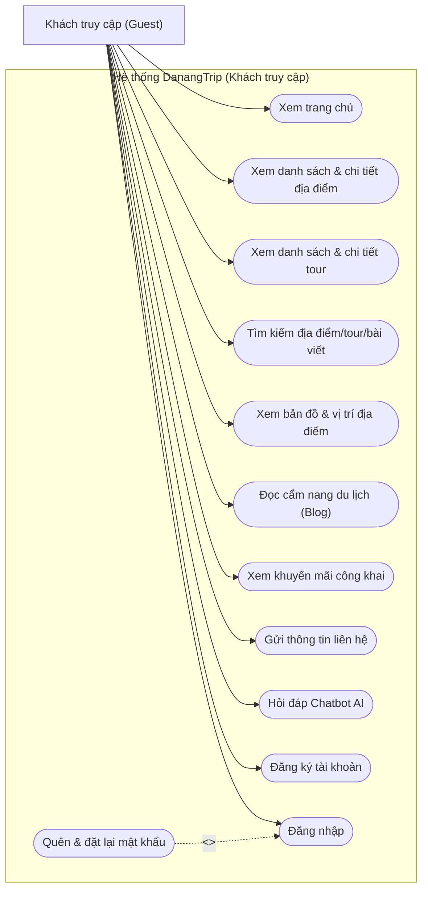
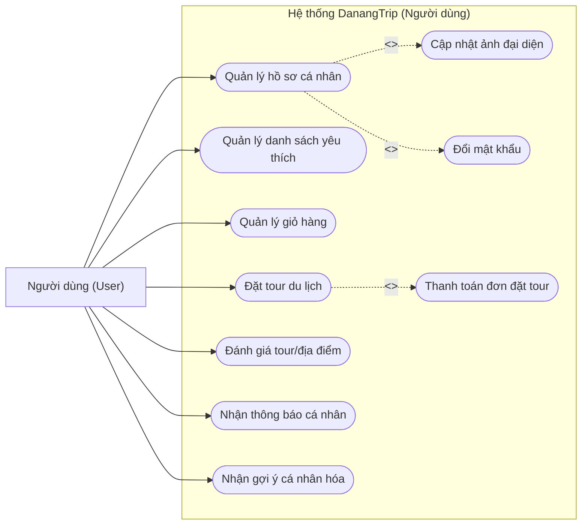
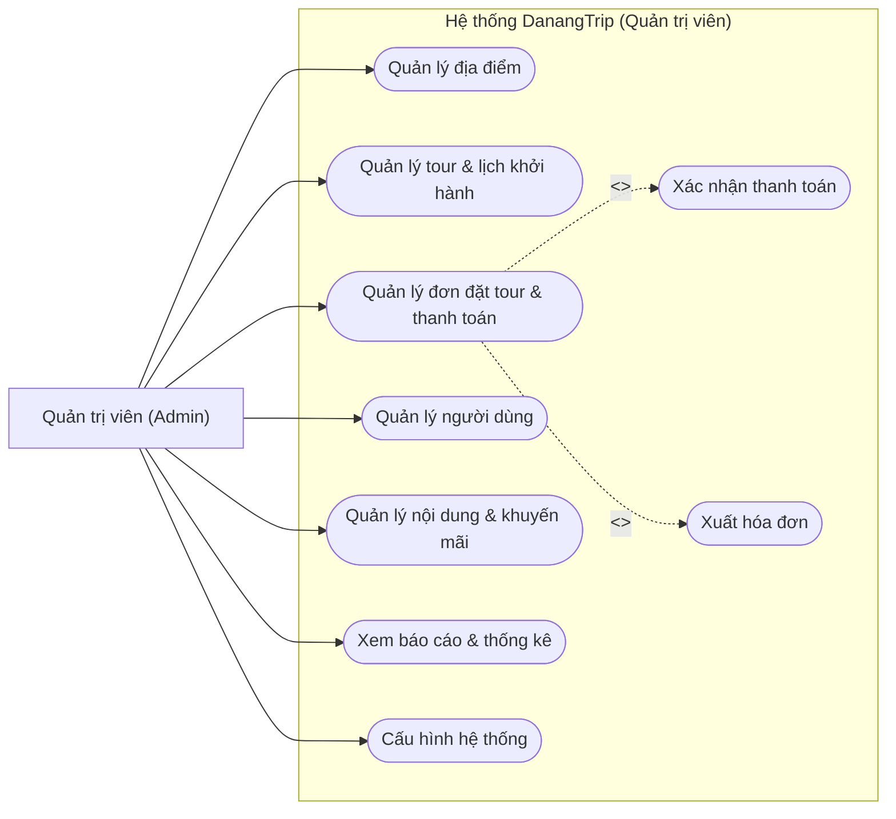
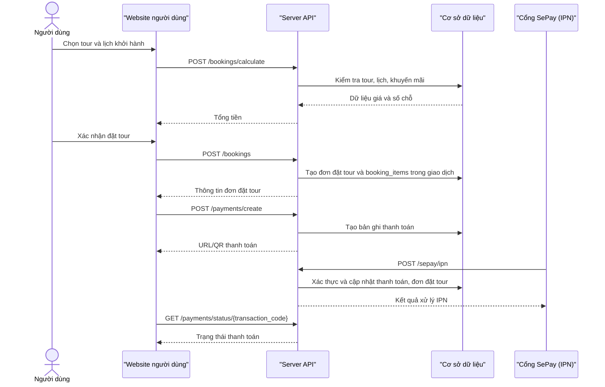
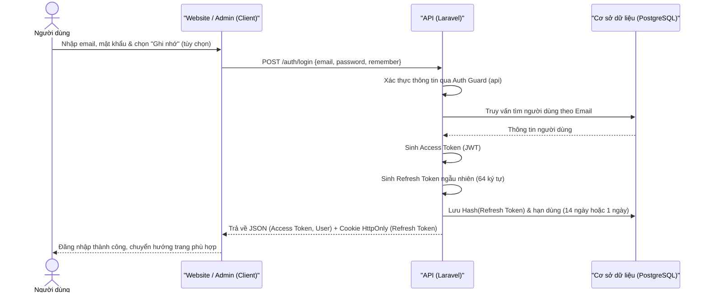
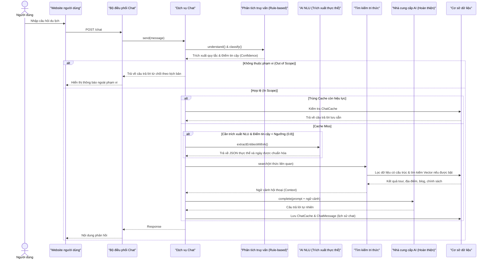
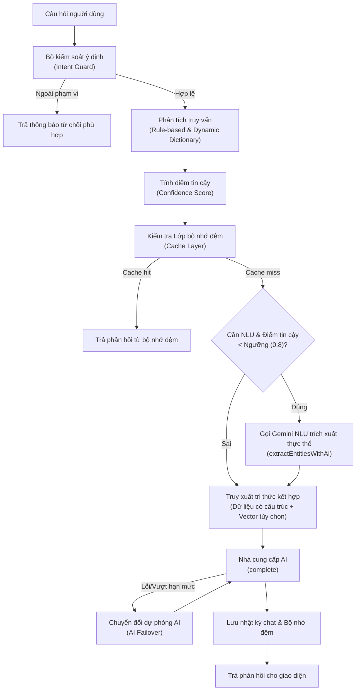
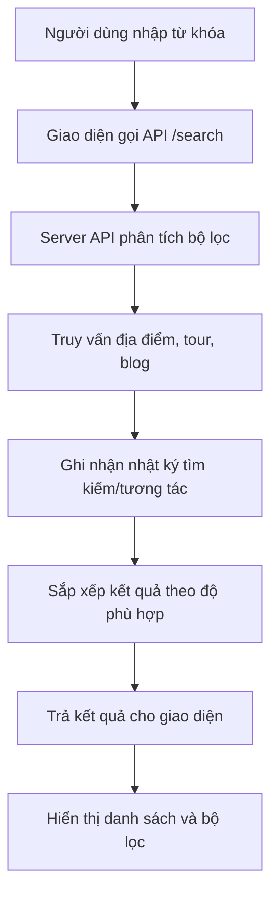
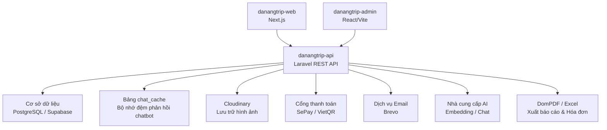

# CHƯƠNG 2. PHÂN TÍCH THIẾT KẾ HỆ THỐNG

## 2.1. Các tác nhân chính

Để phân tích chi tiết các yêu cầu và thiết kế các ca sử dụng (use case) của hệ thống DanangTrip, trước tiên cần xác định rõ ràng các tác nhân (Actors) tham gia tương tác trực tiếp hoặc gián tiếp với hệ thống. Qua phân tích nghiệp vụ, hệ thống DanangTrip phân loại đối tượng sử dụng thành ba nhóm tác nhân chính với vai trò và phạm vi quyền hạn cơ bản nhất, cụ thể như sau:

### 2.1.1. Khách truy cập (Guest)
Khách truy cập đại diện cho các người dùng vãng lai, chưa thực hiện đăng ký tài khoản hoặc chưa đăng nhập vào hệ thống. Đây là nhóm đối tượng có phạm vi quyền hạn cơ bản nhất, chủ yếu tương tác với các giao diện hiển thị thông tin công cộng.
- **Vai trò và quyền hạn:** Khách truy cập có thể truy cập trang chủ để xem thông tin tổng quan, danh sách các địa điểm du lịch nổi bật, các tour du lịch hấp dẫn cũng như các bài viết chia sẻ cẩm nang du lịch. Họ được sử dụng các tính năng tìm kiếm, lọc địa điểm/tour, tra cứu bản đồ số để định vị các điểm đến tại Đà Nẵng, gửi thông tin liên hệ và tương tác với chatbot AI để được tư vấn thông tin du lịch tự động.
- **Mục tiêu tương tác:** Khách truy cập sử dụng hệ thống nhằm mục đích tham khảo thông tin, tìm kiếm các dịch vụ du lịch phù hợp trước khi quyết định đăng ký tài khoản để sử dụng các dịch vụ sâu hơn.

### 2.1.2. Người dùng đã đăng nhập (User)
Người dùng đã đăng nhập là những thành viên đã đăng ký tài khoản thành công và xác thực danh tính qua hệ thống. Nhóm tác nhân này kế thừa toàn bộ các chức năng công cộng của Khách truy cập, đồng thời được cấp quyền truy cập vào các phân hệ chức năng mang tính cá nhân hóa và giao dịch nghiệp vụ.
- **Vai trò và quyền hạn:** Người dùng được phép quản lý hồ sơ cá nhân, danh sách yêu thích và giỏ hàng; tạo đơn đặt tour, áp dụng khuyến mãi hoặc phiếu giảm giá cá nhân, thanh toán qua VietQR/SePay, theo dõi trạng thái đơn và tải hóa đơn. Người dùng còn có thể viết đánh giá, tải ảnh đánh giá, ghi nhận đánh giá hữu ích, xem số dư/lịch sử điểm, đổi điểm lấy phiếu giảm giá và nhận thông báo cá nhân hóa.
- **Mục tiêu tương tác:** Người dùng sử dụng hệ thống để thực hiện đặt tour du lịch, thực hiện thanh toán trực tuyến nhanh chóng và tương tác cộng đồng thông qua việc chia sẻ trải nghiệm thực tế.

### 2.1.3. Quản trị viên (Admin)
Quản trị viên đại diện cho nhóm người dùng nội bộ, có vai trò vận hành, giám sát và quản trị toàn bộ hoạt động của hệ thống thông qua phân hệ trang quản trị (Admin Dashboard). Đây là nhóm tác nhân có đặc quyền cao nhất trong hệ thống.
- **Vai trò và quyền hạn:** Quản trị viên chịu trách nhiệm quản lý danh mục địa điểm, quản lý thông tin địa điểm (thêm, sửa, xóa, duyệt ảnh), quản lý tour du lịch và lịch khởi hành chi tiết. Quản trị viên theo dõi và xử lý các đơn đặt tour, xác nhận giao dịch thanh toán, quản lý tài khoản người dùng (bao gồm phân quyền, khóa hoặc mở khóa tài khoản), quản lý nội dung cẩm nang du lịch (bài viết blog), kiểm duyệt và xử lý các phản hồi/đánh giá từ người dùng. Đồng thời, quản trị viên sử dụng hệ thống báo cáo thống kê doanh thu, xu hướng đặt tour, tăng trưởng người dùng để đưa ra các quyết định vận hành tối ưu.
- **Mục tiêu tương tác:** Vận hành hệ thống ổn định, đảm bảo thông tin dịch vụ du lịch luôn chính xác, xử lý kịp thời các giao dịch tài chính của người dùng và giám sát hiệu quả hoạt động kinh doanh thông qua các số liệu báo cáo thực tế.

## 2.2. Yêu cầu chức năng

Yêu cầu chức năng của hệ thống DanangTrip được chia thành hai nhóm đối tượng sử dụng chính: Nhóm chức năng dành cho người dùng (bao gồm khách truy cập vãng lai và thành viên đã đăng nhập) và nhóm chức năng dành cho quản trị viên (Admin). Nhằm tăng tính tường minh và khoa học cho tài liệu phân tích, các chức năng được phân tách rõ ràng theo từng phân hệ (module) dưới dạng bảng biểu cụ thể.

### 2.2.1. Nhóm chức năng người dùng (Khách du lịch)

*Bảng 2.1: Yêu cầu chức năng nhóm người dùng*

| STT | Phân hệ (Module) | Chi tiết yêu cầu chức năng |
| :---: | :--- | :--- |
| 1 | Xác thực & Tài khoản | - Đăng ký, đăng nhập, đăng xuất, làm mới mã thông báo. - Quên mật khẩu, đặt lại mật khẩu mới. - Xác thực email bằng mã OTP và gửi lại mã xác thực. - Quản lý hồ sơ cá nhân (ảnh đại diện, đổi mật khẩu, xóa tài khoản). |
| 2 | Khám phá & Tìm kiếm | - Xem trang chủ, danh mục, địa điểm/tour nổi bật, bài viết mới. - Tìm kiếm địa điểm/tour, xem gợi ý/xu hướng tìm kiếm và gợi ý cá nhân hóa. - Xem chi tiết địa điểm, hình ảnh, đánh giá, thống kê đánh giá. - Xem vị trí địa điểm trên bản đồ, tìm địa điểm lân cận hoặc gần vị trí người dùng. |
| 3 | Đặt tour và thanh toán | - Xem danh sách tour, chi tiết tour, lịch khởi hành, kiểm tra số chỗ. - Quản lý giỏ hàng và đặt tour. - Tính giá, áp dụng mã khuyến mãi hoặc phiếu giảm giá cá nhân, tạo thanh toán. - Theo dõi trạng thái thanh toán, thử lại thanh toán và xem hóa đơn. |
| 4 | Tương tác và tiện ích | - Quản lý danh sách yêu thích, nhận thông báo hệ thống và nhắc lịch khởi hành. - Viết đánh giá, tải ảnh, quản lý lịch sử đánh giá và ghi nhận đánh giá hữu ích. - Xem số dư/lịch sử điểm, phần thưởng, phiếu giảm giá và đổi điểm. - Gửi liên hệ và tương tác với chatbot tư vấn du lịch. |

### 2.2.2. Nhóm chức năng quản trị (Admin)

*Bảng 2.2: Yêu cầu chức năng nhóm quản trị (Admin)*

| STT | Phân hệ (Module) | Chi tiết yêu cầu chức năng |
| :---: | :--- | :--- |
| 1 | Tổng quan & Bảo mật | - Đăng nhập trang quản trị và kiểm tra phân quyền. - Xem bảng điều khiển (Dashboard) tổng quan về doanh thu, tour/địa điểm nổi bật, tăng trưởng người dùng, xu hướng đặt tour và tìm kiếm. |
| 2 | Quản lý nghiệp vụ du lịch | - Quản lý danh mục địa điểm, danh mục con, địa điểm, thẻ phân loại, tiện ích. - Quản lý tour, danh mục tour và lịch khởi hành. |
| 3 | Quản lý giao dịch | - Quản lý đơn đặt tour, cập nhật trạng thái, xác nhận thủ công khoản chuyển tiền và xuất hóa đơn. - Quản lý luồng thanh toán, xem chi tiết, xuất báo cáo và xử lý hoàn tiền. |
| 4 | Quản lý người dùng & Khách hàng | - Quản lý tài khoản người dùng, phân quyền, khóa/mở khóa tài khoản, xuất danh sách. - Quản lý và phản hồi liên hệ, gửi email chăm sóc khách hàng. - Quản lý đánh giá (duyệt, từ chối, xóa, xử lý báo cáo vi phạm). |
| 5 | Quản lý nội dung & Tiếp thị | - Quản lý bài viết blog, danh mục blog và các trang đích (Landing pages). - Tạo và quản lý các chương trình khuyến mãi. - Gửi thông báo (đơn lẻ hoặc hàng loạt cho toàn bộ người dùng). - Cấu hình các thông số hệ thống và xuất báo cáo thống kê. |

## 2.3. Yêu cầu phi chức năng

*Bảng 2.3: Các yêu cầu phi chức năng và phương án triển khai*

| Nhóm yêu cầu | Mô tả |
| --- | --- |
| Bảo mật | Sử dụng JWT, phân quyền quản trị viên, giới hạn tần suất API, kiểm tra dữ liệu đầu vào, kiểm soát tải ảnh |
| Hiệu năng | Dùng bộ nhớ đệm của React Query, bảng `chat_cache`, phân trang dữ liệu và chỉ mục cơ sở dữ liệu; Redis có thể được cấu hình cho hàng đợi/bộ nhớ đệm khi triển khai |
| Khả dụng | Giao diện đáp ứng, có trạng thái đang tải/trạng thái lỗi, hỗ trợ đa ngôn ngữ |
| Mở rộng | Tách website người dùng, trang quản trị và API; service/repository tách nghiệp vụ; có thể mở rộng AI/hệ thống gợi ý |
| Dễ bảo trì | TypeScript ở tầng giao diện, tầng dịch vụ Laravel, migration, kiểm thử và cấu trúc phân hệ rõ ràng |
| Toàn vẹn dữ liệu | Dùng giao dịch cho đặt tour, thanh toán, cập nhật trạng thái và các thao tác quan trọng |

## 2.4. Biểu đồ use case phân rã

Để làm rõ hơn các chức năng cụ thể của từng nhóm đối tượng sử dụng hệ thống DanangTrip, phần này cung cấp các biểu đồ use case phân rã chi tiết cho từng tác nhân (Khách truy cập, Người dùng đã đăng nhập, Quản trị viên). Mỗi biểu đồ tập trung làm rõ các hành vi tương tác và các mối liên kết (như `<<include>>`) giữa các ca sử dụng.

### 2.4.1. Khách truy cập

Khách truy cập là đối tượng người dùng chưa có tài khoản hoặc chưa đăng nhập vào hệ thống. Họ có thể tương tác với các tính năng công cộng và tra cứu thông tin cơ bản:

Chi tiết các chức năng của khách truy cập bao gồm:
- **Xem trang chủ:** Xem các thông tin tổng quan, hình ảnh, địa điểm nổi bật.
- **Xem danh sách và chi tiết địa điểm:** Tìm hiểu về thông tin, hình ảnh, đánh giá của các địa điểm.
- **Xem danh sách và chi tiết tour:** Xem lịch trình tour, giá cả, và các dịch vụ đi kèm.
- **Tìm kiếm địa điểm/tour/bài viết:** Tra cứu nhanh chóng các dịch vụ theo từ khóa.
- **Xem bản đồ số:** Tìm vị trí địa lý của các địa điểm du lịch tại Đà Nẵng.
- **Đọc blog du lịch:** Tham khảo kinh nghiệm, cẩm nang du lịch từ các bài viết chia sẻ.
- **Xem khuyến mãi công khai:** Theo dõi các chương trình ưu đãi chung của hệ thống.
- **Gửi biểu mẫu liên hệ:** Để lại phản hồi hoặc yêu cầu hỗ trợ cho quản trị viên.
- **Hỏi chatbot:** Sử dụng chatbot AI để tư vấn hành trình và giải đáp thắc mắc.
- **Đăng ký hoặc đăng nhập:** Khởi tạo tài khoản mới hoặc đăng nhập để chuyển đổi thành tác nhân Người dùng đã đăng nhập.

### 2.4.2. Người dùng đã đăng nhập

Người dùng đã đăng nhập kế thừa toàn bộ quyền truy cập công cộng của Khách truy cập, đồng thời được thực hiện các tính năng giao dịch và cá nhân hóa:

Chi tiết các chức năng của người dùng đã đăng nhập bao gồm:
- **Quản lý hồ sơ cá nhân:** Cập nhật thông tin cá nhân cơ bản.
- **Đổi mật khẩu và cập nhật ảnh đại diện:** Đảm bảo bảo mật tài khoản và cập nhật thông tin nhận diện.
- **Lưu hoặc bỏ lưu địa điểm/tour yêu thích:** Lưu trữ các điểm đến hoặc lịch trình quan tâm để xem lại sau.
- **Quản lý giỏ hàng:** Quản lý các tour du lịch đã chọn để chuẩn bị đặt chỗ.
- **Đặt tour và theo dõi đơn đặt tour:** Thực hiện đặt chỗ cho chuyến đi và theo dõi tiến độ đơn hàng.
- **Thanh toán:** Thực hiện thanh toán trực tuyến qua cổng tích hợp.
- **Xem hoặc tải hóa đơn:** Tải hóa đơn PDF của các tour đã thanh toán thành công.
- **Đánh giá tour/địa điểm:** Viết bình luận, đăng tải hình ảnh và chấm điểm sao cho các trải nghiệm thực tế.
- **Xem thông báo:** Nhận các thông tin cập nhật về đơn hàng hoặc chương trình ưu đãi cá nhân.
- **Nhận gợi ý cá nhân hóa:** Hệ thống đề xuất địa điểm/tour dựa trên hành vi tìm kiếm và tương tác trước đó.

### 2.4.3. Quản trị viên

Quản trị viên là tác nhân quản trị nội bộ có đặc quyền cao nhất để vận hành, điều phối hệ thống:

Chi tiết các chức năng của quản trị viên bao gồm:
- **Quản lý dữ liệu địa điểm, danh mục, thẻ phân loại và tiện ích:** Thêm mới, chỉnh sửa, xóa và kiểm duyệt hình ảnh của các địa điểm du lịch.
- **Quản lý tour, danh mục tour và lịch khởi hành:** Cập nhật thông tin chi tiết các tour du lịch, quản lý ngày khởi hành và số chỗ của mỗi đợt.
- **Quản lý đơn đặt tour, thanh toán và hóa đơn:** Tiếp nhận đơn hàng, xác nhận giao dịch thanh toán thủ công hoặc kiểm tra đối soát, hoàn tiền.
- **Quản lý người dùng, vai trò và trạng thái tài khoản:** Theo dõi danh sách tài khoản, khóa hoặc mở khóa tài khoản vi phạm.
- **Quản lý nội dung, cẩm nang blog, thông báo và khuyến mãi:** Đăng tải cẩm nang, phê duyệt bài viết, cấu hình các mã giảm giá và gửi thông báo hệ thống.
- **Quản lý liên hệ và đánh giá:** Phản hồi các yêu cầu liên hệ, kiểm duyệt các đánh giá xấu hoặc vi phạm tiêu chuẩn cộng đồng.
- **Xem bảng điều khiển, báo cáo doanh thu:** Phân tích biểu đồ trực quan về doanh thu, số lượt booking, tăng trưởng người dùng.
- **Cấu hình hệ thống:** Tùy chỉnh các thông số cài đặt chung cho toàn bộ website.

## 2.5. Đặc tả use case tiêu biểu

### 2.5.1. Use case tìm kiếm địa điểm/tour

*Bảng 2.4: Đặc tả ca sử dụng Tìm kiếm*

| Thành phần | Nội dung |
| --- | --- |
| **Mã ca sử dụng** | UC01 |
| **Tên use case** | Tìm kiếm |
| **Mô tả** | Người dùng tìm kiếm địa điểm, tour du lịch, bài viết bằng cách nhập từ khóa và thiết lập các bộ lọc. |
| **Tác nhân** | Khách truy cập, Người dùng |
| **Sự kiện kích hoạt** | Người dùng nhập từ khóa tìm kiếm hoặc nhấp vào các nút lọc giá trị. |
| **Tiền điều kiện** | Hệ thống có dữ liệu địa điểm du lịch, tour du lịch hoặc bài viết blog. |
| **Luồng sự kiện chính (Thành công)** | <table><tr><th>STT</th><th>Thực hiện bởi</th><th>Hành động</th></tr><tr><td>1.</td><td>Người dùng</td><td>Nhập từ khóa tìm kiếm vào thanh tìm kiếm</td></tr><tr><td>2.</td><td>Người dùng</td><td>Chọn các bộ lọc mong muốn (khoảng giá, danh mục, đánh giá sao)</td></tr><tr><td>3.</td><td>Hệ thống</td><td>Tiếp nhận thông tin và gửi yêu cầu truy vấn đến API</td></tr><tr><td>4.</td><td>Hệ thống</td><td>Thực hiện truy vấn và sắp xếp kết quả dựa trên từ khóa</td></tr><tr><td>5.</td><td>Hệ thống</td><td>Hiển thị danh sách kết quả phù hợp trên giao diện</td></tr></table> |
| **Luồng sự kiện thay thế** | <table><tr><th>STT</th><th>Thực hiện bởi</th><th>Hành động</th></tr><tr><td>4a.</td><td>Hệ thống</td><td>Không tìm thấy kết quả phù hợp, hiển thị màn hình thông báo không tìm thấy kết quả và đề xuất địa điểm phổ biến</td></tr></table> |
| **Hậu điều kiện** | Kết quả hiển thị đúng theo từ khóa và các điều kiện lọc được áp dụng. |
| **Trường hợp lỗi** | 1. Từ khóa chứa các ký tự đặc biệt nguy hiểm hoặc lỗi truy vấn SQL. 2. Lỗi kết nối mạng đến API. |

### 2.5.2. Use case chatbot tư vấn du lịch

*Bảng 2.5: Đặc tả ca sử dụng Chatbot tư vấn du lịch*

| Thành phần | Nội dung |
| --- | --- |
| **Mã ca sử dụng** | UC02 |
| **Tên use case** | Chatbot tư vấn du lịch |
| **Mô tả** | Trò chuyện trực tuyến để tư vấn tour du lịch, tìm địa điểm hoặc tra cứu thông tin chính sách nhờ AI RAG. |
| **Tác nhân** | Khách truy cập, Người dùng |
| **Sự kiện kích hoạt** | Người dùng gửi câu hỏi trong khung chat của hệ thống. |
| **Tiền điều kiện** | API chatbot và cơ sở tri thức (knowledge base) hoạt động ổn định. |
| **Luồng sự kiện chính (Thành công)** | <table><tr><th>STT</th><th>Thực hiện bởi</th><th>Hành động</th></tr><tr><td>1.</td><td>Người dùng</td><td>Nhập câu hỏi du lịch vào khung chat</td></tr><tr><td>2.</td><td>Hệ thống</td><td>Kiểm tra ý định câu hỏi</td></tr><tr><td>3.</td><td>Hệ thống</td><td>Trích xuất tham số, truy xuất dữ liệu nghiệp vụ và tìm kiếm ngữ nghĩa nếu được bật</td></tr><tr><td>4.</td><td>Hệ thống</td><td>Xây dựng lời nhắc và gọi API mô hình AI</td></tr><tr><td>5.</td><td>Hệ thống</td><td>Nhận phản hồi, ghi lịch sử hội thoại và bộ nhớ đệm</td></tr><tr><td>6.</td><td>Hệ thống</td><td>Hiển thị câu trả lời cho người dùng</td></tr></table> |
| **Luồng sự kiện thay thế** | <table><tr><th>STT</th><th>Thực hiện bởi</th><th>Hành động</th></tr><tr><td>2a.</td><td>Hệ thống</td><td>Câu hỏi ngoài phạm vi hỗ trợ, trả về câu trả lời từ chối theo kịch bản có sẵn</td></tr><tr><td>4a.</td><td>Hệ thống</td><td>AI chính bị lỗi hoặc vượt hạn mức, tự động chuyển sang mô hình AI dự phòng (AI Failover)</td></tr></table> |
| **Hậu điều kiện** | Người dùng nhận được phản hồi tư vấn và lịch sử trò chuyện được lưu trữ thành công. |
| **Trường hợp lỗi** | 1. Không có kết nối mạng từ hệ thống đến nhà cung cấp AI. 2. Cơ sở tri thức không có dữ liệu trả lời phù hợp (Chatbot trả lời theo kịch bản dự phòng). |

### 2.5.3. Use case đăng ký tài khoản

*Bảng 2.6: Đặc tả ca sử dụng Đăng ký tài khoản*

| Thành phần | Nội dung |
| --- | --- |
| **Mã ca sử dụng** | UC03 |
| **Tên use case** | Đăng ký tài khoản |
| **Mô tả** | Người dùng vãng lai tạo tài khoản mới bằng cách điền thông tin cá nhân và xác thực OTP qua email. |
| **Tác nhân** | Khách truy cập |
| **Sự kiện kích hoạt** | Người dùng nhấp vào liên kết "Đăng ký" trên giao diện chính. |
| **Tiền điều kiện** | Người dùng chưa có tài khoản đăng ký trong hệ thống. |
| **Luồng sự kiện chính (Thành công)** | <table><tr><th>STT</th><th>Thực hiện bởi</th><th>Hành động</th></tr><tr><td>1.</td><td>Khách truy cập</td><td>Điền biểu mẫu đăng ký (Họ tên, Email, Tên đăng nhập, Mật khẩu, Xác nhận mật khẩu)</td></tr><tr><td>2.</td><td>Khách truy cập</td><td>Nhấn nút "Đăng ký"</td></tr><tr><td>3.</td><td>Hệ thống</td><td>Kiểm tra tính hợp lệ và duy nhất của email và tên đăng nhập</td></tr><tr><td>4.</td><td>Hệ thống</td><td>Tạo bản ghi người dùng mới với trạng thái "Chờ kích hoạt"</td></tr><tr><td>5.</td><td>Hệ thống</td><td>Gửi email chứa mã kích hoạt hoặc OTP đến hòm thư người dùng</td></tr><tr><td>6.</td><td>Khách truy cập</td><td>Nhập mã OTP để kích hoạt tài khoản</td></tr><tr><td>7.</td><td>Hệ thống</td><td>Kích hoạt tài khoản thành công và thông báo cho người dùng</td></tr></table> |
| **Luồng sự kiện thay thế** | <table><tr><th>STT</th><th>Thực hiện bởi</th><th>Hành động</th></tr><tr><td>5a.</td><td>Hệ thống</td><td>Cấu hình hệ thống không yêu cầu kích hoạt, kích hoạt tài khoản trực tiếp và đăng nhập ngay</td></tr></table> |
| **Hậu điều kiện** | Tài khoản thành viên mới được lưu vào cơ sở dữ liệu dưới trạng thái Hoạt động. |
| **Trường hợp lỗi** | 1. Email hoặc Tên đăng nhập đã được đăng ký bởi người dùng khác. 2. Mật khẩu nhập lại không khớp. 3. Người dùng nhập sai mã OTP kích hoạt. |

### 2.5.4. Use case đăng nhập

*Bảng 2.7: Đặc tả ca sử dụng Đăng nhập*

| Thành phần | Nội dung |
| --- | --- |
| **Mã ca sử dụng** | UC04 |
| **Tên use case** | Đăng nhập |
| **Mô tả** | Xác thực thông tin tài khoản của người dùng hoặc quản trị viên để cấp quyền truy cập hệ thống. |
| **Tác nhân** | Người dùng, Quản trị viên |
| **Sự kiện kích hoạt** | Người dùng nhấn nút "Đăng nhập" hoặc truy cập trực tiếp trang đăng nhập. |
| **Tiền điều kiện** | Người dùng đã có tài khoản trên hệ thống. |
| **Luồng sự kiện chính (Thành công)** | <table><tr><th>STT</th><th>Thực hiện bởi</th><th>Hành động</th></tr><tr><td>1.</td><td>Người dùng</td><td>Chọn chức năng Đăng nhập</td></tr><tr><td>2.</td><td>Hệ thống</td><td>Hiển thị giao diện đăng nhập</td></tr><tr><td>3.</td><td>Người dùng</td><td>Điền thông tin đăng nhập (Email, Mật khẩu, và tùy chọn Ghi nhớ đăng nhập)</td></tr><tr><td>4.</td><td>Người dùng</td><td>Yêu cầu đăng nhập</td></tr><tr><td>5.</td><td>Hệ thống</td><td>Kiểm tra xem người dùng đã nhập các trường bắt buộc nhập hay chưa</td></tr><tr><td>6.</td><td>Hệ thống</td><td>Xác thực thông tin tài khoản, sinh Access Token (JWT) và Refresh Token ngẫu nhiên (64 ký tự)</td></tr><tr><td>7.</td><td>Hệ thống</td><td>Lưu Hash SHA-256 của Refresh Token vào cơ sở dữ liệu và đính kèm token này vào phản hồi dưới dạng Cookie HttpOnly để đảm bảo an toàn</td></tr><tr><td>8.</td><td>Hệ thống</td><td>Trả về dữ liệu JSON chứa Access Token và thông tin người dùng, hiển thị giao diện tương ứng theo vai trò</td></tr></table> |
| **Luồng sự kiện thay thế** | <table><tr><th>STT</th><th>Thực hiện bởi</th><th>Hành động</th></tr><tr><td>5a.</td><td>Hệ thống</td><td>Thông báo lỗi: Cần nhập các trường bắt buộc nhập nếu Người dùng nhập thiếu</td></tr><tr><td>6a.</td><td>Hệ thống</td><td>Thông báo: Tài khoản hoặc mật khẩu chưa đúng nếu thông tin xác thực không chính xác</td></tr></table> |
| **Hậu điều kiện** | Người dùng đăng nhập thành công và truy cập được chức năng tương ứng với quyền. |
| **Trường hợp lỗi** | 1. Người dùng nhập sai Email hoặc Mật khẩu. 2. Tài khoản đã bị khóa hoặc chưa được kích hoạt. 3. Không thể kết nối với Server API. |

### 2.5.5. Use case đặt tour

*Bảng 2.8: Đặc tả ca sử dụng Đặt tour*

| Thành phần | Nội dung |
| --- | --- |
| **Mã ca sử dụng** | UC05 |
| **Tên use case** | Đặt tour |
| **Mô tả** | Người dùng chọn lịch khởi hành, số lượng hành khách, áp dụng mã giảm giá và khởi tạo đơn đặt tour trực tuyến. |
| **Tác nhân** | Người dùng đã đăng nhập |
| **Sự kiện kích hoạt** | Người dùng nhấn nút "Đặt tour" tại trang chi tiết tour hoặc giỏ hàng. |
| **Tiền điều kiện** | Người dùng đang xem chi tiết một tour du lịch và lịch khởi hành còn chỗ trống. |
| **Luồng sự kiện chính (Thành công)** | <table><tr><th>STT</th><th>Thực hiện bởi</th><th>Hành động</th></tr><tr><td>1.</td><td>Người dùng</td><td>Chọn lịch khởi hành mong muốn</td></tr><tr><td>2.</td><td>Người dùng</td><td>Nhập số lượng khách hàng đi tour</td></tr><tr><td>3.</td><td>Hệ thống</td><td>Tính toán tổng tiền và áp dụng các khuyến mãi hợp lệ</td></tr><tr><td>4.</td><td>Người dùng</td><td>Nhấn nút "Xác nhận đặt tour" và cập nhật thông tin liên hệ</td></tr><tr><td>5.</td><td>Người dùng</td><td>Nhấn nút "Đặt tour"</td></tr><tr><td>6.</td><td>Hệ thống</td><td>Tạo đơn đặt tour mới trong cơ sở dữ liệu với trạng thái "Chờ thanh toán"</td></tr><tr><td>7.</td><td>Hệ thống</td><td>Chuyển hướng người dùng đến giao diện thanh toán</td></tr></table> |
| **Luồng sự kiện thay thế** | <table><tr><th>STT</th><th>Thực hiện bởi</th><th>Hành động</th></tr><tr><td>3a.</td><td>Người dùng</td><td>Nhập mã giảm giá và hệ thống cập nhật lại tổng tiền giảm giá phù hợp</td></tr></table> |
| **Hậu điều kiện** | Đơn đặt tour (booking) được tạo thành công trong hệ thống và ở trạng thái Chờ thanh toán. |
| **Trường hợp lỗi** | 1. Số lượng chỗ trống còn lại không đủ đáp ứng số lượng khách đặt. 2. Nhập số lượng khách không hợp lệ (nhỏ hơn hoặc bằng 0). 3. Lỗi tạo bản ghi trong cơ sở dữ liệu. |

### 2.5.6. Use case thanh toán

*Bảng 2.9: Đặc tả ca sử dụng Thanh toán đơn đặt tour*

| Thành phần | Nội dung |
| --- | --- |
| **Mã ca sử dụng** | UC06 |
| **Tên use case** | Thanh toán đơn đặt tour |
| **Mô tả** | Khách hàng thực hiện thanh toán trực tuyến qua mã VietQR và hệ thống tự động cập nhật trạng thái đơn hàng nhờ cổng SePay IPN. |
| **Tác nhân** | Người dùng, Cổng thanh toán (SePay/VietQR) |
| **Sự kiện kích hoạt** | Người dùng chọn phương thức thanh toán VietQR cho đơn đặt tour đang chờ xử lý. |
| **Tiền điều kiện** | Đơn đặt tour tồn tại trong hệ thống và chưa được thanh toán (trạng thái Chờ thanh toán). |
| **Luồng sự kiện chính (Thành công)** | <table><tr><th>STT</th><th>Thực hiện bởi</th><th>Hành động</th></tr><tr><td>1.</td><td>Người dùng</td><td>Chọn phương thức thanh toán chuyển khoản VietQR</td></tr><tr><td>2.</td><td>Hệ thống</td><td>Hiển thị mã VietQR động cùng thông tin số tiền và nội dung chuyển khoản tự động</td></tr><tr><td>3.</td><td>Người dùng</td><td>Sử dụng ứng dụng ngân hàng quét mã QR và thực hiện thanh toán</td></tr><tr><td>4.</td><td>Cổng thanh toán</td><td>Nhận giao dịch thanh toán thành công và gửi Webhook (IPN) đến hệ thống API</td></tr><tr><td>5.</td><td>Hệ thống</td><td>Xác thực thông tin Webhook và cập nhật trạng thái đơn đặt tour thành "Đã thanh toán"</td></tr><tr><td>6.</td><td>Hệ thống</td><td>Hiển thị giao diện thanh toán thành công và gửi hóa đơn xác nhận qua email</td></tr></table> |
| **Luồng sự kiện thay thế** | <table><tr><th>STT</th><th>Thực hiện bởi</th><th>Hành động</th></tr><tr><td>4a.</td><td>Hệ thống</td><td>Quá thời gian quy định người dùng chưa thanh toán, tự động chuyển đơn hàng sang trạng thái "Hủy"</td></tr></table> |
| **Hậu điều kiện** | Đơn đặt tour được cập nhật thành Đã thanh toán, tạo mã giao dịch và phát hành hóa đơn thành công. |
| **Trường hợp lỗi** | 1. Người dùng chuyển sai nội dung chuyển khoản hoặc sai số tiền yêu cầu. 2. Lỗi kết nối Webhook giữa SePay và Server API. |

### 2.5.7. Use case đánh giá

*Bảng 2.10: Đặc tả ca sử dụng Đánh giá tour/địa điểm*

| Thành phần | Nội dung |
| --- | --- |
| **Mã ca sử dụng** | UC07 |
| **Tên use case** | Đánh giá tour/địa điểm |
| **Mô tả** | Thành viên viết phản hồi, đăng tải ảnh, và chấm điểm sao cho các địa điểm hoặc tour du lịch đã trải nghiệm. |
| **Tác nhân** | Người dùng đã đăng nhập |
| **Sự kiện kích hoạt** | Người dùng nhấn nút "Gửi đánh giá" trong phần đánh giá của trang chi tiết. |
| **Tiền điều kiện** | Người dùng đã đăng nhập; nếu đánh giá tour thì yêu cầu người dùng từng đặt và đi tour đó thành công. |
| **Luồng sự kiện chính (Thành công)** | <table><tr><th>STT</th><th>Thực hiện bởi</th><th>Hành động</th></tr><tr><td>1.</td><td>Người dùng</td><td>Chọn viết đánh giá tại trang chi tiết tour hoặc địa điểm</td></tr><tr><td>2.</td><td>Người dùng</td><td>Chọn số sao đánh giá (1-5 sao), nhập nội dung bình luận và đính kèm ảnh</td></tr><tr><td>3.</td><td>Người dùng</td><td>Nhấn nút "Gửi đánh giá"</td></tr><tr><td>4.</td><td>Hệ thống</td><td>Kiểm tra dữ liệu đầu vào hợp lệ</td></tr><tr><td>5.</td><td>Hệ thống</td><td>Lưu đánh giá vào cơ sở dữ liệu và tự động tính toán lại điểm đánh giá trung bình</td></tr><tr><td>6.</td><td>Hệ thống</td><td>Hiển thị thông báo gửi thành công trên giao diện</td></tr></table> |
| **Luồng sự kiện thay thế** | <table><tr><th>STT</th><th>Thực hiện bởi</th><th>Hành động</th></tr><tr><td>5a.</td><td>Hệ thống</td><td>Chế độ kiểm duyệt được kích hoạt, chuyển đánh giá sang trạng thái "Chờ duyệt" trước khi hiển thị công khai</td></tr></table> |
| **Hậu điều kiện** | Bản ghi đánh giá được ghi nhận và điểm đánh giá trung bình của đối tượng được cập nhật tương ứng. |
| **Trường hợp lỗi** | 1. Nội dung bình luận trống hoặc vi phạm từ khóa cấm. 2. Ảnh đính kèm không đúng định dạng hoặc vượt quá kích dung lượng tối đa. 3. Người dùng cố gắng đánh giá nhiều lần cho một đối tượng (tránh spam). |

### 2.5.8. Use case quản lý tour & lịch khởi hành

*Bảng 2.11: Đặc tả ca sử dụng Quản lý tour & lịch khởi hành*

| Thành phần | Nội dung |
| --- | --- |
| **Mã ca sử dụng** | UC08 |
| **Tên use case** | Quản lý tour & lịch khởi hành |
| **Mô tả** | Quản trị viên quản lý danh sách tour du lịch (thêm, sửa, xóa) và cấu hình lịch khởi hành chi tiết cho từng tour. |
| **Tác nhân** | Quản trị viên |
| **Sự kiện kích hoạt** | Quản trị viên truy cập phân hệ quản lý tour trên giao diện Admin Dashboard. |
| **Tiền điều kiện** | Quản trị viên đăng nhập thành công vào trang quản trị. |
| **Luồng sự kiện chính (Thành công)** | <table><tr><th>STT</th><th>Thực hiện bởi</th><th>Hành động</th></tr><tr><td>1.</td><td>Quản trị viên</td><td>Chọn chức năng Quản lý Tour trên thanh điều hướng Sidebar</td></tr><tr><td>2.</td><td>Hệ thống</td><td>Hiển thị danh sách các tour du lịch hiện có, thông tin chi tiết và bộ lọc tìm kiếm</td></tr><tr><td>3.</td><td>Quản trị viên</td><td>Chọn thêm tour mới hoặc chỉnh sửa/cập nhật thông tin của một tour có sẵn</td></tr><tr><td>4.</td><td>Hệ thống</td><td>Hiển thị biểu mẫu thông tin chi tiết của tour (tên tour, giá cả, thời lượng, lịch trình, số chỗ tối đa)</td></tr><tr><td>5.</td><td>Quản trị viên</td><td>Điền hoặc cập nhật các trường thông tin, cấu hình lịch khởi hành cụ thể, và nhấn nút "Lưu"</td></tr><tr><td>6.</td><td>Hệ thống</td><td>Kiểm tra tính hợp lệ của dữ liệu, lưu vào cơ sở dữ liệu và hiển thị thông báo thành công</td></tr></table> |
| **Luồng sự kiện thay thế** | <table><tr><th>STT</th><th>Thực hiện bởi</th><th>Hành động</th></tr><tr><td>3a.</td><td>Quản trị viên</td><td>Truy cập mục "Lịch khởi hành" của một tour cụ thể để thêm, sửa đổi hoặc xóa các ngày khởi hành và số chỗ override</td></tr><tr><td>5a.</td><td>Quản trị viên</td><td>Nhấn nút "Hủy" để hủy bỏ các thay đổi, hệ thống không lưu và quay lại màn hình danh sách</td></tr></table> |
| **Hậu điều kiện** | Thông tin tour và lịch khởi hành được cập nhật mới nhất trong cơ sở dữ liệu và hiển thị lên giao diện người dùng. |
| **Trường hợp lỗi** | 1. Nhập thiếu thông tin bắt buộc hoặc nhập sai định dạng dữ liệu. 2. Ngày khởi hành bị trùng lặp hoặc thời gian không hợp lệ (ngày trong quá khứ). 3. Lỗi kết nối cơ sở dữ liệu. |

### 2.5.9. Use case quản lý đơn đặt tour

*Bảng 2.12: Đặc tả ca sử dụng Quản lý đơn đặt tour*

| Thành phần | Nội dung |
| --- | --- |
| **Mã ca sử dụng** | UC09 |
| **Tên use case** | Quản lý đơn đặt tour |
| **Mô tả** | Quản trị viên duyệt, cập nhật trạng thái đơn đặt tour và xác nhận thanh toán thủ công. |
| **Tác nhân** | Quản trị viên |
| **Sự kiện kích hoạt** | Quản trị viên truy cập mục quản lý đơn đặt tour trên thanh điều hướng admin. |
| **Tiền điều kiện** | Quản trị viên đã đăng nhập thành công vào trang quản trị (Admin Dashboard). |
| **Luồng sự kiện chính (Thành công)** | <table><tr><th>STT</th><th>Thực hiện bởi</th><th>Hành động</th></tr><tr><td>1.</td><td>Quản trị viên</td><td>Truy cập danh sách đơn đặt tour (booking)</td></tr><tr><td>2.</td><td>Quản trị viên</td><td>Lọc danh sách theo trạng thái đơn hàng (Chờ thanh toán, Đã thanh toán, Chờ duyệt)</td></tr><tr><td>3.</td><td>Quản trị viên</td><td>Chọn xem chi tiết một đơn đặt tour cụ thể</td></tr><tr><td>4.</td><td>Quản trị viên</td><td>Thay đổi trạng thái đơn hàng hoặc xác nhận thanh toán</td></tr><tr><td>5.</td><td>Hệ thống</td><td>Lưu trạng thái mới và gửi email cập nhật thông tin cho khách hàng</td></tr></table> |
| **Luồng sự kiện thay thế** | <table><tr><th>STT</th><th>Thực hiện bởi</th><th>Hành động</th></tr><tr><td>4a.</td><td>Quản trị viên</td><td>Hủy đơn đặt tour, hệ thống cập nhật trạng thái đơn hàng thành "Đã hủy" và giải phóng số chỗ khởi hành</td></tr></table> |
| **Hậu điều kiện** | Trạng thái đơn đặt tour được cập nhật chính xác và khách hàng nhận được email thông báo trạng thái. |
| **Trường hợp lỗi** | 1. Đơn đặt tour không tồn tại trong cơ sở dữ liệu. 2. Quản trị viên cố gắng cập nhật trạng thái không hợp lệ (ví dụ: chuyển từ Đã hoàn thành sang Chờ thanh toán). |

### 2.5.10. Use case đổi điểm lấy phiếu giảm giá

*Bảng 2.12a: Đặc tả ca sử dụng đổi điểm lấy phiếu giảm giá*

| Thành phần | Nội dung |
| --- | --- |
| **Mã ca sử dụng** | UC25 |
| **Tên ca sử dụng** | Đổi điểm lấy phiếu giảm giá cá nhân |
| **Tác nhân** | Người dùng đã đăng nhập |
| **Tiền điều kiện** | Phần thưởng đang hoạt động; người dùng có đủ điểm và chưa vượt giới hạn đổi. |
| **Luồng chính** | Người dùng mở trang điểm thành viên và chọn phần thưởng. Hệ thống khóa số dư cùng phần thưởng trong giao dịch, kiểm tra điều kiện, trừ điểm, ghi giao dịch điểm và cấp phiếu giảm giá cá nhân có thời hạn. |
| **Luồng thay thế** | Hệ thống từ chối khi phần thưởng không hoạt động, không đủ điểm, đã vượt giới hạn hoặc dữ liệu thay đổi trong lúc xử lý. |
| **Hậu điều kiện** | Số dư được cập nhật, phiếu giảm giá xuất hiện trong ví của đúng người dùng và thông báo được tạo. |

## 2.6. Biểu đồ tuần tự đặt tour và thanh toán

## 2.7. Biểu đồ tuần tự đăng nhập

## 2.8. Biểu đồ tuần tự chatbot

## 2.9. Thiết kế quy trình AI Chatbot

Pipeline chatbot trong DanangTrip được thiết kế theo kiến trúc **Bộ định tuyến NLU lai (Hybrid NLU Router)** nhằm tối ưu hóa chi phí API, giảm thiểu độ trễ phản hồi (latency), và đảm bảo độ chính xác khi truy xuất dữ liệu nội bộ. Luồng xử lý gồm các bước sau:

1. **Tiếp nhận & Chuẩn hóa**: Người dùng gửi câu hỏi từ website. Hệ thống tiến hành chuẩn hóa văn bản, loại bỏ ký tự lạ, và xử lý đồng nghĩa (Aliases/viết tắt).
2. **Bộ kiểm soát ý định (Intent Guard)**: Phân loại câu hỏi có thuộc phạm vi hỗ trợ (In-scope) hay không. Nếu ngoài phạm vi, chatbot từ chối trả lời theo kịch bản định sẵn để bảo vệ tài nguyên hệ thống.
3. **Phân tích truy vấn quy tắc & Từ điển động**: Phân tích bằng biểu thức chính quy (Regex) kết hợp đối chiếu **Từ điển điểm đến động (Dynamic Dictionary)** được truy vấn trực tiếp từ danh sách `tours` và `locations` đang hoạt động trong cơ sở dữ liệu (được cache 1 giờ). Hệ thống cũng thực hiện chuẩn hóa bỏ dấu tiếng Việt (tone-insensitive mapping) để tối ưu việc khớp từ khóa.
4. **Tính điểm tin cậy (Confidence Score)**: Điểm tin cậy ($0.0 \rightarrow 1.0$) được tính dựa trên tổng trọng số của các thực thể chính trích xuất được:
   - Điểm đến (Destination): Trọng số 35%
   - Khoảng giá (Price range): Trọng số 25%
   - Số người (People count): Trọng số 20%
   - Ngày khởi hành (Departure date): Trọng số 20%
5. **Lớp bộ nhớ đệm (Cache Layer)**: Sau khi xác định câu hỏi thuộc phạm vi hỗ trợ, hệ thống kiểm tra mã băm được tạo từ ngôn ngữ, ý định và câu hỏi đã chuẩn hóa trong bảng `chat_cache`. Nếu có bản ghi còn hiệu lực, hệ thống trả phản hồi ngay và không gọi AI NLU, không truy xuất lại dữ liệu, cũng không gọi mô hình hoàn thiện câu trả lời.
6. **Bộ định tuyến NLU (NLU Routing)**:
   - Nếu câu hỏi thuộc nhóm ý định phi nghiệp vụ (như chính sách hoàn tiền, tích điểm, liên hệ, tài khoản) không cần tham số lọc, hoặc câu hỏi có điểm tin cậy quy tắc $\ge$ Ngưỡng cấu hình (`config/chatbot.php`, mặc định `0.8`): Hệ thống **bỏ qua hoàn toàn** bước gọi AI NLU để tiết kiệm token và tăng tốc độ xử lý.
   - Nếu câu hỏi yêu cầu lọc nghiệp vụ (tour, đặt chỗ, địa điểm) nhưng điểm tin cậy $< 0.8$: Hệ thống chuyển tiếp yêu cầu đến **Gemini AI NLU** (`extractEntitiesWithAi()`) với prompt cấu hình nhiệt độ thấp (temperature = 0.1) và ép định dạng JSON để trích xuất sâu các thực thể phức tạp hoặc giải quyết ngày tương đối (ví dụ: "cuối tuần sau" $\rightarrow$ ngày cụ thể dựa trên ngày hiện tại của server).
7. **Truy xuất tri thức kết hợp (Hybrid Retrieval)**: Lọc dữ liệu có cấu trúc từ `tours` và `locations` dựa trên các thực thể đã trích xuất, kết hợp tìm kiếm ngữ nghĩa (Cosine Similarity) trong bảng `chat_knowledge_base` trên PostgreSQL để chuẩn bị ngữ cảnh (Context).
8. **Hoàn thiện câu trả lời (AI Completion)**: Gửi prompt đóng gói ngữ cảnh đến mô hình AI được cấu hình. Thứ tự hiện tại là Gemini, Groq và OpenRouter; OpenAI được hỗ trợ trong cấu hình nhưng không nằm trong thứ tự mặc định.
9. **Chuyển đổi dự phòng (AI Failover)**: Tự động chuyển đổi nhà cung cấp dịch vụ AI hoặc API key dự phòng khi gặp lỗi kết nối hoặc vượt hạn mức tần suất.
10. **Lưu trữ & Phản hồi**: Ghi câu hỏi, câu trả lời và siêu dữ liệu xử lý vào bảng `chat_messages` để theo dõi, kiểm thử và phân tích; đồng thời cập nhật `chat_cache`. Phiên bản hiện tại chưa đưa các tin nhắn trước của cùng `session_id` vào prompt, vì vậy đây là nhật ký phiên chứ chưa phải bộ nhớ hội thoại nhiều lượt.

### 2.9.1. Bảng mô tả đầu vào/đầu ra của quy trình AI

*Bảng 2.13: Quy trình các bước xử lý đầu vào và đầu ra của chatbot AI*

| Bước | Lớp dịch vụ/Thành phần | Đầu vào | Đầu ra | Vai trò |
| --- | --- | --- | --- | --- |
| 1 | `ChatController` | Nội dung câu hỏi, `session_id` tùy chọn, ngôn ngữ | Yêu cầu đã được kiểm tra | Tiếp nhận yêu cầu từ giao diện; nếu không có `session_id`, Server API tạo định danh từ IP và User-Agent |
| 2 | `ChatIntentGuardService` | Câu hỏi người dùng | Kết quả hợp lệ/không hợp lệ, nhóm ý định sơ bộ | Giới hạn phạm vi câu hỏi thuộc du lịch, tour, địa điểm, đặt tour hoặc chính sách |
| 3 | `ChatQueryUnderstandingService` | Câu hỏi hợp lệ | Thực thể quy tắc trích xuất ban đầu, Điểm tin cậy (Confidence) | Phân tích nhanh bằng biểu thức chính quy và từ điển động tải từ CSDL |
| 4 | Lớp bộ nhớ đệm (Cache Layer) | Câu hỏi đã chuẩn hóa và ý định | Phản hồi trong bộ nhớ đệm hoặc đi tiếp | Giảm thời gian phản hồi với câu hỏi trùng lặp và tránh gọi AI không cần thiết |
| 5 | Bộ định tuyến NLU (NLU Routing) | Câu hỏi và thực thể ban đầu khi cache miss | Các thực thể đã được làm giàu (Enriched entities) | Tự động quyết định gọi Gemini NLU để phân tích sâu (JSON format) nếu điểm tin cậy dưới ngưỡng `0.8` |
| 6 | `ChatKnowledgeSearchService`, `ChatVectorSearchService` | Ý định và tham số đã trích xuất | Dữ liệu nghiệp vụ và bản ghi cơ sở tri thức liên quan | Kết hợp lọc dữ liệu có cấu trúc với xếp hạng embedding bằng độ tương đồng cosin khi chức năng này được bật |
| 7 | `ChatAiProviderService` (Complete) | Prompt gồm câu hỏi và ngữ cảnh truy xuất | Câu trả lời từ nhà cung cấp AI | Sinh phản hồi tự nhiên dựa trên dữ liệu hệ thống |
| 8 | Cơ chế chuyển đổi dự phòng AI (AI Failover) | Lỗi nhà cung cấp, quá thời gian chờ, vượt giới hạn tần suất hoặc phản hồi không hợp lệ | Nhà cung cấp hoặc khóa truy cập thay thế, hoặc phản hồi dự phòng | Tăng khả năng sẵn sàng của chatbot |
| 9 | `ChatMessage`/`ChatCache` | Câu hỏi, ngữ cảnh, phản hồi và siêu dữ liệu định tuyến | Nhật ký chat và bộ nhớ đệm | `ChatMessage` phục vụ theo dõi/phân tích; `ChatCache` phục vụ tái sử dụng phản hồi. Lịch sử chưa được đưa trở lại prompt để tạo memory nhiều lượt |

### 2.9.2. Đối chiếu quy trình AI với mã nguồn

*Bảng 2.14: Đối chiếu quy trình AI với các thành phần mã nguồn*

| Thành phần thiết kế | Minh chứng trong mã nguồn | Mô tả triển khai |
| --- | --- | --- |
| Bộ kiểm soát ý định (Intent Guard) | `ChatIntentGuardService::classify()` | Chuẩn hóa câu hỏi của người dùng, kiểm tra các từ khóa bị hạn chế và phân loại câu hỏi vào các nhóm chức năng như tour du lịch, địa điểm, đặt tour, thanh toán, hoàn tiền, bài viết hoặc tài khoản. |
| Thành phần phân tích truy vấn (Query Understanding) | `ChatQueryUnderstandingService::understand()` | Phân tích nội dung câu hỏi để trích xuất các tham số bằng biểu thức chính quy. Sử dụng cache để tải các điểm đến động từ database (`getDynamicDestinations()`). Tính toán điểm tin cậy dựa trên các tham số thu thập được. |
| Bộ định tuyến NLU lai & Trích xuất AI | `ChatService::send()` và `ChatAiProviderService::extractEntitiesWithAi()` | Kiểm tra điểm tin cậy và loại ý định để quyết định gọi LLM trích xuất bổ sung dưới định dạng JSON, giúp phân tích các đại lượng phức tạp (như ngân sách số) và giải quyết mốc thời gian tương đối ("cuối tuần sau", "ngày mai"). |
| Lớp bộ nhớ đệm (Cache Layer) | `ChatService::cacheHash()` và model `ChatCache` | Tạo khóa bộ nhớ đệm dựa trên ngôn ngữ, nhóm ý định và nội dung câu hỏi đã được chuẩn hóa; kiểm tra dữ liệu còn hiệu lực trước khi thực hiện truy xuất dữ liệu hoặc gọi mô hình AI. |
| Thành phần truy xuất tri thức | `ChatKnowledgeSearchService::search()` và `ChatVectorSearchService::search()` | Kết hợp truy xuất dữ liệu nghiệp vụ với tìm kiếm ngữ nghĩa trên embedding lưu trong PostgreSQL. Hệ thống tính độ tương đồng cosin ở tầng dịch vụ và chưa sử dụng cơ sở dữ liệu véc-tơ chuyên dụng. |
| Thành phần cung cấp mô hình AI | `ChatAiProviderService::complete()` | Gửi yêu cầu đến mô hình AI được cấu hình, bao gồm Gemini hoặc các nhà cung cấp tương thích giao diện OpenAI. |
| Cơ chế chuyển đổi dự phòng AI (AI Failover) | `ChatAiProviderService::complete()` và `ensureSuccessfulResponse()` | Tự động chuyển sang nhà cung cấp hoặc khóa truy cập khác khi phát hiện lỗi kết nối, vượt thời gian chờ, vượt giới hạn tần suất hoặc khóa truy cập không hợp lệ. |
| Câu trả lời dự phòng | `ChatService::fallbackAnswer()` and `outOfScopeAnswer()` | Trả về câu trả lời dự phòng trong trường hợp không tìm thấy dữ liệu liên quan, mô hình AI gặp lỗi hoặc câu hỏi nằm ngoài phạm vi hỗ trợ của hệ thống. |

### 2.9.3. Ví dụ xử lý câu hỏi chatbot thực tế

Ví dụ người dùng nhập câu hỏi:

> Tôi muốn đi Cầu Rồng tuần sau, 3 người, ngân sách khoảng 1.5 triệu

Quá trình xử lý thực tế qua Bộ định tuyến NLU lai:

*Bảng 2.15: Ví dụ các giai đoạn xử lý câu hỏi chatbot thực tế*

| Giai đoạn | Chi tiết xử lý và kết quả |
| --- | --- |
| **1. Intent Guard** | Câu hỏi hợp lệ. Phân loại ý định chính: `tour`. |
| **2. Phân tích truy vấn quy tắc (Rule-based)** | - Nhận diện điểm đến từ Từ điển động: `destination = "cầu rồng"` - Trích xuất số người: `people = 3` - Khoảng giá: `null` (chưa hỗ trợ nhận diện chữ "khoảng 1.5 triệu" bằng regex thuần) - Ngày đi: `null` (không giải nghĩa được "tuần sau") - **Điểm tin cậy tính được: 55%** (Destination + People = 35% + 20%). |
| **3. Kiểm tra cache** | Hệ thống tạo khóa từ ngôn ngữ, ý định và câu hỏi đã chuẩn hóa. Nếu chưa có phản hồi còn hiệu lực thì mới tiếp tục bước NLU. |
| **4. Định tuyến NLU** | Điểm tin cậy `0.55 < 0.8` (Ngưỡng kích hoạt). Ý định thuộc nhóm lọc nghiệp vụ (`tour`). Hệ thống chuyển tiếp yêu cầu đến `ChatAiProviderService::extractEntitiesWithAi()`. |
| **5. Trích xuất bằng Gemini NLU** | Gemini nhận ngữ cảnh ngày hiện tại của server, giải nghĩa "tuần sau" thành ngày chuẩn hóa theo múi giờ Server API, chuyển "khoảng 1.5 triệu" thành `max_price = 1500000` và trả về JSON thực thể được làm giàu. |
| **6. Truy xuất tri thức RAG** | Lọc các tour đang hoạt động theo điểm đến, ngân sách, số người và lịch khởi hành; đồng thời lấy bài viết hoặc bản ghi cơ sở tri thức liên quan. Tìm kiếm embedding chỉ tham gia khi Vector RAG được bật và bản ghi đã có embedding. |
| **7. AI Completion** | Nhà cung cấp AI khả dụng nhận prompt đóng gói câu hỏi và ngữ cảnh vừa truy xuất, sinh câu trả lời ngắn gọn cùng các thẻ gợi ý cụ thể. |
| **8. Lưu trữ** | Phản hồi được đưa vào `ChatCache` để tối ưu câu hỏi trùng lặp, đồng thời bản ghi được tạo trong `ChatMessage` kèm siêu dữ liệu như `ai_nlu_triggered`. |

## 2.10. Biểu đồ hoạt động tìm kiếm/gợi ý

## 2.11. Kiến trúc hệ thống

## 2.12. Thiết kế cơ sở dữ liệu mức logic

Các thực thể chính:

*Bảng 2.16: Các nhóm bảng thực thể chính trong cơ sở dữ liệu*

| Nhóm | Bảng/Model | Mô tả |
| --- | --- | --- |
| Người dùng | `users`, `refresh_tokens` | Tài khoản, vai trò, xác thực và mã thông báo làm mới |
| Địa điểm | `locations`, `categories`, `subcategories` | Thông tin địa điểm du lịch và phân loại |
| Tiện ích/thẻ phân loại | `tags`, `amenities`, `location_tags`, `location_amenities` | Gắn nhãn và tiện ích cho địa điểm |
| Tour | `tours`, `tour_categories`, `tour_schedules`, `tour_locations` | Tour, danh mục, lịch khởi hành và địa điểm trong tour |
| Đặt tour | `bookings`, `booking_items`, `cart_items` | Đặt tour, chi tiết đơn đặt tour, giỏ hàng, khuyến mãi và phiếu giảm giá đã áp dụng |
| Thanh toán | `payments` | Giao dịch thanh toán, trạng thái và mã giao dịch |
| Tương tác | `favorites`, `ratings`, `rating_images`, `rating_helpful_votes`, `views`, `search_logs` | Yêu thích, đánh giá, ảnh đánh giá, lượt ghi nhận hữu ích, lượt xem và hành vi tìm kiếm |
| Điểm thành viên | `user_point_balances`, `point_rules`, `point_rewards`, `point_transactions`, `user_vouchers` | Số dư, quy tắc cộng điểm, phần thưởng, lịch sử điểm và phiếu giảm giá cá nhân |
| Nội dung | `blog_posts`, `blog_categories`, `landing_pages` | Bài viết du lịch và trang đích |
| Vận hành | `contacts`, `notifications`, `settings`, `promotions` | Liên hệ, thông báo, cấu hình và khuyến mãi |
| Chatbot | `chat_messages`, `chat_cache`, `chat_knowledge_base` | Lịch sử chat, bộ nhớ đệm phản hồi và cơ sở tri thức |

## 2.13. Mô tả một số bảng dữ liệu chính

### 2.13.1. Bảng `users`

*Bảng 2.17: Cấu trúc dữ liệu chi tiết của bảng users*

| Trường | Ý nghĩa |
| --- | --- |
| `id` | Khóa chính |
| `username` | Tên đăng nhập, duy nhất |
| `email` | Email, duy nhất |
| `password` | Mật khẩu đã mã hóa |
| `full_name` | Họ tên người dùng |
| `avatar` | Ảnh đại diện |
| `phone`, `birthdate`, `gender`, `city` | Thông tin cá nhân bổ sung |
| `role` | Vai trò `user` hoặc `admin` |
| `status` | Trạng thái `active`, `blocked`, `pending` |
| `email_verified_at`, `last_login_at` | Thông tin xác thực và lần đăng nhập cuối |

### 2.13.2. Bảng `locations`

*Bảng 2.18: Cấu trúc dữ liệu chi tiết của bảng locations*

| Trường | Ý nghĩa |
| --- | --- |
| `id` | Khóa chính |
| `name`, `slug` | Tên và định danh URL của địa điểm |
| `category_id`, `subcategory_id` | Danh mục và danh mục con |
| `description`, `short_description` | Nội dung giới thiệu |
| `address`, `district`, `ward` | Địa chỉ |
| `latitude`, `longitude` | Tọa độ bản đồ |
| `opening_hours` | Giờ mở cửa dạng JSON |
| `price_min`, `price_max`, `price_level` | Khoảng giá |
| `avg_rating`, `review_count`, `view_count`, `favorite_count` | Thống kê tương tác |
| `thumbnail`, `images`, `video_url` | Tệp hình ảnh và video |
| `status`, `is_featured` | Trạng thái hiển thị và nổi bật |

### 2.13.3. Bảng `tours`

*Bảng 2.19: Cấu trúc dữ liệu chi tiết của bảng tours*

| Trường | Ý nghĩa |
| --- | --- |
| `id` | Khóa chính |
| `name`, `slug` | Tên và định danh URL |
| `tour_category_id` | Danh mục tour |
| `description`, `short_desc` | Mô tả tour |
| `itinerary`, `inclusions`, `exclusions` | Lịch trình, bao gồm, không bao gồm |
| `price_adult`, `price_child`, `price_infant` | Giá theo nhóm khách |
| `discount_percent` | Phần trăm giảm giá |
| `duration`, `start_time`, `meeting_point` | Thời lượng, giờ đi, điểm hẹn |
| `max_people`, `min_people` | Số khách tối đa/tối thiểu |
| `available_from`, `available_to` | Thời gian mở bán |
| `booking_availability` | Trạng thái còn nhận đặt tour hay đã hết chỗ |
| `is_featured`, `is_hot` | Đánh dấu nổi bật/hot |
| `view_count`, `booking_count`, `rating_count`, `rating_avg` | Thống kê |

### 2.13.4. Bảng `tour_schedules`

*Bảng 2.20: Cấu trúc dữ liệu chi tiết của bảng tour_schedules*

| Trường | Ý nghĩa |
| --- | --- |
| `id` | Khóa chính |
| `tour_id` | Tour tương ứng |
| `start_date`, `end_date` | Ngày bắt đầu và kết thúc |
| `max_people`, `booked_people` | Số chỗ tối đa và đã đặt |
| `price_adult`, `price_child`, `price_infant` | Giá override theo lịch |
| `status` | Trạng thái lịch khởi hành |

### 2.13.5. Bảng `bookings`

*Bảng 2.21: Cấu trúc dữ liệu chi tiết của bảng bookings*

| Trường | Ý nghĩa |
| --- | --- |
| `id`, `booking_code` | Khóa chính và mã đặt tour |
| `user_id` | Người đặt, có thể null nếu hỗ trợ khách |
| `customer_name`, `customer_email`, `customer_phone`, `customer_address` | Thông tin khách hàng |
| `customer_note` | Ghi chú của khách |
| `total_amount`, `discount_amount`, `final_amount`, `deposit_amount` | Tổng tiền, giảm giá, số tiền cuối, tiền cọc |
| `payment_method`, `payment_status`, `booking_status` | Phương thức, trạng thái thanh toán, trạng thái đặt tour |
| `promotion_id`, `user_voucher_id` | Khuyến mãi chung và phiếu giảm giá cá nhân được áp dụng |
| `booked_at`, `confirmed_at`, `cancelled_at`, `completed_at` | Các mốc thời gian nghiệp vụ |

### 2.13.6. Bảng `payments`

*Bảng 2.22: Cấu trúc dữ liệu chi tiết của bảng payments*

| Trường | Ý nghĩa |
| --- | --- |
| `id` | Khóa chính |
| `booking_id` | Đơn đặt tour liên quan |
| `transaction_code` | Mã giao dịch duy nhất |
| `amount` | Số tiền thanh toán |
| `payment_method` | Phương thức thanh toán |
| `payment_status` | Trạng thái `pending`, `success`, `failed`, `refunded` |
| `payment_gateway` | Cổng thanh toán |
| `gateway_response` | Dữ liệu phản hồi từ cổng thanh toán |
| `paid_at`, `refunded_at`, `refund_reason` | Thông tin thanh toán/hoàn tiền |

### 2.13.7. Nhóm bảng điểm thành viên

*Bảng 2.22a: Vai trò của các bảng điểm thành viên*

| Bảng | Vai trò |
| --- | --- |
| `user_point_balances` | Lưu điểm khả dụng, tổng điểm đã nhận và tổng điểm đã sử dụng của từng người dùng |
| `point_rules` | Khai báo hành động được cộng điểm, số điểm, giới hạn theo ngày và yêu cầu duyệt |
| `point_rewards` | Khai báo phần thưởng đổi điểm, giá trị giảm, giá trị đơn tối thiểu, thời hạn và giới hạn sử dụng |
| `point_transactions` | Lưu từng biến động điểm, số dư sau giao dịch, nguồn phát sinh và trạng thái |
| `user_vouchers` | Lưu phiếu giảm giá cá nhân được cấp sau khi đổi điểm và trạng thái sử dụng |

Thao tác cộng hoặc đổi điểm được thực hiện trong giao dịch cơ sở dữ liệu. Mã nguồn kiểm tra nguồn phát sinh để hạn chế cộng điểm trùng và khóa số dư khi đổi thưởng để tránh trừ điểm đồng thời.

## 2.14. Thiết kế API

API được đặt dưới prefix `/api/v1` và chia thành ba nhóm:

- Public API: `/home`, `/locations`, `/tours`, `/blog`, `/search`, `/chat`, `/contacts`, `/promotions`, `/config`.
- API yêu cầu xác thực: `/auth/me`, `/user/profile`, `/user/bookings`, `/payments`, `/cart`, `/ratings`, `/recommendations`, `/user/notifications`, `/user/points`, `/user/point-rewards`, `/user/vouchers`.
- API quản trị: `/admin/dashboard`, `/admin/locations`, `/admin/tours`, `/admin/tour-schedules`, `/admin/bookings`, `/admin/payments`, `/admin/users`, `/admin/blog-posts`, `/admin/ratings`, `/admin/settings`, `/admin/promotions`.

## 2.15. Ma trận chức năng và API

*Bảng 2.23: Ma trận phân hệ chức năng giao diện và API tương ứng*

| Phân hệ | Giao diện sử dụng | API chính |
| --- | --- | --- |
| Trang chủ | Website người dùng | `GET /home`, `/home/locations`, `/home/tours`, `/home/blogs` |
| Địa điểm | Website người dùng, trang quản trị | `GET /locations`, `GET /locations/{slug}`, `POST /admin/locations` |
| Tour | Website người dùng, trang quản trị | `GET /tours`, `GET /tours/{slug}`, `POST /admin/tours` |
| Đặt tour | Website người dùng, trang quản trị | `POST /bookings/calculate`, `POST /bookings`, `GET /user/bookings`, `GET /admin/bookings` |
| Thanh toán | Website người dùng, trang quản trị | `POST /payments/create`, `GET /payments/status/{code}`, `POST /sepay/ipn`, `PATCH /admin/bookings/{id}/confirm-payment` |
| Khuyến mãi | Website người dùng, trang quản trị | `GET /promotions`, `POST /promotions/validate`, `GET /admin/promotions`, `POST /admin/promotions` |
| Điểm và phiếu giảm giá | Website người dùng | `GET /user/points`, `GET /user/points/history`, `GET /user/point-rewards`, `POST /user/point-rewards/{id}/redeem`, `GET /user/vouchers` |
| Đánh giá | Website người dùng, trang quản trị | `POST /ratings`, `POST /ratings/{id}/helpful`, `GET /admin/ratings`, `PATCH /admin/ratings/{id}/approve` |
| Blog | Website người dùng, trang quản trị | `GET /blog`, `GET /blog/{slug}`, `POST /admin/blog-posts` |
| Chatbot | Website người dùng | `POST /chat` |
| Báo cáo | Trang quản trị | `/admin/dashboard/*`, `/admin/reports/*` |

## 2.16. Danh sách sơ đồ cần xuất hình trong báo cáo

Các sơ đồ trong file Markdown chỉ là mã nguồn hoặc bản mô tả. Khi đưa vào Word, cần dựng lại bằng draw.io/Figma/PlantUML và xuất thành hình có chú thích:

*Bảng 2.24: Danh mục các sơ đồ kỹ thuật cần thiết kế cho báo cáo*

| Mã hình | Tên hình đề xuất | Nội dung |
| --- | --- | --- |
| Hình 2.1 | Biểu đồ use case phân rã - Khách truy cập | Biểu đồ use case phân rã chi tiết cho tác nhân Khách truy cập |
| Hình 2.2 | Biểu đồ use case phân rã - Người dùng | Biểu đồ use case phân rã chi tiết cho tác nhân Người dùng đã đăng nhập |
| Hình 2.3 | Biểu đồ use case phân rã - Quản trị viên | Biểu đồ use case phân rã chi tiết cho tác nhân Quản trị viên |
| Hình 2.4 | Kiến trúc tổng thể hệ thống DanangTrip | Website người dùng Next.js, trang quản trị React/Vite, Laravel API, PostgreSQL/Supabase, nhà cung cấp AI, Cloudinary, SePay và dịch vụ thư điện tử |
| Hình 2.5 | Quy trình AI Chatbot | Bộ kiểm soát ý định, phân tích truy vấn, bảng bộ nhớ đệm, truy xuất có cấu trúc, tìm kiếm embedding, nhà cung cấp AI và chuyển đổi dự phòng |
| Hình 2.6 | Biểu đồ tuần tự đặt tour và thanh toán | Luồng từ chọn tour đến tạo đơn đặt tour, tạo thanh toán và nhận IPN |
| Hình 2.7 | Biểu đồ tuần tự chatbot | Luồng từ câu hỏi người dùng đến truy xuất dữ liệu và tạo phản hồi |
| Hình 2.8 | ERD cơ sở dữ liệu | Các bảng chính: users, tours, tour_schedules, bookings, payments, locations, ratings, rating_helpful_votes, nhóm điểm thành viên và nhóm bảng chat |
| Hình 2.9 | Sơ đồ cấu trúc các lớp xử lý chatbot | Mối quan hệ và luồng điều phối giữa các lớp dịch vụ chatbot trong hệ thống |
| Hình 2.10 | Quy trình đổi điểm lấy phiếu giảm giá | Kiểm tra phần thưởng, khóa số dư, trừ điểm, ghi giao dịch và cấp phiếu giảm giá |
