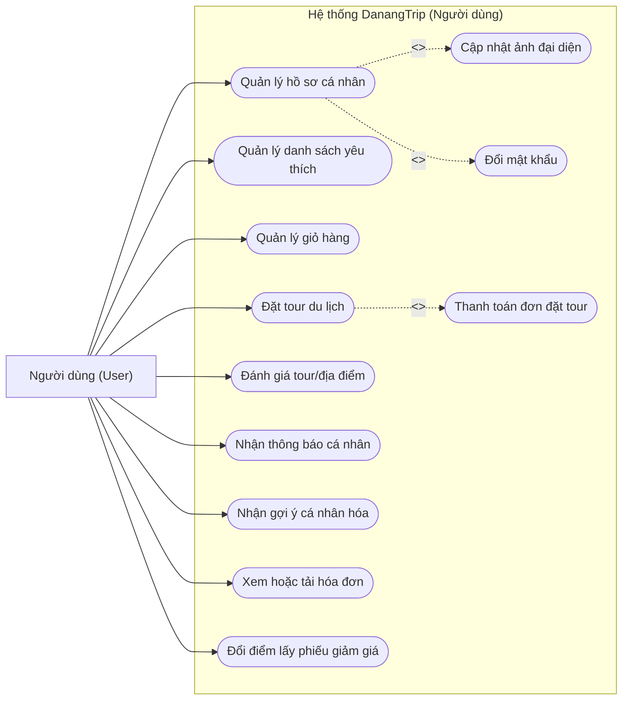
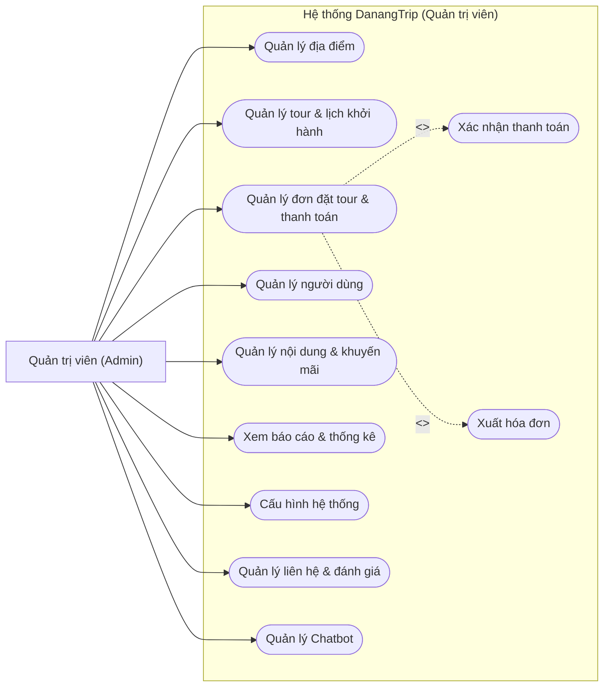
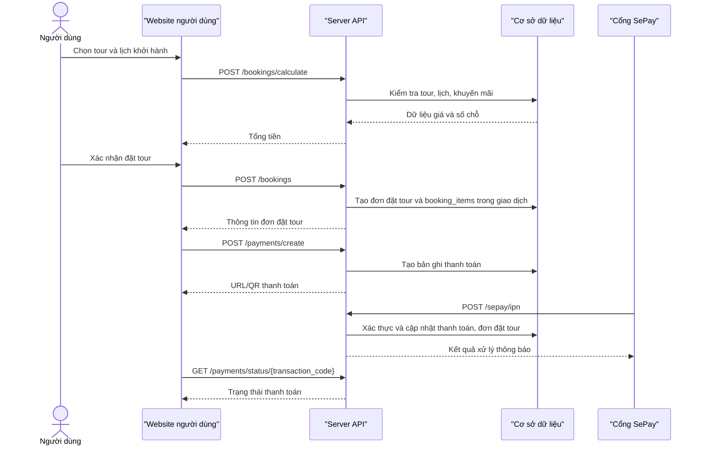
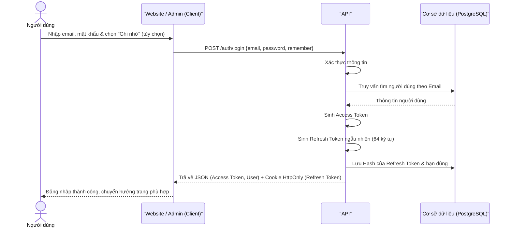
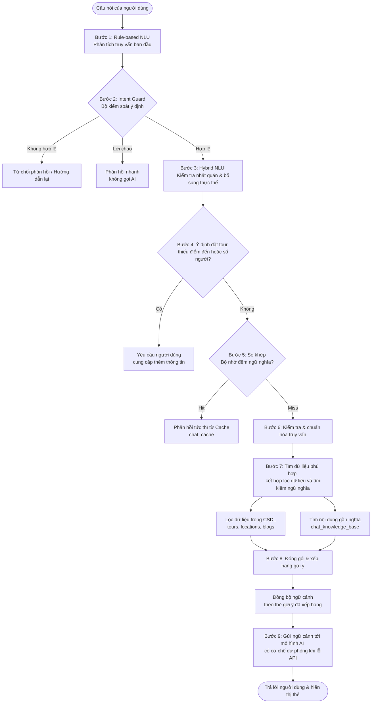
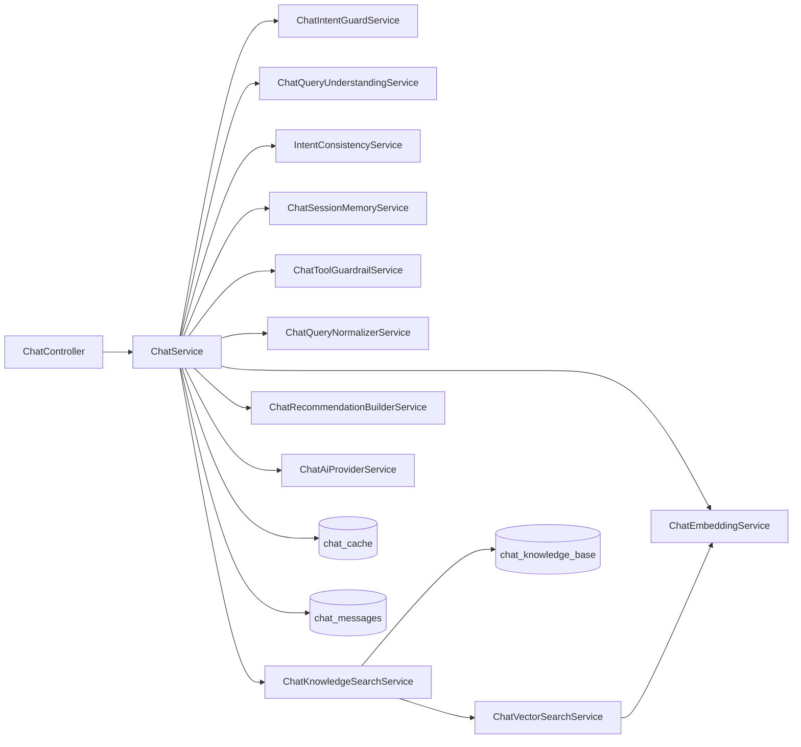

# CHƯƠNG 2. PHÂN TÍCH THIẾT KẾ HỆ THỐNG

## 2.1. Các tác nhân chính

Để phân tích chi tiết các yêu cầu và thiết kế các ca sử dụng (use case) của hệ thống DanangTrip, trước tiên cần xác định rõ ràng các tác nhân (Actors) tham gia tương tác trực tiếp hoặc gián tiếp với hệ thống. Qua phân tích nghiệp vụ, hệ thống DanangTrip phân loại đối tượng sử dụng thành ba nhóm tác nhân chính với vai trò và phạm vi quyền hạn cơ bản nhất, cụ thể như sau:

<!-- DRAWIO_SOURCE_HINH_2_1
<mxfile host="app.diagrams.net" modified="2026-06-17T00:00:00.000Z" agent="Codex" version="24.7.17" type="device">
  <diagram id="danangtrip-actors" name="Hinh 2.1 - Cac tac nhan chinh">
    <mxGraphModel dx="1200" dy="800" grid="1" gridSize="10" guides="1" tooltips="1" connect="1" arrows="1" fold="1" page="1" pageScale="1" pageWidth="1100" pageHeight="760" math="0" shadow="0">
      <root>
        <mxCell id="0"/>
        <mxCell id="1" parent="0"/>
        <mxCell id="title" value="CÁC TÁC NHÂN CHÍNH VÀ VAI TRÒ TRONG HỆ THỐNG DANANGTRIP" style="text;html=1;strokeColor=none;fillColor=none;align=center;verticalAlign=middle;whiteSpace=wrap;rounded=0;fontSize=20;fontStyle=1;fontColor=#1E3A8A;" vertex="1" parent="1">
          <mxGeometry x="120" y="30" width="860" height="40" as="geometry"/>
        </mxCell>
        <mxCell id="guest-card" value="" style="rounded=1;whiteSpace=wrap;html=1;arcSize=8;fillColor=#F8FBFF;strokeColor=#BFDBFE;strokeWidth=2;" vertex="1" parent="1">
          <mxGeometry x="80" y="100" width="280" height="560" as="geometry"/>
        </mxCell>
        <mxCell id="guest-header" value="Khách truy cập (Guest)" style="rounded=1;whiteSpace=wrap;html=1;arcSize=8;fillColor=#EFF6FF;strokeColor=#BFDBFE;strokeWidth=1;fontSize=16;fontStyle=1;fontColor=#1D4ED8;align=center;verticalAlign=middle;" vertex="1" parent="1">
          <mxGeometry x="80" y="100" width="280" height="52" as="geometry"/>
        </mxCell>
        <mxCell id="guest-actor" value="" style="shape=umlActor;verticalLabelPosition=bottom;verticalAlign=top;html=1;outlineConnect=0;strokeColor=#2563EB;strokeWidth=3;" vertex="1" parent="1">
          <mxGeometry x="180" y="180" width="80" height="100" as="geometry"/>
        </mxCell>
        <mxCell id="guest-desc" value="Đối tượng chưa đăng nhập vào hệ thống,&lt;br&gt;chỉ thực hiện các chức năng tra cứu&lt;br&gt;thông tin công khai." style="text;html=1;strokeColor=none;fillColor=none;align=center;verticalAlign=middle;whiteSpace=wrap;rounded=0;fontSize=13;fontStyle=1;fontColor=#6B7280;" vertex="1" parent="1">
          <mxGeometry x="105" y="300" width="230" height="70" as="geometry"/>
        </mxCell>
        <mxCell id="guest-list-box" value="" style="rounded=1;whiteSpace=wrap;html=1;arcSize=20;fillColor=#FFFFFF;strokeColor=#BFDBFE;strokeWidth=2;" vertex="1" parent="1">
          <mxGeometry x="105" y="405" width="230" height="210" as="geometry"/>
        </mxCell>
        <mxCell id="guest-list" value="&amp;bull; Xem trang chủ và danh mục&lt;br&gt;&amp;bull; Tìm kiếm địa điểm, tour&lt;br&gt;&amp;bull; Xem chi tiết và đánh giá&lt;br&gt;&amp;bull; Xem bản đồ và chỉ đường&lt;br&gt;&amp;bull; Đọc các bài viết blog&lt;br&gt;&amp;bull; Tương tác chatbot AI&lt;br&gt;&amp;bull; Gửi biểu mẫu liên hệ&lt;br&gt;&amp;bull; Đăng ký tài khoản / yêu cầu đăng nhập" style="text;html=1;strokeColor=none;fillColor=none;align=left;verticalAlign=middle;whiteSpace=wrap;rounded=0;fontSize=13;fontStyle=1;fontColor=#1D4ED8;spacingLeft=10;" vertex="1" parent="1">
          <mxGeometry x="115" y="425" width="210" height="170" as="geometry"/>
        </mxCell>
        <mxCell id="user-card" value="" style="rounded=1;whiteSpace=wrap;html=1;arcSize=8;fillColor=#F8FFFB;strokeColor=#A7F3D0;strokeWidth=2;" vertex="1" parent="1">
          <mxGeometry x="410" y="100" width="280" height="560" as="geometry"/>
        </mxCell>
        <mxCell id="user-header" value="Người dùng đã đăng nhập (User)" style="rounded=1;whiteSpace=wrap;html=1;arcSize=8;fillColor=#ECFDF5;strokeColor=#A7F3D0;strokeWidth=1;fontSize=16;fontStyle=1;fontColor=#047857;align=center;verticalAlign=middle;" vertex="1" parent="1">
          <mxGeometry x="410" y="100" width="280" height="52" as="geometry"/>
        </mxCell>
        <mxCell id="user-actor" value="" style="shape=umlActor;verticalLabelPosition=bottom;verticalAlign=top;html=1;outlineConnect=0;strokeColor=#059669;strokeWidth=3;" vertex="1" parent="1">
          <mxGeometry x="510" y="180" width="80" height="100" as="geometry"/>
        </mxCell>
        <mxCell id="user-desc" value="Đối tượng đã xác thực tài khoản,&lt;br&gt;kế thừa vai trò của Khách truy cập&lt;br&gt;và có quyền cá nhân." style="text;html=1;strokeColor=none;fillColor=none;align=center;verticalAlign=middle;whiteSpace=wrap;rounded=0;fontSize=13;fontStyle=1;fontColor=#6B7280;" vertex="1" parent="1">
          <mxGeometry x="435" y="300" width="230" height="70" as="geometry"/>
        </mxCell>
        <mxCell id="user-list-box" value="" style="rounded=1;whiteSpace=wrap;html=1;arcSize=20;fillColor=#FFFFFF;strokeColor=#A7F3D0;strokeWidth=2;" vertex="1" parent="1">
          <mxGeometry x="435" y="405" width="230" height="210" as="geometry"/>
        </mxCell>
        <mxCell id="user-list" value="&amp;bull; Kế thừa Khách truy cập&lt;br&gt;&amp;bull; Quản lý hồ sơ và đổi mật khẩu&lt;br&gt;&amp;bull; Quản lý danh sách yêu thích&lt;br&gt;&amp;bull; Quản lý giỏ hàng đặt tour&lt;br&gt;&amp;bull; Đặt tour và theo dõi đơn đặt&lt;br&gt;&amp;bull; Thanh toán qua SePay/VietQR&lt;br&gt;&amp;bull; Xem và tải hóa đơn đơn đặt&lt;br&gt;&amp;bull; Gửi đánh giá địa điểm/tour&lt;br&gt;&amp;bull; Nhận gợi ý và thông báo" style="text;html=1;strokeColor=none;fillColor=none;align=left;verticalAlign=middle;whiteSpace=wrap;rounded=0;fontSize=13;fontStyle=1;fontColor=#047857;spacingLeft=10;" vertex="1" parent="1">
          <mxGeometry x="445" y="425" width="210" height="170" as="geometry"/>
        </mxCell>
        <mxCell id="admin-card" value="" style="rounded=1;whiteSpace=wrap;html=1;arcSize=8;fillColor=#FFF8FB;strokeColor=#FBCFE8;strokeWidth=2;" vertex="1" parent="1">
          <mxGeometry x="740" y="100" width="280" height="560" as="geometry"/>
        </mxCell>
        <mxCell id="admin-header" value="Quản trị viên (Admin)" style="rounded=1;whiteSpace=wrap;html=1;arcSize=8;fillColor=#FDF2F8;strokeColor=#FBCFE8;strokeWidth=1;fontSize=16;fontStyle=1;fontColor=#BE185D;align=center;verticalAlign=middle;" vertex="1" parent="1">
          <mxGeometry x="740" y="100" width="280" height="52" as="geometry"/>
        </mxCell>
        <mxCell id="admin-actor" value="" style="shape=umlActor;verticalLabelPosition=bottom;verticalAlign=top;html=1;outlineConnect=0;strokeColor=#DB2777;strokeWidth=3;" vertex="1" parent="1">
          <mxGeometry x="840" y="180" width="80" height="100" as="geometry"/>
        </mxCell>
        <mxCell id="admin-desc" value="Đối tượng quản lý toàn bộ hệ thống,&lt;br&gt;vận hành nghiệp vụ du lịch&lt;br&gt;và cấu hình hệ thống." style="text;html=1;strokeColor=none;fillColor=none;align=center;verticalAlign=middle;whiteSpace=wrap;rounded=0;fontSize=13;fontStyle=1;fontColor=#6B7280;" vertex="1" parent="1">
          <mxGeometry x="765" y="300" width="230" height="70" as="geometry"/>
        </mxCell>
        <mxCell id="admin-list-box" value="" style="rounded=1;whiteSpace=wrap;html=1;arcSize=20;fillColor=#FFFFFF;strokeColor=#FBCFE8;strokeWidth=2;" vertex="1" parent="1">
          <mxGeometry x="765" y="405" width="230" height="210" as="geometry"/>
        </mxCell>
        <mxCell id="admin-list" value="&amp;bull; Đăng nhập trang quản trị&lt;br&gt;&amp;bull; Quản lý địa điểm và tiện ích&lt;br&gt;&amp;bull; Quản lý tour và lịch khởi hành&lt;br&gt;&amp;bull; Quản lý đơn đặt tour và thanh toán&lt;br&gt;&amp;bull; Quản lý tài khoản người dùng&lt;br&gt;&amp;bull; Phê duyệt đánh giá của khách&lt;br&gt;&amp;bull; Quản lý bài viết blog và liên hệ&lt;br&gt;&amp;bull; Quản lý khuyến mãi và dữ liệu chatbot&lt;br&gt;&amp;bull; Xem thống kê và báo cáo doanh thu" style="text;html=1;strokeColor=none;fillColor=none;align=left;verticalAlign=middle;whiteSpace=wrap;rounded=0;fontSize=13;fontStyle=1;fontColor=#BE185D;spacingLeft=10;" vertex="1" parent="1">
          <mxGeometry x="775" y="425" width="210" height="170" as="geometry"/>
        </mxCell>
      </root>
    </mxGraphModel>
  </diagram>
</mxfile>
-->

<!-- Chèn ảnh xuất từ draw.io của sơ đồ tác nhân chính tại đây. -->
*Hình 2.1: Các tác nhân chính và vai trò trong hệ thống DanangTrip*

### 2.1.1. Khách truy cập (Guest)
Khách truy cập đại diện cho các người dùng vãng lai, chưa thực hiện đăng ký tài khoản hoặc chưa đăng nhập vào hệ thống. Đây là nhóm đối tượng có phạm vi quyền hạn cơ bản nhất, chủ yếu tương tác với các giao diện hiển thị thông tin công cộng.
- **Vai trò và quyền hạn:** Khách truy cập có thể truy cập trang chủ để xem thông tin tổng quan, danh sách các địa điểm du lịch nổi bật, các tour du lịch hấp dẫn cũng như các bài viết chia sẻ cẩm nang du lịch. Họ được sử dụng các tính năng tìm kiếm, lọc địa điểm/tour, tra cứu bản đồ số để định vị các điểm đến tại Đà Nẵng, gửi thông tin liên hệ và tương tác với chatbot AI để được tư vấn thông tin du lịch tự động.
- **Mục tiêu tương tác:** Khách truy cập sử dụng hệ thống nhằm mục đích tham khảo thông tin, tìm kiếm các dịch vụ du lịch phù hợp trước khi quyết định đăng ký tài khoản để sử dụng các dịch vụ sâu hơn.

### 2.1.2. Người dùng đã đăng nhập (User)
Người dùng đã đăng nhập là những thành viên đã đăng ký tài khoản thành công và xác thực danh tính qua hệ thống. Nhóm tác nhân này kế thừa các chức năng công cộng phù hợp của Khách truy cập, đồng thời được cấp quyền truy cập vào các phân hệ chức năng mang tính cá nhân hóa và giao dịch nghiệp vụ.
- **Vai trò và quyền hạn:** Người dùng được phép quản lý hồ sơ cá nhân, danh sách yêu thích và giỏ hàng; tạo đơn đặt tour, áp dụng khuyến mãi hoặc phiếu giảm giá cá nhân, thanh toán qua VietQR/SePay, theo dõi trạng thái đơn và tải hóa đơn. Người dùng còn có thể viết đánh giá, tải ảnh đánh giá, ghi nhận đánh giá hữu ích, xem số dư/lịch sử điểm, đổi điểm lấy phiếu giảm giá và nhận thông báo cá nhân hóa.
- **Mục tiêu tương tác:** Người dùng sử dụng hệ thống để thực hiện đặt tour du lịch, thực hiện thanh toán trực tuyến nhanh chóng và tương tác cộng đồng thông qua việc chia sẻ trải nghiệm thực tế.

### 2.1.3. Quản trị viên (Admin)
Quản trị viên đại diện cho nhóm người dùng nội bộ, có vai trò vận hành, giám sát và quản trị các nghiệp vụ chính của hệ thống thông qua phân hệ trang quản trị (Admin Dashboard). Đây là nhóm tác nhân có đặc quyền cao nhất trong hệ thống.
- **Vai trò và quyền hạn:** Quản trị viên chịu trách nhiệm quản lý danh mục địa điểm, quản lý thông tin địa điểm (thêm, sửa, xóa, duyệt ảnh), quản lý tour du lịch và lịch khởi hành chi tiết. Quản trị viên theo dõi và xử lý các đơn đặt tour, xác nhận giao dịch thanh toán, quản lý tài khoản người dùng (bao gồm phân quyền, khóa hoặc mở khóa tài khoản), quản lý nội dung cẩm nang du lịch (bài viết blog), kiểm duyệt và xử lý các phản hồi/đánh giá từ người dùng. Đồng thời, quản trị viên sử dụng hệ thống báo cáo thống kê doanh thu, xu hướng đặt tour, tăng trưởng người dùng để đưa ra các quyết định vận hành tối ưu.
- **Mục tiêu tương tác:** Vận hành hệ thống ổn định, cập nhật thông tin dịch vụ du lịch kịp thời, xử lý các giao dịch tài chính của người dùng và giám sát hiệu quả hoạt động kinh doanh thông qua các số liệu báo cáo thực tế.

## 2.2. Yêu cầu chức năng

Yêu cầu chức năng của hệ thống DanangTrip được chia thành hai nhóm đối tượng sử dụng chính: Nhóm chức năng dành cho người dùng (bao gồm khách truy cập vãng lai và thành viên đã đăng nhập) và nhóm chức năng dành cho quản trị viên (Admin). Nhằm tăng tính tường minh và khoa học cho tài liệu phân tích, các chức năng được phân tách rõ ràng theo từng phân hệ (module) dưới dạng bảng biểu cụ thể.

### 2.2.1. Nhóm chức năng người dùng (Khách du lịch)

*Bảng 2.1: Yêu cầu chức năng nhóm người dùng*

| STT | Phân hệ (Module) | Chi tiết yêu cầu chức năng |
| :---: | :--- | :--- |
| 1 | Xác thực & Tài khoản | - Đăng ký, đăng nhập, đăng xuất, làm mới mã thông báo.<br>- Quên mật khẩu, đặt lại mật khẩu mới.<br>- Xác thực email bằng mã OTP và gửi lại mã xác thực.<br>- Quản lý hồ sơ cá nhân (ảnh đại diện, đổi mật khẩu, xóa tài khoản). |
| 2 | Khám phá & Tìm kiếm | - Xem trang chủ, danh mục, địa điểm/tour nổi bật, bài viết mới.<br>- Tìm kiếm địa điểm/tour, xem gợi ý/xu hướng tìm kiếm và gợi ý cá nhân hóa.<br>- Xem chi tiết địa điểm, hình ảnh, đánh giá, thống kê đánh giá.<br>- Xem vị trí địa điểm trên bản đồ, tìm địa điểm lân cận hoặc gần vị trí người dùng. |
| 3 | Đặt tour và thanh toán | - Xem danh sách tour, chi tiết tour, lịch khởi hành, kiểm tra số chỗ.<br>- Quản lý giỏ hàng và đặt tour.<br>- Tính giá, áp dụng mã khuyến mãi hoặc phiếu giảm giá cá nhân, tạo thanh toán.<br>- Theo dõi trạng thái thanh toán, thử lại thanh toán và xem hóa đơn. |
| 4 | Tương tác và tiện ích | - Quản lý danh sách yêu thích, nhận thông báo hệ thống và nhắc lịch khởi hành.<br>- Viết đánh giá, tải ảnh, quản lý lịch sử đánh giá và ghi nhận đánh giá hữu ích.<br>- Xem số dư/lịch sử điểm, phần thưởng, phiếu giảm giá và đổi điểm.<br>- Gửi liên hệ và tương tác với chatbot tư vấn du lịch. |

### 2.2.2. Nhóm chức năng quản trị (Admin)

*Bảng 2.2: Yêu cầu chức năng nhóm quản trị (Admin)*

| STT | Phân hệ (Module) | Chi tiết yêu cầu chức năng |
| :---: | :--- | :--- |
| 1 | Tổng quan & Bảo mật | - Đăng nhập trang quản trị và kiểm tra phân quyền.<br>- Xem bảng điều khiển (Dashboard) tổng quan về doanh thu, tour/địa điểm nổi bật, tăng trưởng người dùng, xu hướng đặt tour và tìm kiếm. |
| 2 | Quản lý nghiệp vụ du lịch | - Quản lý danh mục địa điểm, danh mục con, địa điểm, thẻ phân loại, tiện ích.<br>- Quản lý tour, danh mục tour và lịch khởi hành. |
| 3 | Quản lý giao dịch | - Quản lý đơn đặt tour, cập nhật trạng thái, xác nhận thủ công khoản chuyển tiền và xuất hóa đơn.<br>- Quản lý luồng thanh toán, xem chi tiết, xuất báo cáo và xử lý hoàn tiền. |
| 4 | Quản lý người dùng & Khách hàng | - Quản lý tài khoản người dùng, phân quyền, khóa/mở khóa tài khoản, xuất danh sách.<br>- Quản lý và phản hồi liên hệ, gửi email chăm sóc khách hàng.<br>- Quản lý đánh giá (duyệt, từ chối, xóa, xử lý báo cáo vi phạm). |
| 5 | Quản lý nội dung & Tiếp thị | - Quản lý bài viết blog, danh mục blog và các trang đích (Landing pages).<br>- Tạo và quản lý các chương trình khuyến mãi.<br>- Gửi thông báo đơn lẻ hoặc hàng loạt theo nhóm người nhận.<br>- Cấu hình các thông số hệ thống và xuất báo cáo thống kê. |

## 2.3. Yêu cầu phi chức năng

*Bảng 2.3: Các yêu cầu phi chức năng và phương án triển khai*

| Nhóm yêu cầu | Mô tả |
| --- | --- |
| Bảo mật | Sử dụng JWT, phân quyền quản trị viên, giới hạn tần suất API, kiểm tra dữ liệu đầu vào, kiểm soát tải ảnh |
| Hiệu năng | Dùng bộ nhớ đệm của React Query, bảng `chat_cache`, phân trang dữ liệu và chỉ mục cơ sở dữ liệu; Redis có thể được cấu hình cho hàng đợi/bộ nhớ đệm khi triển khai |
| Khả dụng | Giao diện đáp ứng, có trạng thái đang tải/trạng thái lỗi, hỗ trợ đa ngôn ngữ |
| Mở rộng | Tách website người dùng, trang quản trị và API; tầng dịch vụ tách nghiệp vụ chính; có thể mở rộng AI/hệ thống gợi ý |
| Dễ bảo trì | TypeScript ở tầng giao diện, tầng dịch vụ Laravel, migration, kiểm thử và cấu trúc phân hệ rõ ràng |
| Toàn vẹn dữ liệu | Dùng giao dịch cho đặt tour, thanh toán, cập nhật trạng thái và các thao tác quan trọng |

## 2.4. Biểu đồ use case phân rã

Để làm rõ hơn các chức năng cụ thể của từng nhóm đối tượng sử dụng hệ thống DanangTrip, phần này cung cấp các biểu đồ use case phân rã chi tiết cho từng tác nhân (Khách truy cập, Người dùng đã đăng nhập, Quản trị viên). Mỗi biểu đồ tập trung làm rõ các hành vi tương tác và các mối liên kết (như `<<include>>`) giữa các ca sử dụng.

### 2.4.1. Khách truy cập

Khách truy cập là đối tượng người dùng chưa có tài khoản hoặc chưa đăng nhập vào hệ thống. Họ có thể tương tác với các tính năng công cộng và tra cứu thông tin cơ bản:


*Hình 2.2: Biểu đồ use case phân rã cho tác nhân Khách truy cập*

Chi tiết các chức năng của khách truy cập bao gồm:
- **Xem trang chủ:** Xem các thông tin tổng quan, hình ảnh, địa điểm nổi bật.
- **Xem danh sách và chi tiết địa điểm:** Tìm hiểu về thông tin, hình ảnh, đánh giá của các địa điểm.
- **Xem danh sách và chi tiết tour:** Xem lịch trình tour, giá cả, và các dịch vụ đi kèm.
- **Tìm kiếm địa điểm/tour/bài viết:** Tra cứu nhanh chóng các dịch vụ theo từ khóa.
- **Xem bản đồ số:** Tìm vị trí địa lý của các địa điểm du lịch tại Đà Nẵng.
- **Đọc blog du lịch:** Tham khảo kinh nghiệm, cẩm nang du lịch từ các bài viết chia sẻ.
- **Xem khuyến mãi công khai:** Theo dõi các chương trình ưu đãi chung của hệ thống.
- **Gửi biểu mẫu liên hệ:** Để lại phản hồi hoặc yêu cầu hỗ trợ cho quản trị viên.
- **Hỏi chatbot:** Sử dụng chatbot AI để tư vấn hành trình và giải đáp thắc mắc.
- **Đăng ký hoặc đăng nhập:** Khởi tạo tài khoản mới hoặc đăng nhập để chuyển đổi thành tác nhân Người dùng đã đăng nhập.

### 2.4.2. Người dùng đã đăng nhập

Người dùng đã đăng nhập kế thừa các quyền truy cập công cộng phù hợp của Khách truy cập, đồng thời được thực hiện các tính năng giao dịch và cá nhân hóa:



*Hình 2.3: Biểu đồ use case phân rã cho tác nhân Người dùng đã đăng nhập*

Chi tiết các chức năng của người dùng đã đăng nhập bao gồm:
- **Quản lý hồ sơ cá nhân:** Cập nhật thông tin cá nhân cơ bản.
- **Đổi mật khẩu và cập nhật ảnh đại diện:** Đảm bảo bảo mật tài khoản và cập nhật thông tin nhận diện.
- **Lưu hoặc bỏ lưu địa điểm/tour yêu thích:** Lưu trữ các điểm đến hoặc lịch trình quan tâm để xem lại sau.
- **Quản lý giỏ hàng:** Quản lý các tour du lịch đã chọn để chuẩn bị đặt chỗ.
- **Đặt tour và theo dõi đơn đặt tour:** Thực hiện đặt chỗ cho chuyến đi và theo dõi tiến độ đơn hàng.
- **Thanh toán:** Thực hiện thanh toán trực tuyến qua cổng tích hợp.
- **Xem hoặc tải hóa đơn:** Tải hóa đơn PDF của các tour đã thanh toán thành công.
- **Đánh giá tour/địa điểm:** Viết bình luận, đăng tải hình ảnh và chấm điểm sao cho các trải nghiệm thực tế.
- **Xem thông báo:** Nhận các thông tin cập nhật về đơn hàng hoặc chương trình ưu đãi cá nhân.
- **Nhận gợi ý cá nhân hóa:** Hệ thống đề xuất địa điểm/tour dựa trên hành vi tìm kiếm và tương tác trước đó.

### 2.4.3. Quản trị viên

Quản trị viên là tác nhân quản trị nội bộ có đặc quyền cao nhất để vận hành, điều phối hệ thống:



*Hình 2.4: Biểu đồ use case phân rã cho tác nhân Quản trị viên*

Chi tiết các chức năng của quản trị viên bao gồm:
- **Quản lý dữ liệu địa điểm, danh mục, thẻ phân loại và tiện ích:** Thêm mới, chỉnh sửa, xóa và kiểm duyệt hình ảnh của các địa điểm du lịch.
- **Quản lý tour, danh mục tour và lịch khởi hành:** Cập nhật thông tin chi tiết các tour du lịch, quản lý ngày khởi hành và số chỗ của mỗi đợt.
- **Quản lý đơn đặt tour, thanh toán và hóa đơn:** Tiếp nhận đơn hàng, xác nhận giao dịch thanh toán thủ công hoặc kiểm tra đối soát, hoàn tiền.
- **Quản lý người dùng, vai trò và trạng thái tài khoản:** Theo dõi danh sách tài khoản, khóa hoặc mở khóa tài khoản vi phạm.
- **Quản lý nội dung, cẩm nang blog, thông báo và khuyến mãi:** Đăng tải cẩm nang, phê duyệt bài viết, cấu hình các mã giảm giá và gửi thông báo hệ thống.
- **Quản lý liên hệ và đánh giá:** Phản hồi các yêu cầu liên hệ, kiểm duyệt các đánh giá xấu hoặc vi phạm tiêu chuẩn cộng đồng.
- **Quản lý Chatbot:** Xem thống kê chatbot, theo dõi lịch sử hội thoại (logs), cấu hình và dọn dẹp bộ nhớ đệm (cache) phản hồi của trợ lý ảo.
- **Xem bảng điều khiển, báo cáo doanh thu:** Phân tích biểu đồ trực quan về doanh thu, số lượt booking, tăng trưởng người dùng.
- **Cấu hình hệ thống:** Tùy chỉnh các thông số cài đặt chung cho website.

## 2.5. Đặc tả use case tiêu biểu

Các mã ca sử dụng trong phần này được giữ thống nhất theo mã đã thể hiện trong các biểu đồ use case phân rã ở mục 2.4. Vì mục 2.5 chỉ lựa chọn một số use case tiêu biểu để đặc tả chi tiết, thứ tự mã có thể không liên tục tuyệt đối, nhưng vẫn bảo đảm mỗi mã ca sử dụng là duy nhất trong toàn bộ hệ thống.

### 2.5.1. Use case tìm kiếm địa điểm/tour

*Bảng 2.4: Đặc tả ca sử dụng Tìm kiếm*

| Thành phần | Nội dung |
| --- | --- |
| **Mã ca sử dụng** | UC01 |
| **Tên use case** | Tìm kiếm |
| **Mô tả** | Người dùng tìm kiếm địa điểm, tour du lịch, bài viết bằng cách nhập từ khóa và thiết lập các bộ lọc. |
| **Tác nhân** | Khách truy cập, Người dùng |
| **Sự kiện kích hoạt** | Người dùng nhập từ khóa tìm kiếm hoặc nhấp vào các nút lọc giá trị. |
| **Tiền điều kiện** | Hệ thống có dữ liệu địa điểm du lịch, tour du lịch hoặc bài viết blog. |
| **Luồng sự kiện chính (Thành công)** | <table><tr><th>STT</th><th>Thực hiện bởi</th><th>Hành động</th></tr><tr><td>1.</td><td>Người dùng</td><td>Nhập từ khóa tìm kiếm vào thanh tìm kiếm</td></tr><tr><td>2.</td><td>Người dùng</td><td>Chọn các bộ lọc mong muốn (khoảng giá, danh mục, đánh giá sao)</td></tr><tr><td>3.</td><td>Hệ thống</td><td>Tiếp nhận thông tin và gửi yêu cầu truy vấn đến API</td></tr><tr><td>4.</td><td>Hệ thống</td><td>Thực hiện truy vấn và sắp xếp kết quả dựa trên từ khóa</td></tr><tr><td>5.</td><td>Hệ thống</td><td>Hiển thị danh sách kết quả phù hợp trên giao diện</td></tr></table> |
| **Luồng sự kiện thay thế** | <table><tr><th>STT</th><th>Thực hiện bởi</th><th>Hành động</th></tr><tr><td>4a.</td><td>Hệ thống</td><td>Không tìm thấy kết quả phù hợp, hiển thị màn hình thông báo không tìm thấy kết quả và đề xuất địa điểm phổ biến</td></tr></table> |
| **Hậu điều kiện** | Kết quả hiển thị đúng theo từ khóa và các điều kiện lọc được áp dụng. |
| **Trường hợp lỗi** | 1. Từ khóa chứa các ký tự đặc biệt nguy hiểm hoặc lỗi truy vấn SQL.<br>2. Lỗi kết nối mạng đến API. |

### 2.5.2. Use case chatbot tư vấn du lịch

*Bảng 2.5: Đặc tả ca sử dụng Chatbot tư vấn du lịch*

| Thành phần | Nội dung |
| --- | --- |
| **Mã ca sử dụng** | UC02 |
| **Tên use case** | Chatbot tư vấn du lịch |
| **Mô tả** | Trò chuyện trực tuyến để tư vấn tour du lịch, tìm địa điểm hoặc tra cứu thông tin chính sách nhờ AI RAG. |
| **Tác nhân** | Khách truy cập, Người dùng |
| **Sự kiện kích hoạt** | Người dùng gửi câu hỏi trong khung chat của hệ thống. |
| **Tiền điều kiện** | API chatbot và cơ sở tri thức (knowledge base) hoạt động ổn định. |
| **Luồng sự kiện chính (Thành công)** | <table><tr><th>STT</th><th>Thực hiện bởi</th><th>Hành động</th></tr><tr><td>1.</td><td>Người dùng</td><td>Nhập câu hỏi du lịch vào khung chat</td></tr><tr><td>2.</td><td>Hệ thống</td><td>Kiểm tra ý định câu hỏi</td></tr><tr><td>3.</td><td>Hệ thống</td><td>Trích xuất tham số, truy xuất dữ liệu nghiệp vụ và tìm kiếm ngữ nghĩa nếu được bật</td></tr><tr><td>4.</td><td>Hệ thống</td><td>Xây dựng lời nhắc và gọi API mô hình AI</td></tr><tr><td>5.</td><td>Hệ thống</td><td>Nhận phản hồi, ghi lịch sử hội thoại và bộ nhớ đệm</td></tr><tr><td>6.</td><td>Hệ thống</td><td>Hiển thị câu trả lời cho người dùng</td></tr></table> |
| **Luồng sự kiện thay thế** | <table><tr><th>STT</th><th>Thực hiện bởi</th><th>Hành động</th></tr><tr><td>2a.</td><td>Hệ thống</td><td>Câu hỏi ngoài phạm vi hỗ trợ, trả về câu trả lời từ chối theo kịch bản có sẵn</td></tr><tr><td>4a.</td><td>Hệ thống</td><td>AI chính bị lỗi hoặc vượt hạn mức, tự động chuyển sang mô hình AI dự phòng (AI Failover)</td></tr></table> |
| **Hậu điều kiện** | Người dùng nhận được phản hồi tư vấn và lịch sử trò chuyện được lưu trữ thành công. |
| **Trường hợp lỗi** | 1. Không có kết nối mạng từ hệ thống đến nhà cung cấp AI.<br>2. Cơ sở tri thức không có dữ liệu trả lời phù hợp (Chatbot trả lời theo kịch bản dự phòng). |

### 2.5.3. Use case đăng ký tài khoản

*Bảng 2.6: Đặc tả ca sử dụng Đăng ký tài khoản*

| Thành phần | Nội dung |
| --- | --- |
| **Mã ca sử dụng** | UC03 |
| **Tên use case** | Đăng ký tài khoản |
| **Mô tả** | Người dùng vãng lai tạo tài khoản mới bằng cách điền thông tin cá nhân. Tài khoản được tạo ở trạng thái Chờ kích hoạt (pending). Người dùng thực hiện xác thực email qua mã OTP sau khi đăng nhập để sử dụng tài khoản. |
| **Tác nhân** | Khách truy cập |
| **Sự kiện kích hoạt** | Người dùng nhấp vào liên kết "Đăng ký" trên giao diện chính. |
| **Tiền điều kiện** | Người dùng chưa có tài khoản đăng ký trong hệ thống. |
| **Luồng sự kiện chính (Thành công)** | <table><tr><th>STT</th><th>Thực hiện bởi</th><th>Hành động</th></tr><tr><td>1.</td><td>Khách truy cập</td><td>Điền biểu mẫu đăng ký (Họ tên, Email, Tên đăng nhập, Mật khẩu, Xác nhận mật khẩu)</td></tr><tr><td>2.</td><td>Khách truy cập</td><td>Nhấn nút "Đăng ký"</td></tr><tr><td>3.</td><td>Hệ thống</td><td>Kiểm tra tính hợp lệ và duy nhất của email và tên đăng nhập</td></tr><tr><td>4.</td><td>Hệ thống</td><td>Tạo bản ghi người dùng mới với trạng thái "Chờ kích hoạt"</td></tr><tr><td>5.</td><td>Hệ thống</td><td>Gửi email chứa mã kích hoạt hoặc OTP đến hòm thư người dùng</td></tr><tr><td>6.</td><td>Khách truy cập</td><td>Nhập mã OTP để kích hoạt tài khoản</td></tr><tr><td>7.</td><td>Hệ thống</td><td>Kích hoạt tài khoản thành công và thông báo cho người dùng</td></tr></table> |
| **Luồng sự kiện thay thế** | <table><tr><th>STT</th><th>Thực hiện bởi</th><th>Hành động</th></tr><tr><td>5a.</td><td>Hệ thống</td><td>Cấu hình hệ thống không yêu cầu kích hoạt, kích hoạt tài khoản trực tiếp và đăng nhập ngay</td></tr></table> |
| **Hậu điều kiện** | Tài khoản thành viên mới được lưu vào cơ sở dữ liệu dưới trạng thái Hoạt động. |
| **Trường hợp lỗi** | 1. Email hoặc Tên đăng nhập đã được đăng ký bởi người dùng khác.<br>2. Mật khẩu nhập lại không khớp.<br>3. Người dùng nhập sai mã OTP kích hoạt. |

### 2.5.4. Use case đăng nhập

*Bảng 2.7: Đặc tả ca sử dụng Đăng nhập*

| Thành phần | Nội dung |
| --- | --- |
| **Mã ca sử dụng** | UC04 |
| **Tên use case** | Đăng nhập |
| **Mô tả** | Xác thực thông tin tài khoản của người dùng hoặc quản trị viên để cấp quyền truy cập hệ thống. |
| **Tác nhân** | Người dùng, Quản trị viên |
| **Sự kiện kích hoạt** | Người dùng nhấn nút "Đăng nhập" hoặc truy cập trực tiếp trang đăng nhập. |
| **Tiền điều kiện** | Người dùng đã có tài khoản trên hệ thống. |
| **Luồng sự kiện chính (Thành công)** | <table><tr><th>STT</th><th>Thực hiện bởi</th><th>Hành động</th></tr><tr><td>1.</td><td>Người dùng</td><td>Chọn chức năng Đăng nhập</td></tr><tr><td>2.</td><td>Hệ thống</td><td>Hiển thị giao diện đăng nhập</td></tr><tr><td>3.</td><td>Người dùng</td><td>Điền thông tin đăng nhập (Email, Mật khẩu, và tùy chọn Ghi nhớ đăng nhập)</td></tr><tr><td>4.</td><td>Người dùng</td><td>Yêu cầu đăng nhập</td></tr><tr><td>5.</td><td>Hệ thống</td><td>Kiểm tra các trường bắt buộc</td></tr><tr><td>6.</td><td>Hệ thống</td><td>Xác thực thông tin tài khoản, sinh Access Token (JWT) và Refresh Token ngẫu nhiên (64 ký tự)</td></tr><tr><td>7.</td><td>Hệ thống</td><td>Lưu Hash SHA-256 của Refresh Token vào cơ sở dữ liệu và đính kèm token này vào phản hồi dưới dạng Cookie HttpOnly để tăng an toàn</td></tr><tr><td>8.</td><td>Hệ thống</td><td>Trả về dữ liệu JSON chứa Access Token và thông tin người dùng, hiển thị giao diện tương ứng theo vai trò</td></tr></table> |
| **Luồng sự kiện thay thế** | <table><tr><th>STT</th><th>Thực hiện bởi</th><th>Hành động</th></tr><tr><td>5a.</td><td>Hệ thống</td><td>Thông báo lỗi: Cần nhập các trường bắt buộc nhập nếu Người dùng nhập thiếu</td></tr><tr><td>6a.</td><td>Hệ thống</td><td>Thông báo: Tài khoản hoặc mật khẩu chưa đúng nếu thông tin xác thực không chính xác</td></tr></table> |
| **Hậu điều kiện** | Người dùng đăng nhập thành công và truy cập được chức năng tương ứng với quyền. |
| **Trường hợp lỗi** | 1. Người dùng nhập sai Email hoặc Mật khẩu.<br>2. Tài khoản đã bị khóa hoặc chưa được kích hoạt.<br>3. Không thể kết nối với Server API. |

### 2.5.5. Use case đặt tour

*Bảng 2.8: Đặc tả ca sử dụng Đặt tour*

| Thành phần | Nội dung |
| --- | --- |
| **Mã ca sử dụng** | UC05 |
| **Tên use case** | Đặt tour |
| **Mô tả** | Người dùng chọn lịch khởi hành, số lượng hành khách, áp dụng mã giảm giá và khởi tạo đơn đặt tour trực tuyến. |
| **Tác nhân** | Người dùng đã đăng nhập |
| **Sự kiện kích hoạt** | Người dùng nhấn nút "Đặt tour" tại trang chi tiết tour hoặc giỏ hàng. |
| **Tiền điều kiện** | Người dùng đang xem chi tiết một tour du lịch và lịch khởi hành còn chỗ trống. |
| **Luồng sự kiện chính (Thành công)** | <table><tr><th>STT</th><th>Thực hiện bởi</th><th>Hành động</th></tr><tr><td>1.</td><td>Người dùng</td><td>Chọn lịch khởi hành mong muốn</td></tr><tr><td>2.</td><td>Người dùng</td><td>Nhập số lượng khách hàng đi tour</td></tr><tr><td>3.</td><td>Hệ thống</td><td>Tính toán tổng tiền và áp dụng các khuyến mãi hợp lệ</td></tr><tr><td>4.</td><td>Người dùng</td><td>Nhấn nút "Xác nhận đặt tour" và cập nhật thông tin liên hệ</td></tr><tr><td>5.</td><td>Người dùng</td><td>Nhấn nút "Đặt tour"</td></tr><tr><td>6.</td><td>Hệ thống</td><td>Tạo đơn đặt tour mới trong cơ sở dữ liệu với trạng thái "Chờ thanh toán"</td></tr><tr><td>7.</td><td>Hệ thống</td><td>Chuyển hướng người dùng đến giao diện thanh toán</td></tr></table> |
| **Luồng sự kiện thay thế** | <table><tr><th>STT</th><th>Thực hiện bởi</th><th>Hành động</th></tr><tr><td>3a.</td><td>Người dùng</td><td>Nhập mã giảm giá và hệ thống cập nhật lại tổng tiền giảm giá phù hợp</td></tr></table> |
| **Hậu điều kiện** | Đơn đặt tour (booking) được tạo thành công trong hệ thống và ở trạng thái Chờ thanh toán. |
| **Trường hợp lỗi** | 1. Số lượng chỗ trống còn lại không đủ đáp ứng số lượng khách đặt.<br>2. Nhập số lượng khách không hợp lệ (nhỏ hơn hoặc bằng 0).<br>3. Lỗi tạo bản ghi trong cơ sở dữ liệu. |

### 2.5.6. Use case thanh toán

*Bảng 2.9: Đặc tả ca sử dụng Thanh toán đơn đặt tour*

| Thành phần | Nội dung |
| --- | --- |
| **Mã ca sử dụng** | UC06 |
| **Tên use case** | Thanh toán đơn đặt tour |
| **Mô tả** | Khách hàng thực hiện thanh toán trực tuyến qua mã VietQR và hệ thống tự động cập nhật trạng thái đơn hàng nhờ cổng SePay IPN. |
| **Tác nhân** | Người dùng, Cổng thanh toán (SePay/VietQR) |
| **Sự kiện kích hoạt** | Người dùng chọn phương thức thanh toán VietQR cho đơn đặt tour đang chờ xử lý. |
| **Tiền điều kiện** | Đơn đặt tour tồn tại trong hệ thống và chưa được thanh toán (trạng thái Chờ thanh toán). |
| **Luồng sự kiện chính (Thành công)** | <table><tr><th>STT</th><th>Thực hiện bởi</th><th>Hành động</th></tr><tr><td>1.</td><td>Người dùng</td><td>Chọn phương thức thanh toán chuyển khoản VietQR</td></tr><tr><td>2.</td><td>Hệ thống</td><td>Hiển thị mã VietQR động cùng thông tin số tiền và nội dung chuyển khoản tự động</td></tr><tr><td>3.</td><td>Người dùng</td><td>Sử dụng ứng dụng ngân hàng quét mã QR và thực hiện thanh toán</td></tr><tr><td>4.</td><td>Cổng thanh toán</td><td>Nhận giao dịch thanh toán thành công và gửi Webhook (IPN) đến hệ thống API</td></tr><tr><td>5.</td><td>Hệ thống</td><td>Xác thực thông tin Webhook và cập nhật trạng thái đơn đặt tour thành "Đã thanh toán"</td></tr><tr><td>6.</td><td>Hệ thống</td><td>Hiển thị giao diện thanh toán thành công và cho phép người dùng xem hoặc tải hóa đơn</td></tr></table> |
| **Luồng sự kiện thay thế** | <table><tr><th>STT</th><th>Thực hiện bởi</th><th>Hành động</th></tr><tr><td>4a.</td><td>Hệ thống</td><td>Người dùng chưa thanh toán trong thời gian hiển thị mã QR; giao dịch giữ trạng thái chờ và người dùng có thể thử lại thanh toán hoặc hủy đơn theo quy trình.</td></tr></table> |
| **Hậu điều kiện** | Đơn đặt tour được cập nhật thành Đã thanh toán, tạo mã giao dịch và cho phép người dùng xem hoặc tải hóa đơn. |
| **Trường hợp lỗi** | 1. Người dùng chuyển sai nội dung chuyển khoản hoặc sai số tiền yêu cầu.<br>2. Lỗi kết nối Webhook giữa SePay và Server API. |

### 2.5.7. Use case đánh giá

*Bảng 2.10: Đặc tả ca sử dụng Đánh giá tour/địa điểm*

| Thành phần | Nội dung |
| --- | --- |
| **Mã ca sử dụng** | UC07 |
| **Tên use case** | Đánh giá tour/địa điểm |
| **Mô tả** | Thành viên viết phản hồi, đăng tải ảnh, và chấm điểm sao cho các địa điểm hoặc tour du lịch đã trải nghiệm. |
| **Tác nhân** | Người dùng đã đăng nhập |
| **Sự kiện kích hoạt** | Người dùng nhấn nút "Gửi đánh giá" trong phần đánh giá của trang chi tiết. |
| **Tiền điều kiện** | Người dùng đã đăng nhập; nếu đánh giá tour thì yêu cầu người dùng từng đặt và đi tour đó thành công. |
| **Luồng sự kiện chính (Thành công)** | <table><tr><th>STT</th><th>Thực hiện bởi</th><th>Hành động</th></tr><tr><td>1.</td><td>Người dùng</td><td>Chọn viết đánh giá tại trang chi tiết tour hoặc địa điểm</td></tr><tr><td>2.</td><td>Người dùng</td><td>Chọn số sao đánh giá (1-5 sao), nhập nội dung bình luận và đính kèm ảnh</td></tr><tr><td>3.</td><td>Người dùng</td><td>Nhấn nút "Gửi đánh giá"</td></tr><tr><td>4.</td><td>Hệ thống</td><td>Kiểm tra dữ liệu đầu vào hợp lệ</td></tr><tr><td>5.</td><td>Hệ thống</td><td>Lưu đánh giá vào cơ sở dữ liệu và tự động tính toán lại điểm đánh giá trung bình</td></tr><tr><td>6.</td><td>Hệ thống</td><td>Hiển thị thông báo gửi thành công trên giao diện</td></tr></table> |
| **Luồng sự kiện thay thế** | <table><tr><th>STT</th><th>Thực hiện bởi</th><th>Hành động</th></tr><tr><td>5a.</td><td>Hệ thống</td><td>Chế độ kiểm duyệt được kích hoạt, chuyển đánh giá sang trạng thái "Chờ duyệt" trước khi hiển thị công khai</td></tr></table> |
| **Hậu điều kiện** | Bản ghi đánh giá được ghi nhận và điểm đánh giá trung bình của đối tượng được cập nhật tương ứng. |
| **Trường hợp lỗi** | 1. Nội dung bình luận trống hoặc không đạt yêu cầu kiểm duyệt.<br>2. Ảnh đính kèm không đúng định dạng hoặc vượt quá dung lượng tối đa.<br>3. Người dùng cố gắng đánh giá nhiều lần cho một đối tượng (tránh spam). |

### 2.5.8. Use case quản lý tour & lịch khởi hành

*Bảng 2.11: Đặc tả ca sử dụng Quản lý tour & lịch khởi hành*

| Thành phần | Nội dung |
| --- | --- |
| **Mã ca sử dụng** | UC08 |
| **Tên use case** | Quản lý tour & lịch khởi hành |
| **Mô tả** | Quản trị viên quản lý danh sách tour du lịch (thêm, sửa, xóa) và cấu hình lịch khởi hành chi tiết cho từng tour. |
| **Tác nhân** | Quản trị viên |
| **Sự kiện kích hoạt** | Quản trị viên truy cập phân hệ quản lý tour trên giao diện Admin Dashboard. |
| **Tiền điều kiện** | Quản trị viên đăng nhập thành công vào trang quản trị. |
| **Luồng sự kiện chính (Thành công)** | <table><tr><th>STT</th><th>Thực hiện bởi</th><th>Hành động</th></tr><tr><td>1.</td><td>Quản trị viên</td><td>Chọn chức năng Quản lý Tour trên thanh điều hướng Sidebar</td></tr><tr><td>2.</td><td>Hệ thống</td><td>Hiển thị danh sách các tour du lịch hiện có, thông tin chi tiết và bộ lọc tìm kiếm</td></tr><tr><td>3.</td><td>Quản trị viên</td><td>Chọn thêm tour mới hoặc chỉnh sửa/cập nhật thông tin của một tour có sẵn</td></tr><tr><td>4.</td><td>Hệ thống</td><td>Hiển thị biểu mẫu thông tin chi tiết của tour (tên tour, giá cả, thời lượng, lịch trình, số chỗ tối đa)</td></tr><tr><td>5.</td><td>Quản trị viên</td><td>Điền hoặc cập nhật các trường thông tin, cấu hình lịch khởi hành cụ thể, và nhấn nút "Lưu"</td></tr><tr><td>6.</td><td>Hệ thống</td><td>Kiểm tra tính hợp lệ của dữ liệu, lưu vào cơ sở dữ liệu và hiển thị thông báo thành công</td></tr></table> |
| **Luồng sự kiện thay thế** | <table><tr><th>STT</th><th>Thực hiện bởi</th><th>Hành động</th></tr><tr><td>3a.</td><td>Quản trị viên</td><td>Truy cập mục "Lịch khởi hành" của một tour cụ thể để thêm, sửa đổi hoặc xóa các ngày khởi hành và số chỗ override</td></tr><tr><td>5a.</td><td>Quản trị viên</td><td>Nhấn nút "Hủy" để hủy bỏ các thay đổi, hệ thống không lưu và quay lại màn hình danh sách</td></tr></table> |
| **Hậu điều kiện** | Thông tin tour và lịch khởi hành được cập nhật mới nhất trong cơ sở dữ liệu và hiển thị lên giao diện người dùng. |
| **Trường hợp lỗi** | 1. Nhập thiếu thông tin bắt buộc hoặc nhập sai định dạng dữ liệu.<br>2. Ngày khởi hành bị trùng lặp hoặc thời gian không hợp lệ (ngày trong quá khứ).<br>3. Lỗi kết nối cơ sở dữ liệu. |

### 2.5.9. Use case quản lý đơn đặt tour

*Bảng 2.12: Đặc tả ca sử dụng Quản lý đơn đặt tour*

| Thành phần | Nội dung |
| --- | --- |
| **Mã ca sử dụng** | UC09 |
| **Tên use case** | Quản lý đơn đặt tour |
| **Mô tả** | Quản trị viên duyệt, cập nhật trạng thái đơn đặt tour và xác nhận thanh toán thủ công. |
| **Tác nhân** | Quản trị viên |
| **Sự kiện kích hoạt** | Quản trị viên truy cập mục quản lý đơn đặt tour trên thanh điều hướng admin. |
| **Tiền điều kiện** | Quản trị viên đã đăng nhập thành công vào trang quản trị (Admin Dashboard). |
| **Luồng sự kiện chính (Thành công)** | <table><tr><th>STT</th><th>Thực hiện bởi</th><th>Hành động</th></tr><tr><td>1.</td><td>Quản trị viên</td><td>Truy cập danh sách đơn đặt tour (booking)</td></tr><tr><td>2.</td><td>Quản trị viên</td><td>Lọc danh sách theo trạng thái đơn hàng (Chờ thanh toán, Đã thanh toán, Chờ duyệt)</td></tr><tr><td>3.</td><td>Quản trị viên</td><td>Chọn xem chi tiết một đơn đặt tour cụ thể</td></tr><tr><td>4.</td><td>Quản trị viên</td><td>Thay đổi trạng thái đơn hàng hoặc xác nhận thanh toán</td></tr><tr><td>5.</td><td>Hệ thống</td><td>Lưu trạng thái mới và gửi email cập nhật thông tin cho khách hàng</td></tr></table> |
| **Luồng sự kiện thay thế** | <table><tr><th>STT</th><th>Thực hiện bởi</th><th>Hành động</th></tr><tr><td>4a.</td><td>Quản trị viên</td><td>Hủy đơn đặt tour, hệ thống cập nhật trạng thái đơn hàng thành "Đã hủy" và giải phóng số chỗ khởi hành</td></tr></table> |
| **Hậu điều kiện** | Trạng thái đơn đặt tour được cập nhật chính xác và khách hàng nhận được email thông báo trạng thái. |
| **Trường hợp lỗi** | 1. Đơn đặt tour không tồn tại trong cơ sở dữ liệu.<br>2. Quản trị viên cố gắng cập nhật trạng thái không hợp lệ (ví dụ: chuyển từ Đã hoàn thành sang Chờ thanh toán). |

### 2.5.10. Use case đổi điểm lấy phiếu giảm giá

*Bảng 2.13: Đặc tả ca sử dụng đổi điểm lấy phiếu giảm giá*

| Thành phần | Nội dung |
| --- | --- |
| **Mã ca sử dụng** | UC34 |
| **Tên use case** | Đổi điểm lấy phiếu giảm giá cá nhân |
| **Mô tả** | Người dùng sử dụng điểm tích lũy trong tài khoản để đổi lấy phiếu giảm giá cá nhân, sau đó có thể dùng phiếu này khi đặt tour. |
| **Tác nhân** | Người dùng đã đăng nhập |
| **Sự kiện kích hoạt** | Người dùng truy cập trang điểm thành viên, chọn một phần thưởng/phiếu giảm giá và nhấn nút "Đổi quà". |
| **Tiền điều kiện** | Phần thưởng đang hoạt động; người dùng có đủ điểm và chưa vượt giới hạn đổi. |
| **Luồng sự kiện chính (Thành công)** | <table><tr><th>STT</th><th>Thực hiện bởi</th><th>Hành động</th></tr><tr><td>1.</td><td>Người dùng</td><td>Mở trang điểm thành viên và xem danh sách phần thưởng có thể đổi.</td></tr><tr><td>2.</td><td>Người dùng</td><td>Chọn phiếu giảm giá mong muốn và nhấn nút "Đổi quà".</td></tr><tr><td>3.</td><td>Hệ thống</td><td>Kiểm tra trạng thái phần thưởng, số điểm hiện có và giới hạn đổi của người dùng.</td></tr><tr><td>4.</td><td>Hệ thống</td><td>Thực hiện giao dịch khóa dữ liệu điểm và phần thưởng để tránh xử lý trùng.</td></tr><tr><td>5.</td><td>Hệ thống</td><td>Trừ điểm tương ứng, ghi lịch sử giao dịch điểm và cấp phiếu giảm giá cá nhân có thời hạn.</td></tr><tr><td>6.</td><td>Hệ thống</td><td>Hiển thị thông báo đổi thành công, cập nhật số dư điểm và ví phiếu giảm giá của người dùng.</td></tr></table> |
| **Luồng sự kiện thay thế** | <table><tr><th>STT</th><th>Thực hiện bởi</th><th>Hành động</th></tr><tr><td>3a.</td><td>Hệ thống</td><td>Nếu người dùng không đủ điểm, hệ thống hiển thị thông báo không đủ điểm và không tạo phiếu giảm giá.</td></tr><tr><td>3b.</td><td>Hệ thống</td><td>Nếu phần thưởng đã ngừng hoạt động hoặc hết lượt đổi, hệ thống từ chối yêu cầu và yêu cầu người dùng chọn phần thưởng khác.</td></tr><tr><td>4a.</td><td>Hệ thống</td><td>Nếu dữ liệu điểm hoặc phần thưởng thay đổi trong lúc xử lý, hệ thống hủy giao dịch và giữ nguyên số dư điểm ban đầu.</td></tr></table> |
| **Hậu điều kiện** | Số dư được cập nhật, phiếu giảm giá xuất hiện trong ví của đúng người dùng và thông báo được tạo. |
| **Trường hợp lỗi** | 1. Người dùng chưa đăng nhập hoặc phiên đăng nhập đã hết hạn.<br>2. Phần thưởng không tồn tại hoặc không còn hoạt động.<br>3. Người dùng không đủ điểm hoặc đã vượt giới hạn đổi.<br>4. Lỗi kết nối cơ sở dữ liệu trong quá trình ghi giao dịch điểm và cấp phiếu giảm giá. |

## 2.6. Biểu đồ tuần tự đặt tour và thanh toán



*Hình 2.5: Biểu đồ tuần tự đặt tour và thanh toán*

## 2.7. Biểu đồ tuần tự đăng nhập



*Hình 2.6: Biểu đồ tuần tự đăng nhập*

## 2.8. Biểu đồ tuần tự chatbot

Biểu đồ tuần tự dưới đây thể hiện quy trình tương tác chính và luồng dữ liệu thống nhất của hệ thống chatbot du lịch DanangTrip, từ yêu cầu gửi câu hỏi của người dùng, phân tích truy vấn ban đầu, kiểm soát phạm vi, trích xuất thực thể thông minh (NLU), làm rõ thông tin thiếu, đối soát bộ nhớ đệm ngữ nghĩa, truy xuất tri thức kết hợp (Hybrid RAG) đến sinh câu trả lời tự nhiên từ mô hình AI và lưu trữ:

```mermaid
sequenceDiagram
    actor U as Người dùng
    participant W as Website người dùng
    participant API as Server API (Laravel)
    participant CS as Dịch vụ Chat (ChatService)
    participant DB as Cơ sở dữ liệu (PostgreSQL)
    participant AI as Nhà cung cấp AI (LLM / NLU / Embedding)

    U->>W: Nhập câu hỏi du lịch
    W->>API: POST /chat (Gửi câu hỏi + Session ID)
    API->>CS: chat(message, session_id)
    
    CS->>CS: Chuẩn hóa câu hỏi & phân tích Rule-based NLU
    CS->>CS: Phân loại ý định bằng Intent Guard

    alt 1. Ý định ngoài phạm vi (Out of Scope)
        CS-->>API: Trả về câu từ chối theo kịch bản
        API-->>W: JSON phản hồi từ chối
        W-->>U: Hiển thị thông báo ngoài phạm vi du lịch
    else 2. Lời chào (Greeting Fast Path)
        CS-->>API: Phản hồi lời chào tức thì (kịch bản cố định)
        API-->>W: JSON phản hồi lời chào
        W-->>U: Hiển thị lời chào của chatbot
    else 3. Ý định nghiệp vụ hợp lệ (In Scope)
        CS->>CS: Kiểm tra độ tin cậy và tính nhất quán của thực thể
        
        alt Điểm tin cậy thấp hoặc ý định chưa nhất quán
            CS->>AI: Gửi câu hỏi trích xuất thực thể (AI NLU)
            AI-->>CS: Trả về cấu trúc JSON thực thể
        end
        
        CS->>CS: Cập nhật bộ nhớ phiên hội thoại
        
        alt Thiếu thông tin cốt lõi (Cần làm rõ)
            CS-->>API: Trả về yêu cầu làm rõ (Clarification Checklist)
            API-->>W: JSON chứa bảng checklist lựa chọn
            W-->>U: Hiển thị bảng tùy chọn tương tác làm rõ & ô nhập liệu
            Note over U, W, API, CS: Người dùng tích chọn/nhập thêm thông tin để gửi lại ở lượt tiếp theo
        else Đủ thông tin thực thể
            CS->>AI: Vector hóa câu hỏi (ChatEmbeddingService)
            AI-->>CS: Trả về mảng vector câu hỏi (768 chiều)
            CS->>DB: Kiểm tra bộ nhớ đệm ngữ nghĩa (chat_cache - Cosine Similarity)
            DB-->>CS: Trả về bản ghi trùng khớp gần nhất (nếu có)
            
            alt 3a. Trùng bộ nhớ đệm (Cache Hit)
                CS-->>API: Trả về câu trả lời & Thẻ gợi ý lưu sẵn
                API-->>W: JSON phản hồi tức thì
                W-->>U: Hiển thị phản hồi từ bộ nhớ đệm
            else 3b. Không trùng bộ nhớ đệm (Cache Miss)
                CS->>CS: Xác thực tham số và chuẩn hóa thực thể (location_id)
                CS->>DB: Thực hiện tìm kiếm kết hợp (Hybrid Search)
                Note over CS, DB: Lọc SQL có cấu trúc (tours, locations) & Tìm kiếm ngữ nghĩa (chat_knowledge_base)
                DB-->>CS: Trả về danh sách bản ghi và vector tri thức liên quan
                
                CS->>CS: Hợp nhất, chấm điểm xếp hạng & Đóng gói thẻ gợi ý (ChatRecommendationBuilderService)
                CS->>CS: Đồng bộ ngữ cảnh (Chèn dữ liệu thẻ gợi ý lên đầu Prompt)
                
                CS->>AI: Gửi Prompt ngữ cảnh + Câu hỏi (AI Provider)
                Note over CS, AI: Cơ chế AI Failover tự động chuyển đổi khóa/nhà cung cấp (Gemini → Groq) khi lỗi
                AI-->>CS: Trả về câu trả lời tự nhiên ngắn gọn
                
                CS->>DB: Ghi lịch sử chat (chat_messages) & Lưu bộ nhớ đệm (chat_cache)
                CS-->>API: Trả về câu trả lời tự nhiên + Danh sách thẻ gợi ý
                API-->>W: JSON phản hồi (Văn bản + Danh mục thẻ gợi ý)
                W-->>U: Hiển thị câu trả lời Markdown và các thẻ gợi ý tương tác
            end
        end
    end
```

*Hình 2.7: Biểu đồ tuần tự chatbot tư vấn du lịch*

## 2.9. Thiết kế quy trình AI Chatbot

Quy trình xử lý của chatbot DanangTrip được thiết kế theo hướng **Hybrid RAG kết hợp định tuyến NLU**. 

### 2.9.1. Sơ đồ quy trình tổng quát và các thành phần chính

Sơ đồ quy trình tổng quát và các thành phần chính của chatbot được thiết kế trực quan thông qua sơ đồ quy trình dưới đây:



*Hình 2.8: Sơ đồ quy trình tổng quát xử lý chatbot AI*

Trong hệ thống DanangTrip, luồng xử lý câu hỏi diễn ra tuần tự: câu hỏi trước tiên được chuẩn hóa và phân tích nhanh bằng **Rule-based NLU**, sau đó được phân loại bằng **bộ kiểm soát ý định (Intent Guard)** để loại bỏ câu hỏi ngoài phạm vi hoặc xử lý nhanh lời chào. Với các câu hỏi hợp lệ, hệ thống tiếp tục kiểm tra độ tin cậy, bổ sung thực thể bằng AI NLU khi cần, cập nhật bộ nhớ phiên hội thoại và thực hiện làm rõ thông tin thiếu (nếu có). Khi dữ liệu đầu vào đã đủ điều kiện xử lý, hệ thống mới kiểm tra **bộ nhớ đệm ngữ nghĩa (Semantic Cache)**, chuẩn hóa truy vấn, truy xuất dữ liệu từ các bảng nghiệp vụ kết hợp với tìm kiếm ngữ nghĩa bằng **embedding**, rồi chuyển ngữ cảnh cho mô hình ngôn ngữ lớn (LLM) thông qua **cơ chế chuyển đổi dự phòng AI (AI Failover)** để sinh phản hồi tự nhiên.

Các thành phần chính trong quy trình xử lý của chatbot gồm:
- **Bộ kiểm soát ý định (Intent Guard)**: phân loại câu hỏi vào 14 ý định nghiệp vụ (chào hỏi, điểm thành viên, gặp nhân viên tư vấn, thanh toán, hoàn tiền/hủy tour, đặt tour, bài viết, lịch trình, tour du lịch, ẩm thực, chỗ ở/lưu trú trong nhóm địa điểm, địa điểm, tài khoản, liên hệ) nhằm giúp chatbot tập trung đúng phạm vi du lịch và từ chối các câu hỏi nhạy cảm hoặc không liên quan.
- **Thành phần phân tích truy vấn (Query Understanding)**: trích xuất các thực thể quan trọng từ câu hỏi như điểm đến cụ thể, vùng địa lý, chủ đề địa điểm (bãi biển, nhà hàng, chùa chiền...), khoảng giá (giá tối thiểu/tối đa), số người, ngày đi dự kiến, thời lượng chuyến đi và tiêu chí sắp xếp (rẻ nhất, tốt nhất).
- **Quy trình làm rõ thông tin (Clarification Flow)**: áp dụng cho các ý định `tour` hoặc `booking`; hệ thống tự động hỏi lại khi thiếu điểm đến hoặc số lượng người nhằm thu thập đủ thông số cốt lõi trước khi tìm tour phù hợp.
- **Truy xuất dữ liệu có cấu trúc**: tự động tạo các điều kiện truy vấn động dựa trên tham số đã phân tích để lọc dữ liệu trực tiếp từ các bảng nghiệp vụ (`tours`, `tour_schedules`, `locations`, `blog_posts`).
- **Tìm kiếm ngữ nghĩa bằng embedding (Semantic Search)**: khi được kích hoạt, hệ thống sử dụng mô hình embedding để vector hóa câu hỏi của người dùng, thực hiện so khớp độ tương đồng Cosine với các bản ghi tri thức nghiệp vụ và chính sách trong bảng `chat_knowledge_base` mà không cần sử dụng cơ sở dữ liệu vector chuyên dụng.
- **Lớp bộ nhớ đệm ngữ nghĩa (Semantic Cache Layer)**: lưu trữ và tái sử dụng các phản hồi trong bảng `chat_cache`. Khác với cache thông thường, lớp này hỗ trợ so khớp ngữ nghĩa dựa trên cosine similarity của vector câu hỏi (ngưỡng 0.92 cho FAQ và 0.97 cho dữ liệu giao dịch), giúp tiết kiệm tài nguyên AI và phản hồi tức thì đối với các câu hỏi tương tự.
- **Cơ chế chuyển đổi dự phòng AI (AI Failover & Key Rotation)**: tự động luân chuyển giữa các khóa API dự phòng khi gặp lỗi HTTP 429 (vượt quá hạn mức) và tự động chuyển đổi giữa các nhà cung cấp AI khác nhau (Gemini, Groq, OpenRouter, OpenAI) theo thứ tự cấu hình ưu tiên, kết hợp với cơ chế cooldown để cách ly các key lỗi tạm thời.

DanangTrip thiết lập nhóm các lớp dịch vụ xử lý chatbot chuyên biệt như mô tả tại Bảng 2.14:

*Bảng 2.14: Các lớp dịch vụ xử lý chatbot của hệ thống DanangTrip*

| STT | Tên lớp dịch vụ | Chức năng chính |
| :---: | :--- | :--- |
| 1 | `ChatService` | Bộ điều phối trung tâm; quản lý luồng xử lý từ khi nhận tin nhắn, kiểm tra bộ nhớ đệm, thu thập ngữ cảnh, gọi mô hình AI đến ghi nhật ký chi tiết luồng chạy (`CHATBOT_PIPELINE_TRACE`). |
| 2 | `ChatIntentGuardService` | Phân loại ý định (intent) của người dùng dựa trên từ khóa đồng nghĩa và quy tắc ranh giới từ để lọc các câu hỏi ngoài phạm vi nghiệp vụ du lịch. |
| 3 | `ChatQueryUnderstandingService` | Trích xuất thực thể có cấu trúc bằng các biểu thức chính quy (Regex) nâng cao kết hợp với AI NLU khi cần. |
| 4 | `ChatQueryNormalizerService` | Chuẩn hóa các thực thể văn bản đã phân tích sang định danh tương ứng trong cơ sở dữ liệu (như ánh xạ tên địa danh thành `location_id`). |
| 5 | `ChatToolGuardrailService` | Xác thực và làm sạch các tham số trích xuất được (như lọc ngày quá khứ, giới hạn số khách, sửa lỗi ngược khoảng giá) nhằm giảm rủi ro dữ liệu không hợp lệ trước khi truy vấn. |
| 6 | `IntentConsistencyService` | Kiểm tra tính nhất quán giữa ý định phân loại và các thực thể thực tế trích xuất được để quyết định luồng xử lý phù hợp. |
| 7 | `ChatSessionMemoryService` | Quản lý trạng thái hội thoại của phiên chat và theo dõi các bước làm rõ thông tin còn thiếu. |
| 8 | `ChatKnowledgeSyncService` | Đồng bộ định kỳ dữ liệu tour, địa điểm, blog và chính sách vào bảng cơ sở tri thức và tự động tạo embedding. |
| 9 | `ChatKnowledgeSearchService` | Điều phối tìm kiếm kết hợp (hybrid search) giữa truy vấn có cấu trúc và tìm kiếm ngữ nghĩa. |
| 10 | `ChatVectorSearchService` | Thực hiện tính toán độ tương đồng cosine thủ công trên mảng vector để xếp hạng các bản ghi tri thức phù hợp. |
| 11 | `ChatEmbeddingService` | Tích hợp với API Gemini/OpenAI để tạo vector biểu diễn (embeddings) cho câu hỏi và dữ liệu tri thức. |
| 12 | `ChatRecommendationBuilderService` | Đóng gói dữ liệu gợi ý (tours, locations, blogs) thành các cấu trúc chuẩn hóa để phía frontend hiển thị trực quan dưới dạng thẻ (cards) hoặc bản đồ. |
| 13 | `ChatAiProviderService` | Điều phối việc gọi các mô hình AI lớn (LLM), xử lý xoay vòng key, cơ chế cooldown và chuyển đổi dự phòng giữa các nhà cung cấp. |



*Hình 2.9: Sơ đồ cấu trúc các lớp xử lý chatbot*

### 2.9.2. Các giải pháp kỹ thuật đặc thù và thuật toán tối ưu

Trong quá trình triển khai thực tế hệ thống chatbot du lịch, các giải pháp kỹ thuật cụ thể đã được thiết kế nhằm giải quyết các thách thức nghiệp vụ đặc thù:

1. **Xử lý từ ngắn tiếng Việt nhạy cảm qua ranh giới từ (Word Boundary Regex)**:
   Để tránh nhận diện sai các từ ngắn tiếng Việt có ý nghĩa nghiệp vụ (như "cá", "rẻ", "đẹp", "tua", "né", "mai", "tour", "ks") khi chúng nằm trong các từ ghép phức tạp, hệ thống sử dụng biểu thức chính quy có ranh giới từ tiếng Việt tùy biến. Ví dụ, cơ chế này giúp tránh khớp nhầm "cá" trong "các" hoặc "mai" trong "ngày mai", nhờ đó giảm nhiễu khi trích xuất từ khóa và ý định.

2. **Lọc từ dừng và từ khóa giá trước khi tìm kiếm SQL LIKE**:
   Để tránh lỗi kết quả trống khi thực hiện tìm kiếm có cấu trúc bằng các câu truy vấn SQL có mệnh đề `AND` nghiêm ngặt, trước khi tạo câu truy vấn SQL LIKE, hệ thống tự động loại bỏ các từ dừng (stop words) thông dụng (như "ăn", "uống", "món", "ở", "tại") và các từ khóa chỉ giá cả đã được trích xuất riêng sang tham số lọc giá.

3. **Thuật toán chấm điểm ưu tiên tour giá rẻ nhất (Cheapest First Ranking)**:
   Khi người dùng yêu cầu tìm tour "giá rẻ nhất", hệ thống không thể đơn giản sắp xếp kết quả theo giá tăng dần, vì cơ chế xếp hạng cũng cần tính thêm các tín hiệu phụ như mức độ khớp tên địa điểm hoặc điểm đánh giá. Để giữ giá tour là tiêu chí ưu tiên chính, hệ thống chuyển bài toán sắp xếp thành bài toán cho điểm theo công thức:

   $$Score = (100.000.000 - price\_adult) + \sum (bonus_i \times \epsilon_i)$$

   Trong đó:
   - $100.000.000 - price\_adult$ là điểm số cơ sở — tour có giá càng thấp thì điểm cơ sở càng cao.
   - $bonus_i$ là các điểm cộng phụ trợ (khớp tên địa điểm, điểm đánh giá...).
   - $\epsilon_i \ll 1$ là hệ số nhân rất nhỏ, giúp tổng điểm thưởng phụ nhỏ hơn đáng kể so với phần điểm cơ sở theo giá.

   Ví dụ minh họa: Tour A giá 500.000 VND và Tour B giá 450.000 VND cùng khớp địa điểm.

   | Tour | Giá | Điểm cơ sở | Điểm thưởng | Tổng điểm |
   |------|-----|-----------|-------------|-----------|
   | A | 500.000 VND | 99.500.000 | +0,05 | **99.500.000,05** |
   | B | 450.000 VND | 99.550.000 | +0,05 | **99.550.000,05** |

   Tour B được xếp trên trong ví dụ này vì chênh lệch điểm cơ sở (50.000) lớn hơn nhiều so với tổng điểm thưởng phụ. Cách thiết kế này giúp các tín hiệu phụ chủ yếu đóng vai trò phân định khi hai tour có mức giá tương đương.

4. **Đồng bộ ngữ cảnh RAG (Context Alignment)**:
   Để giảm hiện tượng chatbot AI "ảo tưởng" hoặc đưa ra thông tin không khớp với giao diện hiển thị, dữ liệu chi tiết của danh sách thẻ gợi ý (tour, địa điểm, bài viết) đã qua bộ lọc nghiệp vụ và xếp hạng cao nhất sẽ được chèn trực tiếp lên đầu phần lệnh nhắc (prompt) gửi tới mô hình ngôn ngữ lớn (LLM). Cách này định hướng mô hình ưu tiên sử dụng thông tin khớp với các thẻ gợi ý được đính kèm ở khung trò chuyện của người dùng.

5. **Ngưỡng so khớp bộ nhớ đệm ngữ nghĩa động (Dynamic Cosine Similarity Thresholds)**:
   Để tối ưu hóa hiệu năng, hệ thống áp dụng hai ngưỡng độ tương đồng cosin khác nhau trong lớp bộ nhớ đệm ngữ nghĩa:
   - Ngưỡng **0.97** cho các câu hỏi mang tính giao dịch (như hỏi về giá tour, lịch khởi hành cụ thể) nhằm giảm nguy cơ tái sử dụng phản hồi cũ cho các thông tin dễ thay đổi.
   - Ngưỡng **0.92** cho các câu hỏi mang tính hỏi đáp (FAQ) hoặc chính sách chung để tăng tỷ lệ trúng bộ nhớ đệm, tiết kiệm tài nguyên gọi mô hình AI.

### 2.9.3. Công thức tính điểm tin cậy

Điểm tin cậy của bước phân tích truy vấn được tính theo tổng trọng số của các thực thể đã nhận diện:

$$C = \frac{\sum (w_i \times I_i)}{\sum w_i}$$

Trong đó:

- $C$ là điểm tin cậy, có giá trị từ $0$ đến $1$.
- $w_i$ là trọng số của thực thể thứ $i$.
- $I_i = 1$ nếu thực thể được nhận diện và $I_i = 0$ nếu không nhận diện được.

Các trọng số đang được sử dụng:

| Thực thể | Trọng số |
| --- | ---: |
| Điểm đến hoặc khu vực | 35 |
| Khoảng giá | 25 |
| Số người | 20 |
| Ngày khởi hành | 20 |

Ví dụ, câu hỏi nhận diện được điểm đến và số người nhưng chưa nhận diện được giá và ngày đi:

$$C = \frac{35 + 20}{35 + 25 + 20 + 20} = 0,55$$

Do $0{,}55 < 0{,}8$, hệ thống kích hoạt bước phân tích bổ sung bằng AI. Cách tính này giúp những câu hỏi đã đủ rõ được xử lý nhanh bằng quy tắc, trong khi câu hỏi mơ hồ mới cần sử dụng thêm tài nguyên AI.

Công thức trên phù hợp nhất với nhóm câu hỏi tư vấn tour, đặt tour hoặc lịch trình vì các thực thể như điểm đến, giá, số người và ngày đi ảnh hưởng trực tiếp đến kết quả gợi ý. Với các ý định như địa điểm, ẩm thực, khách sạn hoặc bài viết, điểm tin cậy thấp chủ yếu đóng vai trò kích hoạt AI NLU để bổ sung ý định, từ khóa và chủ đề trước khi truy xuất dữ liệu, thay vì bắt buộc hỏi lại người dùng.

### 2.9.4. Công thức tìm kiếm ngữ nghĩa

Nội dung tour, địa điểm, bài viết và chính sách được biểu diễn bằng các vector embedding. Câu hỏi của người dùng cũng được chuyển thành một vector cùng không gian biểu diễn. Mức độ liên quan giữa vector câu hỏi $A$ và vector nội dung $B$ được tính bằng độ tương đồng cosin:

$$\text{sim}(A, B) = \frac{A \cdot B}{\|A\| \times \|B\|} = \frac{\sum_{i=1}^{d} (A_i \times B_i)}{\sqrt{\sum_{i=1}^{d} A_i^2} \times \sqrt{\sum_{i=1}^{d} B_i^2}}$$

Trong đó:

- $A$ là vector embedding của câu hỏi.
- $B$ là vector embedding của một bản ghi cơ sở tri thức.
- $d$ là số chiều của vector; cấu hình embedding hiện tại sử dụng **768 chiều** (model `gemini-embedding-001` của Google; dự phòng sang `text-embedding-3-small` của OpenAI khi Gemini không khả dụng).
- Kết quả càng gần $1$ thì hai nội dung càng gần nhau về ngữ nghĩa.

Hệ thống hiện sử dụng ngưỡng tương đồng tối thiểu `0.68`. Các bản ghi có điểm thấp hơn ngưỡng bị loại; những bản ghi còn lại được sắp xếp giảm dần và chỉ tối đa `vector_context_limit` (mặc định 5) kết quả đầu được đưa vào ngữ cảnh cho mô hình AI. Hệ thống lấy tối đa `vector_candidate_limit` (mặc định 80) bản ghi ứng viên từ PostgreSQL rồi tính độ tương đồng tại tầng dịch vụ PHP. Phiên bản hiện tại chưa sử dụng `pgvector` hoặc chỉ mục vector chuyên dụng, phù hợp với quy mô dữ liệu của đồ án.

### 2.9.5. Bảng mô tả đầu vào/đầu ra của quy trình AI

*Bảng 2.15: Quy trình các bước xử lý đầu vào và đầu ra của chatbot AI*

| Bước | Thành phần | Đầu vào | Đầu ra | Vai trò |
| --- | --- | --- | --- | --- |
| 1 | Tiếp nhận yêu cầu | Nội dung câu hỏi, mã phiên tùy chọn và ngôn ngữ | Yêu cầu hợp lệ | Kiểm tra dữ liệu đầu vào và xác định phiên gửi câu hỏi |
| 2 | Rule-based NLU | Câu hỏi đã chuẩn hóa | Thực thể sơ bộ, loại nội dung gợi ý và điểm tin cậy | Hiểu nhanh điều kiện tìm kiếm bằng quy tắc và từ điển động |
| 3 | Kiểm soát ý định | Câu hỏi đã chuẩn hóa | Ý định và trạng thái trong/ngoài phạm vi | Từ chối câu hỏi không liên quan, xử lý nhanh lời chào và tránh gọi AI không cần thiết |
| 4 | Định tuyến NLU lai | Các thực thể và điểm tin cậy | Bộ thực thể được giữ nguyên hoặc bổ sung bằng AI NLU | Chỉ sử dụng AI phân tích khi câu hỏi chưa đủ rõ hoặc ý định chưa nhất quán |
| 5 | Bộ nhớ phiên và làm rõ | Ý định, thực thể và mã phiên | Slot hội thoại đã cập nhật hoặc yêu cầu làm rõ | Duy trì ngữ cảnh hội thoại và hỏi lại khi thiếu thông tin cốt lõi |
| 6 | Bộ nhớ đệm ngữ nghĩa | Ngôn ngữ, ý định, slot và câu hỏi chuẩn hóa | Phản hồi có sẵn hoặc trạng thái không tìm thấy cache | Giảm thời gian phản hồi và số lần gọi AI |
| 7 | Kiểm tra và chuẩn hóa truy vấn | Thực thể đã phân tích | Thực thể đã được làm sạch, kiểm tra và chuẩn hóa để phục vụ truy vấn dữ liệu | Tăng độ chính xác và độ an toàn khi lọc dữ liệu có cấu trúc |
| 8 | Truy xuất tri thức | Ý định và các điều kiện đã phân tích | Tour, lịch, địa điểm, bài viết và chính sách liên quan | Kết hợp bộ lọc nghiệp vụ với xếp hạng embedding |
| 9 | Xây dựng gợi ý | Kết quả SQL và vector | Danh sách thẻ gợi ý tour/địa điểm/blog đã xếp hạng | Hợp nhất, xếp hạng và chọn kết quả tốt nhất để trả về giao diện |
| 10 | Đồng bộ ngữ cảnh (Context Alignment) | Danh sách thẻ gợi ý và kết quả tìm kiếm | Ngữ cảnh đã sắp xếp ưu tiên các thẻ gợi ý lên đầu | Giúp phản hồi của LLM bám sát các thẻ gợi ý hiển thị |
| 11 | Tạo phản hồi | Câu hỏi và ngữ cảnh đã truy xuất | Câu trả lời tự nhiên | Trả lời dựa trên dữ liệu nội bộ thay vì kiến thức suy đoán |
| 12 | Cơ chế dự phòng khi gọi AI | Lỗi nhà cung cấp, quá thời gian chờ, vượt giới hạn tần suất hoặc phản hồi không hợp lệ | Nhà cung cấp hoặc khóa truy cập thay thế (Gemini → Groq → OpenRouter), hoặc phản hồi dự phòng | Tăng khả năng sẵn sàng của chatbot |
| 13 | Lưu trữ kết quả | Câu hỏi, ngữ cảnh, phản hồi và thông tin xử lý | Nhật ký chat và phản hồi lưu trữ | Hỗ trợ theo dõi, phân tích và tái sử dụng phản hồi |

### 2.9.6. Ví dụ xử lý câu hỏi chatbot thực tế

Ví dụ người dùng nhập câu hỏi:

> Tôi muốn đi Cầu Rồng, 3 người

Quá trình xử lý thực tế qua Bộ định tuyến NLU lai:

*Bảng 2.16: Ví dụ các giai đoạn xử lý câu hỏi chatbot thực tế*

| Giai đoạn | Chi tiết xử lý và kết quả |
| --- | --- |
| **1. Kiểm soát phạm vi** | Câu hỏi hợp lệ và được phân loại vào nhóm tìm kiếm tour (ý định `tour`). Không phải lời chào nên không đi vào Greeting Fast Path. |
| **2. Phân tích bằng quy tắc** | Hệ thống nhận diện được điểm đến là Cầu Rồng và số khách là 3 người bằng quy tắc định sẵn, nhưng chưa có thông tin về khoảng giá và ngày đi. Điểm tin cậy được tính là $0{,}55$. |
| **3. Quyết định dùng AI phân tích** | Vì $0{,}55 < 0{,}8$, hệ thống kích hoạt AI NLU để kiểm tra lại ý định và bổ sung các thực thể nếu câu hỏi còn mơ hồ. |
| **4. Bộ nhớ phiên và làm rõ** | Vì câu hỏi thuộc nhóm tour/đặt tour và đã có điểm đến cùng số người, hệ thống không cần hỏi lại người dùng. Các slot như điểm đến và số người được lưu vào bộ nhớ phiên. |
| **5. Kiểm tra bộ nhớ đệm** | Hệ thống kiểm tra xem câu hỏi tương ứng đã có phản hồi còn hiệu lực trong `chat_cache` hay chưa. Nếu không có kết quả phù hợp thì tiếp tục truy xuất dữ liệu. |
| **6. Kiểm tra và chuẩn hóa truy vấn** | Hệ thống làm sạch các tham số đã phân tích và ánh xạ tên "Cầu Rồng" sang khóa chính `location_id` tương ứng trong cơ sở dữ liệu để phục vụ bước lọc dữ liệu chính xác hơn. |
| **7. Truy xuất tri thức** | Hệ thống lọc các tour đang hoạt động theo điểm đến và số người từ cơ sở dữ liệu, đồng thời tìm kiếm ngữ nghĩa trên bảng `chat_knowledge_base` để lấy thêm ngữ cảnh liên quan. |
| **8. Xây dựng gợi ý và đồng bộ ngữ cảnh** | Hệ thống hợp nhất kết quả SQL và vector, xếp hạng các tour phù hợp, tạo danh sách thẻ gợi ý và sắp xếp ngữ cảnh theo các thẻ đã chọn. |
| **9. Tạo câu trả lời** | Mô hình AI nhận câu hỏi cùng ngữ cảnh đã đồng bộ để tạo câu trả lời tự nhiên ngắn gọn kèm theo các thẻ gợi ý. |
| **10. Lưu trữ** | Hệ thống ghi nhật ký hội thoại và lưu phản hồi vào bộ nhớ đệm để tái sử dụng cho các câu hỏi tương tự. |

## 2.10. Thiết kế cơ sở dữ liệu cốt lõi

Cơ sở dữ liệu của hệ thống DanangTrip có nhiều bảng phục vụ các nghiệp vụ chi tiết như phân loại danh mục, thẻ, tiện ích, phiếu giảm giá, thông báo, nhật ký và bộ nhớ đệm. Tuy nhiên, nếu đưa toàn bộ các bảng này vào một sơ đồ ERD trong chương phân tích thiết kế thì mô hình sẽ quá dày, khó quan sát các quan hệ nghiệp vụ chính. Vì vậy, báo cáo chỉ lựa chọn 10 bảng cốt lõi có ảnh hưởng trực tiếp đến các luồng chính của hệ thống, gồm: quản lý người dùng, địa điểm, tour, lịch khởi hành, đặt tour, chi tiết đơn đặt, thanh toán, đánh giá, bài viết và cơ sở tri thức chatbot.

Việc lựa chọn 10 bảng này giúp sơ đồ tập trung vào các thực thể trung tâm của hệ thống, đồng thời vẫn thể hiện được mối liên hệ giữa dữ liệu du lịch, dữ liệu giao dịch và dữ liệu phục vụ chatbot AI. Các bảng phụ trợ vẫn tồn tại trong cơ sở dữ liệu triển khai thực tế, nhưng được lược bỏ khỏi sơ đồ cốt lõi để bảo đảm tính rõ ràng, dễ đọc và phù hợp với phạm vi trình bày của chương.

*Hình 2.10: Sơ đồ cơ sở dữ liệu cốt lõi của hệ thống DanangTrip*
