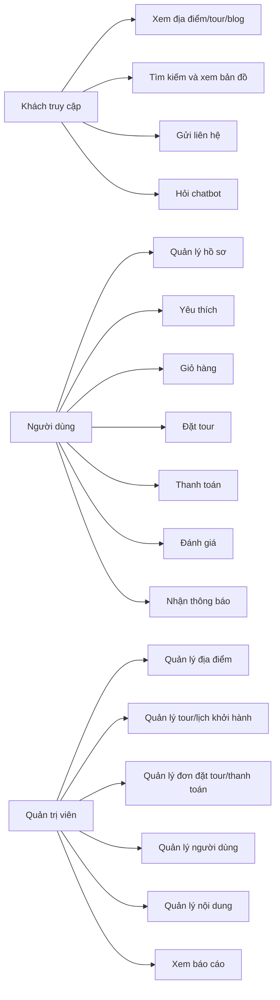
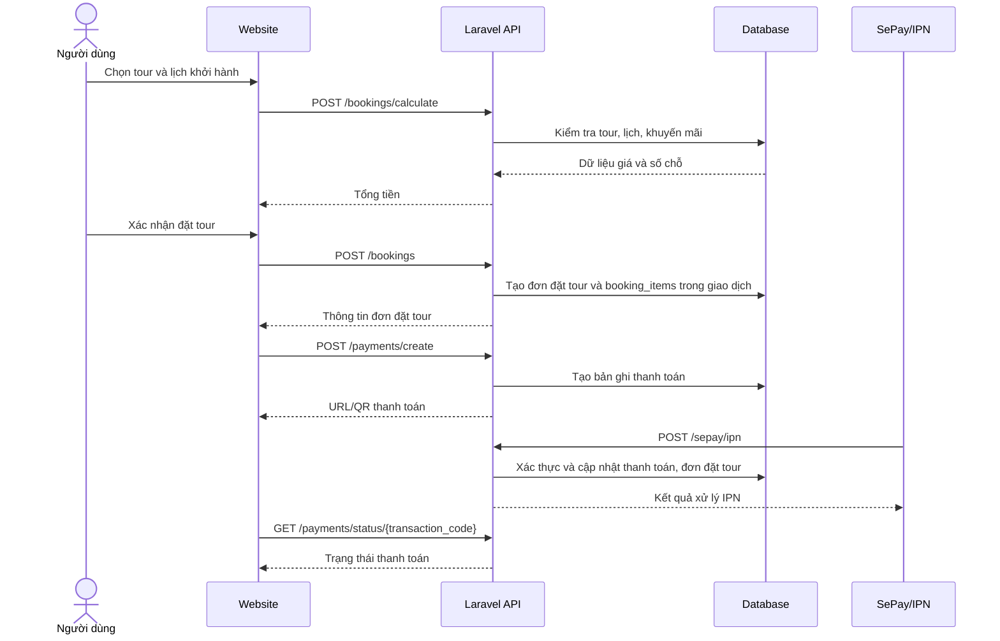
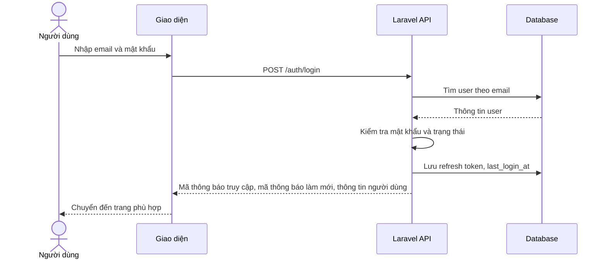
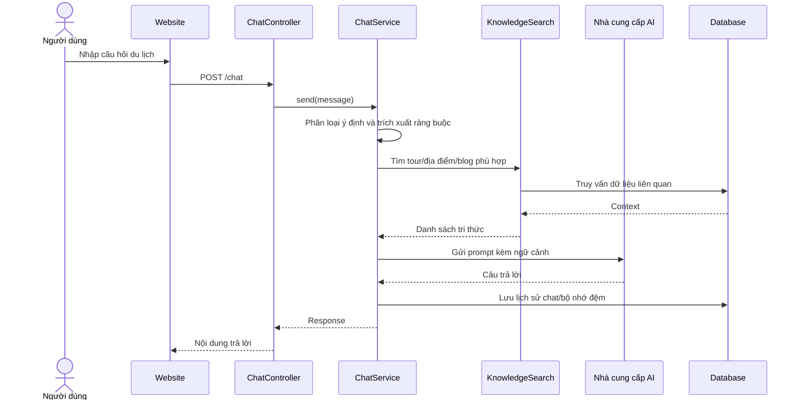
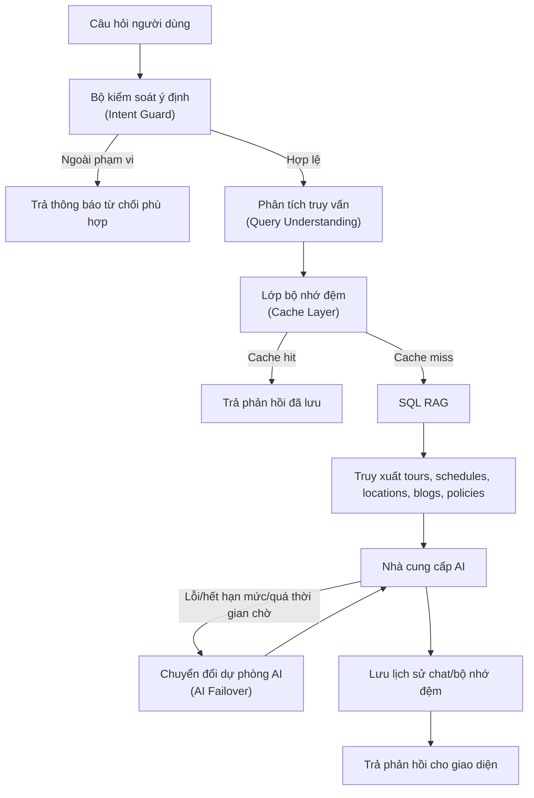
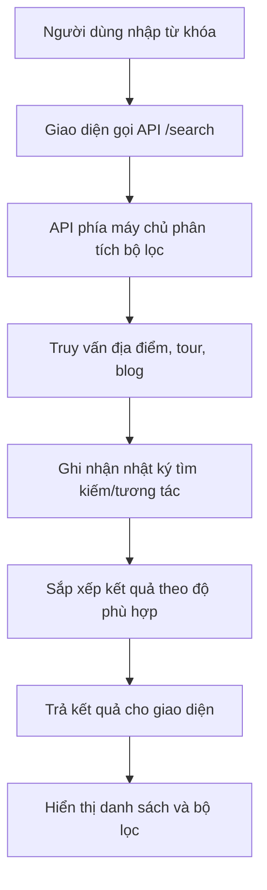
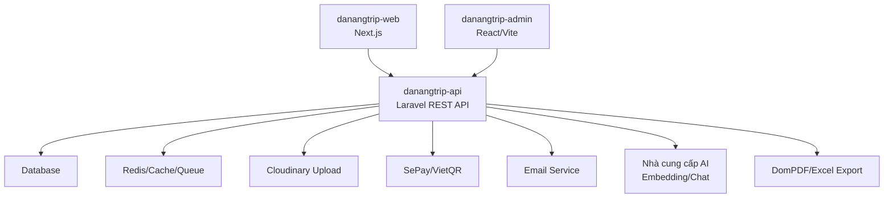

# CHƯƠNG 2. PHÂN TÍCH THIẾT KẾ HỆ THỐNG

## 2.1. Các tác nhân chính

Để phân tích chi tiết các yêu cầu và thiết kế các ca sử dụng (use case) của hệ thống DanangTrip, trước tiên cần xác định rõ ràng các tác nhân (Actors) tham gia tương tác trực tiếp hoặc gián tiếp với hệ thống. Qua phân tích nghiệp vụ, hệ thống DanangTrip phân loại đối tượng sử dụng thành ba nhóm tác nhân chính với vai trò và phạm vi truy cập khác nhau, cụ thể như sau:

### 2.1.1. Khách truy cập (Guest)
Khách truy cập đại diện cho các người dùng vãng lai, chưa thực hiện đăng ký tài khoản hoặc chưa đăng nhập vào hệ thống. Đây là nhóm đối tượng có phạm vi quyền hạn cơ bản nhất, chủ yếu tương tác với các giao diện hiển thị thông tin công cộng.
- **Vai trò và quyền hạn:** Khách truy cập có thể truy cập trang chủ để xem thông tin tổng quan, danh sách các địa điểm du lịch nổi bật, các tour du lịch hấp dẫn cũng như các bài viết chia sẻ cẩm nang du lịch. Họ được sử dụng các tính năng tìm kiếm, lọc địa điểm/tour, tra cứu bản đồ số để định vị các điểm đến tại Đà Nẵng, gửi thông tin liên hệ và tương tác với chatbot AI để được tư vấn thông tin du lịch tự động.
- **Mục tiêu tương tác:** Khách truy cập sử dụng hệ thống nhằm mục đích tham khảo thông tin, tìm kiếm các dịch vụ du lịch phù hợp trước khi quyết định đăng ký tài khoản để sử dụng các dịch vụ sâu hơn.

### 2.1.2. Người dùng đã đăng nhập (User)
Người dùng đã đăng nhập là những thành viên đã đăng ký tài khoản thành công và xác thực danh tính qua hệ thống. Nhóm tác nhân này kế thừa toàn bộ các chức năng công cộng của Khách truy cập, đồng thời được cấp quyền truy cập vào các phân hệ chức năng mang tính cá nhân hóa và giao dịch nghiệp vụ.
- **Vai trò và quyền hạn:** Người dùng được phép quản lý thông tin hồ sơ cá nhân (cập nhật ảnh đại diện, đổi mật khẩu), quản lý danh sách địa điểm/tour yêu thích, và tương tác trực tiếp với luồng đặt dịch vụ bao gồm giỏ hàng, khởi tạo đơn đặt tour (booking), thực hiện thanh toán trực tuyến thông qua cổng thanh toán tích hợp (vietQR/SePay), theo dõi trạng thái đơn hàng và tải hóa đơn điện tử. Ngoài ra, người dùng còn có quyền viết đánh giá, chấm điểm sao cho các địa điểm hoặc tour đã trải nghiệm, và nhận thông báo cá nhân hóa từ hệ thống.
- **Mục tiêu tương tác:** Người dùng sử dụng hệ thống để thực hiện đặt tour du lịch, thực hiện thanh toán trực tuyến nhanh chóng và tương tác cộng đồng thông qua việc chia sẻ trải nghiệm thực tế.

### 2.1.3. Quản trị viên (Admin)
Quản trị viên đại diện cho nhóm người dùng nội bộ, có vai trò vận hành, giám sát và quản trị toàn bộ hoạt động của hệ thống thông qua phân hệ trang quản trị (Admin Dashboard). Đây là nhóm tác nhân có đặc quyền cao nhất trong hệ thống.
- **Vai trò và quyền hạn:** Quản trị viên chịu trách nhiệm quản lý danh mục địa điểm, quản lý thông tin địa điểm (thêm, sửa, xóa, duyệt ảnh), quản lý tour du lịch và lịch khởi hành chi tiết. Quản trị viên theo dõi và xử lý các đơn đặt tour, xác nhận giao dịch thanh toán, quản lý tài khoản người dùng (bao gồm phân quyền, khóa hoặc mở khóa tài khoản), quản lý nội dung cẩm nang du lịch (bài viết blog), kiểm duyệt và xử lý các phản hồi/đánh giá từ người dùng. Đồng thời, quản trị viên sử dụng hệ thống báo cáo thống kê doanh thu, xu hướng đặt tour, tăng trưởng người dùng để đưa ra các quyết định vận hành tối ưu.
- **Mục tiêu tương tác:** Vận hành hệ thống ổn định, đảm bảo thông tin dịch vụ du lịch luôn chính xác, xử lý kịp thời các giao dịch tài chính của người dùng và giám sát hiệu quả hoạt động kinh doanh thông qua các số liệu báo cáo thực tế.

## 2.2. Yêu cầu chức năng

Yêu cầu chức năng của hệ thống DanangTrip được chia thành hai nhóm đối tượng sử dụng chính: Nhóm chức năng dành cho người dùng (bao gồm khách truy cập vãng lai và thành viên đã đăng nhập) và nhóm chức năng dành cho quản trị viên (Admin). Nhằm tăng tính tường minh và khoa học cho tài liệu phân tích, các chức năng được phân tách rõ ràng theo từng phân hệ (module) dưới dạng bảng biểu cụ thể.

### 2.2.1. Nhóm chức năng người dùng (Khách du lịch)

*Bảng 2.1: Yêu cầu chức năng nhóm người dùng*

| STT | Phân hệ (Module) | Chi tiết yêu cầu chức năng |
| :---: | :--- | :--- |
| 1 | Xác thực & Tài khoản | - Đăng ký, đăng nhập, đăng xuất, làm mới mã thông báo. - Quên mật khẩu, đặt lại mật khẩu mới. - Xác thực email bằng mã OTP và gửi lại mã xác thực. - Quản lý hồ sơ cá nhân (ảnh đại diện, đổi mật khẩu, xóa tài khoản). |
| 2 | Khám phá & Tìm kiếm | - Xem trang chủ, danh mục, địa điểm/tour nổi bật, bài viết mới. - Tìm kiếm địa điểm/tour, xem gợi ý/xu hướng tìm kiếm và gợi ý cá nhân hóa. - Xem chi tiết địa điểm, hình ảnh, đánh giá, thống kê đánh giá. - Xem vị trí địa điểm trên bản đồ, tìm địa điểm lân cận hoặc gần vị trí người dùng. |
| 3 | Đặt Tour & Thanh toán | - Xem danh sách tour, chi tiết tour, lịch khởi hành, kiểm tra số chỗ. - Quản lý giỏ hàng và đặt tour. - Tính giá đơn đặt tour, áp dụng mã khuyến mãi, tạo liên kết thanh toán. - Theo dõi trạng thái thanh toán, thử lại thanh toán và xem hóa đơn. |
| 4 | Tương tác & Tiện ích | - Quản lý danh sách yêu thích, nhận thông báo hệ thống. - Viết đánh giá, quản lý lịch sử đánh giá. - Gửi thông tin liên hệ tới quản trị viên. - Tương tác với Chatbot thông minh để hỏi đáp thông tin du lịch. |

### 2.2.2. Nhóm chức năng quản trị (Admin)

*Bảng 2.2: Yêu cầu chức năng nhóm quản trị (Admin)*

| STT | Phân hệ (Module) | Chi tiết yêu cầu chức năng |
| :---: | :--- | :--- |
| 1 | Tổng quan & Bảo mật | - Đăng nhập trang quản trị và kiểm tra phân quyền. - Xem bảng điều khiển (Dashboard) tổng quan về doanh thu, tour/địa điểm nổi bật, tăng trưởng người dùng, xu hướng đặt tour và tìm kiếm. |
| 2 | Quản lý nghiệp vụ du lịch | - Quản lý danh mục địa điểm, danh mục con, địa điểm, thẻ phân loại, tiện ích. - Quản lý tour, danh mục tour và lịch khởi hành. |
| 3 | Quản lý giao dịch | - Quản lý đơn đặt tour, cập nhật trạng thái, xác nhận thanh toán và xuất hóa đơn. - Quản lý luồng thanh toán, xem chi tiết, xuất báo cáo và xử lý hoàn tiền. |
| 4 | Quản lý người dùng & Khách hàng | - Quản lý tài khoản người dùng, phân quyền, khóa/mở khóa tài khoản, xuất danh sách. - Quản lý và phản hồi liên hệ, gửi email chăm sóc khách hàng. - Quản lý đánh giá (duyệt, từ chối, xóa, xử lý báo cáo vi phạm). |
| 5 | Quản lý nội dung & Tiếp thị | - Quản lý bài viết blog, danh mục blog và các trang đích (Landing pages). - Tạo và quản lý các chương trình khuyến mãi. - Gửi thông báo (đơn lẻ hoặc hàng loạt cho toàn bộ người dùng). - Cấu hình các thông số hệ thống và xuất báo cáo thống kê. |

## 2.3. Yêu cầu phi chức năng

*Bảng 2.3: Các yêu cầu phi chức năng và phương án triển khai*

| Nhóm yêu cầu | Mô tả |
| --- | --- |
| Bảo mật | Sử dụng JWT, phân quyền quản trị viên, giới hạn tần suất API, kiểm tra dữ liệu đầu vào, kiểm soát tải ảnh |
| Hiệu năng | Dùng bộ nhớ đệm của React Query, bộ nhớ đệm Laravel, Redis, phân trang dữ liệu, chỉ mục cơ sở dữ liệu |
| Khả dụng | Giao diện đáp ứng, có trạng thái đang tải/trạng thái lỗi, hỗ trợ đa ngôn ngữ |
| Mở rộng | Tách website người dùng, trang quản trị và API; service/repository tách nghiệp vụ; có thể mở rộng AI/hệ thống gợi ý |
| Dễ bảo trì | TypeScript ở tầng giao diện, tầng dịch vụ Laravel, migration, kiểm thử và cấu trúc phân hệ rõ ràng |
| Toàn vẹn dữ liệu | Dùng giao dịch cho đặt tour, thanh toán, cập nhật trạng thái và các thao tác quan trọng |

## 2.4. Phân rã use case theo tác nhân

### 2.4.1. Khách truy cập

Khách truy cập là người chưa đăng nhập nhưng vẫn có thể sử dụng các chức năng tra cứu công khai:

- Xem trang chủ.
- Xem danh sách địa điểm và chi tiết địa điểm.
- Xem danh sách tour và chi tiết tour.
- Tìm kiếm địa điểm/tour/bài viết.
- Xem bản đồ và các địa điểm nổi bật.
- Đọc blog du lịch.
- Xem khuyến mãi công khai.
- Gửi biểu mẫu liên hệ.
- Hỏi chatbot.
- Đăng ký hoặc đăng nhập.

### 2.4.2. Người dùng đã đăng nhập

Người dùng đã đăng nhập kế thừa các chức năng của khách truy cập và có thêm các chức năng cá nhân:

- Quản lý hồ sơ cá nhân.
- Đổi mật khẩu và cập nhật ảnh đại diện.
- Lưu hoặc bỏ lưu địa điểm/tour yêu thích.
- Quản lý giỏ hàng.
- Đặt tour và theo dõi đơn đặt tour.
- Thanh toán và kiểm tra trạng thái thanh toán.
- Xem hoặc tải hóa đơn.
- Đánh giá tour/địa điểm.
- Xem thông báo.
- Nhận gợi ý cá nhân hóa.

### 2.4.3. Quản trị viên

Quản trị viên có quyền truy cập khu vực quản trị để vận hành hệ thống:

- Quản lý dữ liệu địa điểm, danh mục, thẻ phân loại và tiện ích.
- Quản lý tour, danh mục tour và lịch khởi hành.
- Quản lý đơn đặt tour, thanh toán và hóa đơn.
- Quản lý người dùng, vai trò và trạng thái tài khoản.
- Quản lý đánh giá, liên hệ, thông báo, blog và trang đích.
- Quản lý mã khuyến mãi và cấu hình website.
- Xem bảng điều khiển, báo cáo doanh thu, đơn đặt tour, người dùng, địa điểm và đánh giá.

## 2.5. Biểu đồ use case tổng quan

## 2.6. Đặc tả use case tiêu biểu

### 2.6.1. Use case đăng nhập

*Bảng 2.4: Đặc tả ca sử dụng Đăng nhập*

| Thành phần | Nội dung |
| --- | --- |
| Tên use case | Đăng nhập |
| Tác nhân | Người dùng, quản trị viên |
| Tiền điều kiện | Người dùng đã có tài khoản |
| Luồng chính | Nhập email/mật khẩu; gửi yêu cầu đăng nhập; API phía máy chủ kiểm tra thông tin; trả mã thông báo truy cập, mã thông báo làm mới và thông tin người dùng; giao diện lưu trạng thái đăng nhập |
| Luồng ngoại lệ | Sai thông tin đăng nhập; tài khoản bị khóa; dữ liệu không hợp lệ |
| Hậu điều kiện | Người dùng truy cập được chức năng tương ứng với quyền |

### 2.6.2. Use case đặt tour

*Bảng 2.5: Đặc tả ca sử dụng Đặt tour*

| Thành phần | Nội dung |
| --- | --- |
| Tên use case | Đặt tour |
| Tác nhân | Người dùng đã đăng nhập |
| Tiền điều kiện | Người dùng đã chọn tour/lịch khởi hành còn chỗ |
| Luồng chính | Chọn tour; chọn lịch khởi hành; nhập số lượng khách; hệ thống tính giá; người dùng xác nhận; API phía máy chủ tạo đơn đặt tour và chi tiết đơn đặt tour; hệ thống chuyển sang thanh toán |
| Luồng ngoại lệ | Lịch khởi hành hết chỗ; dữ liệu khách không hợp lệ; mã khuyến mãi không hợp lệ |
| Hậu điều kiện | Booking được tạo với trạng thái chờ thanh toán hoặc chờ xác nhận |

### 2.6.3. Use case thanh toán

*Bảng 2.6: Đặc tả ca sử dụng Thanh toán đơn đặt tour*

| Thành phần | Nội dung |
| --- | --- |
| Tên use case | Thanh toán đơn đặt tour |
| Tác nhân | Người dùng, cổng thanh toán |
| Tiền điều kiện | Booking tồn tại và chưa thanh toán |
| Luồng chính | Người dùng tạo thanh toán; hệ thống sinh giao dịch SePay/VietQR; người dùng thanh toán; IPN/callback gửi về API phía máy chủ; API phía máy chủ xác thực và cập nhật thanh toán/đơn đặt tour |
| Luồng ngoại lệ | Thanh toán thất bại; callback sai chữ ký; số tiền không khớp; giao dịch trùng |
| Hậu điều kiện | Booking được cập nhật trạng thái thanh toán thành công hoặc thất bại |

### 2.6.4. Use case quản lý tour

*Bảng 2.7: Đặc tả ca sử dụng Quản lý tour*

| Thành phần | Nội dung |
| --- | --- |
| Tên use case | Quản lý tour |
| Tác nhân | Quản trị viên |
| Tiền điều kiện | Quản trị viên đã đăng nhập |
| Luồng chính | Xem danh sách tour; thêm/sửa/xóa tour; cập nhật trạng thái; đánh dấu tour nổi bật/hot; quản lý lịch khởi hành |
| Luồng ngoại lệ | Dữ liệu không hợp lệ; tour đã phát sinh đơn đặt tour; người dùng không có quyền |
| Hậu điều kiện | Dữ liệu tour được cập nhật và hiển thị cho người dùng |

### 2.6.5. Use case đăng ký

*Bảng 2.8: Đặc tả ca sử dụng Đăng ký tài khoản*

| Thành phần | Nội dung |
| --- | --- |
| Tên use case | Đăng ký tài khoản |
| Tác nhân | Khách truy cập |
| Tiền điều kiện | Người dùng chưa có tài khoản trong hệ thống |
| Luồng chính | Người dùng nhập tên đăng nhập, email, mật khẩu, họ tên; giao diện kiểm tra dữ liệu; API phía máy chủ kiểm tra email/tên đăng nhập trùng; tạo tài khoản ở trạng thái chờ xử lý hoặc hoạt động theo cấu hình; gửi thông tin xác thực nếu cần |
| Luồng ngoại lệ | Email đã tồn tại; username đã tồn tại; mật khẩu không hợp lệ; lỗi gửi email |
| Hậu điều kiện | Tài khoản được tạo và người dùng có thể đăng nhập/xác thực email |

### 2.6.6. Use case tìm kiếm địa điểm/tour

*Bảng 2.9: Đặc tả ca sử dụng Tìm kiếm địa điểm/tour*

| Thành phần | Nội dung |
| --- | --- |
| Tên use case | Tìm kiếm |
| Tác nhân | Khách truy cập, người dùng |
| Tiền điều kiện | Hệ thống có dữ liệu địa điểm, tour hoặc bài viết |
| Luồng chính | Người dùng nhập từ khóa/bộ lọc; giao diện gọi API tìm kiếm; API phía máy chủ chuẩn hóa từ khóa, truy vấn dữ liệu, ghi nhận nhật ký tương tác; trả danh sách kết quả |
| Luồng ngoại lệ | Từ khóa rỗng; không có kết quả; lỗi kết nối API |
| Hậu điều kiện | Người dùng xem được kết quả tìm kiếm hoặc thông báo không có dữ liệu |

### 2.6.7. Use case đánh giá

*Bảng 2.10: Đặc tả ca sử dụng Đánh giá tour/địa điểm*

| Thành phần | Nội dung |
| --- | --- |
| Tên use case | Đánh giá tour/địa điểm |
| Tác nhân | Người dùng đã đăng nhập |
| Tiền điều kiện | Người dùng đã đăng nhập; đối tượng đánh giá tồn tại; nếu là tour có thể yêu cầu người dùng từng đặt tour |
| Luồng chính | Người dùng nhập điểm sao, nội dung, ảnh; API phía máy chủ lưu đánh giá; cập nhật thống kê đánh giá; quản trị viên duyệt nếu cần |
| Luồng ngoại lệ | Nội dung không hợp lệ; ảnh không hợp lệ; người dùng đánh giá trùng; đánh giá bị từ chối |
| Hậu điều kiện | Đánh giá được lưu và hiển thị theo trạng thái duyệt |

### 2.6.8. Use case quản lý đơn đặt tour

*Bảng 2.11: Đặc tả ca sử dụng Quản lý đơn đặt tour*

| Thành phần | Nội dung |
| --- | --- |
| Tên use case | Quản lý đơn đặt tour |
| Tác nhân | Quản trị viên |
| Tiền điều kiện | Quản trị viên đã đăng nhập |
| Luồng chính | Quản trị viên xem danh sách đơn đặt tour; lọc theo trạng thái/ngày/người dùng; xem chi tiết; cập nhật trạng thái; xác nhận thanh toán; xuất hóa đơn hoặc báo cáo |
| Luồng ngoại lệ | Booking không tồn tại; trạng thái chuyển không hợp lệ; không đủ quyền |
| Hậu điều kiện | Trạng thái đơn đặt tour được cập nhật đúng nghiệp vụ |

### 2.6.9. Use case chatbot tư vấn

*Bảng 2.12: Đặc tả ca sử dụng Chatbot tư vấn du lịch*

| Thành phần | Nội dung |
| --- | --- |
| Tên use case | Chatbot tư vấn du lịch |
| Tác nhân | Khách truy cập, người dùng |
| Tiền điều kiện | API chatbot và cơ sở tri thức hoạt động |
| Luồng chính | Người dùng gửi câu hỏi; API phía máy chủ phân loại ý định; trích xuất ràng buộc; tìm kiếm dữ liệu liên quan; AI tạo phản hồi; giao diện hiển thị câu trả lời |
| Luồng ngoại lệ | Câu hỏi ngoài phạm vi; không có dữ liệu phù hợp; nhà cung cấp AI lỗi; yêu cầu vượt giới hạn |
| Hậu điều kiện | Người dùng nhận được câu trả lời hoặc thông báo phù hợp |

## 2.7. Biểu đồ tuần tự đặt tour và thanh toán

## 2.8. Biểu đồ tuần tự đăng nhập

## 2.9. Biểu đồ tuần tự chatbot

## 2.10. Thiết kế quy trình AI Chatbot

Pipeline chatbot trong DanangTrip được thiết kế để đảm bảo câu trả lời bám sát dữ liệu nội bộ của hệ thống. Luồng xử lý gồm các bước:

1. Người dùng gửi câu hỏi từ website.
2. Bộ kiểm soát ý định (Intent Guard) kiểm tra câu hỏi có thuộc phạm vi hỗ trợ hay không.
3. Thành phần phân tích truy vấn (Query Understanding) phân tích câu hỏi và trích xuất các tham số như điểm đến, ngân sách, ngày đi, số người, thời lượng.
4. Lớp bộ nhớ đệm (Cache Layer) kiểm tra khóa bộ nhớ đệm được tạo từ ngôn ngữ, ý định và câu hỏi đã chuẩn hóa nhằm xác định phản hồi tương ứng đã tồn tại hay chưa.
5. Thành phần SQL RAG truy xuất dữ liệu từ các bảng nghiệp vụ như `tours`, `tour_schedules`, `locations`, `blog_posts`, `settings` và `chat_knowledge_base`; dữ liệu truy xuất được sử dụng làm ngữ cảnh đầu vào cho mô hình AI khi sinh phản hồi.
6. Thành phần cung cấp mô hình AI nhận prompt bao gồm câu hỏi gốc của người dùng, kết quả phân tích truy vấn và ngữ cảnh dữ liệu được truy xuất từ hệ thống.
7. Cơ chế chuyển đổi dự phòng AI (AI Failover) xử lý trường hợp nhà cung cấp lỗi hoặc vượt giới hạn.
8. Hệ thống lưu tin nhắn, lưu kết quả vào bộ nhớ đệm và trả phản hồi về giao diện.

### 2.10.1. Bảng mô tả đầu vào/đầu ra của quy trình AI

*Bảng 2.13: Quy trình các bước xử lý đầu vào và đầu ra của chatbot AI*

| Bước | Lớp dịch vụ/Thành phần | Đầu vào | Đầu ra | Vai trò |
| --- | --- | --- | --- | --- |
| 1 | `ChatController` | Nội dung câu hỏi, thông tin phiên chat, ngôn ngữ | Yêu cầu đã được kiểm tra | Tiếp nhận yêu cầu từ giao diện |
| 2 | `ChatIntentGuardService` | Câu hỏi người dùng | Kết quả hợp lệ/không hợp lệ, nhóm ý định sơ bộ | Giới hạn phạm vi câu hỏi thuộc du lịch, tour, địa điểm, đặt tour hoặc chính sách |
| 3 | `ChatQueryUnderstandingService` | Câu hỏi hợp lệ | Intent chi tiết, điểm đến, khoảng giá, số người, ngày đi, thời lượng | Trích xuất tham số phục vụ truy vấn dữ liệu |
| 4 | Lớp bộ nhớ đệm (Cache Layer) | Câu hỏi đã chuẩn hóa, ý định, tham số truy vấn | Phản hồi trong bộ nhớ đệm hoặc không có dữ liệu phù hợp trong bộ nhớ đệm | Giảm thời gian phản hồi với câu hỏi lặp lại |
| 5 | `ChatKnowledgeSearchService` | Intent và tham số đã trích xuất | Danh sách tour, lịch khởi hành, địa điểm, bài viết, chính sách liên quan | Thực hiện SQL RAG từ dữ liệu nội bộ |
| 6 | `ChatAiProviderService` | Prompt gồm câu hỏi và ngữ cảnh truy xuất | Câu trả lời từ nhà cung cấp AI | Sinh phản hồi tự nhiên dựa trên dữ liệu hệ thống |
| 7 | Cơ chế chuyển đổi dự phòng AI (AI Failover) | Lỗi nhà cung cấp, quá thời gian chờ, vượt giới hạn tần suất hoặc phản hồi không hợp lệ | Nhà cung cấp hoặc khóa truy cập thay thế, hoặc phản hồi dự phòng | Tăng khả năng sẵn sàng của chatbot |
| 8 | `ChatMessage`/`ChatCache` | Câu hỏi, ngữ cảnh, phản hồi | Lịch sử chat và bộ nhớ đệm | Lưu lịch sử hội thoại và dữ liệu phục vụ truy vấn sau |

### 2.10.2. Đối chiếu quy trình AI với mã nguồn

*Bảng 2.14: Đối chiếu quy trình AI với các thành phần mã nguồn*

| Thành phần thiết kế | Minh chứng trong mã nguồn | Mô tả triển khai |
| --- | --- | --- |
| Bộ kiểm soát ý định (Intent Guard) | `ChatIntentGuardService::classify()` | Chuẩn hóa câu hỏi của người dùng, kiểm tra các từ khóa bị hạn chế và phân loại câu hỏi vào các nhóm chức năng như tour du lịch, địa điểm, đặt tour, thanh toán, hoàn tiền, bài viết hoặc tài khoản. |
| Thành phần phân tích truy vấn (Query Understanding) | `ChatQueryUnderstandingService::understand()` | Phân tích nội dung câu hỏi để trích xuất các tham số phục vụ tìm kiếm như điểm đến, mức giá, số lượng khách, ngày khởi hành, thời lượng chuyến đi và tiêu chí sắp xếp kết quả. |
| Lớp bộ nhớ đệm (Cache Layer) | `ChatService::cacheHash()` và model `ChatCache` | Tạo khóa bộ nhớ đệm dựa trên ngôn ngữ, nhóm ý định và nội dung câu hỏi đã được chuẩn hóa; kiểm tra dữ liệu còn hiệu lực trước khi thực hiện truy xuất dữ liệu hoặc gọi mô hình AI. |
| Thành phần truy xuất tri thức SQL RAG | `ChatKnowledgeSearchService::search()` | Truy xuất dữ liệu liên quan từ tour du lịch, địa điểm, bài viết, chính sách và cơ sở tri thức nhằm xây dựng ngữ cảnh cho quá trình sinh câu trả lời. |
| Thành phần cung cấp mô hình AI | `ChatAiProviderService::complete()` | Gửi yêu cầu đến mô hình AI được cấu hình, bao gồm Gemini hoặc các nhà cung cấp tương thích giao diện OpenAI. |
| Cơ chế chuyển đổi dự phòng AI (AI Failover) | `ChatAiProviderService::complete()` và `ensureSuccessfulResponse()` | Tự động chuyển sang nhà cung cấp hoặc khóa truy cập khác khi phát hiện lỗi kết nối, vượt thời gian chờ, vượt giới hạn tần suất hoặc khóa truy cập không hợp lệ. |
| Câu trả lời dự phòng | `ChatService::fallbackAnswer()` và `outOfScopeAnswer()` | Trả về câu trả lời dự phòng trong trường hợp không tìm thấy dữ liệu liên quan, mô hình AI gặp lỗi hoặc câu hỏi nằm ngoài phạm vi hỗ trợ của hệ thống. |

### 2.10.3. Ví dụ xử lý câu hỏi chatbot

Ví dụ người dùng nhập câu hỏi:

> Tôi muốn tìm tour Bà Nà cho 2 người, ngân sách dưới 2 triệu, đi cuối tuần này.

Quá trình xử lý dự kiến:

*Bảng 2.15: Ví dụ các giai đoạn xử lý câu hỏi chatbot thực tế*

| Giai đoạn | Kết quả xử lý |
| --- | --- |
| Bộ kiểm soát ý định (Intent Guard) | Câu hỏi hợp lệ, thuộc nhóm tư vấn tour |
| Thành phần phân tích truy vấn (Query Understanding) | `intent = tour_recommendation`, `destination = Bà Nà`, `people = 2`, `price_max = 2000000`, `date = cuối tuần này` |
| Lớp bộ nhớ đệm (Cache Layer) | Kiểm tra bộ nhớ đệm theo câu hỏi đã chuẩn hóa và tham số chính; nếu không có thì tiếp tục truy xuất dữ liệu |
| SQL RAG | Truy vấn các bảng `tours`, `tour_schedules`, `tour_categories`, có thể kết hợp điều kiện điểm đến, giá, số chỗ và ngày khởi hành |
| Context gửi AI | Danh sách tour phù hợp, giá người lớn/trẻ em, lịch khởi hành, số chỗ còn lại, mô tả ngắn và chính sách liên quan |
| AI Response | Tạo câu trả lời gợi ý tour phù hợp, nêu lý do phù hợp và hướng dẫn người dùng xem chi tiết/đặt tour |

Ví dụ phản hồi mong đợi:

> Hệ thống tìm thấy một số tour Bà Nà phù hợp với yêu cầu 2 người và ngân sách dưới 2.000.000 VND. Anh/chị có thể tham khảo tour có lịch khởi hành gần nhất, kiểm tra số chỗ còn lại và chuyển sang trang chi tiết tour để đặt chỗ.

Khi đưa vào báo cáo chính thức, cần thay ví dụ trên bằng dữ liệu thật từ cơ sở dữ liệu của dự án.

## 2.11. Biểu đồ hoạt động tìm kiếm/gợi ý

## 2.12. Kiến trúc hệ thống

## 2.13. Thiết kế cơ sở dữ liệu mức logic

Các thực thể chính:

*Bảng 2.16: Các nhóm bảng thực thể chính trong cơ sở dữ liệu*

| Nhóm | Bảng/Model | Mô tả |
| --- | --- | --- |
| Người dùng | `users`, `refresh_tokens` | Tài khoản, vai trò, xác thực và mã thông báo làm mới |
| Địa điểm | `locations`, `categories`, `subcategories` | Thông tin địa điểm du lịch và phân loại |
| Tiện ích/thẻ phân loại | `tags`, `amenities`, `location_tags`, `location_amenities` | Gắn nhãn và tiện ích cho địa điểm |
| Tour | `tours`, `tour_categories`, `tour_schedules`, `tour_locations` | Tour, danh mục, lịch khởi hành và địa điểm trong tour |
| Đặt tour | `bookings`, `booking_items`, `cart_items` | Đặt tour, chi tiết đơn đặt tour và giỏ hàng |
| Thanh toán | `payments` | Giao dịch thanh toán, trạng thái và mã giao dịch |
| Tương tác | `favorites`, `ratings`, `rating_images`, `views`, `search_logs` | Yêu thích, đánh giá, lượt xem và hành vi tìm kiếm |
| Nội dung | `blog_posts`, `blog_categories`, `landing_pages` | Bài viết du lịch và trang đích |
| Vận hành | `contacts`, `notifications`, `settings`, `promotions` | Liên hệ, thông báo, cấu hình và khuyến mãi |
| Chatbot | `chat_messages`, `chat_cache`, `chat_knowledge_base` | Lịch sử chat, bộ nhớ đệm phản hồi và cơ sở tri thức |

## 2.14. Mô tả một số bảng dữ liệu chính

### 2.14.1. Bảng `users`

*Bảng 2.17: Cấu trúc dữ liệu chi tiết của bảng users*

| Trường | Ý nghĩa |
| --- | --- |
| `id` | Khóa chính |
| `username` | Tên đăng nhập, duy nhất |
| `email` | Email, duy nhất |
| `password` | Mật khẩu đã mã hóa |
| `full_name` | Họ tên người dùng |
| `avatar` | Ảnh đại diện |
| `phone`, `birthdate`, `gender`, `city` | Thông tin cá nhân bổ sung |
| `role` | Vai trò `user` hoặc `admin` |
| `status` | Trạng thái `active`, `blocked`, `pending` |
| `email_verified_at`, `last_login_at` | Thông tin xác thực và lần đăng nhập cuối |

### 2.14.2. Bảng `locations`

*Bảng 2.18: Cấu trúc dữ liệu chi tiết của bảng locations*

| Trường | Ý nghĩa |
| --- | --- |
| `id` | Khóa chính |
| `name`, `slug` | Tên và định danh URL của địa điểm |
| `category_id`, `subcategory_id` | Danh mục và danh mục con |
| `description`, `short_description` | Nội dung giới thiệu |
| `address`, `district`, `ward` | Địa chỉ |
| `latitude`, `longitude` | Tọa độ bản đồ |
| `opening_hours` | Giờ mở cửa dạng JSON |
| `price_min`, `price_max`, `price_level` | Khoảng giá |
| `avg_rating`, `review_count`, `view_count`, `favorite_count` | Thống kê tương tác |
| `thumbnail`, `images`, `video_url` | Tệp hình ảnh và video |
| `status`, `is_featured` | Trạng thái hiển thị và nổi bật |

### 2.14.3. Bảng `tours`

*Bảng 2.19: Cấu trúc dữ liệu chi tiết của bảng tours*

| Trường | Ý nghĩa |
| --- | --- |
| `id` | Khóa chính |
| `name`, `slug` | Tên và định danh URL |
| `tour_category_id` | Danh mục tour |
| `description`, `short_desc` | Mô tả tour |
| `itinerary`, `inclusions`, `exclusions` | Lịch trình, bao gồm, không bao gồm |
| `price_adult`, `price_child`, `price_infant` | Giá theo nhóm khách |
| `discount_percent` | Phần trăm giảm giá |
| `duration`, `start_time`, `meeting_point` | Thời lượng, giờ đi, điểm hẹn |
| `max_people`, `min_people` | Số khách tối đa/tối thiểu |
| `available_from`, `available_to` | Thời gian mở bán |
| `booking_availability` | Trạng thái còn nhận đặt tour hay đã hết chỗ |
| `is_featured`, `is_hot` | Đánh dấu nổi bật/hot |
| `view_count`, `booking_count`, `rating_count`, `rating_avg` | Thống kê |

### 2.14.4. Bảng `tour_schedules`

*Bảng 2.20: Cấu trúc dữ liệu chi tiết của bảng tour_schedules*

| Trường | Ý nghĩa |
| --- | --- |
| `id` | Khóa chính |
| `tour_id` | Tour tương ứng |
| `start_date`, `end_date` | Ngày bắt đầu và kết thúc |
| `max_people`, `booked_people` | Số chỗ tối đa và đã đặt |
| `price_adult`, `price_child`, `price_infant` | Giá override theo lịch |
| `status` | Trạng thái lịch khởi hành |

### 2.14.5. Bảng `bookings`

*Bảng 2.21: Cấu trúc dữ liệu chi tiết của bảng bookings*

| Trường | Ý nghĩa |
| --- | --- |
| `id`, `booking_code` | Khóa chính và mã đặt tour |
| `user_id` | Người đặt, có thể null nếu hỗ trợ khách |
| `customer_name`, `customer_email`, `customer_phone`, `customer_address` | Thông tin khách hàng |
| `customer_note` | Ghi chú của khách |
| `total_amount`, `discount_amount`, `final_amount`, `deposit_amount` | Tổng tiền, giảm giá, số tiền cuối, tiền cọc |
| `payment_method`, `payment_status`, `booking_status` | Phương thức, trạng thái thanh toán, trạng thái đặt tour |
| `booked_at`, `confirmed_at`, `cancelled_at`, `completed_at` | Các mốc thời gian nghiệp vụ |

### 2.14.6. Bảng `payments`

*Bảng 2.22: Cấu trúc dữ liệu chi tiết của bảng payments*

| Trường | Ý nghĩa |
| --- | --- |
| `id` | Khóa chính |
| `booking_id` | Đơn đặt tour liên quan |
| `transaction_code` | Mã giao dịch duy nhất |
| `amount` | Số tiền thanh toán |
| `payment_method` | Phương thức thanh toán |
| `payment_status` | Trạng thái `pending`, `success`, `failed`, `refunded` |
| `payment_gateway` | Cổng thanh toán |
| `gateway_response` | Dữ liệu phản hồi từ cổng thanh toán |
| `paid_at`, `refunded_at`, `refund_reason` | Thông tin thanh toán/hoàn tiền |

## 2.15. Thiết kế API

API được đặt dưới prefix `/api/v1` và chia thành ba nhóm:

- Public API: `/home`, `/locations`, `/tours`, `/blog`, `/search`, `/chat`, `/contacts`, `/promotions`, `/config`.
- API yêu cầu xác thực: `/auth/me`, `/user/profile`, `/user/bookings`, `/payments`, `/cart`, `/ratings`, `/recommendations`, `/user/notifications`.
- API quản trị: `/admin/dashboard`, `/admin/locations`, `/admin/tours`, `/admin/tour-schedules`, `/admin/bookings`, `/admin/payments`, `/admin/users`, `/admin/blog-posts`, `/admin/ratings`, `/admin/settings`, `/admin/promotions`.

## 2.16. Ma trận chức năng và API

*Bảng 2.23: Ma trận phân hệ chức năng giao diện và API tương ứng*

| Phân hệ | Giao diện sử dụng | API chính |
| --- | --- | --- |
| Trang chủ | Website người dùng | `GET /home`, `/home/locations`, `/home/tours`, `/home/blogs` |
| Địa điểm | Website người dùng, trang quản trị | `GET /locations`, `GET /locations/{slug}`, `POST /admin/locations` |
| Tour | Website người dùng, trang quản trị | `GET /tours`, `GET /tours/{slug}`, `POST /admin/tours` |
| Đặt tour | Website người dùng, trang quản trị | `POST /bookings/calculate`, `POST /bookings`, `GET /user/bookings`, `GET /admin/bookings` |
| Thanh toán | Website người dùng, trang quản trị | `POST /payments/create`, `GET /payments/status/{code}`, `POST /sepay/ipn`, `PATCH /admin/bookings/{id}/confirm-payment` |
| Khuyến mãi | Website người dùng, trang quản trị | `GET /promotions`, `POST /promotions/validate`, `GET /admin/promotions`, `POST /admin/promotions` |
| Đánh giá | Website người dùng, trang quản trị | `POST /ratings`, `GET /admin/ratings`, `PATCH /admin/ratings/{id}/approve` |
| Blog | Website người dùng, trang quản trị | `GET /blog`, `GET /blog/{slug}`, `POST /admin/blog-posts` |
| Chatbot | Website người dùng | `POST /chat` |
| Báo cáo | Trang quản trị | `/admin/dashboard/*`, `/admin/reports/*` |

## 2.17. Danh sách sơ đồ cần xuất hình trong báo cáo

Các sơ đồ trong file Markdown chỉ là mã nguồn hoặc bản mô tả. Khi đưa vào Word, cần dựng lại bằng draw.io/Figma/PlantUML và xuất thành hình có chú thích:

*Bảng 2.24: Danh mục các sơ đồ kỹ thuật cần thiết kế cho báo cáo*

| Mã hình | Tên hình đề xuất | Nội dung |
| --- | --- | --- |
| Hình 2.1 | Biểu đồ use case tổng quan | Actor khách truy cập, người dùng, quản trị viên và các nhóm chức năng chính |
| Hình 2.2 | Kiến trúc tổng thể hệ thống DanangTrip | Website người dùng Next.js, trang quản trị React/Vite, Laravel API, PostgreSQL/Supabase, Redis, nhà cung cấp AI, Cloudinary, SePay |
| Hình 2.3 | Quy trình AI Chatbot | Bộ kiểm soát ý định, phân tích truy vấn, lớp bộ nhớ đệm, SQL RAG, nhà cung cấp AI, chuyển đổi dự phòng AI |
| Hình 2.4 | Biểu đồ tuần tự đặt tour và thanh toán | Luồng từ chọn tour đến tạo đơn đặt tour, tạo thanh toán và nhận IPN |
| Hình 2.5 | Biểu đồ tuần tự chatbot | Luồng từ câu hỏi người dùng đến truy xuất dữ liệu và tạo phản hồi |
| Hình 2.6 | ERD cơ sở dữ liệu | Các bảng chính: users, tours, tour_schedules, bookings, payments, locations, ratings, nhóm bảng chat |
| Hình 2.7 | Sơ đồ cấu trúc các lớp xử lý chatbot | Mối quan hệ và luồng điều phối giữa các lớp dịch vụ chatbot trong hệ thống |
