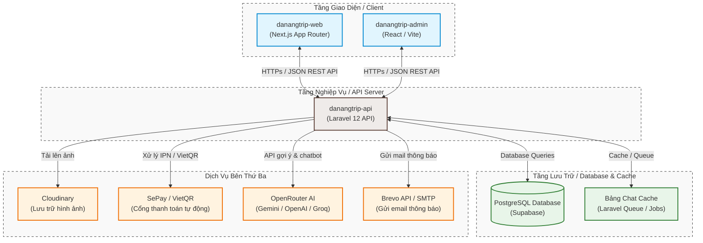
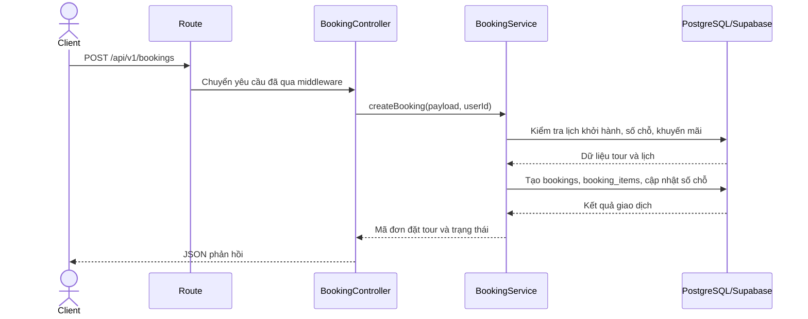
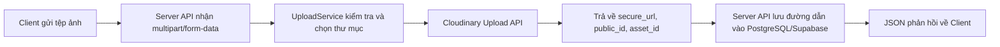

# CHƯƠNG 3. TRIỂN KHAI THỰC TẾ

## 3.1. Cấu trúc hệ thống

Dự án được tổ chức thành nhiều thư mục độc lập:

*Bảng 3.1: Cấu trúc thư mục mã nguồn dự án DanangTrip*

| Thư mục            | Vai trò                                     |
| ------------------ | ------------------------------------------- |
| `danangtrip-web`   | Website người dùng xây dựng bằng Next.js    |
| `danangtrip-admin` | Trang quản trị xây dựng bằng React/Vite     |
| `danangtrip-api`   | Server API xây dựng bằng Laravel            |
| `DATN_AI`          | Định hướng mô-đun gợi ý/AI độc lập          |
| `DATN_Tài liệu`    | Tài liệu, dữ liệu hình ảnh/video và báo cáo |
| `Báo cáo DATN`     | Bộ mẫu Word và file báo cáo mẫu             |

*Hình 3.1: Sơ đồ cấu trúc hệ thống DanangTrip*



## 3.2. Môi trường phát triển

*Bảng 3.2: Môi trường phát triển và triển khai của hệ thống*

| Thành phần           | Công nghệ/Môi trường                                                                       |
| -------------------- | ------------------------------------------------------------------------------------------ |
| Server API           | PHP 8.2, Laravel 12, Composer; triển khai trên PHP/Laravel Server hoặc dịch vụ tương đương |
| Website người dùng   | Node.js, Next.js 16, React 19, TypeScript; có cấu hình OpenNext Cloudflare/Wrangler        |
| Trang quản trị       | Node.js, Vite, React 19, TypeScript; đóng gói và triển khai trên dịch vụ lưu trữ tĩnh      |
| Cơ sở dữ liệu        | PostgreSQL/Supabase, quản lý lược đồ bằng Laravel migration                                |
| Bộ nhớ đệm/Hàng đợi  | Bảng `chat_cache`, Laravel Queue/Jobs; Redis/Predis tùy cấu hình                           |
| Lưu trữ tệp          | Cloudinary                                                                                 |
| Thanh toán           | SePay/VietQR                                                                               |
| AI                   | Gemini, Groq, OpenRouter hoặc nhà cung cấp được cấu hình                                    |
| Kiểm thử và đóng gói | PHPUnit, Playwright, Vitest, Vite build                                                    |

Các thông tin nhạy cảm như khóa API, mật khẩu cơ sở dữ liệu, mã thông báo thanh toán hoặc khóa bí mật webhook không được đưa vào báo cáo.

## 3.3. Triển khai Server API

Laravel cung cấp REST API phiên bản `/api/v1`. Các tuyến được chia thành ba nhóm: công khai, yêu cầu xác thực và quản trị. Ở tầng nghiệp vụ, mã nguồn được tổ chức theo các nhóm dịch vụ chính: xác thực, địa điểm và tour, đặt tour và thanh toán, nội dung và tương tác, điểm thành viên, cùng chatbot AI. Các nghiệp vụ quan trọng như tạo đơn đặt tour, cập nhật thanh toán và cấp quyền lợi thành viên đều sử dụng giao dịch cơ sở dữ liệu để bảo đảm toàn vẹn dữ liệu.

### 3.3.1. Tổ chức tuyến API

Tệp định tuyến chính của Server API là `routes/api.php`. Tất cả API được đặt dưới tiền tố `/api/v1`. Việc chia tuyến thành ba nhóm giúp kiểm soát quyền truy cập rõ ràng:

- Tuyến công khai: phục vụ dữ liệu công khai, không yêu cầu mã thông báo.
- Tuyến yêu cầu xác thực: yêu cầu mã thông báo JWT, phục vụ nghiệp vụ cá nhân của người dùng.
- Tuyến quản trị: yêu cầu mã thông báo JWT và vai trò quản trị viên.

Cách tổ chức này làm giảm rủi ro truy cập sai quyền và giúp tầng giao diện biết rõ API nào cần đăng nhập.

*Bảng 3.3: Một số endpoint tiêu biểu của Server API*

| Phương thức | Endpoint                                      | Thẩm quyền              | Mô tả                             |
| ----------- | --------------------------------------------- | ----------------------- | --------------------------------- |
| `POST`      | `/api/v1/auth/login`                          | Công khai               | Đăng nhập và trả về mã thông báo  |
| `GET`       | `/api/v1/tours`                               | Công khai               | Lấy danh sách tour du lịch        |
| `GET`       | `/api/v1/locations/{slug}`                    | Công khai               | Lấy thông tin chi tiết địa điểm   |
| `POST`      | `/api/v1/bookings`                            | Người dùng đã đăng nhập | Tạo đơn đặt tour mới              |
| `POST`      | `/api/v1/payments/create`                     | Người dùng đã đăng nhập | Tạo giao dịch thanh toán          |
| `GET`       | `/api/v1/user/points`                         | Người dùng đã đăng nhập | Lấy tổng quan điểm thành viên     |
| `POST`      | `/api/v1/chat`                                | Công khai               | Gửi câu hỏi đến chatbot           |
| `PUT`       | `/api/v1/admin/tours/{id}`                    | Quản trị viên           | Cập nhật thông tin tour           |
| `PATCH`     | `/api/v1/admin/bookings/{id}/confirm-payment` | Quản trị viên           | Xác nhận thanh toán thủ công      |
| `POST`      | `/api/v1/sepay/ipn`                           | SePay/IPN               | Nhận thông báo thanh toán tự động |

### 3.3.2. Tổ chức tầng dịch vụ

Server API không xử lý toàn bộ nghiệp vụ trực tiếp trong controller. Controller chủ yếu nhận yêu cầu, gọi service và trả phản hồi. Service chịu trách nhiệm xử lý logic nghiệp vụ, còn repository/model chịu trách nhiệm truy vấn dữ liệu. Ví dụ:

- Khi tạo đơn đặt tour, `BookingController` gọi `BookingService::createBooking`.
- `BookingService` kiểm tra lịch khởi hành, số chỗ, giá, khuyến mãi và tạo dữ liệu trong giao dịch.
- Khi thanh toán thành công, `PaymentService` hoặc `SepayPaymentService` cập nhật trạng thái đơn và thanh toán.

Kiến trúc này giúp Controller gọn, Service tập trung nghiệp vụ và thuận lợi hơn cho kiểm thử cũng như mở rộng tính năng.

*Hình 3.2: Luồng xử lý tạo đơn đặt tour từ Client đến Database*



### 3.3.3. Xử lý lỗi và phản hồi API

Hệ thống có trait/support class phục vụ chuẩn hóa phản hồi lỗi. API cần trả về cấu trúc thống nhất để tầng giao diện dễ xử lý. Các nhóm lỗi phổ biến:

- Lỗi validate dữ liệu đầu vào.
- Lỗi xác thực hoặc hết hạn mã thông báo.
- Lỗi không đủ quyền.
- Lỗi không tìm thấy tài nguyên.
- Lỗi nghiệp vụ như hết chỗ, đơn đặt tour không thể hủy, thanh toán sai trạng thái.
- Lỗi hệ thống hoặc dịch vụ bên ngoài.

Trong mã nguồn hiện tại, phản hồi thành công và phản hồi lỗi được chuẩn hóa như sau:

Phản hồi thành công:

```json
{
  "code": 200,
  "message": "Success",
  "data": {
    "id": 123,
    "booking_code": "BOOK-AB12CD34"
  }
}
```

Phản hồi lỗi kiểm tra dữ liệu:

```json
{
  "code": 422,
  "message": "Validation failed",
  "error_key": "validation.failed",
  "user_message": "Email da ton tai tren he thong.",
  "errors": {
    "email": [
      "Email da ton tai tren he thong."
    ]
  }
}
```

Việc giữ cấu trúc ổn định giúp tầng giao diện chỉ cần dựa vào `code`, `message`, `data` hoặc `errors` để hiển thị trạng thái phù hợp, đồng thời có thể sử dụng thêm `error_key` và `user_message` cho các tình huống nội địa hóa thông báo.

### 3.3.4. Xử lý tải ảnh

Tải ảnh được tách thành `UploadService`. Hệ thống hỗ trợ tải một ảnh, nhiều ảnh và xóa ảnh. Các chức năng cần tải ảnh gồm:

- Ảnh đại diện người dùng.
- Ảnh đại diện và bộ sưu tập ảnh của địa điểm.
- Ảnh đại diện và bộ sưu tập ảnh của tour.
- Ảnh trong đánh giá.
- Ảnh bài viết hoặc trang đích.

Ảnh không được lưu cục bộ trên Server. `UploadService` sử dụng Cloudinary để tải tệp lên dịch vụ lưu trữ bên thứ ba, sau đó nhận về `secure_url`, `public_id` và `asset_id`. Các giá trị này được lưu vào cơ sở dữ liệu hoặc gắn với bản ghi nghiệp vụ tương ứng.

*Hình 3.3: Luồng tải ảnh từ Client lên Cloudinary thông qua Server API*



Luồng này giúp Server không phải duy trì thư mục lưu ảnh cục bộ, giảm rủi ro mất dữ liệu khi thay đổi máy chủ triển khai và thuận tiện hơn khi hiển thị ảnh từ nhiều môi trường giao diện.

## 3.4. Triển khai website người dùng

Website người dùng là cổng thông tin chính để khách du lịch tìm kiếm thông tin và đăng ký dịch vụ của DanangTrip. Giao diện được thiết kế tối ưu hiển thị trên nhiều thiết bị (Responsive Design) với bố cục hiện đại, dễ tương tác. Các luồng nghiệp vụ chính dành cho du khách được phân chia thành các trang chức năng rõ ràng, hỗ trợ đầy đủ tiếng Việt và tiếng Anh, giúp du khách dễ dàng tra cứu điểm đến, đặt tour du lịch, thực hiện thanh toán trực tuyến và sử dụng các tính năng tích hợp như ví điểm thành viên và trợ lý ảo tư vấn thông minh.

### 3.4.1. Luồng trang chủ

Trang chủ là điểm vào chính của website, đóng vai trò tạo ấn tượng đầu tiên và định hướng người dùng. Giao diện trang chủ bao gồm các khối nội dung:

- Khối giới thiệu (Hero banner) hình ảnh đẹp mắt giới thiệu du lịch Đà Nẵng.
- Danh sách các địa điểm tham quan nổi bật nhất.
- Danh sách các tour du lịch tiêu biểu hoặc được quan tâm nhiều.
- Phân loại danh mục khám phá nhanh (như Khách sạn, Ẩm thực, Điểm tham quan).
- Khối hiển thị các bài viết cẩm nang du lịch mới nhất.
- Số liệu thống kê hoặc thông tin giới thiệu tổng quan về thương hiệu.
- Bong bóng chat hỗ trợ nhanh từ chatbot tư vấn.

Giao diện trang chủ thực hiện tải động dữ liệu từ hệ thống để đảm bảo thông tin luôn được cập nhật mới nhất.

*Hình 3.4: Giao diện trang chủ DanangTrip*

### 3.4.2. Luồng địa điểm

Phân hệ địa điểm cung cấp cho người dùng giao diện hiển thị danh sách các điểm đến hấp dẫn được phân loại theo danh mục cụ thể (ẩm thực, mua sắm, danh lam thắng cảnh). Người dùng có thể tìm kiếm theo từ khóa hoặc lọc theo khu vực địa lý. Trang chi tiết địa điểm hiển thị đầy đủ thông tin giới thiệu, giờ hoạt động, bộ sưu tập hình ảnh trực quan, đánh giá từ cộng đồng du khách và bản đồ tương tác hiển thị vị trí địa điểm kèm theo danh sách các địa điểm lân cận để giúp người dùng dễ dàng lên lịch trình di chuyển.

*Hình 3.5: Giao diện danh sách địa điểm và bộ lọc tìm kiếm*

*Hình 3.6: Giao diện chi tiết địa điểm*

*Hình 3.7: Giao diện bản đồ vị trí và địa điểm lân cận*

### 3.4.3. Luồng tour và đặt tour

Phân hệ tour cung cấp giao diện hiển thị danh sách các tour du lịch hiện có kèm theo lịch trình chi tiết theo ngày, thời lượng, điểm hẹn và chính sách giá. Khi thực hiện đặt tour, người dùng sẽ tương tác với một biểu mẫu đặt hàng thông minh:
- **Lựa chọn lịch khởi hành**: Mỗi tour có thể có nhiều ngày đi khác nhau, giao diện hiển thị rõ ràng số chỗ trống khả dụng tương ứng với ngày khởi hành được chọn.
- **Tính toán chi phí**: Tổng chi phí được tự động tính toán theo thời gian thực dựa trên số lượng khách (người lớn, trẻ em) và tự động áp dụng mức giảm giá khi người dùng nhập mã khuyến mãi hoặc chọn phiếu giảm giá cá nhân.
- **Kiểm tra giới hạn đặt chỗ**: Hệ thống tự động kiểm tra số lượng chỗ còn trống theo thời gian thực để ngăn việc người dùng đặt vượt quá giới hạn của chuyến đi.

*Hình 3.8: Giao diện chi tiết tour*

*Hình 3.9: Giao diện chọn lịch khởi hành và kiểm tra số chỗ*

*Hình 3.10: Giao diện form đặt tour và tính giá theo thời gian thực*

Luồng đặt tour và thanh toán được thực hiện trực quan qua các bước:

1. **Chọn dịch vụ**: Người dùng xem thông tin chi tiết tour, tham khảo ưu đãi khả dụng và lựa chọn ngày đi phù hợp.
2. **Nhập thông tin**: Người dùng điền thông tin liên hệ của người đặt, thông tin hành khách đi cùng, đồng thời lựa chọn áp dụng mã giảm giá hoặc đổi điểm thành viên để nhận ưu đãi.
3. **Xác nhận hóa đơn**: Hệ thống kiểm tra tính khả dụng của số chỗ và hiển thị chi tiết hóa đơn tạm tính cùng mức giảm giá tương ứng.
4. **Lựa chọn thanh toán**: Người dùng lựa chọn hình thức thanh toán (quét mã VietQR chuyển khoản nhanh hoặc thanh toán trực tuyến qua cổng thanh toán).
5. **Thực hiện thanh toán**: Giao diện hiển thị mã QR động hoặc chuyển hướng người dùng đến trang thanh toán. Khi người dùng thực hiện chuyển khoản thành công, hệ thống tự động ghi nhận giao dịch (hoặc được phê duyệt thủ công bởi quản trị viên).
6. **Nhận kết quả**: Màn hình hiển thị thông báo đặt tour thành công, cho phép người dùng xem và tải hóa đơn đặt tour, đồng thời hệ thống gửi email xác nhận chi tiết lịch trình về hòm thư của khách hàng.

### 3.4.4. Luồng hồ sơ người dùng

Khu vực hồ sơ cá nhân cho phép người dùng:

- Xem và cập nhật thông tin cá nhân.
- Đổi mật khẩu.
- Quản lý ảnh đại diện.
- Xem danh sách và chi tiết các đơn đặt tour của mình.
- Tra cứu đơn đặt tour nhanh thông qua mã đơn hàng.
- Xem danh sách địa điểm yêu thích.
- Xem lịch sử các đánh giá đã gửi.
- Xem danh sách thông báo cá nhân.
- Xem danh sách đề xuất cá nhân hóa.
- Xem số dư điểm, lịch sử biến động điểm, đổi điểm lấy mã giảm giá và quản lý ví voucher cá nhân.
- Thực hiện yêu cầu xóa tài khoản.

Để bảo mật thông tin, các trang chức năng như quản lý hồ sơ cá nhân, thực hiện đặt tour và thanh toán đều được bảo vệ nghiêm ngặt. Hệ thống tự động kiểm tra trạng thái đăng nhập của người dùng; nếu chưa xác thực, hệ thống sẽ tự động chuyển hướng người dùng về trang đăng nhập. Sau khi đăng nhập thành công, toàn bộ dữ liệu cá nhân, thông tin đơn đặt tour, danh sách yêu thích và ví điểm tích lũy sẽ được hiển thị đồng bộ lên giao diện tương ứng.

*Hình 3.11: Giao diện hồ sơ người dùng*

*Hình 3.12: Giao diện lịch sử đặt tour*

*Hình 3.13: Giao diện điểm thành viên và phần thưởng*

### 3.4.5. Giao diện Chatbot, gợi ý, điểm thành viên và thông báo

#### A. Giao diện Chatbot tư vấn du lịch thông minh
Giao diện chatbot được thiết kế tối ưu dưới dạng một cửa sổ trò chuyện nổi (widget) ở góc màn hình hoặc hiển thị toàn diện trên trang tư vấn chuyên biệt:
- **Khung trò chuyện (Chat Interface)**: Hiển thị danh sách tin nhắn trao đổi trực quan. Tin nhắn từ hệ thống chatbot tự động được định dạng bằng Markdown đẹp mắt (chữ in đậm, gạch đầu dòng, danh sách, đường dẫn liên kết). Có tích hợp hiệu ứng hiển thị ba chấm động (typing indicator) khi chatbot đang sinh câu trả lời để mang lại cảm giác phản hồi tự nhiên.
- **Bảng tùy chọn tương tác làm rõ (Clarification Checklist)**: Trong trường hợp người dùng đưa ra câu hỏi mơ hồ hoặc thiếu dữ liệu, hệ thống tự động hiển thị bảng tùy chọn checklist (như tìm tour, tìm địa điểm ăn uống, tìm khách sạn, v.v.). Dưới mỗi mục chọn khi được tick vào sẽ tự động trượt mở một ô nhập liệu để người dùng điền thêm ghi chú cụ thể. Khi bấm gửi, thông tin được định dạng lại thành chuỗi văn bản gửi vào cuộc trò chuyện giúp chatbot xử lý chính xác và trực quan nhất.
- **Thẻ gợi ý tương tác (Recommendation Cards)**: Khi câu trả lời của chatbot đề cập đến các địa điểm du lịch, tour du lịch hoặc bài viết cẩm nang, hệ thống sẽ tự động đính kèm các thẻ thông tin trực quan ở ngay phía dưới tin nhắn. Các thẻ gợi ý được tự động nhóm theo phân loại (Tours, Địa điểm, Bài viết) và được sắp xếp động dựa trên điểm số phù hợp tốt nhất; nhóm phù hợp nhất sẽ được tự động mở rộng sẵn (`expanded: true`) và đặt lên đầu tiên để tối ưu không gian tương tác. Người dùng có thể click nhanh để xem chi tiết hoặc đặt tour ngay lập tức.
- **Hộp nhập liệu**: Hỗ trợ người dùng nhập câu hỏi tự nhiên và gửi đi nhanh chóng thông qua phím Enter hoặc nút gửi trên màn hình.

#### B. Khối gợi ý tour và địa điểm (Recommendations)
Hệ thống hiển thị các đề xuất tour du lịch hoặc địa điểm hấp dẫn tại trang chủ và các trang chi tiết nhằm nâng cao trải nghiệm khám phá của du khách:
- **Danh sách đề xuất (Recommendation Carousel/Grid)**: Hiển thị dưới dạng lưới thẻ hoặc thanh trượt ngang động, chứa hình ảnh bắt mắt, giá bán, điểm đánh giá trung bình và tiêu đề.
- Các thẻ gợi ý này tự động thay đổi dựa trên hành vi tương tác thực tế của người dùng, giúp tăng tính cá nhân hóa và tính tương tác của trang web.

#### C. Giao diện điểm thành viên, phần thưởng và mã giảm giá
Phân hệ chăm sóc khách hàng thân thiết được tích hợp liền mạch vào trang hồ sơ cá nhân của người dùng:
- **Trang quản lý điểm (/profile/points)**: Trình bày số dư điểm tích lũy hiện có của người dùng trên một thẻ gradient nổi bật. Phía dưới là bảng lịch sử biến động điểm (cộng điểm khi hoàn thành đơn đặt tour hoặc khi đánh giá của mình được người khác bình chọn là hữu ích; trừ điểm khi đổi quà) đi kèm trạng thái và thời gian chi tiết.
- **Danh mục đổi thưởng (Rewards Store)**: Danh sách các mã giảm giá (voucher) có sẵn tương ứng với từng mốc điểm cần đổi. Người dùng chỉ cần nhấn nút "Đổi quà", hệ thống sẽ hiển thị hộp thoại xác nhận và lập tức cấp mã giảm giá cá nhân vào ví tài khoản.
- **Áp dụng mã giảm giá khi thanh toán**: Trong luồng đặt tour, người dùng có thể lựa chọn mã giảm giá hiện có từ ví của mình. Giao diện hóa đơn đặt hàng sẽ lập tức cập nhật số tiền được giảm và tổng tiền thanh toán mới trước khi người dùng thực hiện thanh toán trực tuyến.

#### D. Trung tâm thông báo và tương tác đánh giá hữu ích
- **Menu thông báo (Notification Center)**: Được bố trí dưới dạng danh sách thả xuống từ thanh điều hướng chính, hiển thị thông báo tức thì về tình trạng đơn hàng, xác nhận đặt tour thành công, thông báo được cộng điểm và nhắc nhở lịch khởi hành trước một ngày. Các thông báo chưa đọc sẽ được làm nổi bật bằng ký hiệu dấu chấm đỏ.
- **Tính năng bình chọn đánh giá hữu ích**: Tại mục đánh giá của các địa điểm và tour, mỗi phản hồi từ khách hàng khác đều có thêm nút "Hữu ích". Người dùng có thể nhấn vào để biểu thị sự đồng tình, giúp tăng số lượt đánh giá hữu ích hiển thị công khai và hỗ trợ những du khách khác đưa ra lựa chọn tốt hơn.

*Hình 3.14: Giao diện chatbot tư vấn du lịch*

*Hình 3.15: Giao diện điểm thành viên, phần thưởng và phiếu giảm giá cá nhân*

*Hình 3.16: Giao diện thông báo và ghi nhận đánh giá hữu ích*

## 3.5. Triển khai trang quản trị

Trang quản trị (Admin Dashboard) là công cụ chuyên biệt để quản trị viên theo dõi toàn bộ hoạt động của hệ thống, quản lý tài nguyên và xử lý các giao dịch của khách hàng. Giao diện trang quản trị được thiết kế theo dạng quản lý bảng (table views) kết hợp với các bộ lọc thông minh, biểu mẫu trực quan và các biểu đồ thống kê trực quan sinh động. Nhờ cấu trúc phân quyền chặt chẽ, trang quản trị đảm bảo chỉ những tài khoản quản trị hợp lệ mới có quyền truy cập, chỉnh sửa dữ liệu và phê duyệt các giao dịch thanh toán.

### 3.5.1. Dashboard và báo cáo

Bảng điều khiển (Dashboard) là nơi cung cấp cái nhìn tổng quan về hiệu quả hoạt động của toàn hệ thống du lịch. Giao diện được thiết kế hiện đại với các bảng số liệu thống kê nhanh và các biểu đồ trực quan (biểu đồ đường, biểu đồ cột) giúp quản trị viên dễ dàng theo dõi biến động theo thời gian. Các thông số chính được cập nhật tự động khi thay đổi bộ lọc ngày tháng bao gồm:

- Tổng số người dùng.
- Tổng số đơn đặt tour.
- Doanh thu.
- Số thanh toán thành công/thất bại.
- Top tour được đặt nhiều.
- Top địa điểm được xem nhiều.
- Biểu đồ tăng trưởng người dùng.
- Biểu đồ đơn đặt tour theo thời gian.
- Xu hướng tìm kiếm.

*Hình 3.17: Giao diện bảng điều khiển quản trị và biểu đồ thống kê*

### 3.5.2. Quản lý địa điểm

Giao diện này cho phép quản trị viên theo dõi và kiểm soát danh sách các địa điểm du lịch trên hệ thống. Các tính năng cốt lõi bao gồm hiển thị danh sách dạng bảng (phân trang, tìm kiếm nhanh, lọc theo danh mục), bật/tắt trạng thái hoạt động của địa điểm, và biểu mẫu thêm mới/chỉnh sửa với trình tải lên nhiều hình ảnh trực quan.

*Hình 3.18: Giao diện quản lý địa điểm*

### 3.5.3. Quản lý tour và lịch khởi hành

Quản trị viên quản lý thông tin tour gồm tên, danh mục, mô tả, lịch trình, giá theo nhóm khách, thời lượng, điểm hẹn, hình ảnh, trạng thái hiển thị và trạng thái nổi bật. Lịch khởi hành được quản lý riêng để kiểm soát ngày đi, ngày về, số chỗ, số chỗ đã đặt, giá ghi đè và trạng thái. Việc tách tour và lịch khởi hành thành hai màn hình giúp dễ cập nhật năng lực phục vụ mà không làm thay đổi cấu trúc tour gốc.

*Hình 3.19: Giao diện quản lý tour*

*Hình 3.20: Giao diện quản lý lịch khởi hành*

### 3.5.4. Quản lý đơn đặt tour và thanh toán

Giao diện này phục vụ việc quản lý và xử lý các đơn đặt dịch vụ từ khách hàng. Quản trị viên có thể lọc danh sách đơn đặt tour theo nhiều trạng thái (như đang chờ duyệt, đã thanh toán, đã hoàn thành, đã hủy), tra cứu thông tin chi tiết khách hàng và lịch sử thanh toán. Đối với các đơn hàng sử dụng hình thức chuyển khoản thủ công hoặc trường hợp hệ thống cổng thanh toán tự động gặp sự cố chậm trễ, giao diện cung cấp tính năng phê duyệt thanh toán thủ công để quản trị viên xác nhận đơn hàng ngay lập tức cho khách hàng.

*Hình 3.21: Giao diện quản lý đơn đặt tour*

*Hình 3.22: Giao diện chi tiết đơn đặt tour và xác nhận thanh toán thủ công*

*Hình 3.23: Giao diện quản lý thanh toán*

### 3.5.5. Quản lý nội dung và tương tác

Bao gồm các màn hình quản lý các bài viết cẩm nang du lịch, giao diện trang đích giới thiệu, duyệt các đánh giá từ khách hàng, phản hồi thư liên hệ, gửi thông báo hệ thống và thiết lập các mã khuyến mãi. Các giao diện này đều tuân thủ nguyên tắc thiết kế thống nhất của hệ thống quản trị, tích hợp các biểu mẫu xác thực dữ liệu chặt chẽ và hệ thống kiểm soát quyền hạn bảo mật để đảm bảo vận hành an toàn.

*Hình 3.24: Giao diện quản lý blog và trang đích*

*Hình 3.25: Giao diện duyệt đánh giá, liên hệ và thông báo*

### 3.5.6. Quản trị và cấu hình AI Chatbot

Phân hệ quản trị AI Chatbot (/admin/chatbot) cung cấp công cụ toàn diện để giám sát, cấu hình hiệu năng và quản lý bộ nhớ đệm (Semantic Cache):
- **Phân tích hiệu năng (Technical Analytics)**: Biểu đồ giám sát thời gian phản hồi (Latency), tỷ lệ trúng cache (Cache Hit Rate), chi phí API phát sinh theo ngày, lỗi hệ thống và failover.
- **Thống kê người dùng (Business Analytics)**: Phân tích phân phối ý định (Intents), các điểm đến / tour được quan tâm nhiều nhất, và tỷ lệ hoàn tất cuộc đối thoại làm rõ (Clarification Funnel).
- **Nhật ký hội thoại (Chat Logs)**: Ghi lại toàn bộ nội dung hội thoại, kết quả phân tích ý định (Intent NLU), slots trích xuất, và cảnh báo vi phạm từ tầng kiểm duyệt (Guardrails).
- **Bộ nhớ đệm & Cấu hình (Semantic Cache & Config)**: Quản lý danh sách câu hỏi đang cache; cho phép quản trị viên bật/tắt chatbot, chỉnh giới hạn số lần hỏi lại làm rõ, TTL của cache và điều chỉnh hai thanh trượt Cosine Similarity Threshold cho các truy vấn Giao dịch (Transactional) và Hỏi đáp (FAQ).

*Hình 3.26: Giao diện quản lý, nhật ký và cấu hình AI Chatbot*

### 3.5.7. Dịch vụ hỗ trợ vận hành

Để hỗ trợ tối đa công việc quản trị và tương tác với khách hàng, hệ thống tích hợp các tính năng tự động hóa và kết xuất dữ liệu trực quan:
- **Lưu trữ hình ảnh**: Toàn bộ ảnh đại diện, album ảnh của địa điểm và tour du lịch đều được tải lên hệ thống lưu trữ đám mây chuyên dụng, đảm bảo tốc độ hiển thị nhanh và tối ưu dung lượng máy chủ.
- **Dịch vụ thư điện tử**: Hệ thống tự động gửi email xác thực tài khoản, hóa đơn thanh toán điện tử và nhắc nhở lịch trình trước ngày khởi hành đến hòm thư của khách hàng.
- **Kết xuất báo cáo Excel**: Hỗ trợ xuất dữ liệu báo cáo dạng tệp tin Excel đối với danh sách đơn đặt tour, doanh thu, danh sách người dùng và ý kiến liên hệ để phục vụ công tác đối soát nghiệp vụ.
- **Xuất hóa đơn điện tử**: Tự động tạo và cho phép người dùng hoặc quản trị viên tải xuống hóa đơn đặt tour dưới định dạng tệp PDF rõ ràng, chuyên nghiệp.

## 3.6. Kiểm thử

Dự án có các kiểm thử phía Server như:

- `ApiErrorResponseTest`
- `SecurityFixesTest`
- `RatingReadTrackingTest`
- `SyncTourScheduleAvailabilityTest`
- `AdminCategoryApiTest`
- `HomeControllerTest`
- `PromotionControllerTest`
- `SettingControllerTest`
- `UserProfileDeleteTest`
- `ChatIntentGuardServiceTest`
- `ChatQueryUnderstandingServiceTest`
- `PointServiceTest`
- `SepayPaymentAmountTest`

Dự án giao diện có các kiểm thử Playwright như:

- `user-booking-detail.spec.ts`
- `user-booking-by-code.spec.ts`
- `departure-select.spec.ts`
- `visual-change-password.spec.ts`
- `visual-test.ts`

Các lệnh kiểm thử/thẩm định cần ghi vào báo cáo sau khi chạy thực tế:

```bash
cd D:\DATN\danangtrip-api
php artisan test

cd D:\DATN\danangtrip-web
npm run typecheck
npm run lint
npm run build

cd D:\DATN\danangtrip-admin
npm run typecheck
npm run build
```

### 3.6.1. Kết quả kiểm thử chức năng

Trước khi kiểm thử thủ công từng chức năng, dự án được kiểm tra bằng các lệnh tự động ở Server API, website người dùng và trang quản trị. Kết quả tại thời điểm biên soạn:

*Bảng 3.4: Kết quả kiểm thử tự động của hệ thống*

| STT | Thành phần                 | Lệnh kiểm tra       | Kết quả thực tế                                                                                                                                   | Trạng thái       |
| --- | -------------------------- | ------------------- | ------------------------------------------------------------------------------------------------------------------------------------------------- | ---------------- |
| 1   | Laravel API                | `php artisan test`  | 43 kiểm thử đạt, 159 khẳng định; 4 kiểm thử tích hợp `PointService` bị bỏ qua do môi trường thiếu `pdo_sqlite`; thời gian 11.51 giây (12/06/2026) | Đạt có điều kiện |
| 2   | Website người dùng Next.js | `npm run typecheck` | Chưa xác nhận lại sau thay đổi ngày 12/06/2026; cần chạy và chụp kết quả trước khi nộp                                                            | Chưa xác nhận    |
| 3   | Trang quản trị React/Vite  | `npm run typecheck` | Chưa xác nhận lại sau thay đổi ngày 12/06/2026; cần chạy và chụp kết quả trước khi nộp                                                            | Chưa xác nhận    |
| 4   | Website người dùng Next.js | `npm run build`     | Kết quả cũ cho thấy đóng gói thành công nhưng cần chạy lại với mã nguồn hiện tại                                                                  | Chưa xác nhận    |
| 5   | Trang quản trị React/Vite  | `npm run build`     | Kết quả cũ cho thấy đóng gói thành công nhưng cần chạy lại với mã nguồn hiện tại                                                                  | Chưa xác nhận    |

Ghi chú về cảnh báo khi kiểm tra:

- Bốn kiểm thử tích hợp cơ sở dữ liệu của `PointServiceTest` chưa chạy vì môi trường kiểm thử thiếu `pdo_sqlite`. Do đó không được dùng kết quả PHPUnit hiện tại để khẳng định toàn bộ luồng cộng điểm/đổi thưởng đã được kiểm thử tự động.
- Các cảnh báo đóng gói Next.js và trang quản trị trong bản báo cáo cũ chỉ được giữ làm thông tin tham khảo; cần thay bằng đầu ra của lần chạy gần nhất.

Bảng dưới đây trình bày kết quả kiểm thử chức năng thủ công trên hệ thống với dữ liệu mẫu:

*Bảng 3.5: Kết quả kiểm thử chức năng thủ công trên hệ thống*

| STT | Phân hệ                | Dữ liệu kiểm thử                                                                 | Kết quả mong đợi                                                                                        | Kết quả thực tế                                                                             | Trạng thái    |
| --- | ---------------------- | -------------------------------------------------------------------------------- | ------------------------------------------------------------------------------------------------------- | ------------------------------------------------------------------------------------------- | ------------- |
| 1   | Xác thực               | Đăng ký bằng email chưa tồn tại                                                  | Tài khoản được tạo, không trùng email/tên đăng nhập                                                     | Đăng ký tài khoản thành công, hệ thống gửi email xác nhận                                   | Đạt           |
| 2   | Xác thực               | Đăng nhập đúng email/mật khẩu                                                    | Nhận mã thông báo và chuyển vào hệ thống                                                                | Đăng nhập thành công, nhận JWT token và chuyển vào trang Dashboard                          | Đạt           |
| 3   | Xác thực               | Đăng nhập sai mật khẩu                                                           | Hiển thị thông báo lỗi                                                                                  | Hệ thống hiển thị thông báo sai mật khẩu màu đỏ nổi bật                                     | Đạt           |
| 4   | Địa điểm               | Lọc theo danh mục/quận                                                           | Danh sách hiển thị đúng dữ liệu                                                                         | Danh sách địa điểm tải nhanh, lọc chính xác theo điều kiện chọn                             | Đạt           |
| 5   | Địa điểm               | Mở chi tiết một địa điểm                                                         | Hiển thị mô tả, ảnh, tọa độ, đánh giá                                                                   | Hiển thị đầy đủ thông tin chi tiết, bản đồ vị trí và danh sách đánh giá                     | Đạt           |
| 6   | Tour                   | Mở chi tiết một tour đang hoạt động                                              | Hiển thị giá, lịch trình, lịch khởi hành                                                                | Thông tin chi tiết hiển thị đầy đủ, lịch trình trực quan, hiển thị các mã giảm giá khả dụng | Đạt           |
| 7   | Đặt tour               | Tạo đơn đặt tour với lịch còn chỗ                                                | Đơn đặt tour được tạo, số chỗ cập nhật                                                                  | Tạo đơn đặt tour thành công, lưu thông tin vào DB, trừ số chỗ trống trên lịch               | Đạt           |
| 8   | Đặt tour               | Tạo đơn đặt tour vượt số chỗ                                                     | Hệ thống từ chối và báo lỗi                                                                             | Báo lỗi không đủ chỗ khả dụng và ngăn chặn tạo đơn hàng                                     | Đạt           |
| 9   | Thanh toán             | Tạo thanh toán cho đơn đặt tour đang chờ xử lý                                   | Sinh giao dịch/mã QR                                                                                    | Sinh mã QR VietQR kèm số tiền và nội dung chuyển khoản tự động chính xác                    | Đạt           |
| 10  | Thanh toán             | Nhận IPN hợp lệ từ SePay                                                         | Thanh toán thành công, đơn đặt tour được cập nhật                                                       | Cập nhật trạng thái đơn hàng thành đã thanh toán tự động khi nhận IPN từ SePay              | Đạt           |
| 11  | Đánh giá               | Gửi đánh giá hợp lệ                                                              | Đánh giá được lưu/chờ duyệt                                                                             | Gửi đánh giá thành công, lưu ở trạng thái chờ quản trị viên duyệt                           | Đạt           |
| 12  | Quản trị tour          | Quản trị viên thêm tour mới                                                      | Tour hiển thị ở danh sách quản trị và công khai khi đang hoạt động                                      | Tour mới xuất hiện trên trang quản trị và website người dùng                                | Đạt           |
| 13  | Quản trị đánh giá      | Quản trị viên duyệt đánh giá                                                     | Đánh giá hiển thị công khai                                                                             | Đánh giá sau khi duyệt xuất hiện trên trang chi tiết địa điểm/tour công khai                | Đạt           |
| 14  | Chatbot                | Hỏi tour theo ngân sách                                                          | Trả lời dựa trên dữ liệu tour phù hợp                                                                   | Chatbot nhận diện ý định và lọc tour theo đúng khoảng giá yêu cầu                           | Đạt           |
| 15  | Chatbot                | Hỏi câu ngoài phạm vi du lịch                                                    | Intent Guard từ chối hoặc hướng dẫn hỏi lại                                                             | Từ chối trả lời câu hỏi ngoài phạm vi và hướng dẫn người dùng hỏi đúng chủ đề               | Đạt           |
| 16  | Chatbot                | Nhà cung cấp AI lỗi hoặc quá thời gian chờ                                       | Hệ thống chuyển nhà cung cấp/khóa hoặc trả phản hồi dự phòng                                            | Tự động chuyển đổi khóa API/nhà cung cấp dự phòng mượt mà không gây ngắt quãng              | Đạt           |
| 17  | Quản trị đặt tour      | Quản trị viên xác nhận thanh toán thủ công cho đơn đặt tour chuyển khoản         | Đơn đặt tour cập nhật trạng thái thanh toán thành công và gửi email tự động xác nhận cho khách hàng     | Đã kiểm thử thành công bằng PHPUnit và giao diện quản trị                                   | Đạt           |
| 18  | Khuyến mãi             | Khách hàng áp dụng mã giảm giá hợp lệ                                            | Hệ thống tự động tính toán số tiền chiết khấu, hiển thị chi tiết trên hóa đơn và giảm tổng tiền cần trả | Đã kiểm thử thành công bằng PHPUnit và giao diện người dùng                                 | Đạt           |
| 19  | Khuyến mãi             | Khách hàng áp dụng mã đã hết hạn hoặc chưa đạt giá trị tối thiểu                 | Hệ thống hiển thị thông báo lỗi phù hợp và không áp dụng chiết khấu                                     | Đã kiểm thử thành công bằng PHPUnit và giao diện người dùng                                 | Đạt           |
| 20  | Điểm thành viên        | Người dùng đổi phần thưởng khi đủ điểm                                           | Điểm bị trừ một lần, giao dịch được lưu và phiếu giảm giá cá nhân được cấp                              | Cần ghi kết quả thực tế sau khi kiểm thử trên dữ liệu báo cáo                               | Chưa xác nhận |
| 21  | Phiếu giảm giá cá nhân | Áp dụng phiếu còn hiệu lực của đúng người dùng                                   | Số tiền giảm được tính đúng và phiếu được đánh dấu đã sử dụng khi tạo đơn                               | Cần ghi kết quả thực tế sau khi kiểm thử trên dữ liệu báo cáo                               | Chưa xác nhận |
| 22  | Đánh giá hữu ích       | Người dùng ghi nhận đánh giá công khai của người khác                            | Chỉ tạo một lượt ghi nhận; tăng số lượt hữu ích và xử lý điểm theo quy tắc                              | Cần ghi kết quả thực tế sau khi kiểm thử trên dữ liệu báo cáo                               | Chưa xác nhận |
| 23  | Nhắc lịch khởi hành    | Chạy lệnh nhắc lịch với đơn đã xác nhận, đã thanh toán và khởi hành ngày kế tiếp | Tạo một thông báo cho mỗi đơn/ngày khởi hành và không gửi trùng                                         | Cần ghi kết quả thực tế sau khi chạy tác vụ                                                 | Chưa xác nhận |

### 3.6.2. Kế hoạch kiểm thử phi chức năng

*Bảng 3.6: Phương án kiểm thử phi chức năng đề xuất*

| Nhóm                   | Cách kiểm thử đề xuất                                                                                     |
| ---------------------- | --------------------------------------------------------------------------------------------------------- |
| Bảo mật                | Kiểm tra API yêu cầu xác thực khi không có mã thông báo; kiểm tra người dùng thường truy cập API quản trị |
| Hiệu năng              | Kiểm tra thời gian tải danh sách địa điểm/tour; kiểm tra phân trang                                       |
| Tính đáp ứng giao diện | Chụp giao diện máy tính, máy tính bảng, thiết bị di động                                                  |
| Toàn vẹn dữ liệu       | Kiểm tra đặt tour/thanh toán trong các trường hợp thành công/thất bại                                     |
| Khả dụng               | Kiểm tra trạng thái đang tải, trạng thái rỗng và trạng thái lỗi                                           |
| Đa ngôn ngữ            | Kiểm tra đường dẫn và nội dung ở tiếng Việt/tiếng Anh                                                     |

## 3.7. Kết quả giao diện cần chụp đưa vào báo cáo

Danh sách hình ảnh đề xuất:

- Hình 3.1: Sơ đồ cấu trúc hệ thống DanangTrip.
- Hình 3.2: Luồng xử lý tạo đơn đặt tour từ Client đến Database.
- Hình 3.3: Luồng tải ảnh từ Client lên Cloudinary thông qua Server API.
- Hình 3.4: Giao diện trang chủ DanangTrip.
- Hình 3.5: Giao diện danh sách địa điểm và bộ lọc tìm kiếm.
- Hình 3.6: Giao diện chi tiết địa điểm.
- Hình 3.7: Giao diện bản đồ vị trí và địa điểm lân cận.
- Hình 3.8: Giao diện chi tiết tour.
- Hình 3.9: Giao diện chọn lịch khởi hành và kiểm tra số chỗ.
- Hình 3.10: Giao diện form đặt tour và tính giá theo thời gian thực.
- Hình 3.11: Giao diện hồ sơ người dùng.
- Hình 3.12: Giao diện lịch sử đặt tour.
- Hình 3.13: Giao diện điểm thành viên và phần thưởng.
- Hình 3.14: Giao diện chatbot tư vấn du lịch.
- Hình 3.15: Giao diện điểm thành viên, phần thưởng và phiếu giảm giá cá nhân.
- Hình 3.16: Giao diện thông báo và ghi nhận đánh giá hữu ích.
- Hình 3.17: Giao diện bảng điều khiển quản trị và biểu đồ thống kê.
- Hình 3.18: Giao diện quản lý địa điểm.
- Hình 3.19: Giao diện quản lý tour.
- Hình 3.20: Giao diện quản lý lịch khởi hành.
- Hình 3.21: Giao diện quản lý đơn đặt tour.
- Hình 3.22: Giao diện chi tiết đơn đặt tour và xác nhận thanh toán thủ công.
- Hình 3.23: Giao diện quản lý thanh toán.
- Hình 3.24: Giao diện quản lý blog và trang đích.
- Hình 3.25: Giao diện duyệt đánh giá, liên hệ và thông báo.
- Hình 3.26: Giao diện quản lý, nhật ký và cấu hình AI Chatbot.

## 3.8. Đánh giá kết quả triển khai

Sau khi triển khai, hệ thống đáp ứng được hầu hết các nghiệp vụ chính của một website du lịch:

- Người dùng có thể tìm kiếm và khám phá nội dung du lịch.
- Người dùng có thể đặt tour, áp dụng khuyến mãi/phiếu giảm giá, thanh toán và theo dõi đơn đặt tour.
- Người dùng có thể lưu yêu thích, đánh giá, ghi nhận nội dung hữu ích, tích lũy/đổi điểm và nhận thông báo.
- Quản trị viên có thể quản lý dữ liệu và theo dõi báo cáo.
- Server API có cấu trúc rõ ràng, phân quyền và xử lý nghiệp vụ tập trung.
- Hệ thống có hướng mở rộng cho AI/chatbot và hệ thống gợi ý.

Để có thể vận hành trong môi trường thực tế, hệ thống cần được bổ sung dữ liệu đầy đủ, kiểm thử tải, giám sát, sao lưu dữ liệu, kiểm thử bảo mật chuyên sâu và quy trình vận hành rõ ràng.
