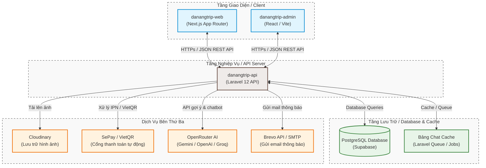
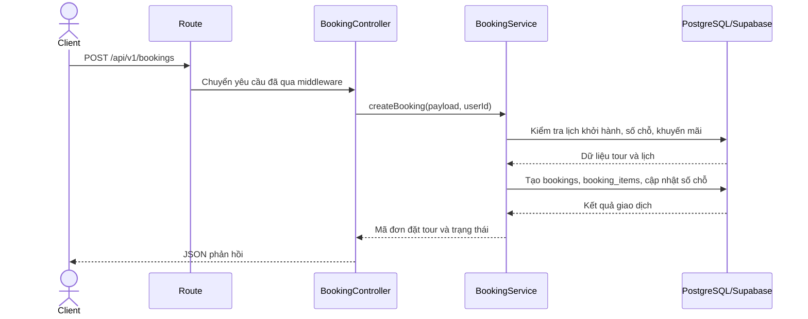
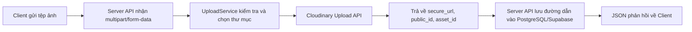

# CHƯƠNG 3. TRIỂN KHAI THỰC TẾ

## 3.1. Cấu trúc hệ thống

Dự án được tổ chức thành nhiều thư mục độc lập:

*Bảng 3.1: Cấu trúc thư mục mã nguồn dự án DanangTrip*

| Thư mục            | Vai trò                                     |
| ------------------ | ------------------------------------------- |
| `danangtrip-web`   | Website người dùng xây dựng bằng Next.js    |
| `danangtrip-admin` | Trang quản trị xây dựng bằng React/Vite     |
| `danangtrip-api`   | Server API xây dựng bằng Laravel            |
| `DATN_AI`          | Định hướng mô-đun gợi ý/AI độc lập          |
| `DATN_Tài liệu`    | Tài liệu, dữ liệu hình ảnh/video và báo cáo |
| `Báo cáo DATN`     | Bộ mẫu Word và file báo cáo mẫu             |

*Hình 3.1: Sơ đồ cấu trúc hệ thống DanangTrip*



## 3.2. Môi trường phát triển

*Bảng 3.2: Môi trường phát triển và triển khai của hệ thống*

| Thành phần           | Công nghệ/Môi trường                                                                       |
| -------------------- | ------------------------------------------------------------------------------------------ |
| Server API           | PHP 8.2, Laravel 12, Composer; triển khai trên PHP/Laravel Server hoặc dịch vụ tương đương |
| Website người dùng   | Node.js, Next.js 16, React 19, TypeScript; có cấu hình OpenNext Cloudflare/Wrangler        |
| Trang quản trị       | Node.js, Vite, React 19, TypeScript; đóng gói và triển khai trên dịch vụ lưu trữ tĩnh      |
| Cơ sở dữ liệu        | PostgreSQL/Supabase, quản lý lược đồ bằng Laravel migration                                |
| Bộ nhớ đệm/Hàng đợi  | Bảng `chat_cache`, Laravel Queue/Jobs; Redis/Predis tùy cấu hình                           |
| Lưu trữ tệp          | Cloudinary                                                                                 |
| Thanh toán           | SePay/VietQR                                                                               |
| AI                   | Gemini, Groq, OpenRouter hoặc nhà cung cấp được cấu hình                                    |
| Kiểm thử và đóng gói | PHPUnit, Playwright, Vitest, Vite build                                                    |

Các thông tin nhạy cảm như khóa API, mật khẩu cơ sở dữ liệu, mã thông báo thanh toán hoặc khóa bí mật webhook không được đưa vào báo cáo.

## 3.3. Triển khai Server API

Laravel cung cấp REST API phiên bản `/api/v1`. Các tuyến được chia thành ba nhóm: công khai, yêu cầu xác thực và quản trị. Ở tầng nghiệp vụ, mã nguồn được tổ chức theo các nhóm dịch vụ chính: xác thực, địa điểm và tour, đặt tour và thanh toán, nội dung và tương tác, điểm thành viên, cùng chatbot AI. Các nghiệp vụ quan trọng như tạo đơn đặt tour, cập nhật thanh toán và cấp quyền lợi thành viên đều sử dụng giao dịch cơ sở dữ liệu để bảo đảm toàn vẹn dữ liệu.

### 3.3.1. Tổ chức tuyến API

Tệp định tuyến chính của Server API là `routes/api.php`. Tất cả API được đặt dưới tiền tố `/api/v1`. Việc chia tuyến thành ba nhóm giúp kiểm soát quyền truy cập rõ ràng:

- Tuyến công khai: phục vụ dữ liệu công khai, không yêu cầu mã thông báo.
- Tuyến yêu cầu xác thực: yêu cầu mã thông báo JWT, phục vụ nghiệp vụ cá nhân của người dùng.
- Tuyến quản trị: yêu cầu mã thông báo JWT và vai trò quản trị viên.

Cách tổ chức này làm giảm rủi ro truy cập sai quyền và giúp tầng giao diện biết rõ API nào cần đăng nhập.

*Bảng 3.3: Một số endpoint tiêu biểu của Server API*

| Phương thức | Endpoint                                      | Thẩm quyền              | Mô tả                             |
| ----------- | --------------------------------------------- | ----------------------- | --------------------------------- |
| `POST`      | `/api/v1/auth/login`                          | Công khai               | Đăng nhập và trả về mã thông báo  |
| `GET`       | `/api/v1/tours`                               | Công khai               | Lấy danh sách tour du lịch        |
| `GET`       | `/api/v1/locations/{slug}`                    | Công khai               | Lấy thông tin chi tiết địa điểm   |
| `POST`      | `/api/v1/bookings`                            | Người dùng đã đăng nhập | Tạo đơn đặt tour mới              |
| `POST`      | `/api/v1/payments/create`                     | Người dùng đã đăng nhập | Tạo giao dịch thanh toán          |
| `GET`       | `/api/v1/user/points`                         | Người dùng đã đăng nhập | Lấy tổng quan điểm thành viên     |
| `POST`      | `/api/v1/chat`                                | Công khai               | Gửi câu hỏi đến chatbot           |
| `PUT`       | `/api/v1/admin/tours/{id}`                    | Quản trị viên           | Cập nhật thông tin tour           |
| `PATCH`     | `/api/v1/admin/bookings/{id}/confirm-payment` | Quản trị viên           | Xác nhận thanh toán thủ công      |
| `POST`      | `/api/v1/sepay/ipn`                           | SePay/IPN               | Nhận thông báo thanh toán tự động |

### 3.3.2. Tổ chức tầng dịch vụ

Server API không xử lý toàn bộ nghiệp vụ trực tiếp trong controller. Controller chủ yếu nhận yêu cầu, gọi service và trả phản hồi. Service chịu trách nhiệm xử lý logic nghiệp vụ, còn repository/model chịu trách nhiệm truy vấn dữ liệu. Ví dụ:

- Khi tạo đơn đặt tour, `BookingController` gọi `BookingService::createBooking`.
- `BookingService` kiểm tra lịch khởi hành, số chỗ, giá, khuyến mãi và tạo dữ liệu trong giao dịch.
- Khi thanh toán thành công, `PaymentService` hoặc `SepayPaymentService` cập nhật trạng thái đơn và thanh toán.

Kiến trúc này giúp Controller gọn, Service tập trung nghiệp vụ và thuận lợi hơn cho kiểm thử cũng như mở rộng tính năng.

*Hình 3.2: Luồng xử lý tạo đơn đặt tour từ Client đến Database*



### 3.3.3. Xử lý lỗi và phản hồi API

Hệ thống có trait/support class phục vụ chuẩn hóa phản hồi lỗi. API cần trả về cấu trúc thống nhất để tầng giao diện dễ xử lý. Các nhóm lỗi phổ biến:

- Lỗi validate dữ liệu đầu vào.
- Lỗi xác thực hoặc hết hạn mã thông báo.
- Lỗi không đủ quyền.
- Lỗi không tìm thấy tài nguyên.
- Lỗi nghiệp vụ như hết chỗ, đơn đặt tour không thể hủy, thanh toán sai trạng thái.
- Lỗi hệ thống hoặc dịch vụ bên ngoài.

Trong mã nguồn hiện tại, phản hồi thành công và phản hồi lỗi được chuẩn hóa như sau:

Phản hồi thành công:

```json
{
  "code": 200,
  "message": "Success",
  "data": {
    "id": 123,
    "booking_code": "BOOK-AB12CD34"
  }
}
```

Phản hồi lỗi kiểm tra dữ liệu:

```json
{
  "code": 422,
  "message": "Validation failed",
  "error_key": "validation.failed",
  "user_message": "Email da ton tai tren he thong.",
  "errors": {
    "email": [
      "Email da ton tai tren he thong."
    ]
  }
}
```

Việc giữ cấu trúc ổn định giúp tầng giao diện chỉ cần dựa vào `code`, `message`, `data` hoặc `errors` để hiển thị trạng thái phù hợp, đồng thời có thể sử dụng thêm `error_key` và `user_message` cho các tình huống nội địa hóa thông báo.

### 3.3.4. Xử lý tải ảnh

Tải ảnh được tách thành `UploadService`. Hệ thống hỗ trợ tải một ảnh, nhiều ảnh và xóa ảnh. Các chức năng cần tải ảnh gồm:

- Ảnh đại diện người dùng.
- Ảnh đại diện và bộ sưu tập ảnh của địa điểm.
- Ảnh đại diện và bộ sưu tập ảnh của tour.
- Ảnh trong đánh giá.
- Ảnh bài viết hoặc trang đích.

Ảnh không được lưu cục bộ trên Server. `UploadService` sử dụng Cloudinary để tải tệp lên dịch vụ lưu trữ bên thứ ba, sau đó nhận về `secure_url`, `public_id` và `asset_id`. Các giá trị này được lưu vào cơ sở dữ liệu hoặc gắn với bản ghi nghiệp vụ tương ứng.

*Hình 3.3: Luồng tải ảnh từ Client lên Cloudinary thông qua Server API*



Luồng này giúp Server không phải duy trì thư mục lưu ảnh cục bộ, giảm rủi ro mất dữ liệu khi thay đổi máy chủ triển khai và thuận tiện hơn khi hiển thị ảnh từ nhiều môi trường giao diện.

## 3.4. Triển khai website người dùng

Website người dùng nằm trong `danangtrip-web`, sử dụng Next.js App Router với cấu trúc route theo ngôn ngữ `/{locale}`. Dự án tích hợp `next-intl` để quản lý đa ngôn ngữ; `middleware.ts` sử dụng `createMiddleware(routing)` để chuẩn hóa URL theo locale và kiểm soát chuyển hướng đối với các tuyến được bảo vệ. Trong triển khai hiện tại, ngôn ngữ được thể hiện trực tiếp trên URL và được dùng lại khi sinh metadata hoặc render nội dung trên từng trang.

Về kỹ thuật render, các trang công khai có giá trị SEO như trang chủ, chi tiết tour, chi tiết địa điểm, blog và các trang danh mục được triển khai theo hướng render phía Server bằng Next.js, đồng thời sử dụng `generateMetadata()` để sinh tiêu đề và mô tả theo ngôn ngữ. Các trang có tính tương tác cao như hồ sơ cá nhân, thông báo, yêu thích, lịch sử đặt tour, giỏ hàng hoặc các khối dữ liệu cập nhật sau thao tác người dùng được kết hợp với `@tanstack/react-query` để quản lý bộ nhớ đệm, đồng bộ trạng thái và làm mới dữ liệu sau mutation.

Các trang chính gồm:

- Trang chủ: `/[locale]`
- Giới thiệu: `/about`
- Danh sách và chi tiết địa điểm: `/locations`, `/locations/[slug]`
- Địa điểm theo danh mục: `/categories/[slug]/locations`
- Bản đồ và gần tôi: `/map`, `/nearby`
- Tìm kiếm: `/search`
- Danh sách và chi tiết tour: `/tours`, `/tours/[slug]`
- Lịch khởi hành và đặt tour: `/tours/[slug]/departures`, `/tours/[slug]/book`
- Danh sách tour theo danh mục: `/tour-categories/[slug]/tours`
- Blog: `/blog`, `/blog/[slug]`
- Giỏ hàng: `/cart`
- Thanh toán: `/payment`, `/payment/result`
- Hồ sơ cá nhân: `/profile`, `/profile/bookings`, `/profile/favorites`, `/profile/ratings`, `/profile/notifications`, `/profile/recommendations`, `/profile/points`
- Điều khoản, quyền riêng tư và liên hệ: `/terms`, `/privacy`, `/contact`

Các lớp dịch vụ phía giao diện như `location.service.ts`, `tour.service.ts`, `booking.service.ts`, `payment.service.ts`, `auth.service.ts`, `search.service.ts` chịu trách nhiệm gọi API. React Query được dùng để lưu bộ nhớ đệm và đồng bộ dữ liệu từ Server; riêng trang đặt tour `/tours/[slug]/book` còn sử dụng `QueryClient`, `dehydrate` và `HydrationBoundary` để nạp sẵn dữ liệu phía Server trước khi hydrate ở Client.

### 3.4.1. Luồng trang chủ

Trang chủ là điểm vào chính của website. Nội dung trang chủ nên gồm:

- Hero/khối giới thiệu du lịch Đà Nẵng.
- Địa điểm nổi bật.
- Tour nổi bật hoặc tour được quan tâm nhiều.
- Danh mục khám phá.
- Bài viết mới.
- Thống kê hoặc thông tin giới thiệu.
- Chatbot hoặc thành phần hỗ trợ nhanh.

Server API cung cấp các endpoint `/home`, `/home/locations`, `/home/tours`, `/home/blogs` để giao diện tải dữ liệu.

*Hình 3.4: Giao diện trang chủ DanangTrip*

### 3.4.2. Luồng địa điểm

Phân hệ địa điểm gồm danh sách, bộ lọc, chi tiết, ảnh, đánh giá và bản đồ. Các trang danh sách và chi tiết địa điểm được render phía Server để tối ưu SEO; sau khi giao diện đã hiển thị, các dữ liệu động như ảnh bổ sung, đánh giá hoặc địa điểm lân cận được làm mới bằng React Query ở Client. Thành phần bản đồ được xây dựng trên `Leaflet` và `react-leaflet`, cho phép hiển thị tọa độ, xem lân cận và hỗ trợ chế độ gần vị trí người dùng.

*Hình 3.5: Giao diện danh sách địa điểm và bộ lọc tìm kiếm*

*Hình 3.6: Giao diện chi tiết địa điểm*

*Hình 3.7: Giao diện bản đồ vị trí và địa điểm lân cận*

### 3.4.3. Luồng tour và đặt tour

Phân hệ tour chịu trách nhiệm hiển thị danh sách tour, chi tiết lịch trình, lịch khởi hành, giá và form đặt tour. Các trang danh sách, chi tiết và lịch khởi hành được render phía Server để tối ưu SEO; riêng form đặt tour và các thông tin biến động theo lựa chọn người dùng được xử lý ở Client. Thành phần đặt tour sử dụng `react-hook-form` để quản lý form, `zod` để kiểm tra dữ liệu đầu vào và React Query để gọi API tính giá.

Một tour có thể có nhiều lịch khởi hành, mỗi lịch có số chỗ và giá riêng. Khi người dùng chọn lịch và số lượng khách, giao diện gọi `POST /bookings/calculate` để tính giá và gọi API kiểm tra chỗ còn lại theo thời gian thực trước khi cho phép thêm vào giỏ hàng hoặc chuyển sang bước đặt tour. Cơ chế này giúp hạn chế tình trạng đặt vượt số chỗ khả dụng.

*Hình 3.8: Giao diện chi tiết tour*

*Hình 3.9: Giao diện chọn lịch khởi hành và kiểm tra số chỗ*

*Hình 3.10: Giao diện form đặt tour và tính giá theo thời gian thực*

Luồng đặt tour được triển khai qua các bước:

1. Người dùng xem chi tiết tour, tham khảo khuyến mãi khả dụng và chọn lịch khởi hành.
2. Website người dùng gọi API `POST /bookings/calculate` để kiểm tra lịch khởi hành, tính giá và xác thực mã khuyến mãi hoặc phiếu giảm giá cá nhân.
3. Người dùng nhập thông tin khách hàng, số lượng khách và chọn quyền lợi giảm giá phù hợp.
4. Server API tạo `bookings` và `booking_items` trong giao dịch cơ sở dữ liệu. Hệ thống lưu `promotion_id` hoặc `user_voucher_id`, cập nhật lượt dùng khuyến mãi và đánh dấu phiếu cá nhân đã sử dụng.
5. Người dùng chọn phương thức thanh toán chuyển khoản hoặc trực tuyến.
6. Server API tạo bản ghi thanh toán, sinh mã giao dịch hoặc mã QR thanh toán VietQR.
7. Trạng thái thanh toán được cập nhật tự động khi hệ thống nhận callback/IPN từ SePay, hoặc được cập nhật thủ công bởi Quản trị viên từ trang quản lý đơn đặt tour (`PATCH /admin/bookings/{id}/confirm-payment`).
8. Người dùng xem kết quả thanh toán, chi tiết đơn đặt tour, hóa đơn PDF và nhận email hoặc thông báo tự động. Đơn có số tiền bằng không được xác nhận trực tiếp mà không sinh mã QR.

Các trạng thái cần quản lý gồm trạng thái đơn đặt tour, trạng thái thanh toán, trạng thái lịch khởi hành và số chỗ còn lại.

### 3.4.4. Luồng hồ sơ người dùng

Khu vực hồ sơ cho phép người dùng:

- Xem và cập nhật thông tin cá nhân.
- Đổi mật khẩu.
- Quản lý ảnh đại diện.
- Xem danh sách đơn đặt tour và chi tiết đơn đặt tour.
- Tra cứu đơn đặt tour theo mã.
- Xem danh sách yêu thích.
- Xem lịch sử đánh giá.
- Xem thông báo.
- Xem đề xuất cá nhân hóa.
- Xem số dư và lịch sử điểm, danh sách phần thưởng, phiếu giảm giá cá nhân và thực hiện đổi điểm.
- Xóa tài khoản.

Các tuyến hồ sơ, thanh toán và đặt tour được bảo vệ ở lớp middleware. `middleware.ts` kiểm tra cookie `token`, đối chiếu với danh sách tuyến cần bảo vệ như `/profile`, `/payment`, `/dashboard` và chuyển hướng về trang đăng nhập nếu người dùng chưa xác thực. Sau khi đăng nhập thành công, các trang hồ sơ sử dụng React Query để nạp dữ liệu cá nhân, đơn đặt tour, thông báo và điểm thành viên theo phiên hiện tại.

*Hình 3.11: Giao diện hồ sơ người dùng*

*Hình 3.12: Giao diện lịch sử đặt tour*

*Hình 3.13: Giao diện điểm thành viên và phần thưởng*

### 3.4.5. Chatbot, gợi ý, điểm thành viên và thông báo

Chatbot được triển khai ở Server API thông qua endpoint `/chat`, còn giao diện phía người dùng cung cấp vùng hội thoại để tiếp nhận câu hỏi, hiển thị các tin nhắn trong phiên giao diện hiện tại và hiển thị kết quả gợi ý theo ngữ cảnh du lịch. Các tin nhắn trên giao diện đang được lưu trong Zustand và không được khôi phục sau khi tải lại trang. Server API có ghi `session_id` trong `chat_messages`, nhưng chưa nạp các tin nhắn trước vào prompt; do đó hệ thống chưa có bộ nhớ hội thoại nhiều lượt hoàn chỉnh.

Hệ thống xây dựng cơ sở tri thức từ tour và lịch khởi hành, địa điểm du lịch, bài viết blog và các chính sách hỗ trợ liên quan đến đặt tour hoặc thanh toán. Khi người dùng gửi câu hỏi, Server API thực hiện các bước:

1. `ChatIntentGuardService` xác định câu hỏi có nằm trong phạm vi hỗ trợ của DanangTrip hay không.
2. `ChatQueryUnderstandingService` trích xuất các ràng buộc như điểm đến, vùng, chủ đề địa điểm, ngân sách, số người, ngày đi, thời lượng và tiêu chí sắp xếp.
3. Cache Layer kiểm tra khóa bộ nhớ đệm được tạo từ ngôn ngữ, ý định và câu hỏi đã chuẩn hóa nhằm xác định phản hồi tương ứng còn hiệu lực hay không.
4. Khi cache miss và câu hỏi nghiệp vụ có điểm tin cậy dưới ngưỡng, `ChatAiProviderService` dùng Gemini NLU để bổ sung thực thể dưới dạng JSON.
5. `ChatKnowledgeSearchService` truy xuất dữ liệu có cấu trúc từ tour, lịch khởi hành, địa điểm, bài viết và chính sách. Khi cấu hình tìm kiếm ngữ nghĩa được bật, `ChatVectorSearchService` tạo embedding câu hỏi, lấy ứng viên từ `chat_knowledge_base` và xếp hạng bằng độ tương đồng cosin.
6. `ChatAiProviderService` gửi lời nhắc có ngữ cảnh theo thứ tự Gemini, Groq và OpenRouter, đồng thời chuyển khóa hoặc nhà cung cấp khi gặp lỗi, quá thời gian chờ hoặc vượt giới hạn.
7. Hệ thống ghi nhật ký tin nhắn, lưu kết quả vào bộ nhớ đệm và trả phản hồi cùng các thẻ tour, địa điểm hoặc bài viết về giao diện.

Tại thời điểm kiểm tra ngày 13/06/2026, cấu hình cục bộ đã bật Vector RAG. Bảng `chat_knowledge_base` có 276 bản ghi hoạt động, trong đó 256 bản ghi đã có embedding; 20 bản ghi còn lại cần chạy bổ sung lệnh `php artisan chatbot:sync-knowledge --embed`. Phương pháp hiện tại tải tối đa một tập ứng viên cấu hình từ PostgreSQL và tính độ tương đồng cosin trong PHP, phù hợp với quy mô đồ án nhưng chưa phù hợp cho cơ sở tri thức rất lớn.

API `/recommendations` được thiết kế để cung cấp danh sách tour hoặc địa điểm đề xuất dựa trên các tín hiệu tương tác như tìm kiếm, lượt xem, yêu thích và đánh giá. Trong phạm vi đồ án, cơ chế này được xây dựng dựa trên luật kết hợp thống kê tần suất hành vi tương tác thực tế của người dùng.

Phân hệ điểm thành viên sử dụng các bảng `user_point_balances`, `point_rules`, `point_rewards`, `point_transactions` và `user_vouchers`. `PointService` là lớp xử lý trung tâm:

1. Khi phát sinh hành động hợp lệ, hệ thống tra cứu quy tắc điểm, kiểm tra nguồn phát sinh đã được ghi nhận hay chưa và giới hạn theo ngày.
2. Khi đổi điểm, hệ thống khóa số dư và phần thưởng trong giao dịch, kiểm tra số điểm cùng giới hạn sử dụng, sau đó trừ điểm và cấp phiếu giảm giá cá nhân.
3. Phiếu giảm giá được kiểm tra quyền sở hữu, trạng thái, thời hạn và giá trị đơn tối thiểu trước khi áp dụng vào đơn đặt tour.
4. Người dùng truy cập `/profile/points` để xem tổng quan, lịch sử giao dịch, phần thưởng và phiếu giảm giá.

Điểm được phát sinh từ các nguồn đã cấu hình, chẳng hạn thanh toán đơn đặt tour hoặc tương tác với đánh giá. Mỗi nguồn nghiệp vụ được gắn định danh để hạn chế cộng điểm trùng.

API `POST /ratings/{id}/helpful` chỉ chấp nhận người dùng đã đăng nhập, đánh giá đã được duyệt, không phải đánh giá của chính người gửi và chưa được người đó ghi nhận trước đây. Bảng `rating_helpful_votes` lưu quan hệ người dùng - đánh giá và trường `helpful_count` được tăng sau khi tạo lượt ghi nhận hợp lệ.

Hệ thống tạo thông báo khi đơn đặt tour được xác nhận, hủy hoặc hoàn thành; khi thanh toán hoặc hoàn tiền thay đổi; khi người dùng nhận điểm hoặc đổi được phiếu giảm giá. Lệnh `bookings:send-tour-reminders` chạy theo lịch hằng ngày để nhắc các đơn đã xác nhận, đã thanh toán và có ngày khởi hành vào ngày kế tiếp. Trước khi tạo, hệ thống kiểm tra thông báo cùng loại của đơn và ngày khởi hành để tránh gửi trùng.

*Hình 3.14: Giao diện chatbot tư vấn du lịch*

*Hình 3.15: Giao diện điểm thành viên, phần thưởng và phiếu giảm giá cá nhân*

*Hình 3.16: Giao diện thông báo và ghi nhận đánh giá hữu ích*

## 3.5. Triển khai trang quản trị

Trang quản trị nằm trong `danangtrip-admin`, được xây dựng bằng React 19, Vite, `react-router-dom`, `@tanstack/react-query`, `react-hook-form`, `yup`, `@tanstack/react-table`, `recharts`, `i18next` và hệ giao diện dựa trên `TailwindCSS`, `Headless UI`, `lucide-react` cùng các thành phần nội bộ. Thiết kế này ưu tiên tốc độ phát triển, đồng bộ biểu mẫu và khả năng tái sử dụng cho các màn hình quản trị dạng bảng.

Các tuyến quản trị được định nghĩa bằng React Router và được bảo vệ bởi `PrivateRoute.tsx`. Thành phần này chỉ render nội dung khi `isAuthenticated` hợp lệ và người dùng có `role` là `admin`; nếu không thỏa điều kiện, hệ thống chuyển hướng về trang đăng nhập. Ngoài ra, ngôn ngữ giao diện quản trị được xử lý bởi `i18next-browser-languagedetector`, ưu tiên `localStorage`, `cookie`, `querystring` và `navigator`.

Các đường dẫn chính gồm:

- `/dashboard`: bảng điều khiển tổng quan.
- `/admin/tours/list`, `/admin/tours/create`, `/admin/tours/edit/:id`: quản lý tour.
- `/admin/tour-categories`: quản lý danh mục tour.
- `/admin/tours/schedules`: quản lý lịch khởi hành.
- `/admin/locations`, `/admin/locations/create`, `/admin/locations/edit/:id`, `/admin/locations/detail/:id`: quản lý địa điểm.
- `/admin/location-categories`: quản lý danh mục địa điểm.
- `/admin/bookings`, `/admin/bookings/detail/:id`: quản lý đơn đặt tour.
- `/admin/payments`, `/admin/payments/detail/:id`: quản lý thanh toán.
- `/admin/reports/ratings`, `/admin/reports/bookings`, `/admin/reports/revenue`, `/admin/reports/locations`, `/admin/reports/users`: báo cáo.
- `/admin/users`, `/admin/users/create`, `/admin/users/detail/:id`, `/admin/users/edit/:id`: quản lý người dùng.
- `/admin/blog-posts`, `/admin/blog-categories`: quản lý blog.
- `/admin/ratings`, `/admin/contacts`, `/admin/notifications`, `/admin/promotions`, `/admin/settings`, `/admin/landing-pages`.

Trang quản trị tập trung vào thao tác dữ liệu dạng bảng, bộ lọc, biểu mẫu thêm/sửa, xác nhận hành động, biểu đồ và báo cáo.

### 3.5.1. Dashboard và báo cáo

Bảng điều khiển quản trị giúp quản trị viên theo dõi tình trạng hệ thống. Các số liệu tổng hợp và biểu đồ được triển khai bằng `Recharts`, kết hợp các truy vấn React Query để tải và làm mới dữ liệu khi thay đổi bộ lọc hoặc khoảng thời gian. Các dữ liệu nên trình bày trong báo cáo:

- Tổng số người dùng.
- Tổng số đơn đặt tour.
- Doanh thu.
- Số thanh toán thành công/thất bại.
- Top tour được đặt nhiều.
- Top địa điểm được xem nhiều.
- Biểu đồ tăng trưởng người dùng.
- Biểu đồ đơn đặt tour theo thời gian.
- Xu hướng tìm kiếm.

*Hình 3.17: Giao diện bảng điều khiển quản trị và biểu đồ thống kê*

### 3.5.2. Quản lý địa điểm

Quản trị viên có thể thêm, sửa, xóa, bật/tắt trạng thái và đánh dấu nổi bật địa điểm. Màn hình này kết hợp bảng dữ liệu, form nhập liệu và thành phần tải ảnh; biểu mẫu được quản lý bằng `react-hook-form` và `yup`, còn danh sách được đồng bộ bằng React Query sau mỗi thao tác thêm/sửa/xóa.

*Hình 3.18: Giao diện quản lý địa điểm*

### 3.5.3. Quản lý tour và lịch khởi hành

Quản trị viên quản lý thông tin tour gồm tên, danh mục, mô tả, lịch trình, giá theo nhóm khách, thời lượng, điểm hẹn, hình ảnh, trạng thái hiển thị và trạng thái nổi bật. Lịch khởi hành được quản lý riêng để kiểm soát ngày đi, ngày về, số chỗ, số chỗ đã đặt, giá ghi đè và trạng thái. Việc tách tour và lịch khởi hành thành hai màn hình giúp dễ cập nhật năng lực phục vụ mà không làm thay đổi cấu trúc tour gốc.

*Hình 3.19: Giao diện quản lý tour*

*Hình 3.20: Giao diện quản lý lịch khởi hành*

### 3.5.4. Quản lý đơn đặt tour và thanh toán

Quản trị viên có thể xem danh sách đơn đặt tour, lọc theo trạng thái, xem chi tiết khách hàng, xác nhận thanh toán, cập nhật trạng thái đơn đặt tour, xuất hóa đơn và xuất báo cáo. Với thanh toán, quản trị viên có thể xem mã giao dịch, cổng thanh toán, số tiền, trạng thái, thời gian thanh toán và xử lý hoàn tiền nếu có. Mục xác nhận thanh toán thủ công là phần mở rộng quan trọng cho các khoản chuyển khoản chưa được SePay cập nhật tự động.

*Hình 3.21: Giao diện quản lý đơn đặt tour*

*Hình 3.22: Giao diện chi tiết đơn đặt tour và xác nhận thanh toán thủ công*

*Hình 3.23: Giao diện quản lý thanh toán*

### 3.5.5. Quản lý nội dung và tương tác

Các phân hệ blog, trang đích, đánh giá, liên hệ, thông báo và khuyến mãi giúp hệ thống vận hành đầy đủ hơn. Quản trị viên có thể duyệt đánh giá, phản hồi liên hệ, gửi thông báo hàng loạt, tạo mã giảm giá và cập nhật cấu hình website. Các màn hình này tiếp tục dùng cùng mẫu kỹ thuật: React Query cho dữ liệu, `react-hook-form` cho biểu mẫu và Route Guard cho phân quyền truy cập.

*Hình 3.24: Giao diện quản lý blog và trang đích*

*Hình 3.25: Giao diện duyệt đánh giá, liên hệ và thông báo*

### 3.5.6. Tải ảnh, email, báo cáo và hóa đơn

Hệ thống có các tích hợp hỗ trợ vận hành:

- Tải ảnh qua Cloudinary cho địa điểm, tour, ảnh đại diện và nội dung.
- Gửi email qua dịch vụ thư điện tử/Brevo cho các luồng liên hệ, xác thực hoặc thông báo.
- Xuất báo cáo bằng Maatwebsite Excel cho bảng điều khiển, người dùng, đơn đặt tour, thanh toán, liên hệ, địa điểm.
- Sinh hóa đơn PDF bằng DomPDF thông qua `InvoicePdfService`.

## 3.6. Kiểm thử

Dự án có các kiểm thử phía Server như:

- `ApiErrorResponseTest`
- `SecurityFixesTest`
- `RatingReadTrackingTest`
- `SyncTourScheduleAvailabilityTest`
- `AdminCategoryApiTest`
- `HomeControllerTest`
- `PromotionControllerTest`
- `SettingControllerTest`
- `UserProfileDeleteTest`
- `ChatIntentGuardServiceTest`
- `ChatQueryUnderstandingServiceTest`
- `PointServiceTest`
- `SepayPaymentAmountTest`

Dự án giao diện có các kiểm thử Playwright như:

- `user-booking-detail.spec.ts`
- `user-booking-by-code.spec.ts`
- `departure-select.spec.ts`
- `visual-change-password.spec.ts`
- `visual-test.ts`

Các lệnh kiểm thử/thẩm định cần ghi vào báo cáo sau khi chạy thực tế:

```bash
cd D:\DATN\danangtrip-api
php artisan test

cd D:\DATN\danangtrip-web
npm run typecheck
npm run lint
npm run build

cd D:\DATN\danangtrip-admin
npm run typecheck
npm run build
```

### 3.6.1. Kết quả kiểm thử chức năng

Trước khi kiểm thử thủ công từng chức năng, dự án được kiểm tra bằng các lệnh tự động ở Server API, website người dùng và trang quản trị. Kết quả tại thời điểm biên soạn:

*Bảng 3.4: Kết quả kiểm thử tự động của hệ thống*

| STT | Thành phần                 | Lệnh kiểm tra       | Kết quả thực tế                                                                                                                                   | Trạng thái       |
| --- | -------------------------- | ------------------- | ------------------------------------------------------------------------------------------------------------------------------------------------- | ---------------- |
| 1   | Laravel API                | `php artisan test`  | 43 kiểm thử đạt, 159 khẳng định; 4 kiểm thử tích hợp `PointService` bị bỏ qua do môi trường thiếu `pdo_sqlite`; thời gian 11.51 giây (12/06/2026) | Đạt có điều kiện |
| 2   | Website người dùng Next.js | `npm run typecheck` | Chưa xác nhận lại sau thay đổi ngày 12/06/2026; cần chạy và chụp kết quả trước khi nộp                                                            | Chưa xác nhận    |
| 3   | Trang quản trị React/Vite  | `npm run typecheck` | Chưa xác nhận lại sau thay đổi ngày 12/06/2026; cần chạy và chụp kết quả trước khi nộp                                                            | Chưa xác nhận    |
| 4   | Website người dùng Next.js | `npm run build`     | Kết quả cũ cho thấy đóng gói thành công nhưng cần chạy lại với mã nguồn hiện tại                                                                  | Chưa xác nhận    |
| 5   | Trang quản trị React/Vite  | `npm run build`     | Kết quả cũ cho thấy đóng gói thành công nhưng cần chạy lại với mã nguồn hiện tại                                                                  | Chưa xác nhận    |

Ghi chú về cảnh báo khi kiểm tra:

- Bốn kiểm thử tích hợp cơ sở dữ liệu của `PointServiceTest` chưa chạy vì môi trường kiểm thử thiếu `pdo_sqlite`. Do đó không được dùng kết quả PHPUnit hiện tại để khẳng định toàn bộ luồng cộng điểm/đổi thưởng đã được kiểm thử tự động.
- Các cảnh báo đóng gói Next.js và trang quản trị trong bản báo cáo cũ chỉ được giữ làm thông tin tham khảo; cần thay bằng đầu ra của lần chạy gần nhất.

Bảng dưới đây trình bày kết quả kiểm thử chức năng thủ công trên hệ thống với dữ liệu mẫu:

*Bảng 3.5: Kết quả kiểm thử chức năng thủ công trên hệ thống*

| STT | Phân hệ                | Dữ liệu kiểm thử                                                                 | Kết quả mong đợi                                                                                        | Kết quả thực tế                                                                             | Trạng thái    |
| --- | ---------------------- | -------------------------------------------------------------------------------- | ------------------------------------------------------------------------------------------------------- | ------------------------------------------------------------------------------------------- | ------------- |
| 1   | Xác thực               | Đăng ký bằng email chưa tồn tại                                                  | Tài khoản được tạo, không trùng email/tên đăng nhập                                                     | Đăng ký tài khoản thành công, hệ thống gửi email xác nhận                                   | Đạt           |
| 2   | Xác thực               | Đăng nhập đúng email/mật khẩu                                                    | Nhận mã thông báo và chuyển vào hệ thống                                                                | Đăng nhập thành công, nhận JWT token và chuyển vào trang Dashboard                          | Đạt           |
| 3   | Xác thực               | Đăng nhập sai mật khẩu                                                           | Hiển thị thông báo lỗi                                                                                  | Hệ thống hiển thị thông báo sai mật khẩu màu đỏ nổi bật                                     | Đạt           |
| 4   | Địa điểm               | Lọc theo danh mục/quận                                                           | Danh sách hiển thị đúng dữ liệu                                                                         | Danh sách địa điểm tải nhanh, lọc chính xác theo điều kiện chọn                             | Đạt           |
| 5   | Địa điểm               | Mở chi tiết một địa điểm                                                         | Hiển thị mô tả, ảnh, tọa độ, đánh giá                                                                   | Hiển thị đầy đủ thông tin chi tiết, bản đồ vị trí và danh sách đánh giá                     | Đạt           |
| 6   | Tour                   | Mở chi tiết một tour đang hoạt động                                              | Hiển thị giá, lịch trình, lịch khởi hành                                                                | Thông tin chi tiết hiển thị đầy đủ, lịch trình trực quan, hiển thị các mã giảm giá khả dụng | Đạt           |
| 7   | Đặt tour               | Tạo đơn đặt tour với lịch còn chỗ                                                | Đơn đặt tour được tạo, số chỗ cập nhật                                                                  | Tạo đơn đặt tour thành công, lưu thông tin vào DB, trừ số chỗ trống trên lịch               | Đạt           |
| 8   | Đặt tour               | Tạo đơn đặt tour vượt số chỗ                                                     | Hệ thống từ chối và báo lỗi                                                                             | Báo lỗi không đủ chỗ khả dụng và ngăn chặn tạo đơn hàng                                     | Đạt           |
| 9   | Thanh toán             | Tạo thanh toán cho đơn đặt tour đang chờ xử lý                                   | Sinh giao dịch/mã QR                                                                                    | Sinh mã QR VietQR kèm số tiền và nội dung chuyển khoản tự động chính xác                    | Đạt           |
| 10  | Thanh toán             | Nhận IPN hợp lệ từ SePay                                                         | Thanh toán thành công, đơn đặt tour được cập nhật                                                       | Cập nhật trạng thái đơn hàng thành đã thanh toán tự động khi nhận IPN từ SePay              | Đạt           |
| 11  | Đánh giá               | Gửi đánh giá hợp lệ                                                              | Đánh giá được lưu/chờ duyệt                                                                             | Gửi đánh giá thành công, lưu ở trạng thái chờ quản trị viên duyệt                           | Đạt           |
| 12  | Quản trị tour          | Quản trị viên thêm tour mới                                                      | Tour hiển thị ở danh sách quản trị và công khai khi đang hoạt động                                      | Tour mới xuất hiện trên trang quản trị và website người dùng                                | Đạt           |
| 13  | Quản trị đánh giá      | Quản trị viên duyệt đánh giá                                                     | Đánh giá hiển thị công khai                                                                             | Đánh giá sau khi duyệt xuất hiện trên trang chi tiết địa điểm/tour công khai                | Đạt           |
| 14  | Chatbot                | Hỏi tour theo ngân sách                                                          | Trả lời dựa trên dữ liệu tour phù hợp                                                                   | Chatbot nhận diện ý định và lọc tour theo đúng khoảng giá yêu cầu                           | Đạt           |
| 15  | Chatbot                | Hỏi câu ngoài phạm vi du lịch                                                    | Intent Guard từ chối hoặc hướng dẫn hỏi lại                                                             | Từ chối trả lời câu hỏi ngoài phạm vi và hướng dẫn người dùng hỏi đúng chủ đề               | Đạt           |
| 16  | Chatbot                | Nhà cung cấp AI lỗi hoặc quá thời gian chờ                                       | Hệ thống chuyển nhà cung cấp/khóa hoặc trả phản hồi dự phòng                                            | Tự động chuyển đổi khóa API/nhà cung cấp dự phòng mượt mà không gây ngắt quãng              | Đạt           |
| 17  | Quản trị đặt tour      | Quản trị viên xác nhận thanh toán thủ công cho đơn đặt tour chuyển khoản         | Đơn đặt tour cập nhật trạng thái thanh toán thành công và gửi email tự động xác nhận cho khách hàng     | Đã kiểm thử thành công bằng PHPUnit và giao diện quản trị                                   | Đạt           |
| 18  | Khuyến mãi             | Khách hàng áp dụng mã giảm giá hợp lệ                                            | Hệ thống tự động tính toán số tiền chiết khấu, hiển thị chi tiết trên hóa đơn và giảm tổng tiền cần trả | Đã kiểm thử thành công bằng PHPUnit và giao diện người dùng                                 | Đạt           |
| 19  | Khuyến mãi             | Khách hàng áp dụng mã đã hết hạn hoặc chưa đạt giá trị tối thiểu                 | Hệ thống hiển thị thông báo lỗi phù hợp và không áp dụng chiết khấu                                     | Đã kiểm thử thành công bằng PHPUnit và giao diện người dùng                                 | Đạt           |
| 20  | Điểm thành viên        | Người dùng đổi phần thưởng khi đủ điểm                                           | Điểm bị trừ một lần, giao dịch được lưu và phiếu giảm giá cá nhân được cấp                              | Cần ghi kết quả thực tế sau khi kiểm thử trên dữ liệu báo cáo                               | Chưa xác nhận |
| 21  | Phiếu giảm giá cá nhân | Áp dụng phiếu còn hiệu lực của đúng người dùng                                   | Số tiền giảm được tính đúng và phiếu được đánh dấu đã sử dụng khi tạo đơn                               | Cần ghi kết quả thực tế sau khi kiểm thử trên dữ liệu báo cáo                               | Chưa xác nhận |
| 22  | Đánh giá hữu ích       | Người dùng ghi nhận đánh giá công khai của người khác                            | Chỉ tạo một lượt ghi nhận; tăng số lượt hữu ích và xử lý điểm theo quy tắc                              | Cần ghi kết quả thực tế sau khi kiểm thử trên dữ liệu báo cáo                               | Chưa xác nhận |
| 23  | Nhắc lịch khởi hành    | Chạy lệnh nhắc lịch với đơn đã xác nhận, đã thanh toán và khởi hành ngày kế tiếp | Tạo một thông báo cho mỗi đơn/ngày khởi hành và không gửi trùng                                         | Cần ghi kết quả thực tế sau khi chạy tác vụ                                                 | Chưa xác nhận |

### 3.6.2. Kế hoạch kiểm thử phi chức năng

*Bảng 3.6: Phương án kiểm thử phi chức năng đề xuất*

| Nhóm                   | Cách kiểm thử đề xuất                                                                                     |
| ---------------------- | --------------------------------------------------------------------------------------------------------- |
| Bảo mật                | Kiểm tra API yêu cầu xác thực khi không có mã thông báo; kiểm tra người dùng thường truy cập API quản trị |
| Hiệu năng              | Kiểm tra thời gian tải danh sách địa điểm/tour; kiểm tra phân trang                                       |
| Tính đáp ứng giao diện | Chụp giao diện máy tính, máy tính bảng, thiết bị di động                                                  |
| Toàn vẹn dữ liệu       | Kiểm tra đặt tour/thanh toán trong các trường hợp thành công/thất bại                                     |
| Khả dụng               | Kiểm tra trạng thái đang tải, trạng thái rỗng và trạng thái lỗi                                           |
| Đa ngôn ngữ            | Kiểm tra đường dẫn và nội dung ở tiếng Việt/tiếng Anh                                                     |

## 3.7. Kết quả giao diện cần chụp đưa vào báo cáo

Danh sách hình ảnh đề xuất:

- Hình 3.1: Sơ đồ cấu trúc hệ thống DanangTrip.
- Hình 3.2: Luồng xử lý tạo đơn đặt tour từ Client đến Database.
- Hình 3.3: Luồng tải ảnh từ Client lên Cloudinary thông qua Server API.
- Hình 3.4: Giao diện trang chủ DanangTrip.
- Hình 3.5: Giao diện danh sách địa điểm và bộ lọc tìm kiếm.
- Hình 3.6: Giao diện chi tiết địa điểm.
- Hình 3.7: Giao diện bản đồ vị trí và địa điểm lân cận.
- Hình 3.8: Giao diện chi tiết tour.
- Hình 3.9: Giao diện chọn lịch khởi hành và kiểm tra số chỗ.
- Hình 3.10: Giao diện form đặt tour và tính giá theo thời gian thực.
- Hình 3.11: Giao diện hồ sơ người dùng.
- Hình 3.12: Giao diện lịch sử đặt tour.
- Hình 3.13: Giao diện điểm thành viên và phần thưởng.
- Hình 3.14: Giao diện chatbot tư vấn du lịch.
- Hình 3.15: Giao diện điểm thành viên, phần thưởng và phiếu giảm giá cá nhân.
- Hình 3.16: Giao diện thông báo và ghi nhận đánh giá hữu ích.
- Hình 3.17: Giao diện bảng điều khiển quản trị và biểu đồ thống kê.
- Hình 3.18: Giao diện quản lý địa điểm.
- Hình 3.19: Giao diện quản lý tour.
- Hình 3.20: Giao diện quản lý lịch khởi hành.
- Hình 3.21: Giao diện quản lý đơn đặt tour.
- Hình 3.22: Giao diện chi tiết đơn đặt tour và xác nhận thanh toán thủ công.
- Hình 3.23: Giao diện quản lý thanh toán.
- Hình 3.24: Giao diện quản lý blog và trang đích.
- Hình 3.25: Giao diện duyệt đánh giá, liên hệ và thông báo.

## 3.8. Đánh giá kết quả triển khai

Sau khi triển khai, hệ thống đáp ứng được hầu hết các nghiệp vụ chính của một website du lịch:

- Người dùng có thể tìm kiếm và khám phá nội dung du lịch.
- Người dùng có thể đặt tour, áp dụng khuyến mãi/phiếu giảm giá, thanh toán và theo dõi đơn đặt tour.
- Người dùng có thể lưu yêu thích, đánh giá, ghi nhận nội dung hữu ích, tích lũy/đổi điểm và nhận thông báo.
- Quản trị viên có thể quản lý dữ liệu và theo dõi báo cáo.
- Server API có cấu trúc rõ ràng, phân quyền và xử lý nghiệp vụ tập trung.
- Hệ thống có hướng mở rộng cho AI/chatbot và hệ thống gợi ý.

Để có thể vận hành trong môi trường thực tế, hệ thống cần được bổ sung dữ liệu đầy đủ, kiểm thử tải, giám sát, sao lưu dữ liệu, kiểm thử bảo mật chuyên sâu và quy trình vận hành rõ ràng.
