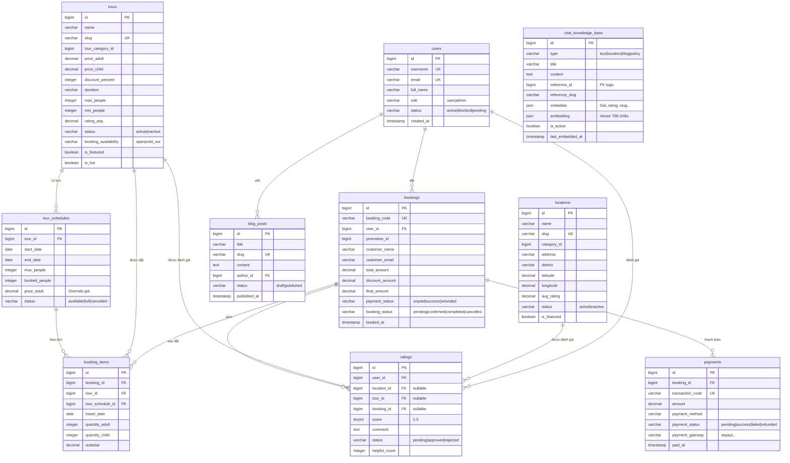

# DanangTrip — Sơ đồ Cơ sở Dữ liệu rút gọn (ERD 10 bảng cốt lõi)

> File DBML tương ứng để import vào **dbdiagram.io**: `danangtrip_erd_top10.dbml`

## Sơ đồ ERD (Mermaid — nhúng vào báo cáo)

---

## Bảng tóm tắt các nhóm bảng cốt lõi (10 bảng)

| Nhóm                      | Bảng                                    | Vai trò                                                             |
| ------------------------- | --------------------------------------- | ------------------------------------------------------------------- |
| **Người dùng**            | `users`                                 | Tài khoản khách hàng và quản trị viên                               |
| **Địa điểm**              | `locations`                             | Quản lý thông tin điểm tham quan, ẩm thực, vui chơi tại Đà Nẵng     |
| **Tour**                  | `tours`, `tour_schedules`               | Quản lý sản phẩm tour du lịch và lịch khởi hành chi tiết            |
| **Đặt tour & Thanh toán** | `bookings`, `booking_items`, `payments` | Quản lý toàn bộ vòng đời giao dịch và trạng thái thanh toán         |
| **Đánh giá & Blog**       | `ratings`, `blog_posts`                 | Hệ thống phản hồi khách hàng và các bài viết cẩm nang du lịch (SEO) |
| **Chatbot AI**            | `chat_knowledge_base`                   | Cơ sở dữ liệu tri thức của chatbot phục vụ cho tính năng RAG        |

**Tổng cộng: 10 bảng quan trọng nhất của hệ thống** (đáp ứng trọn vẹn mô hình đặt tour, tìm kiếm địa điểm, và trợ lý chatbot AI).
