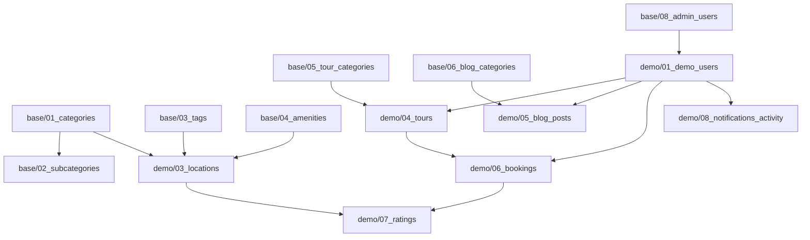

# DanangTrip Database Seeders v2

Thư mục `seeders_v2/` là phiên bản tái cấu trúc hoàn toàn của dữ liệu seeder dành cho dự án **DanangTrip**. Dữ liệu được tổ chức theo cấu trúc dạng cây phân lớp khoa học, loại bỏ hoàn toàn các cập nhật vá (backfills), chuẩn hóa tiếng Việt có dấu cho toàn bộ dữ liệu hiển thị trên giao diện người dùng.

> [!WARNING]
> **KHÔNG tự động chạy trực tiếp lên database production:** Các file SQL này được gom lại để phục vụ kiểm tra ngoại tuyến trước khi áp dụng. Hãy đảm bảo chạy psql đúng môi trường đích mong muốn.

---

## Cấu Trúc Thư Mục Mới (21 Tệp SQL)

```
seeders_v2/
├── base/                           ← DỮ LIỆU HỆ THỐNG BẮT BUỘC
│   ├── 01_categories.sql               40 danh mục du lịch chính (tiếng Việt chuẩn)
│   ├── 02_subcategories.sql            ~80 danh mục con chuyên sâu
│   ├── 03_tags.sql                     ~80 tags địa điểm & tour
│   ├── 04_amenities.sql                100 tiện nghi dịch vụ
│   ├── 05_tour_categories.sql          100 danh mục tour du lịch
│   ├── 06_blog_categories.sql          100 danh mục bài viết/tin tức
│   ├── 07_system_settings.sql          ~35 cấu hình tham số hệ thống
│   ├── 08_admin_users.sql              Tài khoản Admin và Operator mẫu
│   ├── 09_point_rules.sql              Quy tắc tích điểm thành viên & đổi voucher
│   └── 10_landing_pages.sql            Trang đích SEO & FAQ mẫu dạng JSONB
│
├── demo/                           ← DỮ LIỆU CHẠY THỬ NGHIỆM & TRÌNH BÀY
│   ├── 01_demo_users.sql               98 user demo (id 3–100, tên tiếng Việt)
│   ├── 02_promotions.sql               12 mã khuyến mãi/chiến dịch hiện hành
│   ├── 03_locations.sql                117 địa điểm đã chuẩn hóa tọa độ, mô tả & ảnh Cloudinary
│   ├── 04_tours.sql                    130 tour du lịch (gồm tour thực tế và lịch hành trình dài cho chatbot)
│   ├── 05_blog_posts.sql               100 bài viết cẩm nang du lịch (gồm ảnh đại diện Cloudinary)
│   ├── 06_bookings.sql                 Lịch sử đặt tour demo & giao dịch thanh toán (SePay/VietQR)
│   ├── 07_ratings.sql                  Đánh giá thực tế, lượt vote hữu ích & lượt thích địa điểm
│   └── 08_notifications_activity.sql   Hoạt động tìm kiếm tiếng Việt, lượt views, thông báo & điểm loyalty
│
├── test/                           ← DỮ LIỆU KIỂM THỬ TÍNH NĂNG
│   ├── 01_test_cart.sql                Kiểm thử giỏ hàng (sử dụng dynamic JOIN)
│   ├── 02_coverage_check.sql           Script kiểm tra độ phủ, số lượng và FK integrity (chỉ đọc)
│   └── 03_test_checkout.sql            Tour test trị giá 1.000đ dành cho tích hợp webhook SePay thực tế
│
└── run_all_seeders.sql             ← Master Script thực thi toàn bộ theo thứ tự FK chuẩn
```

---

## Phân Loại Dữ Liệu & Quy Tắc Chuẩn Hóa

1. **BASE**: Dữ liệu cấu hình bắt buộc. Thiếu dữ liệu này hệ thống sẽ lỗi runtime hoặc không thể khởi chạy.
2. **DEMO**: Dữ liệu trình bày luồng nghiệp vụ. Toàn bộ thông tin hiển thị đã được sửa thành **tiếng Việt có dấu** (Ví dụ: `Da Nang` → `Đà Nẵng`, `Quan an` → `Quán ăn`, `Khach san` → `Khách sạn`). Slug/code/key được giữ không dấu đúng tiêu chuẩn.
3. **TEST**: Dữ liệu phục vụ kiểm thử thủ công và tự động.
4. **INVALID**: Dữ liệu trùng lặp, dữ liệu rác, các bảng nháp crawl trung gian đã bị loại bỏ hoàn toàn trong v2.

---

## Thứ Tự Thực Thi Khóa Ngoại (Foreign Key Dependencies)



Master script [run_all_seeders.sql](file:///d:/DATN/DATN_Tài liệu/database-seeders/seeders_v2/run_all_seeders.sql) tự động sắp xếp chính xác thứ tự này.

---

## Hướng Dẫn Sử Dụng (Chạy Offline)

Khi người dùng đã duyệt toàn bộ và sẵn sàng cập nhật cơ sở dữ liệu thật, có thể thực hiện theo các cách sau:

### Cách 1: Chạy toàn bộ seeder cho database mới (Migrate Fresh)
```powershell
# Di chuyển vào thư mục seeders_v2
cd "d:\DATN\DATN_Tài liệu\database-seeders\seeders_v2"

# Thực thi master script qua psql CLI
psql -h localhost -U postgres -d danangtrip -f run_all_seeders.sql
```

### Cách 2: Chạy đơn lẻ một tệp SQL cụ thể để cập nhật dữ liệu
Ví dụ: chỉ cập nhật địa điểm và danh mục địa điểm:
```powershell
psql -h localhost -U postgres -d danangtrip -f base/01_categories.sql
psql -h localhost -U postgres -d danangtrip -f demo/03_locations.sql
```

### Cách 3: Kiểm tra mức độ hoàn thiện của cơ sở dữ liệu sau khi seed
```powershell
psql -h localhost -U postgres -d danangtrip -f test/02_coverage_check.sql
```

---

## Kiểm Tra Chất Lượng Mã Nguồn SQL
Để kiểm tra tĩnh encoding UTF-8 không lỗi tiếng Việt và tính nhất quán chéo:
```powershell
cd ..
php audit_vietnamese_diacritics_db.php
```
